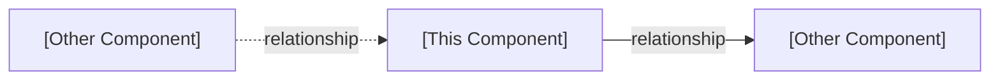
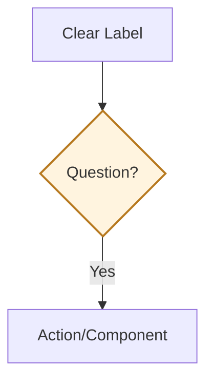
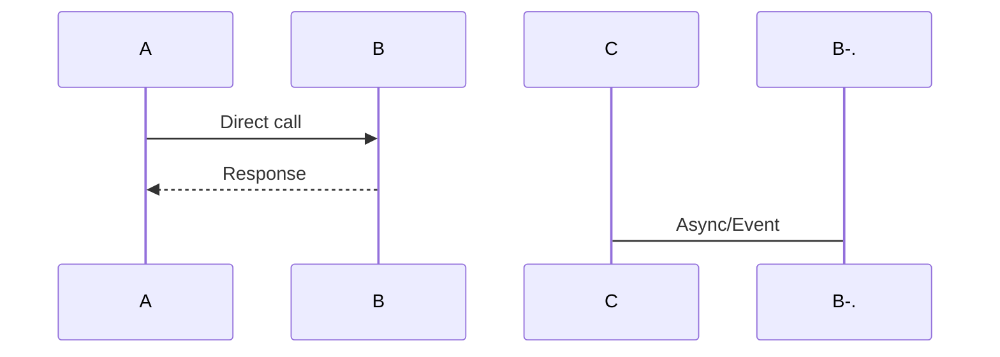
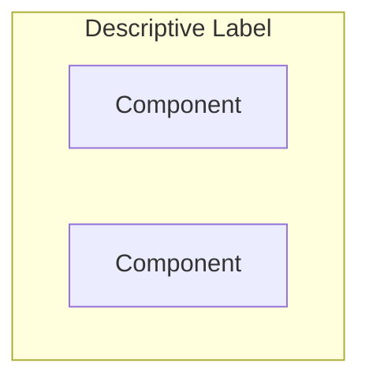

# Guide for Writing Architecture Component Documentation

This guide defines the standard structure for agent-sdk architecture documentation. Follow this pattern for consistency and quality.

---

## Document Structure Template

### 1. Frontmatter (Required)
```yaml
---
title: [Component Name]
description: High-level architecture of the [component purpose]
---
```

**Guidelines:**
- Title: Component name (capitalize properly)
- Description: One-line summary emphasizing architecture/design, not usage
- Use "architecture", "design", "system" vocabulary (not "how to use")

### 2. Opening Statement (Required)
One paragraph that:
- States what the component **is** (not what it does)
- Highlights its primary architectural role
- Positions it within the larger system

**Pattern:**
```
The **[Component]** [architectural role/pattern]. It [key responsibility] and [design characteristic].
```

**Example:**
```
The **Conversation** component orchestrates agent execution through structured message flows 
and state management. It serves as the primary interface for interacting with agents, managing 
their lifecycle from initialization to completion.
```

### 3. Source Link (Required)
Link to GitHub source directory or primary file:

```markdown
**Source:** [`path/to/component/`](https://github.com/OpenHands/agent-sdk/tree/main/path)
```

### 4. Core Responsibilities (Required)
Numbered list of 3-5 primary responsibilities.

**Guidelines:**
- Use bold for category, dash for description
- Keep each item to one line
- Focus on **what** the component manages, not **how**
- Order by importance or logical flow

**Template:**
```markdown
## Core Responsibilities

The [Component] system has [N] primary responsibilities:

1. **[Category]** - [Brief description]
2. **[Category]** - [Brief description]
3. **[Category]** - [Brief description]
```

### 5. Architecture Diagram (Required)
High-level system architecture showing:
- Main components and their relationships
- Data/control flow
- Key abstractions

**Guidelines:**
- Use Mermaid flowchart
- Keep it simple (max 10-12 nodes)
- Use subgraphs for logical grouping
- Apply consistent styling (see color palette below)
- Label edges to show relationships

**Template:**
```markdown
## Architecture

```mermaid
%%{init: {"theme": "default", "flowchart": {"nodeSpacing": 25, "rankSpacing": 35}} }%%
flowchart TB
    [component diagram]
    
    classDef primary fill:#f3e8ff,stroke:#7c3aed,stroke-width:2px
    classDef secondary fill:#e8f3ff,stroke:#2b6cb0,stroke-width:2px
    classDef tertiary fill:#fff4df,stroke:#b7791f,stroke-width:2px
```
\```

**Color Palette:**
- Purple (`#f3e8ff` / `#7c3aed`) - Entry points, factories, primary interfaces
- Blue (`#e8f3ff` / `#2b6cb0`) - Implementations, concrete classes
- Orange (`#fff4df` / `#b7791f`) - Core abstractions, state containers
- Green (`#e9f9ef` / `#2f855a`) - Services, utilities

### 6. Key Components Table (Required)
Table listing main classes/modules with GitHub links.

**Template:**
```markdown
### Key Components

| Component | Purpose | Design |
|-----------|---------|--------|
| **[`ClassName`](github-link)** | What it is | How it works |
```

**Guidelines:**
- Link every component name to its source file
- Purpose: One phrase describing what it is
- Design: One phrase describing the pattern/approach
- Keep each cell concise (5-10 words max)

### 7. Key Architectural Patterns (2-4 sections recommended)
Deep dive into 2-4 most important architectural patterns/mechanisms.

**Section Types:**
- Dispatch mechanisms (Factory, Strategy)
- State management patterns
- Execution models
- Data flow patterns
- Extension points

**Template for each pattern:**
```markdown
## [Pattern Name]

[One paragraph explaining the pattern and why it matters]

```mermaid
[Diagram illustrating the pattern]
```
\```

**[Concise explanation of key aspects]**
- Bullet 1
- Bullet 2
- Bullet 3

[Optional: One-line insight or trade-off]
```

**Guidelines:**
- Start with diagram, not text
- Use flowcharts for decision logic
- Use sequence diagrams for interactions (sparingly)
- Explain **what** and **why**, not **how**
- Compare alternatives in tables if applicable

### 8. Auxiliary Services/Features (Optional)
If component has pluggable services or secondary features.

**Template:**
```markdown
## Auxiliary Services

The [component] provides pluggable [features] that [relationship to core]:

| Service | Purpose | Architecture Pattern |
|---------|---------|---------------------|
| **[Service](link)** | What it does | Pattern used |

**Design Principle:** [One sentence explaining the separation/relationship]
```

### 9. Component Relationships (Required)
Show how this component interacts with others in the system.

**Template:**
```markdown
## Component Relationships

### How [Component] Interacts


\```

**Relationship Characteristics:**
- **[Component A] → [Component B]**: [Nature of relationship]
- **[Component C] → [Component D]**: [Nature of relationship]
```

**Guidelines:**
- Show 3-5 most important relationships
- Use solid arrows for direct dependencies
- Use dotted arrows for indirect/callback relationships
- Describe the nature of each relationship

### 10. Design Rationale (Optional but recommended)
Explain key architectural decisions.

**Template:**
```markdown
## Design Rationale

**[Pattern/Decision]:** [One sentence explaining the decision and its benefits]

**[Pattern/Decision]:** [One sentence explaining the decision and its benefits]
```

**Guidelines:**
- Keep each rationale to 1-2 sentences
- Focus on trade-offs and constraints
- Explain what was avoided and why

### 11. See Also (Required)
Links to related architecture docs and usage guides.

**Template:**
```markdown
## See Also

- **[Related Component](/sdk/arch/component)** - Brief description
- **[Usage Guide](/sdk/guides/guide)** - Practical examples
```

---

## Writing Guidelines

### DO ✅

**Focus on Architecture:**
- Design patterns and rationale
- Component boundaries and responsibilities
- Data/control flow
- Extension points and abstractions
- Trade-offs and constraints

**Be Concise:**
- One diagram per major concept
- Tables over bullet lists
- Short paragraphs (2-4 sentences)
- Prefer visual over textual

**Link Components:**
- Every class/module name links to source
- Cross-reference related architecture docs
- Link to usage guides for details

**Use Diagrams:**
- Flowcharts for logic and structure
- Sequence diagrams for interactions (sparingly)
- Keep diagrams simple (max 10-12 nodes)
- Consistent styling and colors

### DON'T ❌

**Avoid Implementation Details:**
- Step-by-step procedures ("how it works" with numbers)
- Configuration parameters and options
- File paths and directory structures
- Code snippets (unless illustrating a pattern)
- API method signatures

**Avoid Usage Instructions:**
- Installation steps
- Configuration examples
- Tutorial-style walkthroughs
- "Getting started" content

**Avoid Redundancy:**
- Don't repeat what's in code comments
- Don't duplicate API reference docs
- Don't explain obvious relationships

---

## Quality Checklist

Before submitting architecture documentation, verify:

- [ ] Frontmatter has appropriate title and description
- [ ] Opening statement positions component architecturally
- [ ] GitHub source link is present and correct
- [ ] 3-5 core responsibilities are listed
- [ ] Main architecture diagram shows system structure
- [ ] All component names in tables link to source
- [ ] 2-4 key patterns are explained with diagrams
- [ ] Component relationships are visualized
- [ ] No step-by-step implementation details
- [ ] No configuration or usage instructions
- [ ] Consistent diagram styling (colors, spacing)
- [ ] All links work (both internal and external)
- [ ] Document is 200-350 lines (not too long)
- [ ] Content is scannable (headings, tables, diagrams)

---

## Length Guidelines

**Target:** 200-350 lines total

**Section Allocation:**
- Frontmatter + intro: ~10 lines
- Core responsibilities: ~10 lines
- Architecture diagram: ~40 lines
- Key components table: ~10 lines
- Pattern sections (2-4): ~40-60 lines each
- Auxiliary services: ~30 lines (if applicable)
- Component relationships: ~30 lines
- Design rationale: ~10-20 lines
- See Also: ~5 lines

**If exceeding 350 lines:**
- Condense pattern sections (combine related patterns)
- Remove auxiliary services section (mention in main architecture)
- Simplify diagrams (fewer nodes, less detail)
- Shorten explanations (tables instead of paragraphs)

---

## Example: Conversation Component

See `/workspace/project/docs/sdk/arch/conversation.mdx` as the reference implementation of this guide.

**What it does well:**
- ✅ Clear architectural focus (no usage details)
- ✅ All components linked to source
- ✅ Diagrams are conceptual, not procedural
- ✅ Pattern sections focus on "what" and "why"
- ✅ Compact (274 lines)
- ✅ Scannable (tables, diagrams, short paragraphs)

---

## Common Patterns by Component Type

### For Orchestration Components (Agent, Conversation)
- Lifecycle management
- State transitions
- Execution models
- Event flows

### For Abstraction Layers (LLM, Workspace, Tool)
- Provider/implementation selection
- Common interface
- Extension points
- Adapter patterns

### For Infrastructure (Agent Server, Workspace Implementations)
- Deployment architecture
- Communication protocols
- Isolation boundaries
- Resource management

### For Utilities (Events, Condenser, Security)
- Data structures
- Processing pipeline
- Integration points
- Design constraints

---

## Diagram Best Practices

### Flowchart Guidelines


- Use rectangles for components/states
- Use diamonds for decisions
- Use rounded rectangles for entry/exit points
- Label all edges clearly
- Limit to 2-3 levels of depth

### Sequence Diagram Guidelines


- Use for showing time-ordered interactions
- Limit to 3-5 participants
- Keep interactions to 5-10 steps
- Use activation boxes sparingly

### Subgraph Guidelines


- Use to show logical groupings
- 2-3 subgraphs maximum
- Keep labels concise
- Don't nest subgraphs

---

## Review Process

1. **Self-review** against quality checklist
2. **Peer review** for accuracy and clarity
3. **Cross-check** links and references
4. **Test** in local Mintlify build (if possible)

---

## Template Files

See `/workspace/project/docs/sdk/arch/conversation.mdx` for the canonical example.

For new components, copy this structure and fill in:
- Component-specific responsibilities
- Architecture diagram
- 2-4 key patterns
- Relationships with other components
