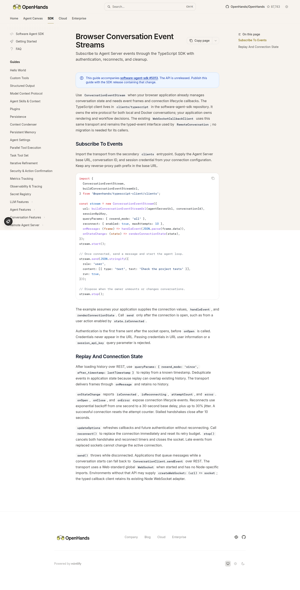

# Browser event-stream guide evidence

September 13, 2026. Guide source: `6fc492c07d33005f3a48ee7b27f5892b720cf81e`.

The actual Mintlify page rendered with HTTP 200 and no browser errors.

The exact documented `ConversationEventStream` constructor was extracted from the guide and executed with application-supplied connection values/callbacks, using Node's browser-compatible global WebSocket and the assembled unreleased SDK. It authenticated, replayed the real model conversation from the orchestration example, explicitly reconnected, and replayed again. The [credential-free trace](browser-stream-live.json) records connection transitions and event kinds. Credentials were not present in the URL. `stop()` closed the stream; the disposable runtime was then released.

The guide's message-send block was deliberately not invoked: this validation subscribes to an existing completed conversation. It does not claim to demonstrate a new browser application or every message-send path. Reproduce by supplying a real conversation and session key, running the constructor/start block, waiting for connected state, calling `reconnect()`, then `stop()`.
