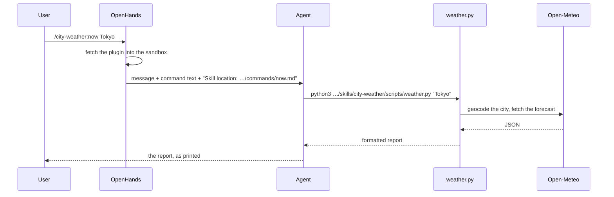

{/* GENERATED from OpenHands/enterprise-cookbook@main (plugin-with-script/README.md). Edit the source, not this file. */}

<Card title="View source on GitHub" icon="github" href="https://github.com/OpenHands/enterprise-cookbook/tree/main/plugin-with-script" horizontal />

A plugin can ship code as well as instructions. This example's
[`city-weather/`](https://github.com/OpenHands/enterprise-cookbook/tree/main/plugin-with-script/city-weather) plugin bundles a small Python script, and its
command and skill tell the agent to run that script and show what it prints.
The agent doesn't work out the API calls itself; it runs one command.

Put the work in a script when it should be the same every time: calling an API,
parsing a file, or formatting a report. The result is repeatable, uses fewer
tokens than having the agent improvise, and you can test the script on its own.

## How It Works



1. OpenHands fetches the plugin into the sandbox, under
   `~/.openhands/cache/plugins/`.
2. The message `/city-weather:now Tokyo` triggers the plugin's command. The
   agent receives the command's instructions along with the absolute path of the
   file they came from.
3. The instructions say where the script is relative to that file, so the agent
   runs it by its absolute path and shows the output.

## Run It

<Tabs>
  <Tab title="Load via API">
    Use the companion [`load-plugin`](/cookbook/load-plugin) example:

    ```bash
    cd ../load-plugin
    pip install requests
    export OH_API_KEY="sk-oh-..."
    python load_plugin.py \
      --repo-path plugin-with-script/city-weather \
      --message "/city-weather:now Tokyo"
    ```
  </Tab>

  <Tab title="Launch via Badge">
    Click to run the command on launch:

    [](https://app.all-hands.dev/launch?plugins=W3sic291cmNlIjogImdpdGh1YjpPcGVuSGFuZHMvZW50ZXJwcmlzZS1jb29rYm9vayIsICJyZWYiOiAibWFpbiIsICJyZXBvX3BhdGgiOiAicGx1Z2luLXdpdGgtc2NyaXB0L2NpdHktd2VhdGhlciIsICJwYXJhbWV0ZXJzIjogeyJjaXR5IjogIlRva3lvIn19XQ%3D%3D\&message=%2Fcity-weather%3Anow%20Tokyo)

    Or load the plugin and ask in your own words, such as "What's the weather in
    Paris?":

    [](https://app.all-hands.dev/launch?plugins=W3sic291cmNlIjogImdpdGh1YjpPcGVuSGFuZHMvZW50ZXJwcmlzZS1jb29rYm9vayIsICJyZWYiOiAibWFpbiIsICJyZXBvX3BhdGgiOiAicGx1Z2luLXdpdGgtc2NyaXB0L2NpdHktd2VhdGhlciJ9XQ%3D%3D)
  </Tab>
</Tabs>

The conversation runs the script once and finishes with its report:

```text
City Weather Report for Tokyo, Japan

- Current Time: 2026-10-10 01:30 GMT+9
- Temperature: 62°F / 16°C
- Current Precipitation: 0.0 mm

Precipitation Forecast (Next 4 Hours):
| Time  | Probability |
|-------|-------------|
| 01:00 | 0% |
| 02:00 | 0% |
| 03:00 | 0% |
| 04:00 | 0% |
```

To use the skill instead of the command, send a message such as
`--message "What's the weather in Paris?"`. The skill is triggered by "weather
in", "weather for", and "forecast for", and runs the same script.

<Tip>
  To test changes from a branch before they're merged, pass `--ref <branch>` to
  `load_plugin.py`. For OpenHands Enterprise, pass `--base-url` with your
  install's URL, or rebuild the badges with
  [`build_launch_url.py --base-url`](/cookbook/launch-plugin-badge).
</Tip>

## Run the Script Locally

The script uses only the Python standard library and the free
[Open-Meteo](https://open-meteo.com/) API, which needs no key. Run it directly
to check it before the agent does:

```bash
python3 city-weather/skills/city-weather/scripts/weather.py "New York"
```

```text
City Weather Report for New York, United States

- Current Time: 2026-10-09 12:30 GMT-4
- Temperature: 70°F / 21°C
- Current Precipitation: 0.0 mm
...
```

If the city isn't found or Open-Meteo can't be reached, it prints an error and
exits with status 1, and the instructions tell the agent to show that error.

## How the Agent Finds the Script

The plugin is fetched to a path in the sandbox that the plugin author can't
know in advance. When a command or skill fires, OpenHands adds the location of
its file to what the agent sees:

```text
Skill location: /home/openhands/.openhands/cache/plugins/enterprise-cookbook-3c5c88fa6e51c50a/plugin-with-script/city-weather/commands/now.md
(Use this path to resolve relative file references in the skill content below)
```

So write the script's path relative to the file that refers to it:

| File                           | Location given to the agent             | Script path in the instructions                         |
| ------------------------------ | --------------------------------------- | ------------------------------------------------------- |
| `commands/now.md`              | `<plugin>/commands/now.md`              | `<plugin>/skills/city-weather/scripts/weather.py`       |
| `skills/city-weather/SKILL.md` | `<plugin>/skills/city-weather/SKILL.md` | `scripts/weather.py`, relative to the skill's directory |

The command spells out the relationship so the agent doesn't have to guess:

````markdown city-weather/commands/now.md expandable
---
argument-hint: <city>
description: Report the current weather and precipitation forecast for a city
---

# City Weather Report

Report the weather for the city named in **$ARGUMENTS** by running the script
bundled with this plugin. Don't call the weather APIs yourself.

## Instructions

1. Read the city from the arguments: **$ARGUMENTS**. If it is empty, ask the
   user which city they want and wait for their answer.
2. Find the script. The skill location given above is this file,
   `<plugin>/commands/now.md`. The script is in the same plugin at
   `<plugin>/skills/city-weather/scripts/weather.py`.
3. Run it with the city as its argument, quoted:

   ```bash
   python3 <plugin>/skills/city-weather/scripts/weather.py "<city>"
   ```

4. Show the script's output to the user exactly as printed. If it exits with an
   error, show the error and stop.

## Examples

`/city-weather:now Tokyo`
`/city-weather:now New York`
````

<Info>
  This works for commands and skills, which the agent reads. Hooks are different:
  OpenHands runs them from the agent's workspace with no plugin-root path, so a
  hook can't call a script bundled in its plugin. That's why the hook examples,
  such as [`command-blacklist`](/cookbook/command-blacklist), put their script inline in
  `hooks.json`.
</Info>

## Where Scripts Go

This plugin follows the
[Claude Code plugin layout](https://code.claude.com/docs/en/plugins-reference),
which OpenHands loads:

- **A script used by one skill** goes in that skill's directory, under
  `skills/<skill>/scripts/`. That's where `weather.py` is.
- **A script shared by several skills, or called by hooks,** goes in `scripts/`
  at the plugin root.

The command is there so that `/city-weather:now` and the plugin's
`entry_command` can start it on launch. In OpenHands, `entry_command` and
`/<plugin>:<name>` refer to files in `commands/`, while a skill is triggered by
keywords in the message.

<Accordion title="Why not use ${CLAUDE_SKILL_DIR}?">
  Claude Code replaces `${CLAUDE_SKILL_DIR}` and `${CLAUDE_PLUGIN_ROOT}` with
  absolute paths when it loads a skill, and its docs show bundled scripts referred
  to that way. OpenHands doesn't replace these variables, so the agent would see
  them as literal text. It gives the agent the skill's location instead, which is
  why this plugin's instructions use paths relative to the file.

  Claude Code also puts a plugin's `bin/` directory on the `PATH`. OpenHands
  doesn't, so call scripts by their path.
</Accordion>

## Plugin Structure

```text
city-weather/
├── .claude-plugin/
│   └── plugin.json              # manifest: name, entry_command, parameters
├── commands/
│   └── now.md                   # /city-weather:now <city>
└── skills/
    └── city-weather/
        ├── SKILL.md             # triggered by "weather in", "weather for", "forecast for"
        └── scripts/
            └── weather.py       # the script both of them run
```

## Related

<CardGroup cols={2}>
  <Card title="load-plugin" href="/cookbook/load-plugin" icon="plug">
    Start a conversation with a plugin loaded through the REST API
  </Card>

  <Card title="launch-plugin-badge" href="/cookbook/launch-plugin-badge" icon="rocket">
    Build launch links and badges like the ones above
  </Card>

  <Card title="command-blacklist" href="/cookbook/command-blacklist" icon="shield-halved">
    A plugin whose script runs as a hook, inlined in hooks.json
  </Card>

  <Card title="Plugins overview" href="/overview/plugins" icon="book-open">
    What plugins are and the format they follow
  </Card>

  <Card title="Plugin Launcher" href="/openhands/usage/cloud/plugin-launcher" icon="book-open">
    The /launch route the badges use
  </Card>

  <Card title="Claude Code skills" href="https://code.claude.com/docs/en/skills" icon="arrow-up-right-from-square">
    Supporting files in a skill directory, including scripts/
  </Card>
</CardGroup>
