This guide walks you through setting up and using Laminar for Analytics in OpenHands Enterprise.
You'll opt into Analytics and configure conversations to automatically send traces to Laminar.

## Who This Is For

This guide is for users who want to explore analytics on their OpenHands Enterprise conversations.

### Why Laminar?

[Laminar](https://laminar.sh/) is an open source observability platform for AI agents like OpenHands.

Use Laminar to view your conversation traces including prompts, tool calls, and answers. A trace is a record of what your agent did.

Laminar can help you see where the agent went wrong. From traces, you can create signals. A signal is a natural language instruction to extract structured data from traces. Use signals to analyze recurring behavior across traces. You can then create better situations for prompting and measure them in Laminar. You can also analyze and improve your skills.

For example, you can view all conversation traces related to a specific skill.

Laminar can help you answer the following questions:
- On a trace, did the agent do a good job using the skill?
- On another trace, did the agent do a bad job?

For more information on evaluating skills, see [Evaluating Agent Skills](https://www.openhands.dev/blog/evaluating-agent-skills).

### Prerequisites

Before you begin, make sure you completed the [Quick Start guide](/enterprise/quick-start).

## Enable Analytics

You should see an **Analytics Configuration** section on the application configuration page.

Check the **Enable Analytics** box to have the installer set up and configure Laminar for analytics.

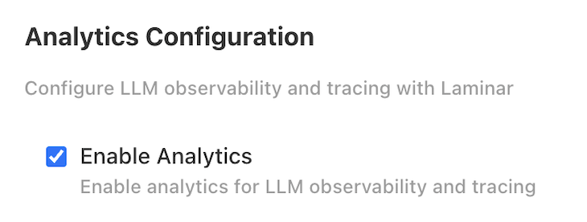

## Deploy

OpenHands will begin deploying. You can expect the deployment status to transition from
**Missing** to **Unavailable** to **Ready**. This typically takes 10-15 minutes.

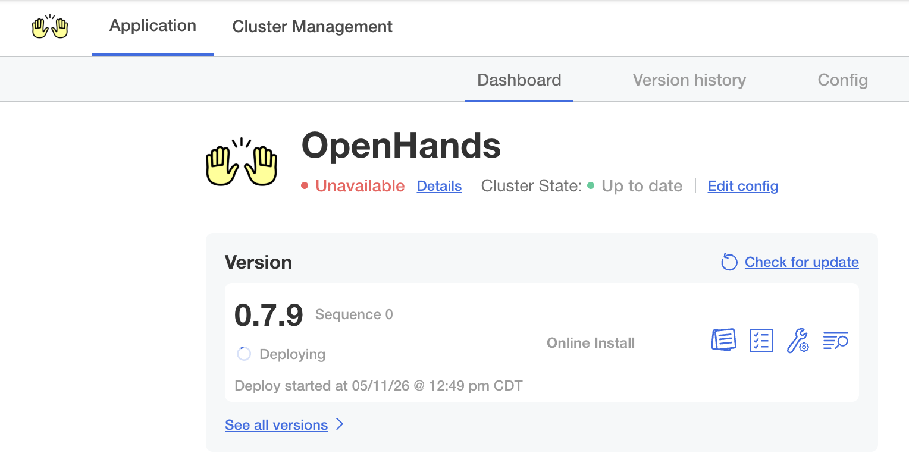

Click **Details** next to the deployment status to monitor individual resources. Resources
shown in orange are still deploying -- wait until all resources are ready.

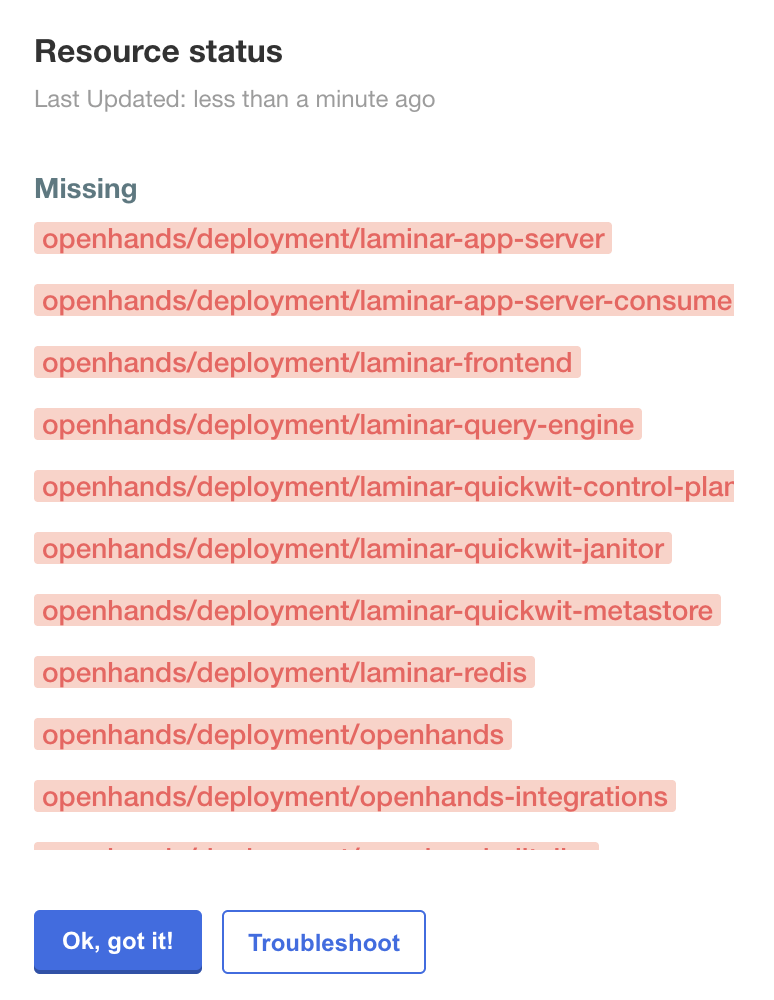

## Access Laminar UI

Once the deployment status shows **Ready**, navigate to `https://analytics.app.<your-base-domain>`.

Click the **Continue with Keycloak** button:

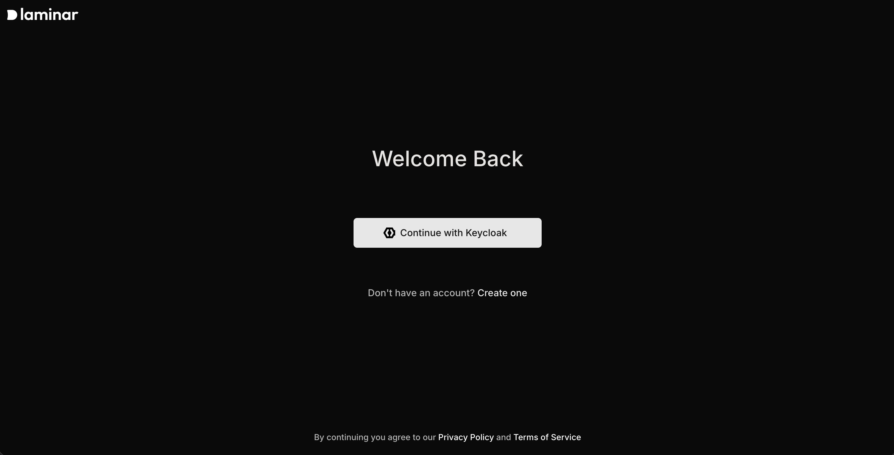

## Create a Laminar project

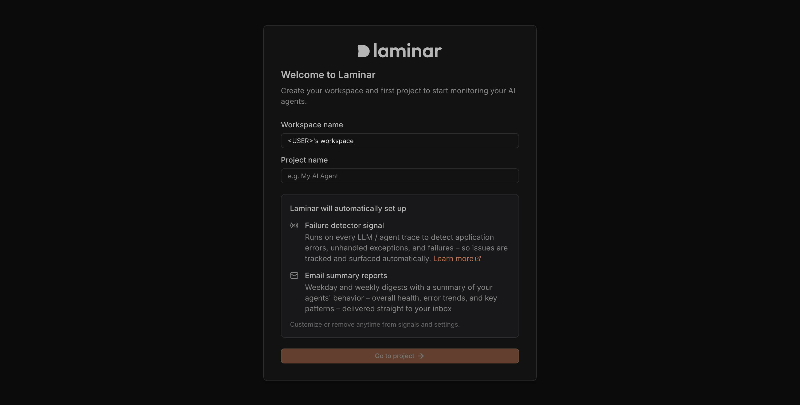

Once a project has been created, Laminar is ready to listen for traces.

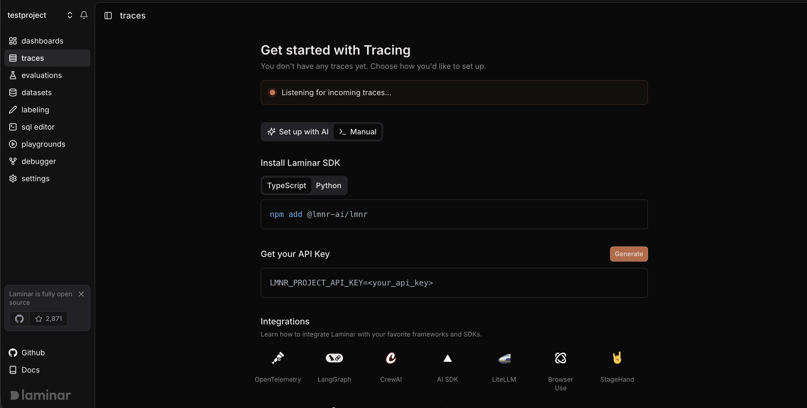

## Create an ingest only API Key

Important: Always use ingest API keys when deploying.

Create a key with ther right permissions. Ingest only keys are recommended as they only have write access to write traces. They cannot be used to read data.

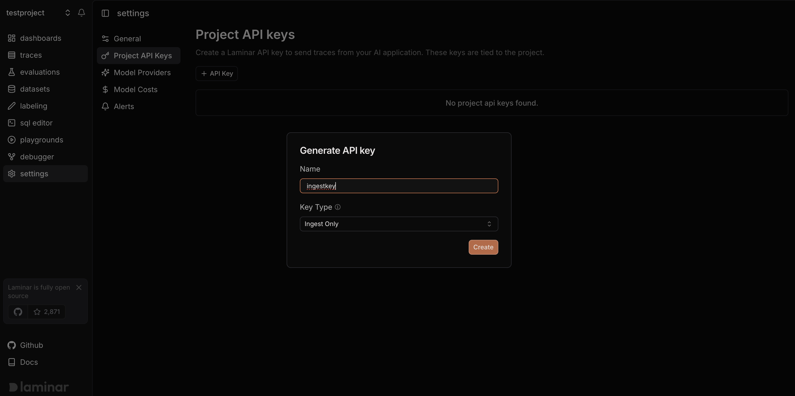

## Set Laminar Project API Key to enable automatic conversation traces

Set the ingest only key as the Laminar Project API Key in the Admin Console configuration:

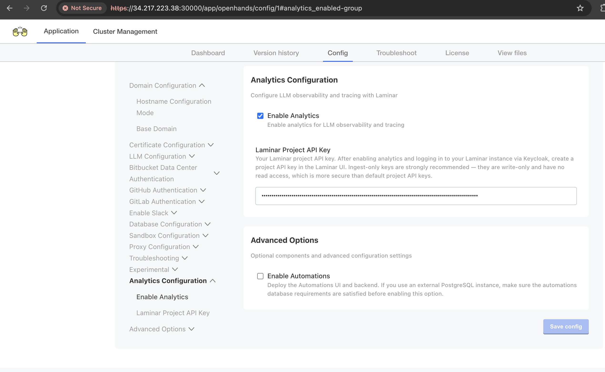

Click **Save config**.

## Deploy Updated Configuration

Deploy the config change after setting the Laminar Project API Key in the Admin Console.

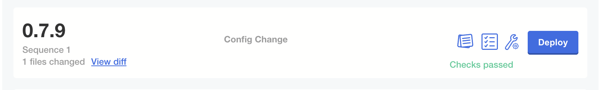

Wait for the deployment to complete.

## Start a conversation

Navigate to the OpenHands UI at `https://app.<your-base-domain>`. Start a new conversation and try a prompt.

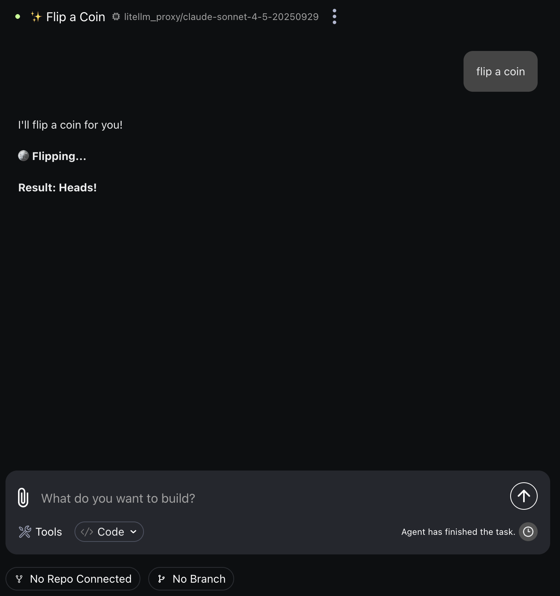

Your conversations will now automatically send a trace to Laminar.

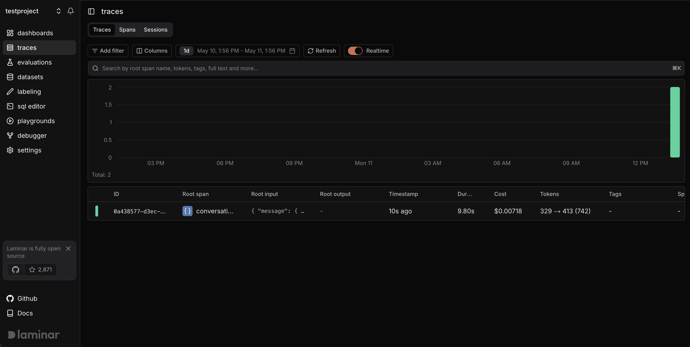

<video
  controls
  className="w-full aspect-video"
  src="https://github.com/user-attachments/assets/0cdf1625-3246-4388-a989-765f00d33ffb"
></video>

## Next Steps

<CardGroup cols={2}>
  <Card title="Prompting Best Practices" icon="lightbulb" href="/openhands/usage/tips/prompting-best-practices">
    Get the most out of your AI coding agents with effective prompting techniques.
  </Card>
  <Card title="Contact Support" icon="headset" href="https://openhands.dev/contact">
    Reach out to the OpenHands team for deployment assistance or questions.
  </Card>
  <Card title="OpenHands Documentation" icon="book" href="/overview/introduction">
    Explore the full OpenHands documentation for usage guides and features.
  </Card>
</CardGroup>
