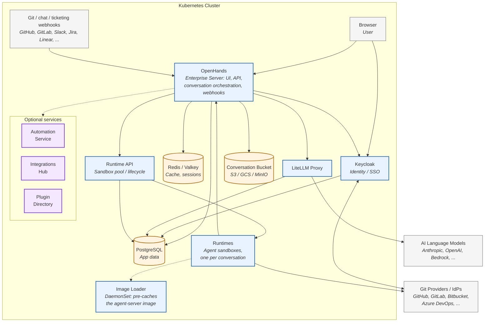
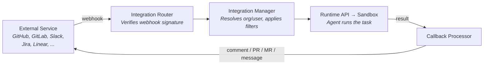

This page explains how OpenHands Enterprise (OHE) and OpenHands Cloud are built: the
overall solution, the individual components/services that make it up, and which
external systems are required versus optional.

<Info>
  OpenHands Cloud (the hosted SaaS at [app.all-hands.dev](https://app.all-hands.dev)) and
  OpenHands Enterprise (the self-hosted product) run the same codebase. The open-source
  [OpenHands](https://github.com/OpenHands/OpenHands) project provides the core agent and
  application server, and an enterprise layer adds SaaS-specific concerns on top: Keycloak
  authentication, organizations and billing, Git-provider **app** integrations with
  webhooks, chat/ticketing integrations, the Automation service, and license/telemetry
  tooling. See [Enterprise vs. Open Source](/enterprise/enterprise-vs-oss) for a full
  feature comparison.
</Info>

## How It Works

A user's browser talks to the **OpenHands** application (server + frontend), which
coordinates with **Keycloak** for identity, a **LiteLLM proxy** for LLM calls, and the
**Runtime API** for spinning up isolated **sandboxes** where the coding agent actually
runs. Optional services extend this core with scheduled/event-driven automations,
plugins, and richer integrations.

The core loop is:

1. A user (or a webhook from GitHub, GitLab, Slack, Jira, or Linear) creates or resumes
   a **conversation**.
2. The OpenHands app authenticates the request (via Keycloak-issued cookies/tokens) and
   asks the **Runtime API** for a sandbox.
3. Runtime API assigns a **warm** (pre-started) or freshly created **Runtime** pod — an
   isolated sandbox running the agent server.
4. The agent in the sandbox calls out through the **LiteLLM proxy** to the configured LLM
   provider, executes tools (bash, file edits, browser, git), and streams events back to
   the app and browser.
5. The agent can push commits, open PRs/MRs, and comment back on the originating
   issue/PR/message through the relevant **Git provider** or **chat/ticketing
   integration**.
6. Conversation state and artifacts are persisted to PostgreSQL, Redis (cache/sessions),
   and an object store (S3/GCS/MinIO — the "conversation bucket").

## Components And Services

### Core Components

These are present in every deployment.

| Component | What It Does |
|---|---|
| **OpenHands (Enterprise Server)** | The main app: web UI, REST/V1 API, conversation orchestration, Git-provider webhook receivers/resolvers, billing routes, and org/user management. |
| **Keycloak** | Identity provider and SSO broker. Terminates OAuth/OIDC flows with GitHub, GitLab, Bitbucket, Bitbucket Data Center, Azure DevOps (or another IdP), issues tokens, and stores brokered provider tokens. OpenHands wraps Keycloak's tokens in a signed session cookie. |
| **PostgreSQL** | Primary relational store for the app, Keycloak, LiteLLM, and Runtime API — one shared instance or split per service. |
| **Redis (or Valkey)** | Caching, rate limiting, and short-lived session data. |
| **LiteLLM Proxy** | Normalizes calls to many LLM providers (Anthropic, OpenAI, Azure, Bedrock, and more) behind one API, and centralizes per-team API key and usage management. |
| **Runtime API** | Manages the pool of sandbox ("Runtime") pods: maintains **warm runtimes** that are ready to be claimed instantly, creates new ones on demand, and tears them down. |
| **Runtimes (agent sandboxes)** | Isolated execution environments — one pod per active conversation — where the OpenHands agent runs. Has its own filesystem, can run shell commands, edit files, browse the web, and call back out to Git providers. |
| **Image Loader** | A DaemonSet that pre-pulls and caches the agent-server (sandbox) image on every node in the runtime cluster, so new sandboxes start quickly. |
| **Conversation bucket (object storage)** | Durable storage for conversation transcripts and session files: any S3-compatible store (AWS S3, MinIO, Cloudflare R2) or GCS. |

### Enterprise Supporting Services

| Component | What It Does |
|---|---|
| **Auth / Token Manager** | Manages OAuth exchanges and refresh of Git-provider tokens brokered through Keycloak, and issues the signed session cookie used for subsequent requests. |
| **Maintenance task processor** | Scheduled jobs for cleanup, budget resets, proactive conversation cleanup, GitLab webhook installation, and contact sync. |
| **Sharing service** | Public, shareable conversation and event links. |
| **Verified models registry** | Org-level curation of which LLMs and models are allowed. |
| **Telemetry / license enforcement** | Periodic usage metrics used for license compliance in self-hosted OHE deployments. Not used on the public OpenHands Cloud SaaS. |

### Optional Platform Services

These ship as independently toggled services alongside the core deployment:

| Service | Purpose |
|---|---|
| **Automation service** | Runs scheduled ("cron") or event-driven ("webhook") agent jobs — for example, posting a daily report to Slack, or reviewing every pull request labeled `openhands`. Has its own API, database, and object storage for uploaded automation packages. Automation runs execute inside a Runtime sandbox, the same as interactive conversations. See [Automations](/openhands/usage/automations/overview). |
| **Integrations Hub** | An agent context layer providing managed connectors and MCP (Model Context Protocol) server integrations, with its own database and credential encryption. |
| **Plugin Directory** | A marketplace UI and API for discovering, browsing, and reviewing agent plugins — bundles of skills, commands, and MCP configuration that can be loaded into a conversation. See [Plugin Marketplace](/enterprise/plugin-marketplace). |
| **Agent Canvas** | An alternate, frontend-only developer control center UI that can point at any agent-server backend — local, VM, Docker, or OpenHands Cloud — instead of only the SaaS backend baked into the main OpenHands UI. See [Agent Canvas Architecture](/openhands/usage/agent-canvas/architecture). |
| **Device plugin** | A Kubernetes DaemonSet that exposes host devices (such as `/dev/fuse` and `/dev/kvm`) to sandbox pods as schedulable resources, without running sandboxes privileged. Only relevant when sandboxes run in the same cluster as the rest of the stack. |

### Integration Adapters

Each Git, chat, or ticketing integration (GitHub, GitLab, Bitbucket, Bitbucket Data
Center, Azure DevOps, Jira, Jira Data Center, Linear, Slack) follows the same pattern: an
**integration router** receives an HMAC-signed webhook, an **integration manager**
resolves the org/user and applies filters, a conversation is started in a sandbox, and a
**callback processor** posts the result back to the external service once the agent
finishes.

Each adapter is independently enabled, and only wires up its webhook router if the
corresponding OAuth app credentials are configured. See the
[Azure DevOps](/enterprise/integrations/azure-devops),
[Bitbucket Data Center](/enterprise/integrations/bitbucket-data-center),
[Jira Data Center](/enterprise/integrations/jira-data-center), and
[Slack](/enterprise/integrations/slack) integration guides.

## Required Vs. Optional External Systems

### Required For Any Deployment

| System | Why It's Required | Notes |
|---|---|---|
| **Kubernetes cluster** | Every component runs as a pod, Deployment, CronJob, or DaemonSet. | Kubernetes 1.19+; Traefik is the recommended ingress controller |
| **At least one LLM provider** | The agent needs a model to reason and act. Anthropic, OpenAI, Azure OpenAI, AWS Bedrock, Google, or any LiteLLM-supported provider will work. | Configured as a secret consumed by the bundled LiteLLM proxy, or point at your own LiteLLM instance — see [External LLM Gateways](/enterprise/integrations/external-llm-gateways) |
| **PostgreSQL** | System of record for the app, Keycloak, LiteLLM, and Runtime API. PostgreSQL 16.4+ is required. | Bundled, or bring your own — see [External PostgreSQL](/enterprise/external-postgres) |
| **Redis or Valkey** | Caching, rate limiting, and short-lived session data. | Bundled, or bring your own |
| **Keycloak** | Identity and session management; brokers all sign-in flows. | Bundled; requires its own PostgreSQL database |
| **Object storage (S3-compatible or GCS)** | Durable storage for conversation transcripts and artifacts, and — if automations are enabled — uploaded automation packages. | Bundled MinIO for proof-of-concept deployments, or bring your own S3/GCS/R2 for production |
| **At least one identity provider (IdP) / Git provider for login** | Users authenticate through Keycloak using OAuth; you must enable and configure at least one of GitHub, GitLab, Bitbucket, Bitbucket Data Center, or Azure DevOps (or another Keycloak-supported IdP). | See [Quick Start](/enterprise/quick-start) for GitHub App setup, and the integration guides for other providers |
| **DNS and TLS** | The app, Keycloak, Runtime API, and LiteLLM each need a routable hostname, and a wildcard record is needed for per-sandbox runtime hostnames. | See [DNS and TLS](/enterprise/k8s-install/dns-and-tls) |

### Optional, Feature-Gated

| System | Unlocks | Related Docs |
|---|---|---|
| **GitHub App** (webhooks) | Trigger agent runs from issues, PR comments, or mentions; the agent can open PRs, push commits, and comment. Can also be used purely as a login IdP without webhooks. | [Quick Start](/enterprise/quick-start) |
| **GitLab App** | The same capabilities, for GitLab (cloud or self-hosted). | — |
| **Bitbucket (Cloud) OAuth consumer** | Login and webhook-triggered runs for Bitbucket Cloud repositories. | — |
| **Bitbucket Data Center** | The same, for self-hosted Bitbucket via an OAuth2 Application Link. | [Bitbucket Data Center](/enterprise/integrations/bitbucket-data-center) |
| **Azure DevOps** | Login and integration for Azure Repos and Azure Boards. | [Azure DevOps](/enterprise/integrations/azure-devops) |
| **Slack** | Mention-triggered conversations, with results posted back to a channel or thread. | [Slack](/enterprise/integrations/slack) |
| **Jira / Jira Data Center** | Ticket-triggered conversations, with status and comment updates. | [Jira Data Center](/enterprise/integrations/jira-data-center) |
| **Linear** | Issue-triggered conversations. | — |
| **Resend or SMTP** | Transactional email for organization invitations and budget alerts. | — |
| **Datadog** | Metrics and log shipping for observability. | — |
| **Tavily** | Web search tool for agents. | — |
| **Automation service dependencies** | The Automation service needs its own PostgreSQL database and its own durable object store (S3-compatible or GCS) for uploaded automation packages. | [Automations](/openhands/usage/automations/overview) |
| **Integrations Hub dependencies** | Its own PostgreSQL database and a credential-encryption key secret. | — |
| **Plugin marketplace source** | A Git repository hosting a plugin catalog, if using the Plugin Directory. | [Plugin Marketplace](/enterprise/plugin-marketplace) |
| **Laminar** | Trace-level observability for conversations. | [Analytics](/enterprise/analytics) |
| **cert-manager** | Automated TLS certificate issuance for the app, Keycloak, LiteLLM, and runtime hosts. | [DNS and TLS](/enterprise/k8s-install/dns-and-tls) |

## Deployment Topology Notes

- Sandboxes ("Runtimes") can run in the **same** Kubernetes cluster as the rest of the
  stack, or in a **separate** cluster reachable by the Runtime API — useful for isolating
  untrusted agent workloads from the control plane, or for scaling sandbox capacity
  independently.
- A **warm runtime pool** is maintained so new conversations can claim an already-running
  sandbox instead of waiting for a cold pod to schedule.
- Production deployments should use managed PostgreSQL (for example, RDS or Cloud SQL)
  instead of an in-cluster database, and real S3 or GCS instead of bundled MinIO. See the
  [Sizing Guide](/enterprise/sizing-guide) for capacity planning based on peak concurrent
  sandboxes.

## Next Steps

<CardGroup cols={2}>
  <Card title="Enterprise vs. Open Source" icon="scale-balanced" href="/enterprise/enterprise-vs-oss">
    Compare OpenHands Enterprise against Agent Canvas and OpenHands Cloud.
  </Card>
  <Card title="Sizing Guide" icon="ruler" href="/enterprise/sizing-guide">
    Size your deployment from peak concurrent sandboxes.
  </Card>
  <Card title="Kubernetes Installation" icon="dharmachakra" href="/enterprise/k8s-install/index">
    Deploy OpenHands Enterprise into your own Kubernetes cluster using Helm.
  </Card>
  <Card title="Conversations And Sandboxes" icon="boxes-stacked" href="/enterprise/conversations-and-sandboxes">
    Understand how conversations map onto sandboxes and Agent Servers.
  </Card>
</CardGroup>
