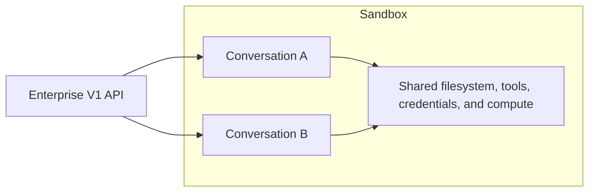

OpenHands Enterprise separates the user's coding session from the environment
where the coding agent runs:

- A **conversation** is the session shown in the OpenHands application. It has
  its own messages, events, agent state, repository selection, and usage
  metrics.
- A **sandbox** is the execution environment. It provides the filesystem,
  processes, credentials, tools, and compute used by one or more conversations.
- An **Agent Server** runs inside the sandbox and executes the OpenHands coding
  agent for each conversation attached to that sandbox.

The Enterprise V1 API manages conversations and sandboxes at the application
level. Most customer integrations should begin with this API.

## How The Components Relate



The Enterprise V1 API creates and manages the user-visible conversations. A
sandbox can contain one conversation or several, depending on placement.

Two conversations in the same sandbox keep separate conversation histories,
but they share the sandbox's filesystem, credentials, compute limits, and
failure domain.

## Choose The Sandbox Boundary

Use separate sandboxes when conversations cross a security, trust, repository,
or failure boundary. Use a shared sandbox when the conversations are trusted
to share the same environment and reducing startup time or sandbox count is
more important than isolation.

| Placement | Appropriate When | Tradeoff |
| --- | --- | --- |
| One sandbox per conversation | Work requires isolation or independent cleanup | Uses the most sandbox capacity |
| Several conversations per sandbox | Trusted work can share files, credentials, and compute | A failure or resource problem can affect every attached conversation |
| Explicitly selected sandbox | An application prepares an environment or maintains a small warm pool | The application must coordinate placement and cleanup |

<Warning>
  A separate conversation is not a security boundary when it shares a
  sandbox with another conversation.
</Warning>

## Configure Automatic Placement

The user's `Sandbox Grouping Strategy` application setting controls automatic
placement:

| Setting | Placement Behavior |
| --- | --- |
| No grouping | Start a new sandbox for each conversation |
| Group by newest | Use the newest available sandbox |
| Least recently used | Use the least recently used available sandbox |
| Fewest conversations | Use the available sandbox with the fewest conversations |
| Add to any | Use the first available sandbox |

To change the setting:

1. Navigate to `Settings > Application`.
2. Select a value under `Sandbox Grouping Strategy`.
3. Click `Save Changes`.

The setting applies to conversations started with that user's application
settings. It does not change the installation's sandbox capacity.

Grouping is a placement rule, not a resource scheduler. It does not determine
whether a sandbox has enough CPU, memory, disk, or credentials for another
conversation. Applications running concurrent workloads must still limit
admission based on their tested sandbox capacity.

## Manage Conversations With V1

The V1 API uses the Enterprise base URL and Bearer authentication:

```http
Authorization: Bearer YOUR_API_KEY
```

The main conversation endpoints are:

| Operation | Endpoint |
| --- | --- |
| Start a conversation | `POST /api/v1/app-conversations` |
| Check asynchronous startup | `GET /api/v1/app-conversations/start-tasks?ids={start_task_id}` |
| Get conversations by ID | `GET /api/v1/app-conversations?ids={conversation_id}` |
| Search conversations | `GET /api/v1/app-conversations/search` |
| Send a follow-up message | `POST /api/v1/app-conversations/{conversation_id}/send-message` |
| Read events | `GET /api/v1/conversation/{conversation_id}/events/search` |
| Update conversation metadata | `PATCH /api/v1/app-conversations/{conversation_id}` |
| Download the trajectory | `GET /api/v1/app-conversations/{conversation_id}/download` |
| Delete a conversation | `DELETE /api/v1/app-conversations/{conversation_id}` |

### Start A Conversation

```bash
curl -X POST \
  "https://OPENHANDS_HOST/api/v1/app-conversations" \
  -H "Authorization: Bearer YOUR_API_KEY" \
  -H "Content-Type: application/json" \
  -d '{
    "initial_message": {
      "role": "user",
      "content": [
        {
          "type": "text",
          "text": "Run the repository tests and explain any failures."
        }
      ],
      "run": true
    },
    "selected_repository": "yourorganization/yourrepository",
    "selected_branch": "main"
  }'
```

Conversation startup is asynchronous. The response is a start task. Poll the
start task until it reaches `READY` and returns `app_conversation_id` and
`sandbox_id`.

### Add Observability Context

Conversation start requests can include optional observability fields:

| Field | Type | Description |
| --- | --- | --- |
| `observability_span_name` | string | Creates a named child span under the root `conversation` span. Use stable, low-cardinality names for grouping and signal routing. |
| `observability_tags` | string array | Adds tags to the conversation root observability span. |
| `observability_metadata` | object | Adds trace-level metadata. Values must be scalars or homogeneous scalar arrays, such as strings, numbers, booleans, `string[]`, `number[]`, or `boolean[]`. |

```json
{
  "initial_message": {
    "role": "user",
    "content": [
      {
        "type": "text",
        "text": "Evaluate this repository against the WB rubric."
      }
    ],
    "run": true
  },
  "selected_repository": "yourorganization/yourrepository",
  "observability_span_name": "wb_rubric_eval",
  "observability_tags": ["wb-rubric", "evaluation"],
  "observability_metadata": {
    "evaluation": "wb",
    "attempt": 1,
    "replay": false
  }
}
```

### Pass Secrets At Conversation Start

For credentials needed by only one conversation, include a `secrets` map in
the start request:

```json
{
  "initial_message": {
    "role": "user",
    "content": [
      {
        "type": "text",
        "text": "Review the repository and open a pull request."
      }
    ],
    "run": true
  },
  "secrets": {
    "GITHUB_TOKEN": "YOUR_SHORT_LIVED_TOKEN"
  }
}
```

Conversation-specific secrets are available before the first agent action.
They take precedence over stored secrets with the same permitted name for that
conversation. Prefer short-lived, narrowly scoped credentials, and do not put
secret values in the initial message or write them to the workspace.

The same request can include `plugins`. Secrets present at startup can fill
`${NAME}` placeholders in an attached plugin's MCP configuration before the
MCP connection opens. Pass both `secrets` and `plugins` in the start request
when a plugin requires a conversation-specific credential.

<Warning>
  If `GITHUB_TOKEN` represents a different GitHub user than the Enterprise
  account, start the conversation without `selected_repository`. Clone the
  repository after the conversation starts, or prepare a sandbox and then
  attach the conversation. Configure `git user.name` and `git user.email`
  separately because the push credential does not set commit authorship.
</Warning>

For tested implementations, see the
[per-conversation secrets](https://github.com/jpshackelford/oh-examples/tree/main/per-conversation-secrets)
and
[service-account GitHub PAT](https://github.com/jpshackelford/oh-examples/tree/main/service-account-github-pat)
examples.

### Select An Existing Sandbox

For explicit placement:

1. Create a sandbox with `POST /api/v1/sandboxes`.
2. Wait until its status is `RUNNING`.
3. Include its ID as `sandbox_id` when starting the conversation.
4. Verify that the completed start task returns the expected sandbox ID.

```json
{
  "sandbox_id": "SANDBOX_ID",
  "initial_message": {
    "role": "user",
    "content": [
      {
        "type": "text",
        "text": "Run the compatibility check."
      }
    ],
    "run": true
  }
}
```

Explicit placement overrides automatic grouping for that conversation. It
does not add isolation between conversations attached to the selected
sandbox.

## Inspect Work Through V1

Enterprise exposes application-level endpoints for reviewing work without
connecting directly to the Agent Server:

| Operation | Endpoint |
| --- | --- |
| Read a workspace file | `GET /api/v1/app-conversations/{conversation_id}/file` |
| List Git changes | `GET /api/v1/app-conversations/{conversation_id}/git/changes` |
| Read the Git diff | `GET /api/v1/app-conversations/{conversation_id}/git/diff` |
| List loaded skills | `GET /api/v1/app-conversations/{conversation_id}/skills` |
| List configured hooks | `GET /api/v1/app-conversations/{conversation_id}/hooks` |

The app-conversation record also includes sandbox status, agent execution
status, and model usage metrics.

Use the events endpoint for messages, tool actions, tool observations, state
changes, and errors. Use the current app-conversation record to reconcile
status after a process restart or missed event.

## Manage Sandbox Lifecycle

The V1 sandbox endpoints include:

| Operation | Endpoint |
| --- | --- |
| Create a sandbox | `POST /api/v1/sandboxes` |
| Search sandboxes | `GET /api/v1/sandboxes/search` |
| Get a sandbox | `GET /api/v1/sandboxes?id={sandbox_id}` |
| Pause a sandbox | `POST /api/v1/sandboxes/{sandbox_id}/pause` |
| Resume a sandbox | `POST /api/v1/sandboxes/{sandbox_id}/resume` |
| Delete a sandbox | `DELETE /api/v1/sandboxes/{sandbox_id}` |

Pause retains the conversation and recoverable workspace while releasing
active runtime capacity. Delete only after required results and artifacts are
stored elsewhere.

Before pausing or deleting a shared sandbox, check every conversation attached
to it. The operation affects all of them.

Deleting the last conversation can also remove its sandbox. After deleting a
conversation, check whether the sandbox still exists before sending a separate
sandbox delete request.
