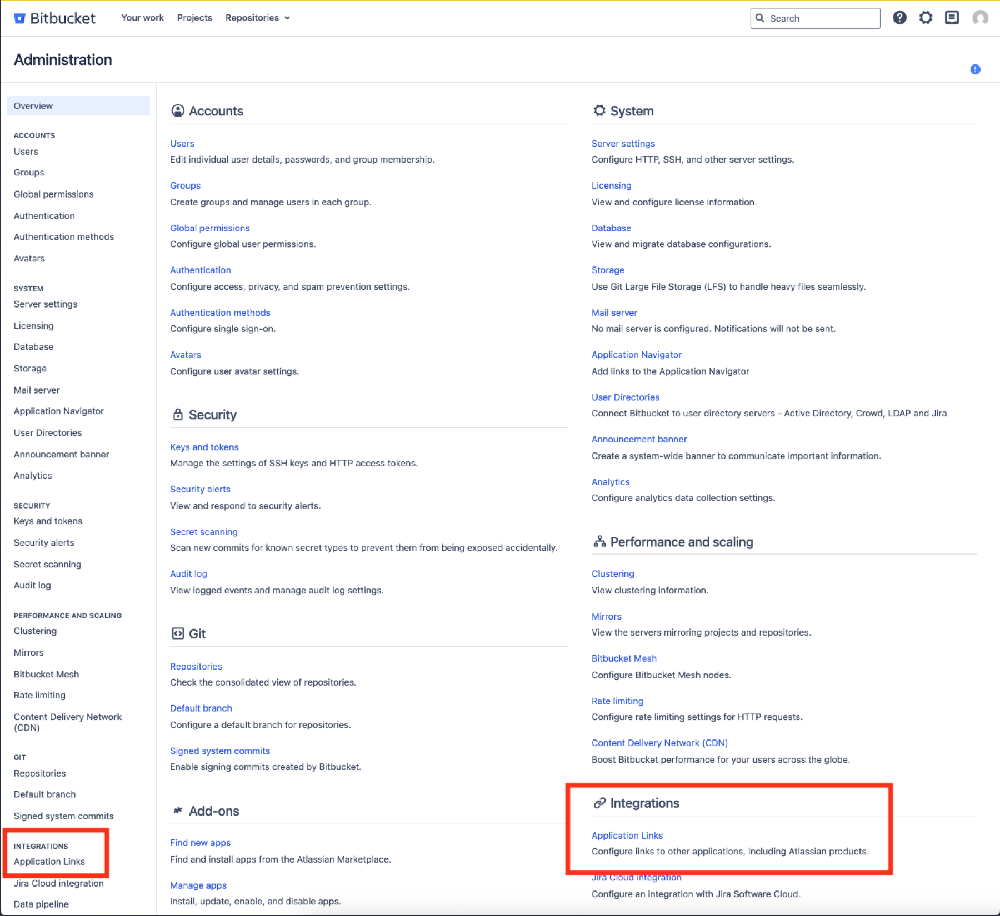
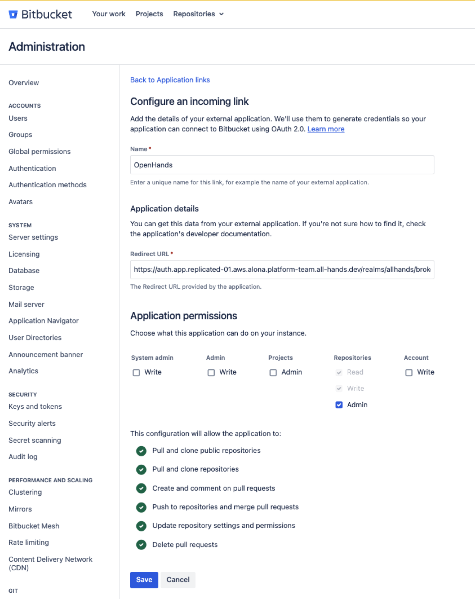
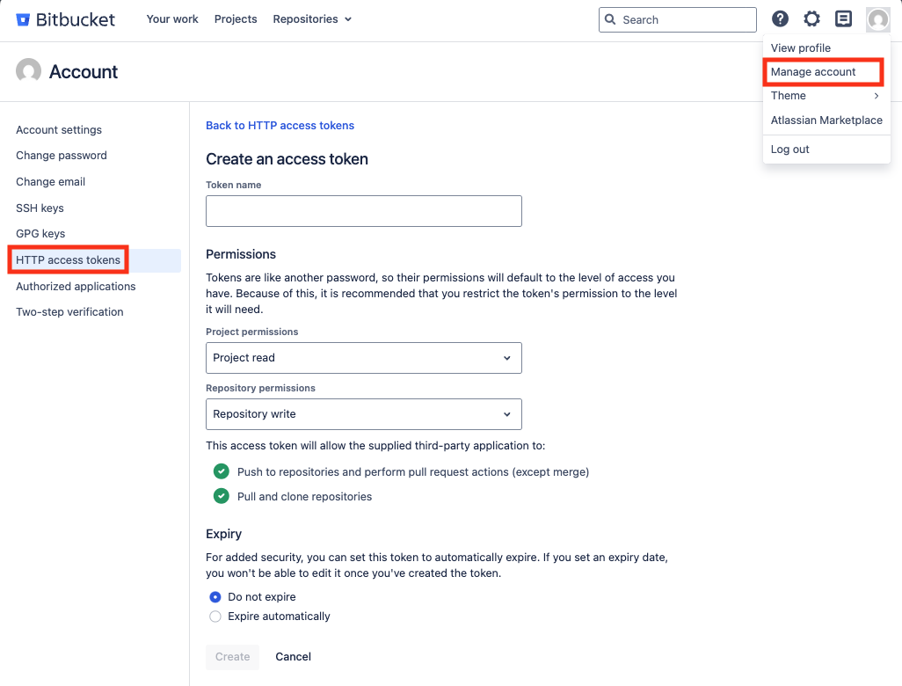

This guide explains how to connect Bitbucket Data Center to an OpenHands
Enterprise Replicated installation. The integration lets users sign in with
Bitbucket Data Center, open repositories, and invoke OpenHands from pull request
comments.

## Prerequisites

- A Bitbucket Data Center administrator who can create an OAuth 2.0 Application
  Link.
- A currently supported Bitbucket Data Center version with OAuth 2.0 Application
  Links enabled. If the application link flow does not show
  incoming OAuth 2.0 settings, verify your Bitbucket Data Center version and
  application link settings.
- Repository administrator access for users who will install repository
  webhooks from OpenHands.
- Network access from OpenHands to Bitbucket Data Center for API calls, and
  from Bitbucket Data Center back to the OpenHands app URL for webhook delivery.
- If Bitbucket Data Center uses an internal or self-signed certificate, upload
  the issuing CA in the OpenHands Enterprise Admin Console under **Additional
  Trusted CA Certificates** before deploying.

## Create a Bitbucket OAuth Application Link

In Bitbucket Data Center, create an OAuth 2.0 Application Link for OpenHands.
The exact menu labels can vary by Bitbucket version, but this is usually under
**Administration > Application Links**.



Use this callback URL:

```text
https://auth.app.<your-openhands-domain>/realms/allhands/broker/bitbucket_data_center/endpoint
```

Replace only `<your-openhands-domain>` in the callback URL. Leave the rest of
the path unchanged.

Use your actual auth hostname, for example:

```text
https://auth.app.openhands.example.com/realms/allhands/broker/bitbucket_data_center/endpoint
```

OpenHands requests the `REPO_ADMIN` OAuth scope so it can list repositories and
install or refresh repository webhooks from the OpenHands UI. Copy the client ID
and client secret. You will paste them into the OpenHands Enterprise Admin
Console.

<Note>
  `REPO_ADMIN` is required so OpenHands can list repositories in the UI and
  create or refresh the `OpenHands Resolver` repository webhook. OpenHands does
  not perform other repository administration actions.
</Note>



## Create a Bot Token

This step is strongly recommended but technically optional. When a bot token is
configured, OpenHands posts comments and reactions as the bot account instead of
as the user.

Create a dedicated Bitbucket Data Center user for OpenHands. For example, create
a user named `openhands` with an email address such as
`openhands-bot@company.com`. Grant this user access to all repositories where
OpenHands should post comments or reactions. Then create an HTTP access token
for that user with **Repository permissions** set to **Repository write**. Store
the token securely. You will need to paste the HTTP access token into the
OpenHands Enterprise Admin Console.



## Configure the Admin Console

Open the Replicated Admin Console for your OpenHands Enterprise installation and
go to the application configuration page.

In **Bitbucket Data Center Authentication**:

1. Enable **Bitbucket Data Center Authentication**.
2. Enter the **Bitbucket Data Center Domain**.
3. Enter the **Bitbucket Data Center Client ID**.
4. Enter the **Bitbucket Data Center Client Secret**.
5. Enter the **Bitbucket Data Center Bot Token** if you have one.
6. Save and deploy the updated configuration.

<Warning>
  The Bitbucket Data Center Domain must be a bare hostname, for example
  `bitbucket.example.com`. Do not include `https://`.
</Warning>

## Sign In with Bitbucket Data Center

After the deployment is completed, users choose **Sign in with Bitbucket Data
Center** on your app's login page.

On first sign-in, users may be asked to accept OpenHands terms and complete an
offline access flow. After sign-in, OpenHands stores the user's Bitbucket Data
Center token so it can list repositories and run resolver jobs as that user.

## Install Repository Webhooks

To trigger OpenHands on Bitbucket repositories, repository administrators can
install the OpenHands bot onto a repository from **Settings > Integrations**
within the OpenHands app. For each repository that should support `@openhands`
pull request comments, click **Install**. If a webhook already exists, click
**Reinstall** to refresh it.

OpenHands creates or updates a repository webhook named `OpenHands Resolver`.
The webhook URL is connection-specific:

```text
https://app.<your-openhands-domain>/integration/bitbucket-dc/connections/<connection-id>/events
```

OpenHands subscribes the webhook to repository and pull request events,
including pull request comment add, edit, and delete events. The signing secret
is generated and stored by OpenHands.

## Trigger OpenHands from Bitbucket Data Center

Open a pull request and add a comment containing `@openhands`. Inline pull
request comments are also supported.

OpenHands starts a resolver job when:

- The repository webhook is installed and active.
- The webhook delivery signature is valid.
- The mentioning Bitbucket user has signed in to OpenHands with Bitbucket Data
  Center.
- The mentioning user has access to the repository.

The resolver context includes the pull request title, description, current
comments, and the triggering comment. OpenHands replies back to the pull request
when the job starts and when it completes.

## Troubleshooting

| Symptom | Check |
| --- | --- |
| The Bitbucket Data Center login option is not visible | Confirm Bitbucket Data Center Authentication is enabled in the Admin Console and the deployment has been applied. |
| OAuth redirects fail | Confirm the callback URL exactly matches `https://auth.app.<your-openhands-domain>/realms/allhands/broker/bitbucket_data_center/endpoint`. |
| Login tries to reach an invalid `https://https://...` URL | Remove `https://` from the Bitbucket Data Center Domain field in the Admin Console. |
| Repository webhook install fails | Confirm the user has repository admin access and the OAuth app grants `REPO_ADMIN`. |
| Webhook delivery reaches OpenHands but no job starts | Confirm the comment contains `@openhands`, the webhook is installed for that repository, and the mentioning Bitbucket user has signed in to OpenHands. |
| OpenHands cannot list Bitbucket repositories or install webhooks | Confirm the OpenHands cluster can reach the Bitbucket Data Center URL. |
| Bitbucket webhook deliveries do not reach OpenHands | Confirm the Bitbucket Data Center network can reach the OpenHands app URL. |
| Bitbucket API calls fail with TLS errors | Upload the Bitbucket Data Center CA certificate in **Additional Trusted CA Certificates** and redeploy. |
