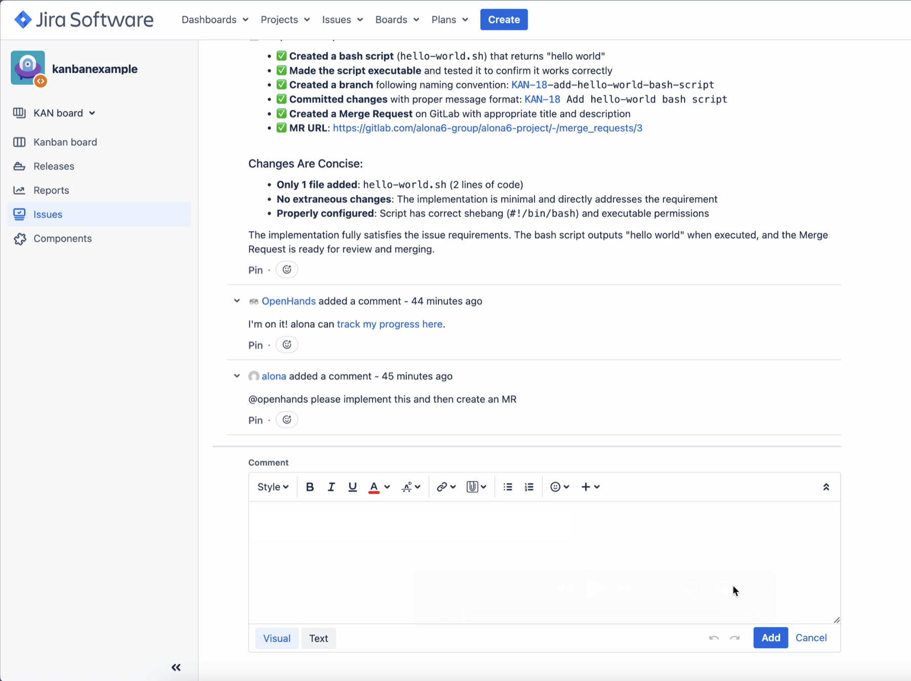
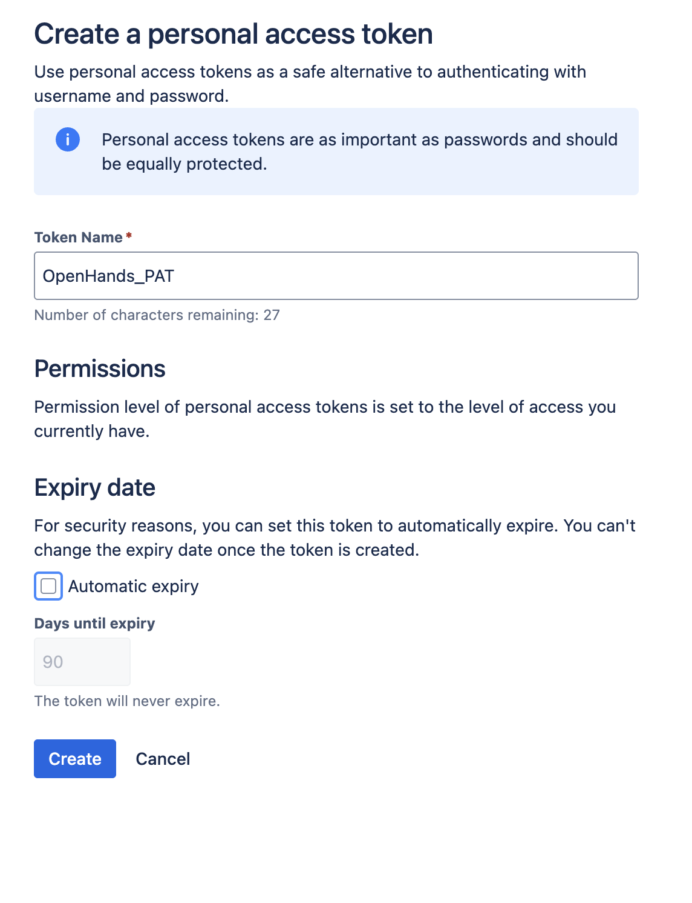
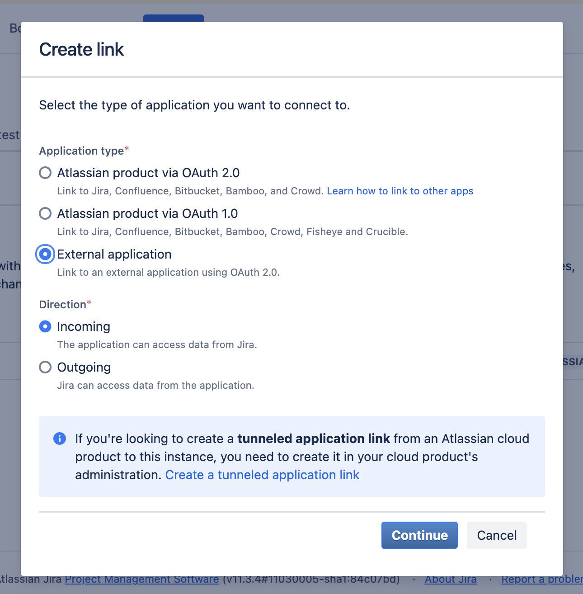
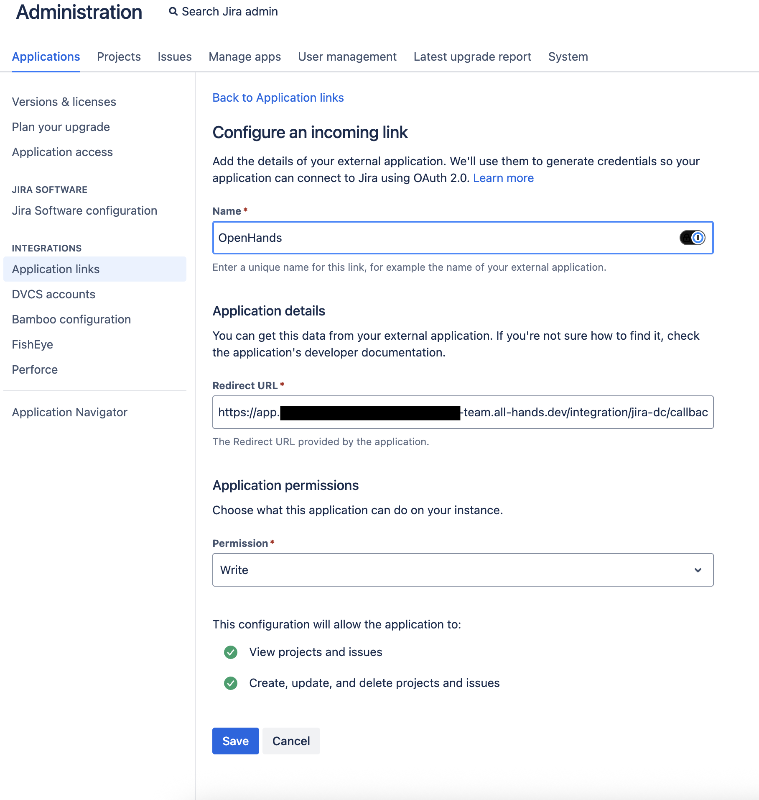
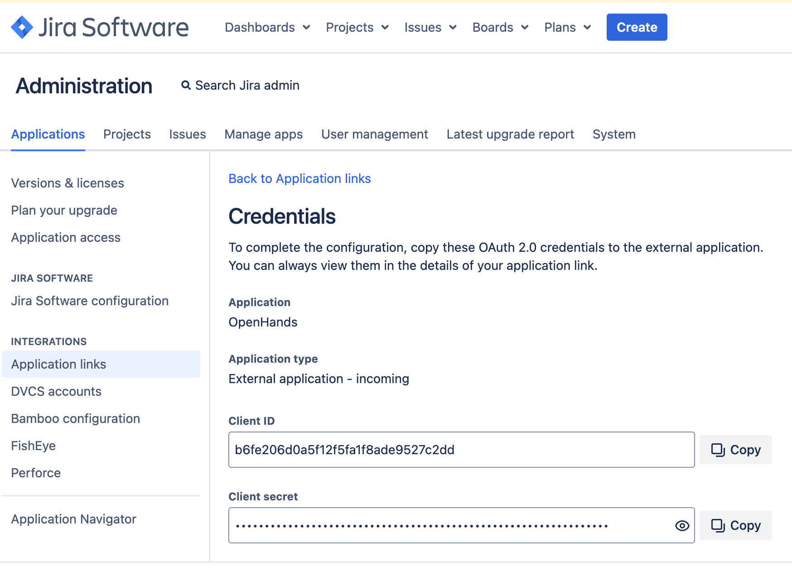
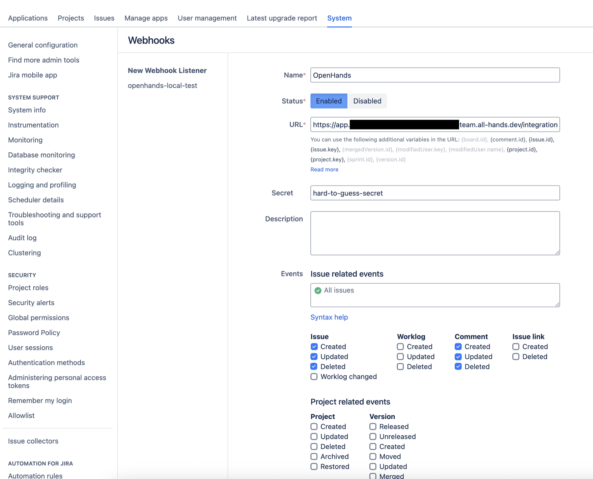

This guide explains how to connect Jira Data Center to an OpenHands Enterprise
Replicated installation. The integration lets users start OpenHands from Jira
issues by commenting with `@openhands` or by adding the `openhands` label.



## Prerequisites

- Jira Data Center administrator access to create users, personal access
  tokens, OAuth applications, and webhooks.
- A currently supported Jira Data Center version with OAuth 2.0 incoming
  application links enabled. If you do not see **External
  application** and **Incoming** while creating the link, verify your Jira Data
  Center version and application link settings.
- Network access from OpenHands to Jira Data Center for API calls, and from
  Jira Data Center back to the OpenHands app URL for webhook delivery.
- If Jira Data Center uses an internal or self-signed certificate, upload the
  issuing CA in the OpenHands Enterprise Admin Console under **Additional
  Trusted CA Certificates** before deploying.

<Note>
  Jira Data Center setup is global for the OpenHands Enterprise installation.
  Service account values are configured in the Admin Console. Webhook setup is
  completed later inside OpenHands.
</Note>

## Create a Bot Token

Create a dedicated Jira user for OpenHands. For example, create a user named
`openhands` with an email address such as `openhands-bot@company.com`.
OpenHands uses this bot account to read issues, add comments, and add
reactions. Grant it access to all Jira projects where OpenHands should read and
comment.

After you have granted the bot user access, sign in as the `openhands` user and
create a Jira personal access token from the user's profile. Store it securely.
You will need to paste the bot account email and PAT into the OpenHands
Enterprise Admin Console.



## Create a Jira OAuth Application

OAuth linking is recommended because it lets team members prove ownership of
their Jira account before using OpenHands to process their Jira events.

In Jira Data Center, open **Administration > Applications > Application links**
and create a new link. When Jira asks what type of application to connect,
choose **External application**. For the direction, choose **Incoming** because
OpenHands connects to Jira during OAuth linking.



Configure the incoming link with this callback URL:

```text
https://app.<your-openhands-domain>/integration/jira-dc/callback
```

Use your actual app hostname, for example:

```text
https://app.openhands.example.com/integration/jira-dc/callback
```

When prompted for OAuth scopes, select `WRITE` (allows OpenHands to link Jira
accounts and make Jira API calls within the user's granted Jira permissions).



Copy the OAuth client ID and client secret and store them securely. You will
paste them into the Admin Console.



<Note>
  If your Jira Data Center installation cannot provide an OAuth application, you
  can select email matching in the Admin Console instead. In that mode,
  OpenHands links Jira users by matching their Jira email address to their
  OpenHands email address.
</Note>

## Configure the Admin Console

Open the Replicated Admin Console for your OpenHands Enterprise installation and
go to the application configuration page.

In **Jira Data Center Integration**:

1. Enable **Jira Data Center Integration**.
2. Select the user linking method:
   - **OAuth** is recommended.
   - **Email match** can be used if OAuth is not available.
3. Enter the **Jira Data Center Service Account Email**.
4. Enter the **Jira Data Center Service Account PAT**.
5. If using OAuth, enter the **Jira Data Center Base URL**, including
   `https://`.
6. If using OAuth, enter the **Jira Data Center OAuth Client ID** and
   **OAuth Client Secret**.
7. Save and deploy the updated configuration.

<Warning>
  The Jira Data Center Base URL must include the scheme, for example
  `https://jira.example.com`. Do not enter only `jira.example.com`.
</Warning>

## Install the Jira Webhook

After OpenHands is deployed, sign in to OpenHands and open
**Settings > Integrations > Jira Data Center**.

If OAuth is enabled, click **Connect** and complete the Jira OAuth flow. Then set
up the webhook using one of the options below.

### Automatic setup

Choose **Install automatically** and paste a short-lived Jira admin PAT.
OpenHands uses this PAT once to call Jira's webhook API and then discards it. The
PAT is never stored. The automatic setup creates or updates a Jira global
webhook named `OpenHands` that points to this OpenHands URL.

```text
https://app.<your-openhands-domain>/integration/jira-dc/connections/<connection-id>/events
```

### Manual setup

Choose **Set it up in Jira myself**, then click **Generate webhook details**.
OpenHands saves the connection and shows a webhook URL and signing secret.



Automatic setup is recommended. If you choose manual setup, create a global
webhook using the generated URL and signing secret. Jira must include the
request body and sign deliveries with the generated secret; if your Jira admin
UI does not support those settings, use automatic setup.

Use these events:

- `jira:issue_created`
- `jira:issue_updated`
- `jira:issue_deleted`
- `comment_created`
- `comment_updated`
- `comment_deleted`

After saving the webhook in Jira, return to OpenHands and click
**I created the webhook**.

## Link Users

Each user who wants to invoke OpenHands from Jira should sign in to OpenHands and
connect their Jira Data Center account from **Settings > Integrations > Jira Data
Center**.

<Note>
  Webhook setup is global for the OpenHands Enterprise installation. Only the
  user setting up the integration needs to install the webhook or provide a Jira
  admin PAT. Other teammates only need to connect their own Jira Data Center
  account from **Settings > Integrations** before using `@openhands` from Jira.
</Note>

When a Jira event arrives, OpenHands resolves the Jira user to an OpenHands user.
If the Jira user has an OpenHands account but has not connected Jira Data
Center, OpenHands comments on the issue asking them to connect their account and
try again.
If no OpenHands account exists for the Jira user's email address, OpenHands
comments on the issue asking the user to sign up and try again.

## Trigger OpenHands from Jira

Create or update a Jira issue with clear requirements. Include the target
repository in the issue description or in a follow-up comment, for example:

```text
Repository: Acme/web-app
```

OpenHands looks for a line starting with `Repository:` followed by the same
`org/repo` format configured in your connected source control provider.

Then trigger OpenHands with either:

- A Jira comment containing `@openhands`.
- The `openhands` label on the issue.

The invoking OpenHands user must have access to the target repository written in
the Jira issue. If OpenHands cannot determine or access the repository, it
comments on the issue with the next step to fix the repository reference or
access.

## Troubleshooting

| Symptom | Check |
| --- | --- |
| The Jira Data Center card is not visible in OpenHands | Confirm Jira Data Center Integration is enabled in the Admin Console and the deployment has been applied. |
| OAuth redirects fail | Confirm the Jira OAuth callback URL exactly matches `https://app.<your-openhands-domain>/integration/jira-dc/callback`. |
| Automatic webhook setup fails | Confirm the admin PAT belongs to a Jira user allowed to create global webhooks. |
| Webhook deliveries return `403` | Confirm the webhook URL and signing secret match the values generated by OpenHands. |
| Webhook deliveries reach OpenHands but no job starts | Confirm the Jira user is linked, the integration is active, the comment contains `@openhands` or the issue update added the `openhands` label, and the user has access to the repository. |
| OAuth, issue reads, or automatic webhook setup fail with connection errors | Confirm the OpenHands cluster can reach the Jira Data Center URL. |
| Jira webhook deliveries do not reach OpenHands | Confirm the Jira Data Center network can reach the OpenHands app URL. |
| Jira API calls fail with TLS errors | Upload the Jira Data Center CA certificate in **Additional Trusted CA Certificates** and redeploy. |
