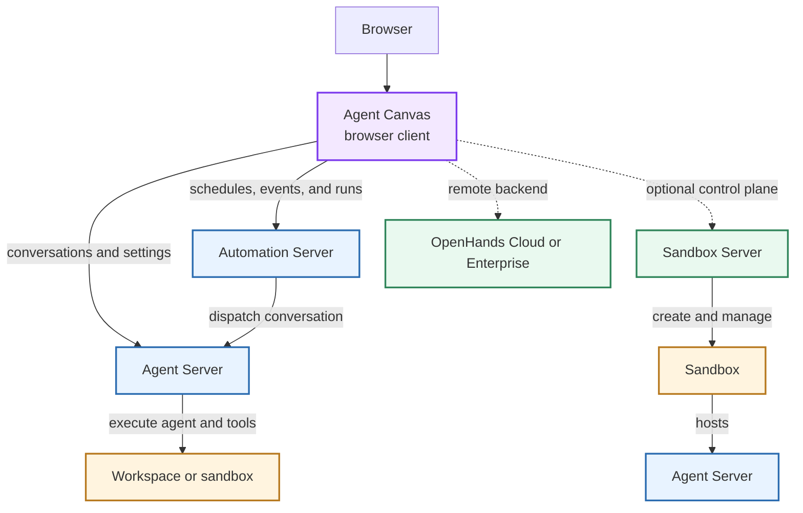

Agent Canvas is the open-source browser client and control center for OpenHands conversations and automations. It presents backend state and sends requests to backend services; it is not an agent runtime or sandbox.

<Warning>
  **Agent Canvas does not execute tools.** Agent Server or an ACP agent process executes tools in the selected workspace.

  **Agent Canvas does not provide sandbox isolation.** Isolation comes from the selected workspace, container, sandbox service, or remote platform.
</Warning>

## Core Components

| Component | Responsibility | Source |
|-----------|----------------|--------|
| **Agent Canvas** | Browser interface for conversations, files, settings, backends, and automations | [`OpenHands/OpenHands`](https://github.com/OpenHands/OpenHands) |
| **Agent Server** | Runs conversations, agents, tools, and workspace operations; streams events to clients | [`OpenHands/software-agent-sdk`](https://github.com/OpenHands/software-agent-sdk/tree/main/openhands-agent-server) |
| **Automation Server** | Stores schedules and event triggers, tracks runs, and dispatches conversations | [`OpenHands/automation`](https://github.com/OpenHands/automation) |
| **Sandbox Server** | Creates and manages sandboxed environments that host Agent Server | [`OpenHands/sandbox-server`](https://github.com/OpenHands/sandbox-server) |
| **Workspace or sandbox** | Defines which files, processes, credentials, and networks an agent can access | Deployment-specific |

## Service Relationships

The normal browser path is **Browser → Agent Canvas → backend services**. Agent Server owns conversation execution. Automation Server owns scheduled and event-driven run lifecycle. A backend distribution can expose both services behind one URL, but they remain separate responsibilities.

Sandbox Server is an optional control plane. It creates sandboxes that host Agent Server, while Agent Canvas remains the client. OpenHands Cloud and OpenHands Enterprise provide remote backend and sandbox infrastructure behind their service endpoints.

## Client And Launcher Boundaries

`Agent Canvas` can refer to two related surfaces:

- **Canvas client** — The React browser application. It renders state and sends requests to backend services.
- **`agent-canvas` launcher and distributions** — Packaging that can start the Canvas client, Agent Server, Automation Server, and ingress together.

The launcher supports split modes:

| Mode | Services started |
|------|------------------|
| `agent-canvas` | Canvas client, Agent Server, Automation Server, and ingress |
| `agent-canvas --frontend-only` | Canvas client and ingress |
| `agent-canvas --backend-only` | Agent Server, Automation Server, and ingress |

Docker and Helm packages can also bundle the client and backend services. A bundled deployment changes how services are installed, not which component owns execution or isolation.

## Execution And Isolation

When you send a message, Agent Canvas sends it to the selected backend. Agent Server starts or resumes the conversation, runs the selected agent, invokes tools, updates backend state, and streams events to Canvas.

The workspace determines the execution boundary:

| Workspace type | Execution and isolation boundary |
|----------------|----------------------------------|
| **Local process** | Agent Server and tools run directly on the backend host without container isolation. |
| **Docker or Kubernetes** | Agent Server and tools run inside the configured container or pod with its mounts and network policy. |
| **Sandbox Server** | The control plane creates a sandbox that hosts Agent Server and applies the configured sandbox boundary. |
| **OpenHands Cloud or Enterprise** | The remote platform selects and manages the execution environment. |

Connecting Canvas to a remote backend does not grant the browser direct access to that backend's filesystem. Canvas displays files and terminal output returned by Agent Server.

## State Ownership

State belongs to backend services rather than the browser client:

- Agent Server stores conversation history, agent and LLM profiles, secrets, MCP configuration, and related settings.
- Automation Server stores automation definitions, schedules, events, and run history.
- The workspace or sandbox stores files produced or changed by the agent.
- Agent Canvas stores connection information needed to reach configured backends.

Switching backends changes which backend-managed conversations, settings, automations, and workspaces Canvas displays.

## Deployment Patterns

| Pattern | Relationship |
|---------|--------------|
| **Local all-in-one** | The launcher starts Canvas and local backend services on one machine. |
| **Split local or self-hosted** | Canvas runs separately and connects to a backend-only launcher on a workstation, VM, or cluster. |
| **Sandbox control plane** | Canvas connects through Sandbox Server to Agent Server instances hosted in managed sandboxes. |
| **Remote platform** | Canvas connects to OpenHands Cloud or OpenHands Enterprise endpoints. |

## Next Steps

- [Install Agent Canvas](/openhands/usage/agent-canvas/setup)
- [Connect And Manage Backends](/openhands/usage/agent-canvas/backends)
- [Self-Host On A VM](/openhands/usage/agent-canvas/backend-setup/vm)
- [Use Docker](/openhands/usage/agent-canvas/backend-setup/docker)
- [Agent Server Overview](/sdk/guides/agent-server/overview)
