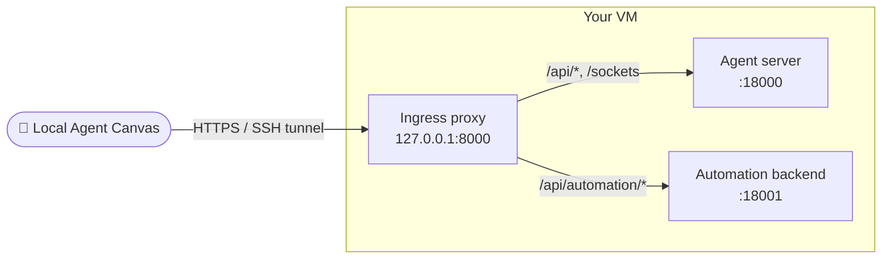

Use `--backend-only` to run just the agent server and automation backend on a remote machine — no frontend served. Connect to it from your local Agent Canvas through **Manage Backends**.

<Warning>
  The agent server can read and write the host filesystem, execute shell commands, and access the network. Lock down the machine before starting.
</Warning>

## Overview



`agent-canvas --backend-only --public` starts the agent server and automation backend behind an ingress proxy on `127.0.0.1:8000`. No frontend is served — you connect from your local Agent Canvas UI.

<Tip>
  If you also want to serve the UI from the VM, see [Self-Hosting Agent Canvas](/openhands/usage/agent-canvas/self-hosting) instead.
</Tip>

## 1. Provision and Secure the Machine

Any always-on Linux or macOS host:

- **Cloud VM** — Ubuntu 24.04 LTS, 2 vCPU / 4 GB RAM is enough for a single user.
- **Dedicated hardware** — Mac Mini, Intel NUC, spare laptop.

Lock down inbound traffic **before** starting the backend:

- **Port 22 (SSH)** — your IP or VPN CIDR only.
- **Everything else** — drop.

## 2. Install Prerequisites

On Ubuntu:

```bash
apt-get update && apt-get install -y curl git

# Node.js 22.x (via nvm, asdf, or NodeSource)
# uv (for the agent server runtime):
curl -LsSf https://astral.sh/uv/install.sh | sh
```

On macOS, install Node and `uv` via Homebrew instead.

## 3. Start the Backend

```bash
LOCAL_BACKEND_API_KEY=<choose-a-strong-secret> npx @openhands/agent-canvas --backend-only --public
```

- `--backend-only` starts only the agent server and automation backend (no frontend).
- `--public` requires `LOCAL_BACKEND_API_KEY` — every API request must carry a matching `X-Session-API-Key` header.

## 4. Connect from Your Local Machine

On your laptop, start the frontend:

```bash
agent-canvas --frontend-only
```

Then add the VM as a backend:

1. Click the backend switcher → **Manage Backends** → **Add Backend**.
2. Fill in:
   - **Name** — e.g. `my-vm`
   - **Host / Base URL** — `http://localhost:8000` (if using an SSH tunnel) or the VM's URL if you've set up a reverse proxy
   - **API Key** — the `LOCAL_BACKEND_API_KEY` from step 3
3. Save and select it as the active backend.

### Using an SSH Tunnel

The simplest way to reach the backend without exposing ports:

```bash
ssh -L 8000:127.0.0.1:8000 user@your-vm
```

Then use `http://localhost:8000` as the backend URL.

### Using a Reverse Proxy

If you prefer direct HTTPS access, put nginx + Let's Encrypt in front of `127.0.0.1:8000`. See the [Self-Hosting guide](/openhands/usage/agent-canvas/self-hosting#4-optional-add-a-domain-with-nginx--tls) for the full nginx + TLS walkthrough — the same configuration works for backend-only deployments.

## Related Guides

- [Connect and Manage Backends](/openhands/usage/agent-canvas/backends)
- [Self-Hosting Agent Canvas](/openhands/usage/agent-canvas/self-hosting) — deploy the full stack (UI + backend)
- [Local Backend](/openhands/usage/agent-canvas/backend-setup/local)
- [Docker Backend](/openhands/usage/agent-canvas/backend-setup/docker)
- [Cloud Backend](/openhands/usage/agent-canvas/backend-setup/cloud)
