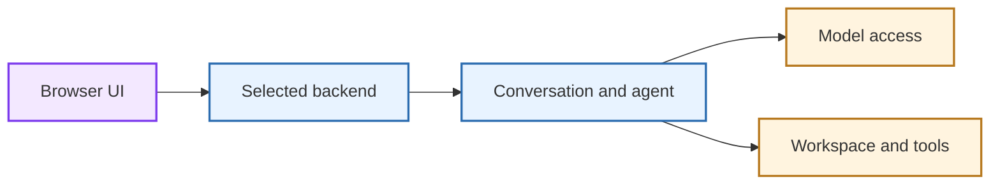

Agent Canvas is an open-source control surface for agentic work. From one place, you can manage conversations, files, terminals, model configuration, backends, and automations.

The browser interface connects to one or more backends that run the agent and its tools. By default, that backend runs on your machine, but you can instead use Docker, a VM, Modal, or [OpenHands Cloud](/openhands/usage/cloud/openhands-cloud). The LLM models can run locally, through a provider API or be accessed through an ACP agent.

## When To Use Agent Canvas

Choose the path that matches where and how you want your agents to run:

| If you want to... | Start here |
|-------------------|------------|
| Run OpenHands locally in a browser | [Install Agent Canvas](/openhands/usage/agent-canvas/setup) |
| Use a sandboxed local environment | [Docker Backend](/openhands/usage/agent-canvas/backend-setup/docker) |
| Run agents on an always-on machine | [VM / Self-Hosted Installation](/openhands/usage/agent-canvas/backend-setup/vm) |
| Connect to managed cloud sandboxes | [Cloud Backend](/openhands/usage/agent-canvas/backend-setup/cloud) |
| Use Claude Code, Codex, Gemini CLI, or another ACP agent | [ACP Agents](/openhands/usage/agent-canvas/acp-agents) |

## How Agent Canvas Works

Agent Canvas has four pieces to understand:

| Concept | What It Means | Why It Matters |
|-------|---------------|----------------|
| **Browser UI** | The web interface you open in your browser. | This is where you chat, inspect files, manage settings, and configure automations. |
| **Backend** | The agent server that runs conversations, tools, settings, secrets, and automations. | This determines where the agent runs and what machine or sandbox it can access. |
| **Workspace** | The folder, repository, container mount, or cloud sandbox the agent works in. | This determines which files the agent can read and write. |
| **Agent and model** | The OpenHands agent or an ACP agent, plus the model credentials it uses. | This determines which LLM or provider receives conversation context and powers the agent. |

The browser UI is a client of the selected backend. Conversations, settings, secrets, LLM profiles, MCP servers, skills, and automations persist on that backend. The workspace and tools run where that backend runs.

<Note>
  Switching backends switches the environment the agent is using. For details on how conversations and workspaces remain separate, see [Conversations](/openhands/usage/agent-canvas/conversations) and [Backends](/openhands/usage/agent-canvas/backends).
</Note>

## Choosing A Trust Boundary

Before installing, decide where you want the agent to run and what files it should be able to access.

| Setup | Trust Boundary | Best For |
|-------|----------------|----------|
| **npm local install** | Runs directly on your machine. The agent server can operate on the local filesystem. | Fastest local setup when you trust the machine and understand the file access. |
| **Docker** | Runs inside a container and only sees the directories you mount. | Local sandboxing and clearer file boundaries. |
| **VM or dedicated machine** | Runs on the remote host you control. | Always-on agents, heavier compute, team-shared backends, or personal/work separation. |
| **OpenHands Cloud** | Runs in managed OpenHands Cloud sandboxes. | Cloud execution without maintaining your own machine or VM backend. |

<Warning>
  Agent Canvas can run agents that execute shell commands, read files, write files, and use connected tools. Only connect a backend to files, secrets, and networks that you are willing to let the agent use.
</Warning>

## What Happens When You Close the Terminal?

For a local npm or npx installation, closing the terminal stops the Agent Canvas process, so the browser UI can no longer use its local backend. Start Agent Canvas again with the same command to continue. A Docker container, VM, or cloud backend continues running until that backend is stopped.

See [Install](/openhands/usage/agent-canvas/setup#run-agent-canvas-again) to restart Agent Canvas and [Troubleshooting](/openhands/usage/agent-canvas/troubleshooting) if the browser cannot reconnect.

## Model Access

Agent Canvas supports several model access patterns:

- **Direct provider key** — enter an API key from Anthropic, OpenAI, Google, or another supported provider.
- **OpenHands LLM API key** — use an OpenHands LLM API key for verified hosted models.
- **ACP agent subscription login** — use a signed-in provider, such as Claude Code, Codex, or Gemini, when the backend runs on the same machine as that login.
- **Local or OpenAI-compatible provider** — connect providers such as Ollama, LM Studio, LiteLLM, or a compatible gateway through model settings.

See [Manage LLM Profiles](/openhands/usage/agent-canvas/llm-profiles) and [ACP Agents](/openhands/usage/agent-canvas/acp-agents) for details.

## How It Fits With Other OpenHands Products

| Surface | Best for | Where it runs |
|---------|----------|---------------|
| **Agent Canvas** | Browser-first agent work, workspace access, and automations | The backend you select: your machine, Docker, a VM, Modal, or Cloud |
| **OpenHands SDK** | Building agent-powered Python applications | Your application and the workspace you configure |
| **OpenHands Cloud** | Fully managed hosted execution | Managed OpenHands Cloud infrastructure |
| **Local GUI (Legacy)** | Following older Docker-based Local GUI documentation | Your local Docker environment |

### Agent Canvas vs "openhands serve"

`agent-canvas` starts the current Agent Canvas UI and backend stack. `openhands serve` starts the legacy OpenHands CLI GUI server and will not run if you have only installed agent-canvas.

### How Conversations and Workspaces Are Isolated

A conversation belongs to one active backend and has its own history, agent configuration, and backend-managed state. Its workspace is the folder, mount, or sandbox attached to that backend. Start a new conversation for a separate task, or [branch a conversation](/openhands/usage/agent-canvas/conversations#branch-from-a-message) to explore another path while preserving the original.

## Before You Start

For the normal local setup, you need:

- Node.js 22.12 or later
- `npm`
- A model access path, such as a provider API key, OpenHands Cloud LLM key, ACP subscription login, or local model server
- A folder, repository, or project workspace for the agent to work in

For a sandboxed local setup, use Docker instead of the direct npm backend path.

## Where To Go Next

- [Install Agent Canvas](/openhands/usage/agent-canvas/setup)
- [First Time Setup](/openhands/usage/agent-canvas/first-time-setup)
- [Connect and Manage Backends](/openhands/usage/agent-canvas/backends)
- [Manage LLM Profiles](/openhands/usage/agent-canvas/llm-profiles)
- [Conversations](/openhands/usage/agent-canvas/conversations)
- [ACP Agents](/openhands/usage/agent-canvas/acp-agents)
- [Troubleshooting](/openhands/usage/agent-canvas/troubleshooting)
