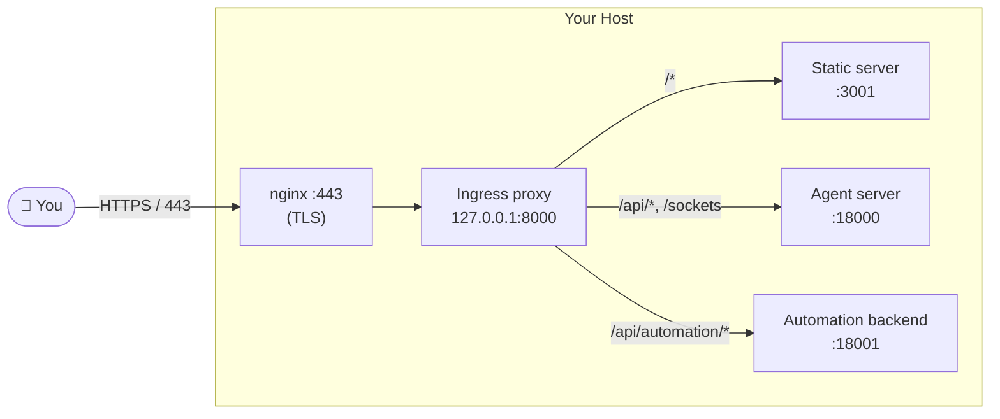

Self-hosting runs the complete Agent Canvas stack on infrastructure you control. Users access the UI directly through a browser, and the backend runs on the same host.

<Warning>
  Anyone who can reach your Agent Canvas deployment can potentially drive an agent that reads files, runs shell commands, and accesses the network. Lock down the host before exposing it to anyone else.
</Warning>

## Overview



A single `agent-canvas --public` command starts the agent server, automation backend, and static frontend, fronted by an ingress proxy on `127.0.0.1:8000`. nginx terminates TLS and forwards to that single port.

## 1. Provision a Machine

Any always-on Linux or macOS host with a stable network connection:

- **Cloud VM** — DigitalOcean, AWS EC2, GCP, Hetzner, Linode, etc. Ubuntu 24.04 LTS is a good default. 2 vCPU / 4 GB RAM is enough for a single user.
- **Dedicated hardware** — a Mac Mini, Intel NUC, or spare laptop.

## 2. Lock Down the Network

Do this **before** starting Agent Canvas.

At the cloud-provider or network level, restrict inbound traffic:

- **Port 22 (SSH)** — your IP or VPN CIDR only.
- **Everything else** — drop.

All Agent Canvas services bind to `127.0.0.1`, but the network firewall guarantees nothing is reachable from outside even if something binds incorrectly.

## 3. Install Prerequisites and Start Agent Canvas

On Ubuntu:

```bash
apt-get update && apt-get install -y curl git

# Node.js 22.x (via nvm, asdf, or NodeSource)
# uv (for the agent server runtime):
curl -LsSf https://astral.sh/uv/install.sh | sh
```

On macOS, install Node and `uv` via Homebrew instead.

Start the full stack in public mode:

```bash
LOCAL_BACKEND_API_KEY=<choose-a-strong-secret> npx @openhands/agent-canvas --public
```

- `--public` means the API key is **not** baked into the frontend. Anyone who opens the UI must enter the key before they can interact with the agent.

<Tip>
  Without `--public`, the key is auto-injected into the frontend — convenient for local-only use, but unsafe when the deployment is reachable by others.
</Tip>

At this point, Agent Canvas is running but only accessible via SSH tunnel. That's sufficient for personal use. For browser access without tunneling, continue to step 4.

## 4. (Optional) Add a Domain with nginx + TLS

If you want browser access from anywhere — a phone, another laptop, etc. — point a domain at the machine and front it with nginx + Let's Encrypt.

### Point a Domain at the Machine

Create an `A` record pointing to the machine's public IP (e.g. `canvas.example.com`):

```bash
dig +short canvas.example.com
```

### Open Ports 80 and 443

Update your network firewall to additionally allow:

- **Port 80 (HTTP)** — open to `0.0.0.0/0` (required for Let's Encrypt HTTP-01 challenges). nginx redirects all HTTP to HTTPS.
- **Port 443 (HTTPS)** — restrict to your IP if possible. If you need it world-open, `LOCAL_BACKEND_API_KEY` is your primary defense.

### Install nginx and Certbot

```bash
apt-get install -y nginx certbot python3-certbot-nginx
```

### Configure nginx

Save this at `/etc/nginx/sites-available/canvas.example.com`, replacing the domain:

```nginx
server {
    listen 80;
    listen [::]:80;
    server_name canvas.example.com;

    location /.well-known/acme-challenge/ {
        root /var/www/html;
    }

    location / {
        proxy_pass http://127.0.0.1:8000;
        proxy_http_version 1.1;
        proxy_set_header Host $host;
        proxy_set_header X-Real-IP $remote_addr;
        proxy_set_header X-Forwarded-For $proxy_add_x_forwarded_for;
        proxy_set_header X-Forwarded-Proto $scheme;

        # WebSocket / SSE support — required for live agent events.
        proxy_set_header Upgrade $http_upgrade;
        proxy_set_header Connection "upgrade";
        proxy_read_timeout 3600s;
        proxy_send_timeout 3600s;
    }
}
```

Enable the site and issue a certificate:

```bash
ln -sf /etc/nginx/sites-available/canvas.example.com \
       /etc/nginx/sites-enabled/canvas.example.com
nginx -t && systemctl reload nginx

certbot --nginx -d canvas.example.com \
    --non-interactive --agree-tos \
    --email you@example.com \
    --redirect
```

Certbot adds the `listen 443 ssl` block, a 301 redirect from HTTP to HTTPS, and a systemd timer for auto-renewal.

### Verify

```bash
curl -I https://canvas.example.com/      # → 200 (API key entry screen)
curl -I http://canvas.example.com/       # → 301 redirect to HTTPS
```

Open `https://canvas.example.com/` in a browser, enter your `LOCAL_BACKEND_API_KEY`, and confirm you land in Agent Canvas.

## 5. (Optional) Connect from Another Agent Canvas Instance

You don't have to use the remote UI. If you run Agent Canvas locally, you can add the self-hosted deployment as a remote backend:

1. Open **Manage Backends** → **Add Backend**.
2. Fill in:
   - **Name** — e.g. `my-vm`
   - **Host / Base URL** — `https://canvas.example.com` (or `http://localhost:8000` if using an SSH tunnel)
   - **API Key** — the `LOCAL_BACKEND_API_KEY` from step 3
3. Save and select it as the active backend.

You can also run a lightweight frontend-only instance that points at this deployment:

```bash
agent-canvas --frontend-only
```

Then add the self-hosted backend through **Manage Backends** as above.

## Security Checklist

Before exposing Agent Canvas to a broader network:

1. **Restrict inbound network access** — only open ports you need (SSH, 80/443 for the reverse proxy).
2. **Use `--public` mode** with a strong `LOCAL_BACKEND_API_KEY`.
3. **Use TLS** — put a reverse proxy in front with Let's Encrypt if the UI is internet-reachable.
4. **Treat the host as sensitive infrastructure** — it stores secrets, conversations, and working copies.

## Related Guides

- [Connect and Manage Backends](/openhands/usage/agent-canvas/backends)
- [VM Backend](/openhands/usage/agent-canvas/backend-setup/vm) — run just the backend on a VM (headless)
- [Docker Backend](/openhands/usage/agent-canvas/backend-setup/docker)
- [Cloud Backend](/openhands/usage/agent-canvas/backend-setup/cloud)
