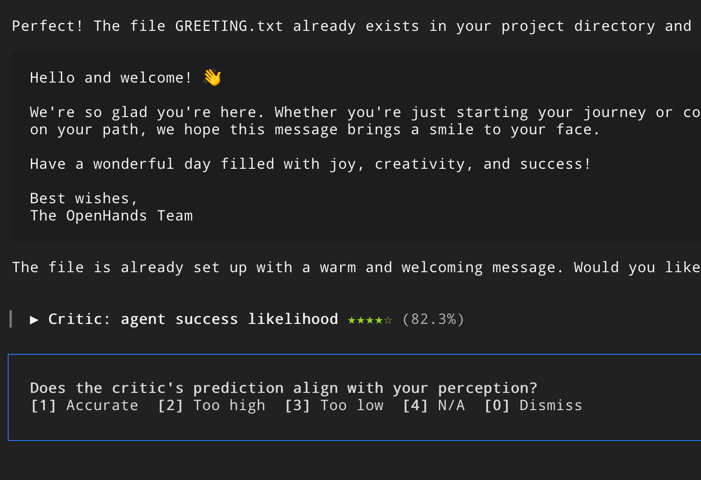
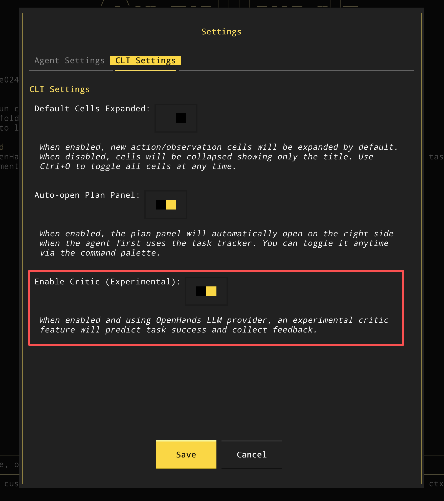

<Warning>
**This feature is highly experimental** and subject to change. The API, configuration, and behavior may evolve significantly based on feedback and testing.
</Warning>

## Overview

If you're using the [OpenHands LLM Provider](/openhands/usage/llms/openhands-llms), an experimental **critic feature** is automatically enabled to predict task success in real-time.

For detailed information about the critic feature, including programmatic access and advanced usage, see the [SDK Critic Guide](/sdk/guides/critic).

## What is the Critic?

The critic is an LLM-based evaluator that analyzes agent actions and conversation history to predict the quality or success probability of agent decisions. It provides:

- **Quality scores**: Probability scores between 0.0 and 1.0 indicating predicted success
- **Real-time feedback**: Scores computed during agent execution, not just at completion

<video
  controls
  className="w-full aspect-video"
  src="/openhands/usage/cli/critic-demo.mp4"
></video>

## Pricing

The critic feature is **free during the public beta phase** for all OpenHands LLM Provider users.

## Disabling the Critic

If you prefer not to use the critic feature, you can disable it in your settings.

