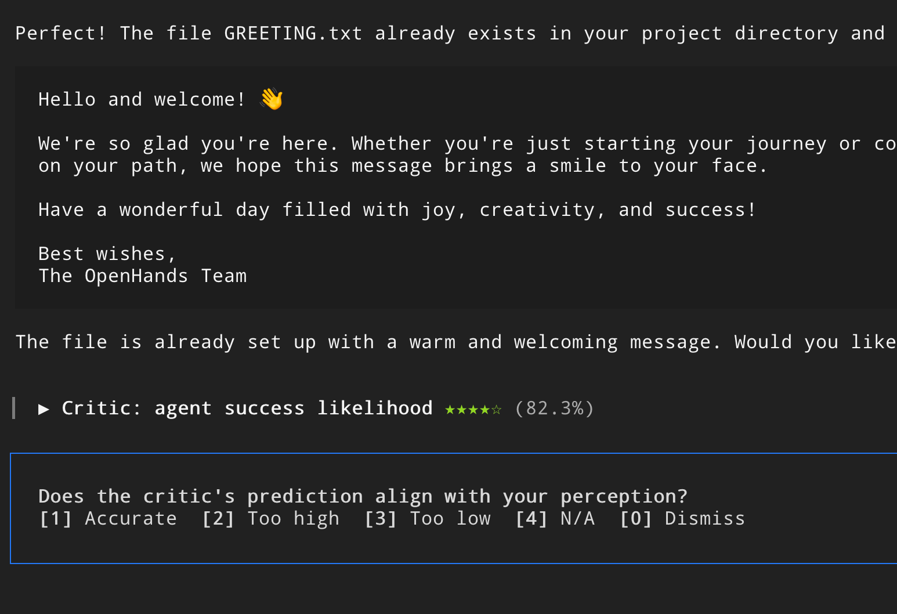
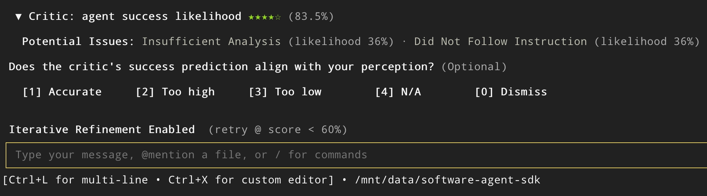
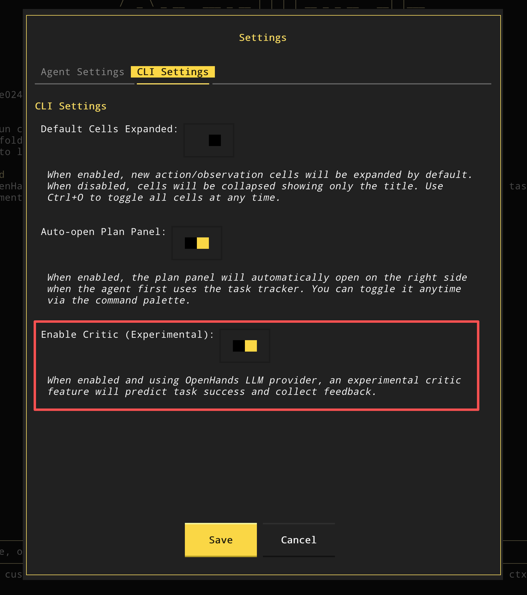

<Warning>
**This feature is highly experimental** and subject to change. The API, configuration, and behavior may evolve significantly based on feedback and testing.
</Warning>

## Overview

If you're using the [OpenHands LLM Provider](/openhands/usage/llms/openhands-llms), an experimental **critic feature** is automatically enabled to predict task success in real-time.

For detailed information about the critic feature, including programmatic access and advanced usage, see the [SDK Critic Guide](/sdk/guides/critic).


## What is the Critic?

The critic is an LLM-based evaluator that analyzes agent actions and conversation history to predict the quality or success probability of agent decisions. It provides:

- **Quality scores**: Probability scores between 0.0 and 1.0 indicating predicted success
- **Real-time feedback**: Scores computed during agent execution, not just at completion
- **Iterative refinement**: Automatic follow-up prompts when the critic predicts incomplete work



## Pricing

The critic feature is **free during the public beta phase** for all OpenHands LLM Provider users.

## Iterative Refinement

When **Iterative Refinement** mode is enabled, the CLI automatically prompts the agent to review and improve its work if the critic predicts a low probability of task success. This creates a self-correcting loop where the agent can catch and fix its own mistakes.

### How It Works

1. The agent completes a task (or calls `FinishAction`)
2. The critic evaluates the result and produces a success probability score (0–100%), along with per-issue probability scores
3. Refinement triggers if **either** condition is met:
   - The overall score falls below the **refinement threshold** (default: 60%), **OR**
   - Any specific issue has a probability above the **issue threshold** (default: 75%), even if the overall score is acceptable (e.g., insufficient testing at 82% triggers refinement even when the overall score is 70%)
4. A follow-up prompt is automatically sent to the agent with the score and any detected issues
5. The agent reviews its work, identifies remaining issues, and attempts to fix them
6. This process repeats until neither condition triggers or the **max iterations** limit is reached (default: 3)

### Demo

**Example with a higher refinement threshold** — the agent must achieve a higher score to pass, triggering more refinement cycles:

<video
  controls
  className="w-full aspect-video"
  src="https://github.com/user-attachments/assets/4e955321-e627-4d2a-97d8-d9f0f710ab2e"
></video>

**Example with a moderate refinement threshold:**

<video
  controls
  className="w-full aspect-video"
  src="https://github.com/user-attachments/assets/13237eec-2721-48a1-9ef9-666b57a7529e"
></video>

### Enabling Iterative Refinement

Iterative refinement is configured via the Settings UI:

1. Open the command palette with `Ctrl+P`
2. Select **Settings**
3. Navigate to the **Critic Settings** tab
4. Toggle on **Iterative Refinement**
5. Optionally adjust the **Refinement Threshold** (1–100%)

### Configuration Options

| Option | Default | Description |
|--------|---------|-------------|
| **Refinement Threshold** | 60% (`0.6`) | Overall success score below which refinement is triggered |
| **Issue Threshold** | 75% (`0.75`) | Per-issue probability above which refinement is triggered, even if the overall score is acceptable |
| **Max Iterations** | 3 | Maximum number of refinement attempts per user turn (1–10) |

### Example Refinement Prompt

When refinement is triggered, the agent receives a message like:

```
The task appears incomplete (iteration 1/3, predicted success likelihood: 45.0%).

Please review what you've done and verify each requirement is met.
List what's working and what needs fixing, then complete the task.
```

If specific issues are detected, they are included in the prompt:

```
The task appears incomplete (iteration 1/3, predicted success likelihood: 52.0%).

**Detected issues requiring attention:**
- Insufficient Testing (82%)
- Missing Error Handling (76%)

Please review what you've done and verify each requirement is met.
List what's working and what needs fixing, then complete the task.
```

### Status Indicator

A visual indicator in the status bar shows the current refinement iteration when active (e.g., "Refining 1/3"):



## Disabling the Critic

If you prefer not to use the critic feature, you can disable it in your settings:

1. Open the command palette with `Ctrl+P`
2. Select **Settings**
3. Navigate to the **Critic Settings** tab
4. Toggle off **Enable Critic (Experimental)**



