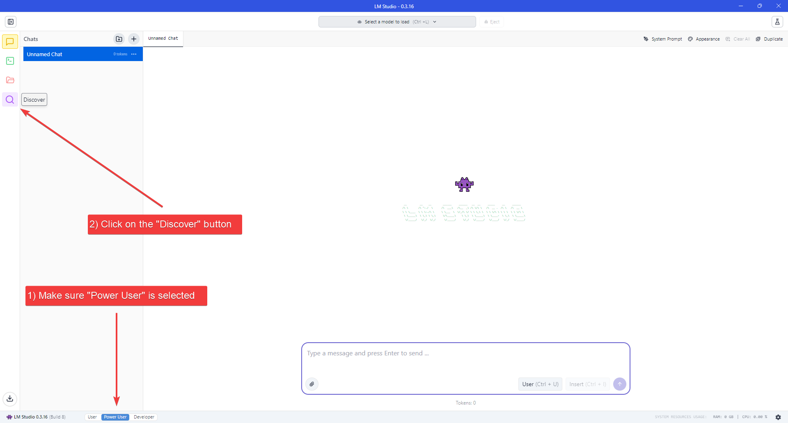
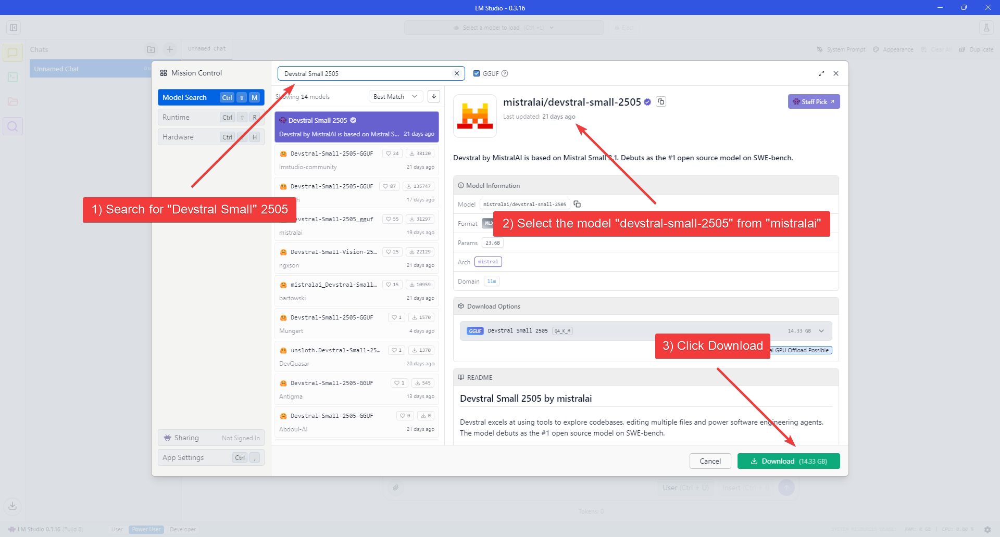
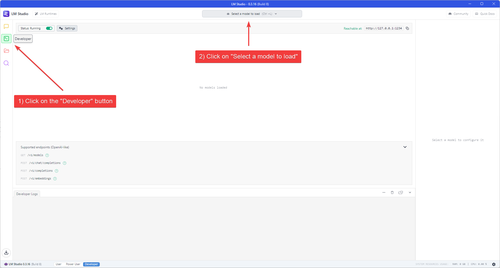
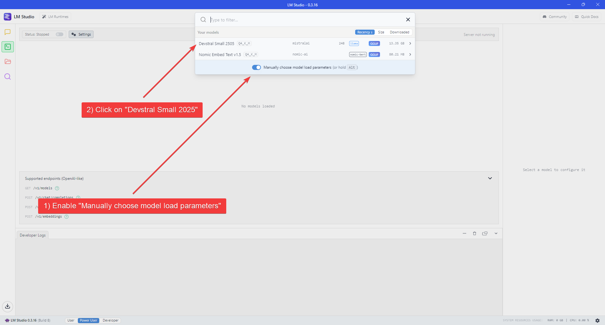
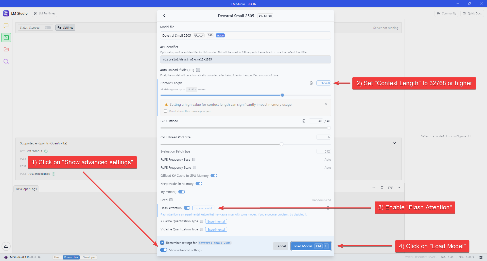
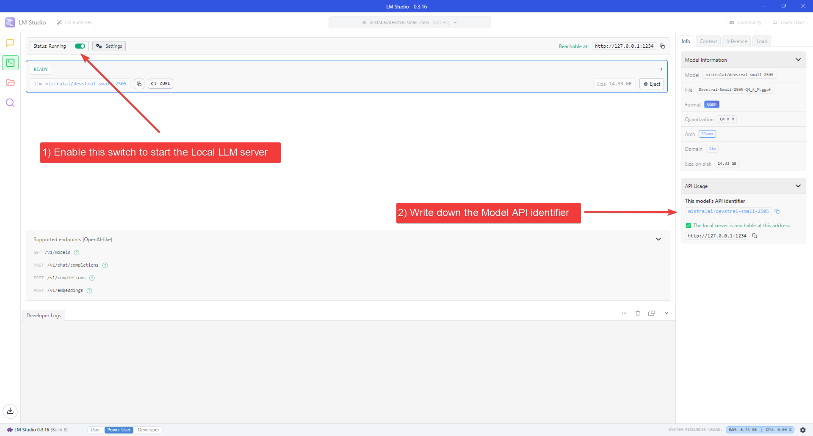
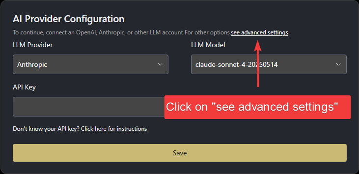
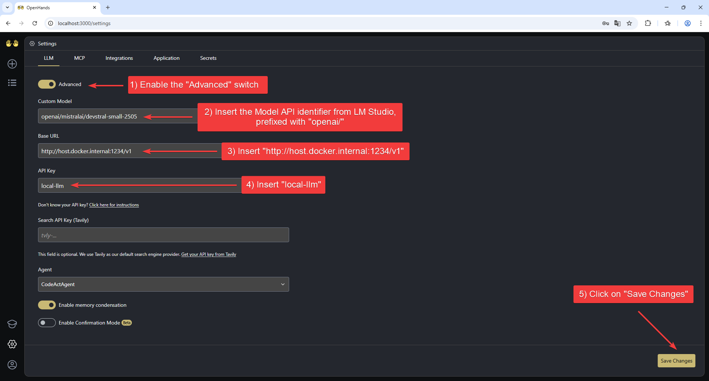

## News

- 2025/12/12: We now recommend two powerful local models for OpenHands: [Qwen3-Coder-30B-A3B-Instruct](https://huggingface.co/Qwen/Qwen3-Coder-30B-A3B-Instruct) and [Devstral Small 2 (24B)](https://huggingface.co/mistralai/Devstral-Small-2-24B-Instruct-2512). Both models deliver excellent performance on coding tasks and work great with OpenHands!

## Quickstart: Running OpenHands with a Local LLM using LM Studio

This guide explains how to serve a local LLM using [LM Studio](https://lmstudio.ai/) and have OpenHands connect to it.

We recommend:
- **LM Studio** as the local model server, which handles metadata downloads automatically and offers a simple, user-friendly interface for configuration.
- **Qwen3-Coder-30B-A3B-Instruct** as the LLM for software development. This model is optimized for coding tasks and works excellently with agent-style workflows like OpenHands.

### Hardware Requirements

Running Qwen3-Coder-30B-A3B-Instruct requires:
- A recent GPU with at least 12GB of VRAM (tested on RTX 3060 with 12GB VRAM + 64GB RAM), or
- A Mac with Apple Silicon with at least 32GB of RAM

### 1. Install LM Studio

Download and install the LM Studio desktop app from [lmstudio.ai](https://lmstudio.ai/).

### 2. Download the Model

1. Make sure to set the User Interface Complexity Level to "Power User", by clicking on the appropriate label at the bottom of the window.
2. Click the "Discover" button (Magnifying Glass icon) on the left navigation bar to open the Models download page.



3. Search for **"Qwen3-Coder-30B-A3B-Instruct"**, confirm you're downloading from the official Qwen publisher, then proceed to download.



4. Wait for the download to finish.

### 3. Load the Model

1. Click the "Developer" button (Console icon) on the left navigation bar to open the Developer Console.
2. Click the "Select a model to load" dropdown at the top of the application window.



3. Enable the "Manually choose model load parameters" switch.
4. Select **Qwen3-Coder-30B-A3B-Instruct** from the model list.



5. Enable the "Show advanced settings" switch at the bottom of the Model settings flyout to show all the available settings.
6. Set "Context Length" to at least 22000 (for lower VRAM systems) or 32768 (recommended for better performance) and enable Flash Attention.
7. Click "Load Model" to start loading the model.



### 4. Start the LLM server

1. Enable the switch next to "Status" at the top-left of the Window.
2. Take note of the Model API Identifier shown on the sidebar on the right.



### 5. Start OpenHands

1. Check [the installation guide](/openhands/usage/run-openhands/local-setup) and ensure all prerequisites are met before running OpenHands, then run:

```bash
docker pull docker.openhands.dev/openhands/runtime:1.2-nikolaik

docker run -it --rm --pull=always \
    -e SANDBOX_RUNTIME_CONTAINER_IMAGE=docker.openhands.dev/openhands/runtime:1.2-nikolaik \
    -e LOG_ALL_EVENTS=true \
    -v /var/run/docker.sock:/var/run/docker.sock \
    -v ~/.openhands:/.openhands \
    -p 3000:3000 \
    --add-host host.docker.internal:host-gateway \
    --name openhands-app \
    docker.openhands.dev/openhands/openhands:1.2
```

2. Wait until the server is running (see log below):
```
Digest: sha256:e72f9baecb458aedb9afc2cd5bc935118d1868719e55d50da73190d3a85c674f
Status: Image is up to date for docker.openhands.dev/openhands/openhands:1.2
Starting OpenHands...
Running OpenHands as root
14:22:13 - openhands:INFO: server_config.py:50 - Using config class None
INFO:     Started server process [8]
INFO:     Waiting for application startup.
INFO:     Application startup complete.
INFO:     Uvicorn running on http://0.0.0.0:3000 (Press CTRL+C to quit)
```

3. Visit `http://localhost:3000` in your browser.

### 6. Configure OpenHands to use the LLM server

Once you open OpenHands in your browser, you'll need to configure it to use the local LLM server you just started.

When started for the first time, OpenHands will prompt you to set up the LLM provider.

1. Click "see advanced settings" to open the LLM Settings page.



2. Enable the "Advanced" switch at the top of the page to show all the available settings.

3. Set the following values:
    - **Custom Model**: `openai/qwen/qwen3-coder-30b-a3b-instruct` (the Model API identifier from LM Studio, prefixed with "openai/")
    - **Base URL**: `http://host.docker.internal:1234/v1`
    - **API Key**: `local-llm`

4. Click "Save Settings" to save the configuration.



That's it! You can now start using OpenHands with the local LLM server.

If you encounter any issues, let us know on [Slack](https://openhands.dev/joinslack).

## Advanced: Alternative LLM Backends

This section describes how to run local LLMs with OpenHands using alternative backends like Ollama, SGLang, or vLLM — without relying on LM Studio.

### Create an OpenAI-Compatible Endpoint with Ollama

- Install Ollama following [the official documentation](https://ollama.com/download).
- Example launch command for Qwen3-Coder-30B-A3B-Instruct:

```bash
# ⚠️ WARNING: OpenHands requires a large context size to work properly.
# When using Ollama, set OLLAMA_CONTEXT_LENGTH to at least 22000.
# The default (4096) is way too small — not even the system prompt will fit, and the agent will not behave correctly.
OLLAMA_CONTEXT_LENGTH=32768 OLLAMA_HOST=0.0.0.0:11434 OLLAMA_KEEP_ALIVE=-1 nohup ollama serve &
ollama pull qwen3-coder:30b
```

### Create an OpenAI-Compatible Endpoint with vLLM or SGLang

First, download the model checkpoint:

```bash
huggingface-cli download Qwen/Qwen3-Coder-30B-A3B-Instruct --local-dir Qwen/Qwen3-Coder-30B-A3B-Instruct
```

#### Serving the model using SGLang

- Install SGLang following [the official documentation](https://docs.sglang.ai/start/install.html).
- Example launch command (with at least 2 GPUs):

```bash
SGLANG_ALLOW_OVERWRITE_LONGER_CONTEXT_LEN=1 python3 -m sglang.launch_server \
    --model Qwen/Qwen3-Coder-30B-A3B-Instruct \
    --served-model-name Qwen3-Coder-30B-A3B-Instruct \
    --port 8000 \
    --tp 2 --dp 1 \
    --host 0.0.0.0 \
    --api-key mykey --context-length 131072
```

#### Serving the model using vLLM

- Install vLLM following [the official documentation](https://docs.vllm.ai/en/latest/getting_started/installation.html).
- Example launch command (with at least 2 GPUs):

```bash
vllm serve Qwen/Qwen3-Coder-30B-A3B-Instruct \
    --host 0.0.0.0 --port 8000 \
    --api-key mykey \
    --tensor-parallel-size 2 \
    --served-model-name Qwen3-Coder-30B-A3B-Instruct \
    --enable-prefix-caching
```

If you are interested in further improved inference speed, you can also try Snowflake's version
of vLLM, [ArcticInference](https://www.snowflake.com/en/engineering-blog/fast-speculative-decoding-vllm-arctic/),
which can achieve up to 2x speedup in some cases.

1. Install the Arctic Inference library that automatically patches vLLM:

```bash
pip install git+https://github.com/snowflakedb/ArcticInference.git
```

2. Run the launch command with speculative decoding enabled:

```bash
vllm serve Qwen/Qwen3-Coder-30B-A3B-Instruct \
    --host 0.0.0.0 --port 8000 \
    --api-key mykey \
    --tensor-parallel-size 2 \
    --served-model-name Qwen3-Coder-30B-A3B-Instruct \
    --speculative-config '{"method": "suffix"}'
```

### Run OpenHands (Alternative Backends)

#### Using Docker

Run OpenHands using [the official docker run command](/openhands/usage/run-openhands/local-setup).

#### Using Development Mode

Use the instructions in [Development.md](https://github.com/OpenHands/OpenHands/blob/main/Development.md) to build OpenHands.

Start OpenHands using `make run`.

### Configure OpenHands (Alternative Backends)

Once OpenHands is running, open the Settings page in the UI and go to the `LLM` tab.

1. Click **"see advanced settings"** to access the full configuration panel.
2. Enable the **Advanced** toggle at the top of the page.
3. Set the following parameters, if you followed the examples above:
   - **Custom Model**: `openai/<served-model-name>`
     - For **Ollama**: `openai/qwen3-coder:30b`
     - For **SGLang/vLLM**: `openai/Qwen3-Coder-30B-A3B-Instruct`
   - **Base URL**: `http://host.docker.internal:<port>/v1`
     Use port `11434` for Ollama, or `8000` for SGLang and vLLM.
   - **API Key**:
     - For **Ollama**: any placeholder value (e.g. `dummy`, `local-llm`)
     - For **SGLang** or **vLLM**: use the same key provided when starting the server (e.g. `mykey`)
