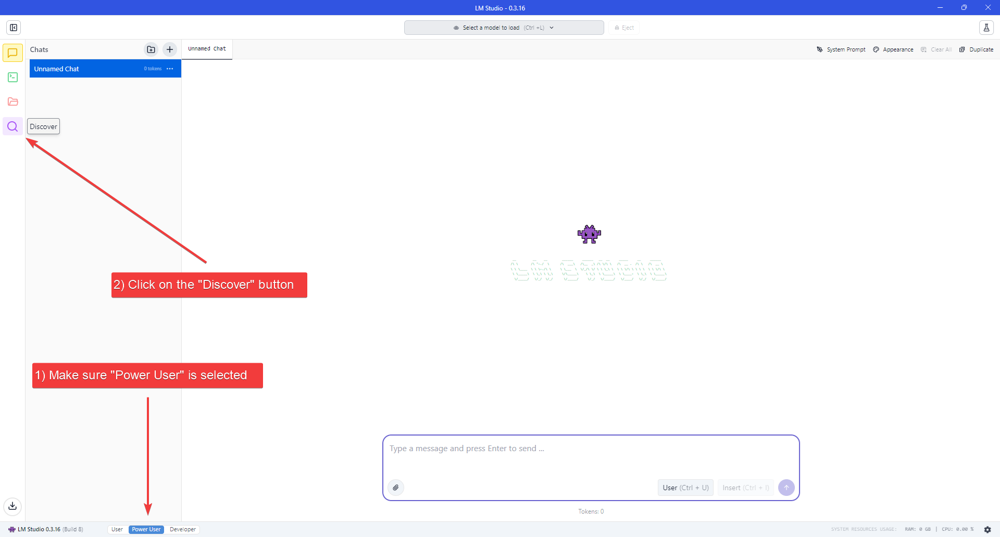
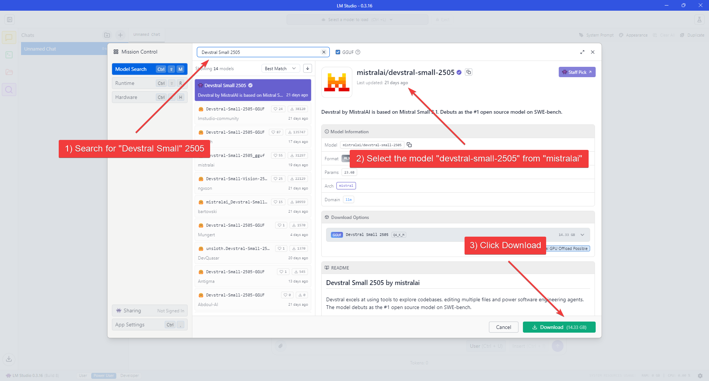
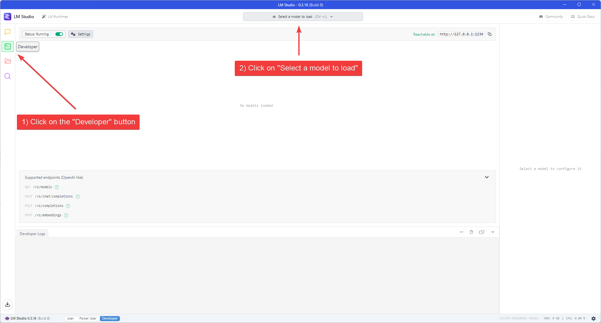
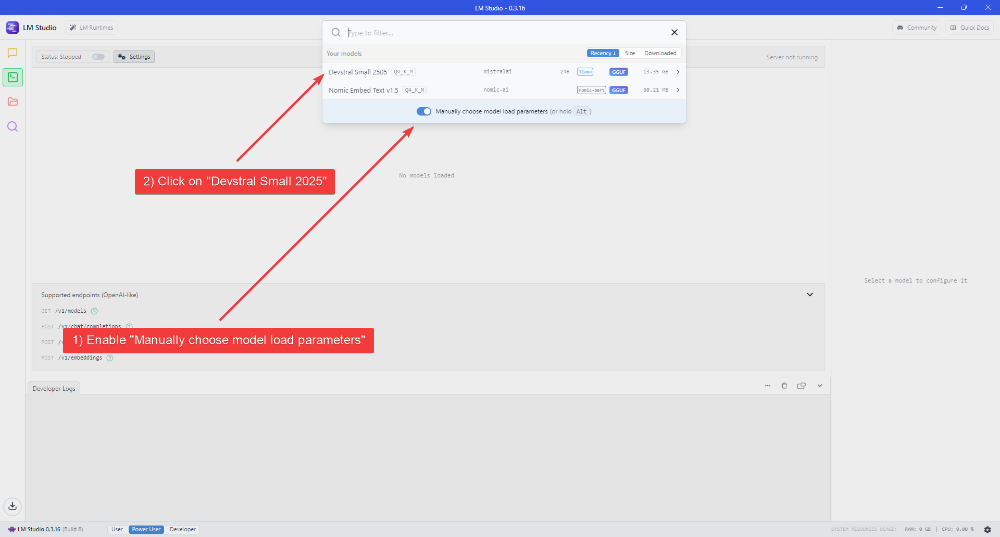
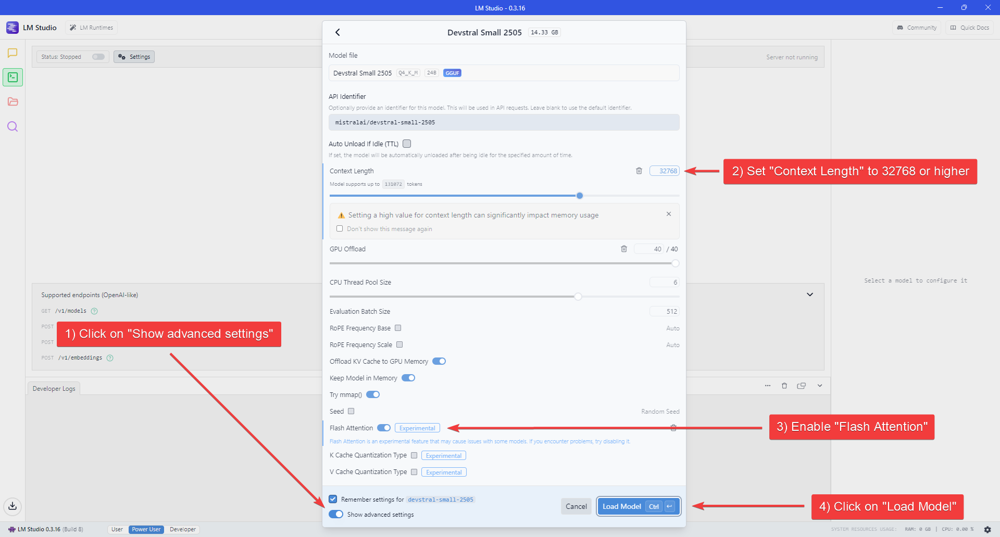
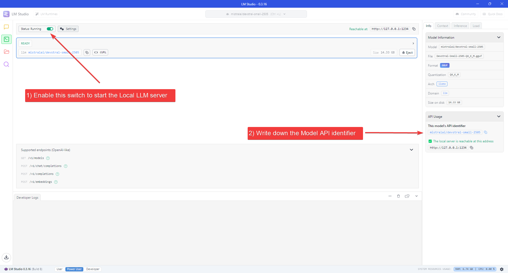
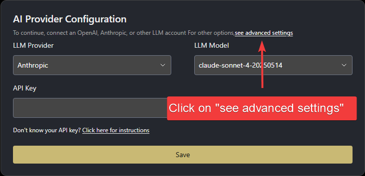
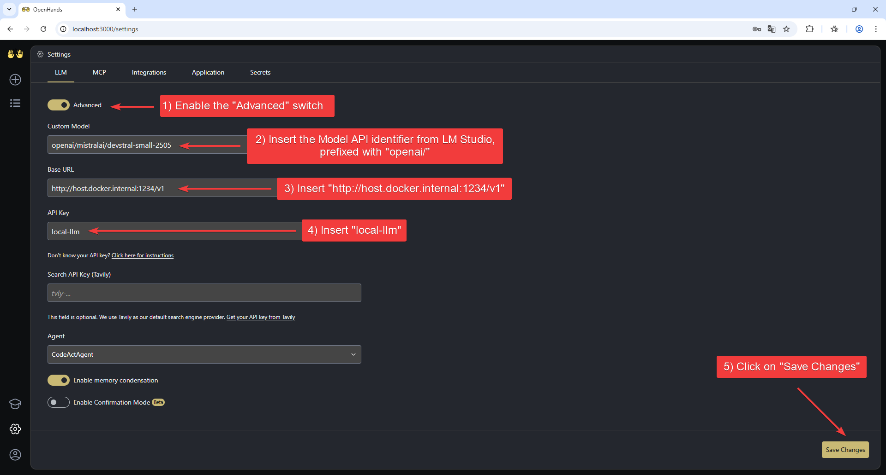

## News

- 2026/05/21: We now recommend [Qwen3.6-35B-A3B](https://huggingface.co/Qwen/Qwen3.6-35B-A3B) as the first local model to try with OpenHands. It is an open-weight MoE model built for agentic coding, supports a large context window, and is available through LM Studio, Ollama, vLLM, and SGLang.

## Quickstart: Running OpenHands with a Local LLM using LM Studio

This guide explains how to serve a local LLM using [LM Studio](https://lmstudio.ai/) and have OpenHands connect to it.

We recommend:
- **LM Studio** as the local model server, which handles metadata downloads automatically and offers a simple, user-friendly interface for configuration.
- **Qwen3.6-35B-A3B** as the LLM for software development. This model is optimized for agentic coding and works well with tool-heavy workflows like OpenHands.

### Hardware Requirements

Running Qwen3.6-35B-A3B requires:
- A recent GPU with at least 24GB of VRAM for quantized variants, or multiple GPUs for full precision and larger context windows, or
- A Mac with Apple Silicon with at least 64GB of unified memory for quantized variants

### 1. Install LM Studio

Download and install the LM Studio desktop app from [lmstudio.ai](https://lmstudio.ai/).

### 2. Download the Model

1. Make sure to set the User Interface Complexity Level to "Power User", by clicking on the appropriate label at the bottom of the window.
2. Click the "Discover" button (Magnifying Glass icon) on the left navigation bar to open the Models download page.



3. Search for **"Qwen3.6-35B-A3B"**, confirm you're downloading from the official Qwen publisher, then proceed to download.



4. Wait for the download to finish.

### 3. Load the Model

1. Click the "Developer" button (Console icon) on the left navigation bar to open the Developer Console.
2. Click the "Select a model to load" dropdown at the top of the application window.



3. Enable the "Manually choose model load parameters" switch.
4. Select **Qwen3.6-35B-A3B** from the model list.



5. Enable the "Show advanced settings" switch at the bottom of the Model settings flyout to show all the available settings.
6. Set "Context Length" to at least 22000 (for lower VRAM systems) or 32768 (recommended for better performance) and enable Flash Attention.
7. Click "Load Model" to start loading the model.



### 4. Start the LLM server

1. Enable the switch next to "Status" at the top-left of the Window.
2. Take note of the Model API Identifier shown on the sidebar on the right.



<Warning>
**Linux users:** By default, LM Studio only listens on `127.0.0.1` (localhost). If OpenHands runs inside a Docker container, it cannot reach `127.0.0.1` on the host — even with `--add-host host.docker.internal:host-gateway`.

To fix this, enable **"Serve on Local Network"** in LM Studio's server settings. This switches the bind address to `0.0.0.0`, making the server reachable from Docker.

You can verify connectivity from inside the container:
```bash
docker exec -it openhands-app curl -s http://host.docker.internal:1234/v1/models
```
If this returns the model list, the connection is working. If it hangs or errors, LM Studio is still bound to localhost only.
</Warning>

### 5. Start OpenHands

1. Check [the installation guide](/openhands/usage/run-openhands/local-setup) and ensure all prerequisites are met before running OpenHands, then run:

```bash
docker run -it --rm --pull=always \
    -e AGENT_SERVER_IMAGE_REPOSITORY=ghcr.io/openhands/agent-server \
    -e AGENT_SERVER_IMAGE_TAG=1.26.0-python \
    -e LOG_ALL_EVENTS=true \
    -v /var/run/docker.sock:/var/run/docker.sock \
    -v ~/.openhands:/.openhands \
    -p 3000:3000 \
    --add-host host.docker.internal:host-gateway \
    --name openhands-app \
    docker.openhands.dev/openhands/openhands:1.8
```

2. Wait until the server is running (see log below):
```
Digest: sha256:e72f9baecb458aedb9afc2cd5bc935118d1868719e55d50da73190d3a85c674f
Status: Image is up to date for docker.openhands.dev/openhands/openhands:1.8
Starting OpenHands...
Running OpenHands as root
14:22:13 - openhands:INFO: server_config.py:50 - Using config class None
INFO:     Started server process [8]
INFO:     Waiting for application startup.
INFO:     Application startup complete.
INFO:     Uvicorn running on http://0.0.0.0:3000 (Press CTRL+C to quit)
```

3. Visit `http://localhost:3000` in your browser.

### 6. Configure OpenHands to use the LLM server

Once you open OpenHands in your browser, you'll need to configure it to use the local LLM server you just started.

When started for the first time, OpenHands will prompt you to set up the LLM provider.

1. Click "see advanced settings" to open the LLM Settings page.



2. Enable the "Advanced" switch at the top of the page to show all the available settings.

3. Set the following values:
    - **Custom Model**: `openai/qwen/qwen3.6-35b-a3b` (the Model API identifier from LM Studio, prefixed with "openai/")
    - **Base URL**: `http://host.docker.internal:1234/v1`
    - **API Key**: `local-llm`

4. Click "Save Settings" to save the configuration.



That's it! You can now start using OpenHands with the local LLM server.

If you encounter any issues, let us know on [Slack](https://openhands.dev/joinslack).

## Community-Reported Notes and Troubleshooting

If OpenHands behaves like a plain chatbot, refuses to use tools or files, or has constant failed tool calls with a local model, the issue may be with the model itself rather than your setup. Even with a large context window, some local models may struggle with reliable tool use.

**Community-reported working models:**
- `qwen2.5-coder-14b-instruct` — reported to resolve chatbot-like behavior
- `qwopus3.5-27b-v3 Q8_0` (and similar retrained qwopus variants) — reported to work well with tool calls

If you're experiencing issues, try switching to one of these models before assuming the setup is broken.

## Advanced: Alternative LLM Backends

This section describes how to run local LLMs with OpenHands using alternative backends like Ollama, [Atomic Chat](https://atomic.chat/), SGLang, or vLLM — without relying on LM Studio.

### Create an OpenAI-Compatible Endpoint with Ollama

- Install Ollama following [the official documentation](https://ollama.com/download).
- Example launch command for Qwen3.6-35B-A3B:

```bash
# ⚠️ WARNING: OpenHands requires a large context size to work properly.
# When using Ollama, set OLLAMA_CONTEXT_LENGTH to at least 22000.
# The default (4096) is way too small — not even the system prompt will fit, and the agent will not behave correctly.
OLLAMA_CONTEXT_LENGTH=32768 OLLAMA_HOST=0.0.0.0:11434 OLLAMA_KEEP_ALIVE=-1 nohup ollama serve &
ollama pull qwen3.6:35b-a3b
```

### Create an OpenAI-Compatible Endpoint with Atomic Chat

[Atomic Chat](https://atomic.chat/) is an open-source desktop app for running local models (and optional cloud providers). It exposes a **single OpenAI-compatible HTTP API** on your machine, typically at `http://127.0.0.1:1337/v1`. See the upstream [README](https://github.com/AtomicBot-ai/Atomic-Chat/blob/main/README.md) for downloads, system requirements, and release notes.

#### 1. Install and start Atomic Chat

1. Download Atomic Chat from [atomic.chat](https://atomic.chat/) or [GitHub Releases](https://github.com/AtomicBot-ai/Atomic-Chat/releases).
2. Open Atomic Chat and **enable the local API server** in the app settings (defaults may vary by version; the API is usually served on **port 1337**).
3. **Download and load a coding-capable model** with a **large context window**. OpenHands needs enough context for the system prompt and tools — use at least **~22k tokens**, and **32k+** when your hardware allows (same guidance as LM Studio on this page).

<Note>
  Atomic Chat binds the local API to **loopback (`127.0.0.1`) by default**, so the OpenAI-compatible endpoint is not exposed on your LAN unless you explicitly change the server host and set an API key. For Docker on the host, use `host.docker.internal:1337/v1` as described below.
</Note>

#### 2. Discover the model id OpenHands must use

Atomic Chat lists served models via the OpenAI-compatible `GET /v1/models` endpoint. From the same machine:

```bash
curl -s http://127.0.0.1:1337/v1/models | head
```

Use the `id` field of the model you have loaded as the suffix after `openai/` in OpenHands (see [Configure OpenHands (Alternative Backends)](#configure-openhands-alternative-backends) below).

#### 3. Point OpenHands at Atomic Chat

Follow [Run OpenHands (Alternative Backends)](#run-openhands-alternative-backends) and [Configure OpenHands (Alternative Backends)](#configure-openhands-alternative-backends) below. When OpenHands runs **inside Docker** and Atomic Chat runs on the **host**, use:

- **Base URL**: `http://host.docker.internal:1337/v1`
- **Custom Model**: `openai/<model-id-from-/v1/models>` (prefix required, same convention as LM Studio on this page)
- **API Key**: any placeholder string (for example `local-llm`) unless your Atomic Chat build requires a real key

If OpenHands and Atomic Chat run on the **same host without Docker** for the web UI, you can use `http://127.0.0.1:1337/v1` instead.

Atomic Chat also ships a **Launch → OpenHands** integration that can configure `LLM_BASE_URL`, `LLM_MODEL`, and `LLM_API_KEY` for the OpenHands CLI automatically.

#### Troubleshooting

- **Connection refused from Docker**: confirm Atomic Chat is running, the local server is enabled, and your `docker run` includes `--add-host host.docker.internal:host-gateway` as in [local setup](/openhands/usage/run-openhands/local-setup).
- **Wrong model errors**: the Custom Model string must match an `id` returned by `GET /v1/models` after the `openai/` prefix.
- **Agent ignores tools or acts like a chatbot**: try a stronger coding model or a larger context window; see [Community-Reported Notes and Troubleshooting](#community-reported-notes-and-troubleshooting) on this page.

### Create an OpenAI-Compatible Endpoint with vLLM or SGLang

First, download the model checkpoint:

```bash
huggingface-cli download Qwen/Qwen3.6-35B-A3B --local-dir Qwen/Qwen3.6-35B-A3B
```

#### Serving the model using SGLang

- Install SGLang following [the official documentation](https://docs.sglang.io/get_started/install.html).
- Example launch command (with at least 2 GPUs):

```bash
SGLANG_ALLOW_OVERWRITE_LONGER_CONTEXT_LEN=1 python3 -m sglang.launch_server \
    --model Qwen/Qwen3.6-35B-A3B \
    --served-model-name Qwen3.6-35B-A3B \
    --port 8000 \
    --tp 2 --dp 1 \
    --host 0.0.0.0 \
    --api-key mykey --context-length 131072
```

#### Serving the model using vLLM

- Install vLLM following [the official documentation](https://docs.vllm.ai/en/latest/getting_started/installation.html).
- Example launch command (with at least 2 GPUs):

```bash
vllm serve Qwen/Qwen3.6-35B-A3B \
    --host 0.0.0.0 --port 8000 \
    --api-key mykey \
    --tensor-parallel-size 2 \
    --served-model-name Qwen3.6-35B-A3B \
    --enable-prefix-caching
```

If you are interested in further improved inference speed, you can also try Snowflake's version
of vLLM, [ArcticInference](https://www.snowflake.com/en/engineering-blog/fast-speculative-decoding-vllm-arctic/),
which can achieve up to 2x speedup in some cases.

1. Install the Arctic Inference library that automatically patches vLLM:

```bash
pip install git+https://github.com/snowflakedb/ArcticInference.git
```

2. Run the launch command with speculative decoding enabled:

```bash
vllm serve Qwen/Qwen3.6-35B-A3B \
    --host 0.0.0.0 --port 8000 \
    --api-key mykey \
    --tensor-parallel-size 2 \
    --served-model-name Qwen3.6-35B-A3B \
    --speculative-config '{"method": "suffix"}'
```

### Run OpenHands (Alternative Backends)

#### Using Docker

Run OpenHands using [the official docker run command](/openhands/usage/run-openhands/local-setup).

#### Using Development Mode

Use the instructions in [Development.md](https://github.com/OpenHands/OpenHands/blob/main/Development.md) to build OpenHands.

Start OpenHands using `make run`.

### Configure OpenHands (Alternative Backends)

Once OpenHands is running, open the Settings page in the UI and go to the `LLM` tab.

1. Click **"see advanced settings"** to access the full configuration panel.
2. Enable the **Advanced** toggle at the top of the page.
3. Set the following parameters, if you followed the examples above:
   - **Custom Model**: `openai/<served-model-name>`
     - For **Ollama**: `openai/qwen3.6:35b-a3b`
     - For **SGLang/vLLM**: `openai/Qwen3.6-35B-A3B`
     - For **Atomic Chat**: `openai/<model-id-from-/v1/models>` (see [Atomic Chat](#create-an-openai-compatible-endpoint-with-atomic-chat) above)
   - **Base URL**: `http://host.docker.internal:<port>/v1`
     Use port `11434` for Ollama, `1337` for Atomic Chat (default), or `8000` for SGLang and vLLM.
   - **API Key**:
     - For **Ollama** or **Atomic Chat**: any placeholder value (e.g. `dummy`, `local-llm`) unless your server requires a real key
     - For **SGLang** or **vLLM**: use the same key provided when starting the server (e.g. `mykey`)
