# Advanced Features

Beyond the core components, OpenHands SDK provides powerful advanced features for production use, including intelligent context management, workflow automation, and enterprise-grade security.

## Feature Overview


## Context Management

Intelligent context management to keep conversations efficient and focused.

### Auto Context Condensation

Automatically compress conversation history to stay within token limits:

```mermaid
graph LR
    subgraph "Before Condensation"
        L1[Long conversation<br/>10,000 tokens]
    end
    
    subgraph "Condensation Pipeline"
        C1[Remove duplicate actions]
        C2[Summarize tool outputs]
        C3[Compress file contents]
    end
    
    subgraph "After Condensation"
        L2[Condensed context<br/>3,000 tokens]
    end
    
    L1 --> C1
    C1 --> C2
    C2 --> C3
    C3 --> L2
    
    L2 --> Benefits[✅ 60-70% reduction<br/>✅ No task degradation<br/>✅ Lower costs]
    
    style L1 fill:#ffcccc
    style L2 fill:#ccffcc
```



**Usage:**

```python
from openhands.sdk.context.condenser import PipelineCondenser

agent = Agent(
    llm=llm,
    tools=tools,
    context_condenser=PipelineCondenser(
        max_tokens=8000,
        enable_file_compression=True,
        enable_output_summarization=True,
    ),
)

# Condensation happens automatically when context exceeds max_tokens
```

[Learn more →](/sdk/advanced/context-condensation)

### Context Files (repo.md, CLAUDE.md)

Inject repository-specific knowledge into your agent:

```python
from openhands.sdk.context import AgentContext, RepoMicroagent

agent = Agent(
    llm=llm,
    tools=tools,
    context=AgentContext(
        microagents=[
            RepoMicroagent(
                # Loads from .openhands/microagents/repo.md
                working_dir=working_dir,
            ),
        ],
    ),
)
```

**Example `.openhands/microagents/repo.md`:**

```markdown
# Project: E-commerce Platform

## Architecture
- Frontend: React + TypeScript
- Backend: Python FastAPI
- Database: PostgreSQL

## Coding Standards
- Use TypeScript strict mode
- All endpoints must have tests
- Follow PEP 8 for Python code

## Deployment
- Deploy via GitHub Actions
- Run tests before merging
```

[Learn more →](/sdk/advanced/context-files)

### Keyword-Triggered Microagents

Inject context on-demand when keywords are mentioned:

```python
from openhands.sdk.context import KnowledgeMicroagent

agent = Agent(
    llm=llm,
    tools=tools,
    context=AgentContext(
        microagents=[
            KnowledgeMicroagent(
                triggers=["deployment", "deploy"],
                content="""
                # Deployment Procedure
                1. Run `npm run build`
                2. Run `npm test`
                3. Push to main branch
                4. GitHub Actions handles deployment
                """,
            ),
            KnowledgeMicroagent(
                triggers=["testing", "test"],
                content="""
                # Testing Guidelines
                - Use pytest for backend tests
                - Use Jest for frontend tests
                - Aim for 80% coverage
                """,
            ),
        ],
    ),
)

# When user mentions "deployment", deployment docs are automatically injected
```

[Learn more →](/sdk/advanced/microagents)

## Workflow Features

Automate common workflow patterns.

### Built-in TODO Lists

Agents can manage TODO lists for complex tasks:

```mermaid
graph TB
    Task[User Task:<br/>"Refactor authentication"]
    
    Agent[Agent] --> Breakdown
    
    subgraph "TODO List"
        Breakdown[Break down task]
        T1[✅ 1. Read current auth code]
        T2[🔄 2. Design new architecture]
        T3[⬜ 3. Implement new auth]
        T4[⬜ 4. Write tests]
        T5[⬜ 5. Update documentation]
    end
    
    Task --> Agent
    
    style T1 fill:#ccffcc
    style T2 fill:#fff5cc
    style T3 fill:#ffffff
```

**Usage:**

```python
from openhands.sdk.tool import TaskTrackerTool

agent = Agent(
    llm=llm,
    tools=[
        TaskTrackerTool(),  # Enables TODO management
        BashTool(),
        FileEditorTool(),
    ],
)

# Agent can now:
# - task_create("Implement authentication")
# - task_list()
# - task_done(1)
```

[Learn more →](/sdk/advanced/task-tracking)

### Auto-Generated Conversation Titles

Conversations get meaningful titles automatically:

```python
conversation = Conversation(agent=agent)
conversation.send_message("Fix the login bug in auth.py")
conversation.run()

print(conversation.title)
# Output: "Fix login bug in auth.py" (auto-generated)
```

### Stuck Detection

Automatically detect when agents are stuck in loops:


**Detected patterns:**
- Same action repeated multiple times
- Cycling through small set of actions
- No observable progress after many iterations

[Learn more →](/sdk/advanced/stuck-detection)

## Security Features

Enterprise-grade security for safe agent execution.

### LLM Security Analyzer

Two-tier security analysis:


**Example:**

```python
from openhands.sdk.security import LLMSecurityAnalyzer

agent = Agent(
    llm=llm,
    tools=tools,
    security_analyzer=LLMSecurityAnalyzer(
        llm=security_llm,
        enable_rule_based=True,
        enable_llm_analysis=True,
    ),
)

# Now dangerous commands are caught:
# - "rm -rf /" → HIGH risk
# - "curl | sh" → HIGH risk
# - "Delete all files modified last week" → HIGH risk (semantic)
```

[Learn more →](/sdk/security/analyzer)

### Custom Confirmation Policies

Control when user approval is required:

```python
from openhands.sdk.security import ConfirmationPolicyBase

class CustomPolicy(ConfirmationPolicyBase):
    def should_confirm(
        self,
        action: ActionEvent,
        risk: SecurityRisk,
    ) -> bool:
        # Auto-approve LOW and MEDIUM in development
        if os.getenv("ENV") == "dev":
            return risk == SecurityRisk.HIGH
        
        # Require confirmation for MEDIUM+ in production
        return risk in [SecurityRisk.MEDIUM, SecurityRisk.HIGH]

agent = Agent(
    llm=llm,
    tools=tools,
    confirmation_policy=CustomPolicy(),
)
```

[Learn more →](/sdk/security/confirmation-policies)

### Secrets Management

Automatic masking of sensitive data:

```python
from openhands.sdk.utils.secrets import SecretsManager

# Secrets are automatically masked in logs and events
secrets = SecretsManager()
secrets.add_secret("sk-1234567890abcdef")  # OpenAI API key

# Logs show: "Using API key sk-***************" 
# Events stored: "sk-***************"
```

[Learn more →](/sdk/security/secrets)

## Production Deployment

Built-in production server for enterprise deployment.

### REST + WebSocket Server


**Start server:**

```bash
# Start production server
openhands-server \
  --host 0.0.0.0 \
  --port 8000 \
  --persistence-dir ./conversations \
  --workspace-dir ./workspaces
```

**Client usage:**

```python
import httpx

# Create conversation
response = httpx.post(
    "http://localhost:8000/api/conversations",
    json={
        "agent_config": {...},
        "message": "Create a Python file",
    },
    headers={"Authorization": "Bearer <token>"},
)

conversation_id = response.json()["id"]

# Stream events via WebSocket
import websockets

async with websockets.connect(
    f"ws://localhost:8000/ws/{conversation_id}"
) as ws:
    async for message in ws:
        event = json.loads(message)
        print(event)
```

[Learn more →](/sdk/production/server)

### Container Sandboxing

Run agents in isolated containers:

```python
from openhands.sdk.workspace import DockerWorkspace

workspace = DockerWorkspace(
    image="openhands/workspace:latest",
    network_mode="none",  # No network access
    memory_limit="2g",
    cpu_limit=2,
)

agent = Agent(
    llm=llm,
    tools=tools,
    workspace=workspace,
)

# Agent runs in isolated container
# - Can't access host filesystem
# - Can't make network requests (if network_mode="none")
# - Resource limited
```

[Learn more →](/sdk/production/sandboxing)

### Interactive Workspace Access

Debug agents in real-time:


**Features:**
- **VNC Desktop**: See what the agent sees
- **VSCode Web**: Browse and edit files
- **SSH Access**: Direct terminal access

[Learn more →](/sdk/production/workspace-access)

## Performance Optimization

### Context Condensation Metrics

From our evaluation:
- **60-70% token reduction** on long conversations
- **No task completion degradation**
- **40% cost savings** on large tasks

### Token Tracking

```python
# Track costs automatically
conversation.run()

metrics = conversation.state.metrics
print(f"Input tokens: {metrics.input_tokens}")
print(f"Output tokens: {metrics.output_tokens}")
print(f"Total cost: ${metrics.total_cost:.4f}")

# Example output:
# Input tokens: 12,543
# Output tokens: 3,872
# Total cost: $0.48
```

## Next Steps

- **[Context Condensation](/sdk/advanced/context-condensation)** - Reduce token usage
- **[Microagents](/sdk/advanced/microagents)** - Inject targeted knowledge
- **[Security](/sdk/security/overview)** - Secure agent execution
- **[Production Server](/sdk/production/server)** - Deploy at scale
- **[Examples](/sdk/examples)** - Complete working examples
