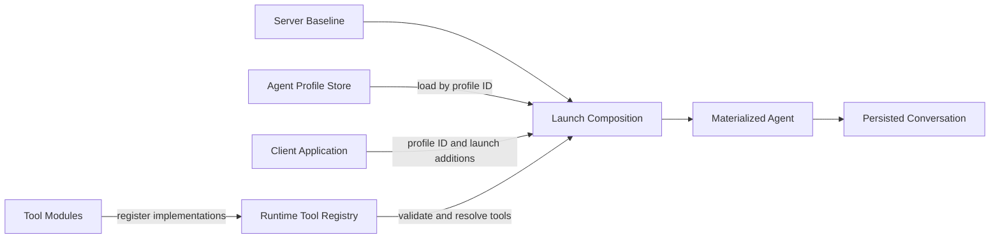
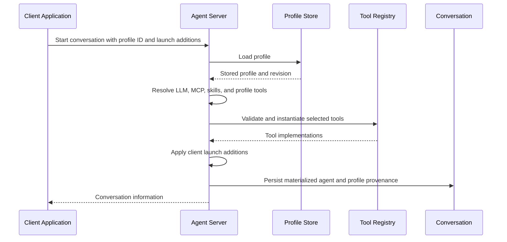

An **Agent Profile** is a named, reusable specification for launching an agent. It stores durable user intent, such as the agent kind, referenced LLM profile, tool selection, and MCP server selection. It is not a running agent and does not contain resolved credentials.

The agent server resolves a profile when a conversation starts. It combines the stored profile with server-owned policy and explicit additions from the client application, then persists the resulting agent with the conversation.

## Design Goals

Agent Profiles follow four principles:

- **Portable profiles:** A profile can be launched by Agent Canvas, another client application, or directly through the agent-server API.
- **Application-neutral storage:** Profiles do not contain client-specific tools, deployment URLs, or resolved secrets unless the user explicitly selected them as profile configuration.
- **Server-owned resolution:** The agent server resolves references and produces the final agent used by the conversation.
- **Stable conversations:** A conversation resumes from its materialized agent rather than re-resolving the current version of its profile.

## Architecture

### Component Responsibilities

| Component | Owns | Does Not Own |
| --- | --- | --- |
| **Tool module and registry** | Tool names, factories, and runtime availability | Whether a client or profile selects the tool |
| **Agent Profile** | Durable, secret-free agent configuration and references | Client-specific launch context or resolved credentials |
| **Client application** | Profile selection and application-specific launch additions | Profile resolution or server baseline policy |
| **Agent server** | Profile storage, validation, reference resolution, launch composition, and conversation persistence | Client-specific tool names or product behavior |
| **Conversation** | The materialized agent and profile provenance used for resume | Live synchronization with later profile edits |

## Availability Is Not Selection

Registering a tool makes its implementation available to the runtime. Registration alone does not decide whether the tool is included in an agent.

For example, Agent Canvas can preload and register `canvas_ui`. Canvas then requests that tool as an application-specific launch addition. The agent server does not need Canvas-specific policy. Another client can use the same mechanism to add a tool such as `post_on_slack`.

This separation keeps the tool registry reusable:

1. A runtime or deployment makes tool implementations available.
2. A profile selects portable agent capabilities.
3. A client application adds capabilities required for that launch.
4. The agent server validates and composes the final agent.

## Launch Flow

The launch request does not modify the stored profile. Editing a profile later also does not change conversations that were already launched from it.

## Tool Composition

Tool composition has four distinct layers:

1. **Runtime-available tools:** Implementations registered in the current agent-server process.
2. **Server baseline:** The standard tools selected by the agent server when a profile inherits tools.
3. **Profile-selected tools:** The portable tool choice stored in the Agent Profile.
4. **Client launch additions:** Application-specific tools added for one conversation launch.

The server baseline is independent of any profile whose name happens to be `default`. Renaming or editing that profile does not change server policy.

For an OpenHands Agent Profile, the `tools` field controls only the profile-selected layer:

| Profile `tools` | Profile-Resolved Tools |
| --- | --- |
| `null` | Inherit the server baseline |
| `[]` | Select no profile tools |
| Non-empty list | Use that profile list exactly |

Client launch additions are applied after profile resolution. If Agent Canvas adds `canvas_ui`, the resulting composition is:

| Profile `tools` | Profile-Resolved Tools | Canvas Addition | Materialized Tools |
| --- | --- | --- | --- |
| `null` | Server baseline | `canvas_ui` | Server baseline plus `canvas_ui` |
| `[]` | None | `canvas_ui` | `canvas_ui` |
| `[{"name": "terminal"}]` | `terminal` | `canvas_ui` | `terminal` plus `canvas_ui` |

<Note>
  An explicit profile list is exact within the profile layer. A client launch addition is a separate, visible modification. To launch a completely tool-free agent, the client must not add application-specific tools.
</Note>

The server validates every selected or added tool against the runtime registry. An unavailable tool must fail the launch instead of silently producing a different agent.

## Launch-Only Context

Some context belongs to the client application or deployment rather than the reusable profile. Examples include instructions for reaching services available only in the current runtime.

Clients send this information as an additive launch override. The server applies it after profile resolution. Launch overrides cannot replace the profile's LLM or other durable configuration.

The launch override is folded into the materialized agent and excluded from the stored request metadata. This prevents the override from being applied twice when the conversation resumes.

## Persistence and Provenance

When a profile launches a conversation, the server stores:

- The fully materialized agent, including resolved tools and launch additions.
- The stable profile ID and the profile revision used at launch.
- The conversation-scoped configuration and secret references needed for restore.

The server does not re-resolve the profile during resume. This provides deterministic behavior when a profile is renamed, edited, or deleted after a conversation starts.

The runtime must still provide implementations for tools referenced by the materialized agent. Client applications that introduce custom server-side tools should preload those modules before conversations are restored.

## Compatibility and Migration

Older clients can construct inline agents instead of launching by profile ID. The agent server exposes its resolved baseline tool list as `default_tools` through `/server_info` so those clients do not need to duplicate server policy.

Clients should feature-detect the required profile-launch fields instead of inferring support from a version number alone. When the contract is unavailable, they can use their existing inline-agent fallback.

Legacy profile migration is deliberately narrow. A schema-v1, untouched revision-0 OpenHands profile named `default` that was seeded with `tools: []` migrates to `tools: null`. User-created profiles and explicit empty lists remain unchanged.

## ACP Profiles

ACP agents delegate prompt construction and tool execution to an ACP subprocess. Their tools are not resolved through the OpenHands profile tool-composition path described above. Shared profile behavior, such as stable identity, references, revision provenance, and conversation snapshots, still applies.

## See Also

- [Agent Architecture](/sdk/arch/agent)
- [Tool System and MCP](/sdk/arch/tool-system)
- [Conversation Architecture](/sdk/arch/conversation)
- [Remote Agent Server](/sdk/guides/agent-server/overview)
- [Manage Agent Profiles in Agent Canvas](/openhands/usage/agent-canvas/agent-profiles)
