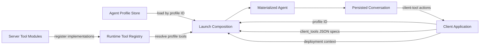
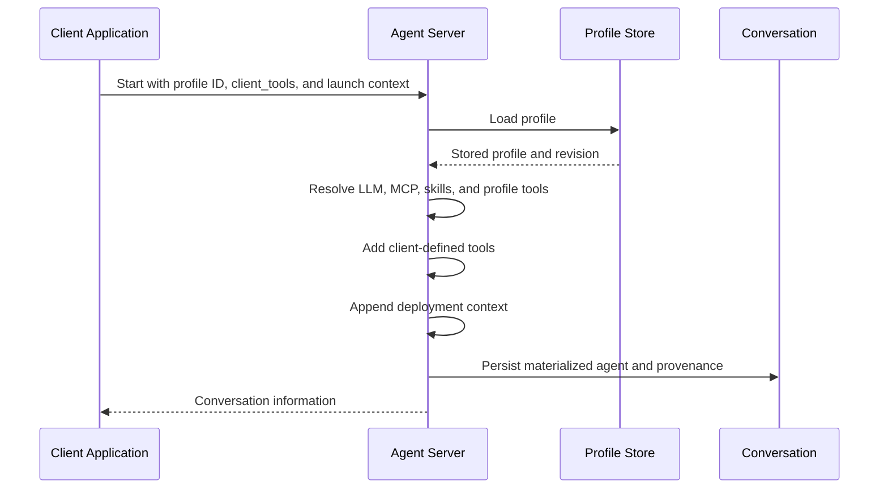

An **Agent Profile** is a named, reusable specification for launching an agent. It stores durable user intent, such as the agent kind, referenced LLM profile, tool selection, and MCP server selection. It is not a running agent and does not contain resolved credentials.

The agent server resolves a profile when a conversation starts. The client can also supply client-defined tools and deployment-specific context for that launch. The server materializes the result and persists it with the conversation.

## Design Goals

Agent Profiles follow four principles:

- **Portable profiles:** A profile can be launched by Agent Canvas, another client application, or directly through the agent-server API.
- **Application-neutral storage:** Profiles do not contain client-specific tools, deployment URLs, or resolved secrets unless the user explicitly selected them as profile configuration.
- **Server-owned resolution:** The agent server resolves profile references and produces the final agent used by the conversation.
- **Stable conversations:** A conversation resumes from its materialized agent rather than re-resolving the current version of its profile.

## Architecture

### Component Responsibilities

| Component | Owns | Does Not Own |
| --- | --- | --- |
| **Server tool module and registry** | Server-executed tool names, factories, and runtime availability | Whether a profile selects a tool |
| **Agent Profile** | Durable, secret-free agent configuration and references | Client-specific UI tools, deployment context, or resolved credentials |
| **Client application** | Profile selection, client-executed tool definitions, and deployment context | Profile resolution or server tool defaults |
| **Agent server** | Profile storage, validation, reference resolution, launch composition, and conversation persistence | Client-specific product behavior |
| **Conversation** | The materialized agent, client tool specifications, and profile provenance used for resume | Live synchronization with later profile edits |

## Tool Selection

Registering a server tool makes its implementation available to the runtime. Registration alone does not select the tool for an agent.

For an OpenHands Agent Profile, the `tools` field controls the server-executed tools selected by that profile:

| Profile `tools` | Resolved Server Tools |
| --- | --- |
| `null` | Use the standard OpenHands tool set |
| `[]` | Use no server tools |
| Non-empty list | Use that list exactly |

The standard tool set is independent of any profile whose name happens to be `default`. Renaming or editing that profile does not change the standard tool set.

## Client-Defined Tools

A client application can send JSON `client_tools` specifications when it starts a conversation. The server adds those tools after resolving the inline agent or Agent Profile. When the agent calls one, the server emits its action over the conversation event stream and the client performs the product-specific behavior.

Client-defined tools do not require a Python implementation in the agent-server runtime. Their names, descriptions, parameter schemas, and annotations travel with the conversation and are restored with it.

For example, Agent Canvas sends `canvas_ui_control` as a client-defined tool. Its frontend handles the resulting action by selecting a file, preview, or application tab. Another client could use the same API for a tool such as `post_on_slack` without making either tool part of the server's standard tool set.

Client-defined tools are additive to the profile's `tools` field:

| Profile `tools` | Resolved Server Tools | Canvas Client Tool | Materialized Tools |
| --- | --- | --- | --- |
| `null` | Standard OpenHands set | `canvas_ui_control` | Standard set plus `canvas_ui_control` |
| `[]` | None | `canvas_ui_control` | `canvas_ui_control` |
| `[{"name": "terminal"}]` | `terminal` | `canvas_ui_control` | `terminal` plus `canvas_ui_control` |

<Note>
  An explicit profile list is exact for server-executed tools. To launch a completely tool-free agent, the client must also omit `client_tools`.
</Note>

## Launch Flow

The launch request does not modify the stored profile. Editing a profile later also does not change conversations that were already launched from it.

## Launch-Only Context

Some instructions belong to the current deployment rather than a reusable profile. For example, a deployment can tell the agent how to reach runtime services that are available only for that launch.

Clients send these instructions through `agent_launch_additions.system_message_suffix_append`. The server appends the value after resolving the inline agent or Agent Profile. Launch additions cannot replace the profile's LLM, tools, or other durable configuration.

The server folds the suffix into the materialized agent and excludes `agent_launch_additions` from stored request metadata. This prevents the suffix from being applied twice when the conversation resumes.

## Persistence and Provenance

When a profile launches a conversation, the server stores:

- The fully materialized agent, including resolved server tools, client tools, and launch context.
- The client tool specifications needed to restore client-executed actions.
- The stable profile ID and profile revision used at launch.
- The conversation-scoped configuration and secret references needed for restore.

The server does not re-resolve the profile during resume. This provides deterministic behavior when a profile is renamed, edited, or deleted after a conversation starts.

Server-executed tools referenced by the materialized agent must still be available when the conversation resumes. Client-defined tools remain executable by the connected client and do not require a server-side Python module.

## Compatibility and Migration

Clients must only send `agent_launch_additions` to server releases that support it. When it is unavailable, a client can continue constructing its existing inline agent. The established `client_tools` API remains independent of that compatibility path.

Legacy profile migration is deliberately narrow. A schema-v1, untouched revision-0 OpenHands profile named `default` that was seeded with `tools: []` migrates to `tools: null`. User-created profiles and explicit empty lists remain unchanged.

Older persisted conversations can still reference server-executed tool modules that current clients no longer use. Deployments can keep those modules importable for restore while all new conversations use client-defined tools.

## ACP Profiles

ACP agents delegate prompt construction and tool execution to an ACP subprocess. Their tools are not resolved through the OpenHands profile tool-composition path described above. Shared profile behavior, such as stable identity, references, revision provenance, and conversation snapshots, still applies.

## See Also

- [Agent Architecture](/sdk/arch/agent)
- [Tool System and MCP](/sdk/arch/tool-system)
- [Conversation Architecture](/sdk/arch/conversation)
- [Remote Agent Server](/sdk/guides/agent-server/overview)
- [Manage Agent Profiles in Agent Canvas](/openhands/usage/agent-canvas/agent-profiles)
