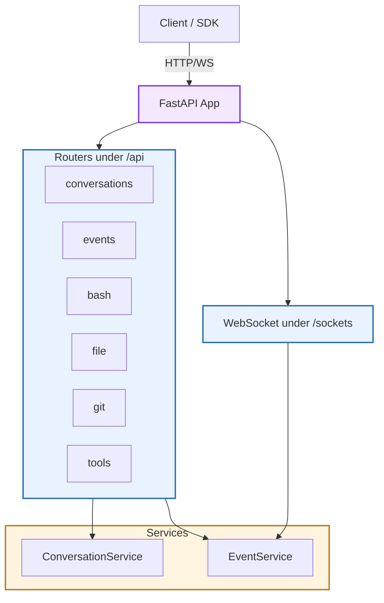
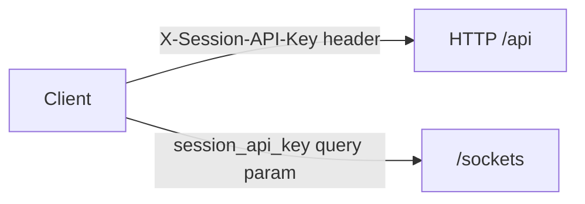
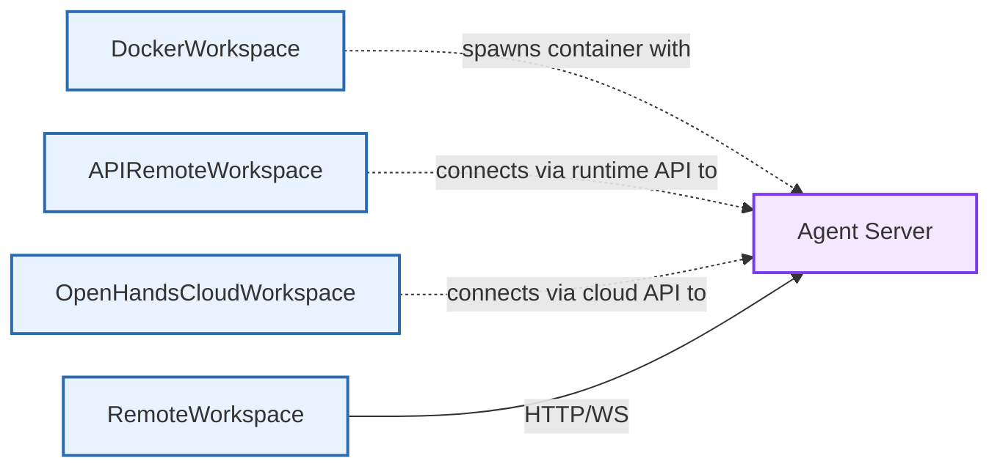

The **Agent Server** (`openhands.agent_server`) is a FastAPI-based HTTP/WebSocket server that enables remote agent execution. It provides the API layer that workspace implementations connect to for running conversations in isolated environments.

**Source:** [`openhands-agent-server/`](https://github.com/OpenHands/software-agent-sdk/tree/main/openhands-agent-server)

<Note>
For practical usage guides on deploying and connecting to agent servers, see the [Remote Agent Server Overview](/sdk/guides/agent-server/overview).
</Note>

## Core Responsibilities

1. **Conversation lifecycle** – Start, run, pause, delete conversations ([conversation_router.py](https://github.com/OpenHands/software-agent-sdk/blob/HEAD/openhands-agent-server/openhands/agent_server/conversation_router.py))
2. **Event streaming** – Search/get events via REST; real-time streaming via WebSocket ([event_router.py](https://github.com/OpenHands/software-agent-sdk/blob/HEAD/openhands-agent-server/openhands/agent_server/event_router.py), [sockets.py](https://github.com/OpenHands/software-agent-sdk/blob/HEAD/openhands-agent-server/openhands/agent_server/sockets.py))
3. **Execution utilities** – Bash commands, file upload/download, Git operations ([bash_router.py](https://github.com/OpenHands/software-agent-sdk/blob/HEAD/openhands-agent-server/openhands/agent_server/bash_router.py), [file_router.py](https://github.com/OpenHands/software-agent-sdk/blob/HEAD/openhands-agent-server/openhands/agent_server/file_router.py), [git_router.py](https://github.com/OpenHands/software-agent-sdk/blob/HEAD/openhands-agent-server/openhands/agent_server/git_router.py))
4. **Tool registry** – List registered tools ([tool_router.py](https://github.com/OpenHands/software-agent-sdk/blob/HEAD/openhands-agent-server/openhands/agent_server/tool_router.py))
5. **Health monitoring** – Server uptime and idle time ([server_details_router.py](https://github.com/OpenHands/software-agent-sdk/blob/HEAD/openhands-agent-server/openhands/agent_server/server_details_router.py))

## Architecture

### Key Components

| Component | Purpose | Source |
|-----------|---------|--------|
| **FastAPI App** | Main application with lifespan management | [api.py](https://github.com/OpenHands/software-agent-sdk/blob/HEAD/openhands-agent-server/openhands/agent_server/api.py) |
| **ConversationService** | Manages conversation state and execution | [conversation_service.py](https://github.com/OpenHands/software-agent-sdk/blob/HEAD/openhands-agent-server/openhands/agent_server/conversation_service.py) |
| **EventService** | Handles event storage and streaming | [event_service.py](https://github.com/OpenHands/software-agent-sdk/blob/HEAD/openhands-agent-server/openhands/agent_server/event_service.py) |
| **Request/Response Models** | Pydantic models for API payloads | [models.py](https://github.com/OpenHands/software-agent-sdk/blob/HEAD/openhands-agent-server/openhands/agent_server/models.py) |

## API Endpoints

### REST Endpoints (`/api`)

| Router | Endpoint | Description |
|--------|----------|-------------|
| **Conversations** | `POST /api/conversations` | Start new conversation |
| | `POST /api/conversations/{id}/run` | Run agent loop |
| | `POST /api/conversations/{id}/events` | Send message (optionally with `run: true`) |
| **Events** | `GET /api/conversations/{id}/events/search` | List events |
| | `GET /api/conversations/{id}/events/{event_id}` | Get specific event |
| **Bash** | `POST /api/bash/start_bash_command` | Start background command |
| | `GET /api/bash/bash_events/search` | List bash events |
| **Files** | `POST /api/file/upload/{path}` | Upload file |
| | `GET /api/file/download/{path}` | Download file |
| **Tools** | `GET /api/tools/` | List registered tools |
| **Server** | `GET /server_info` | Get uptime and idle time |

### WebSocket Endpoints (`/sockets`)

| Endpoint | Description |
|----------|-------------|
| `/sockets/events/{conversation_id}` | Stream conversation events |
| `/sockets/bash-events` | Stream bash command events |

## Authentication

| Method | Authentication | Source |
|--------|---------------|--------|
| **HTTP** | `X-Session-API-Key` header | [dependencies.py](https://github.com/OpenHands/software-agent-sdk/blob/HEAD/openhands-agent-server/openhands/agent_server/dependencies.py) |
| **WebSocket** | `session_api_key` query parameter | [sockets.py](https://github.com/OpenHands/software-agent-sdk/blob/HEAD/openhands-agent-server/openhands/agent_server/sockets.py) |
| **Config** | Environment-driven settings | [config.py](https://github.com/OpenHands/software-agent-sdk/blob/HEAD/openhands-agent-server/openhands/agent_server/config.py) |

## Design Notes

**Stateless Server:** The agent server itself does not manage containers or infrastructure. It runs inside whatever environment is provided—containerization and lifecycle are handled by workspace implementations.

**Workspace Integration:** Workspace implementations spawn or connect to the agent server:
- [**DockerWorkspace**](/sdk/guides/agent-server/docker-sandbox) launches the server inside a Docker container
- [**APIRemoteWorkspace**](/sdk/guides/agent-server/api-sandbox) connects to a server provisioned by a runtime API
- [**OpenHandsCloudWorkspace**](/sdk/guides/agent-server/cloud-workspace) connects to OpenHands Cloud-managed sandboxes

For workspace architecture details, see [Workspace Architecture](/sdk/arch/workspace).

**Security:** API key validation at the schema level, absolute path enforcement for file operations, and typed Pydantic payloads.

## Component Relationships

**Relationship Characteristics:**
- **DockerWorkspace → Agent Server**: Spawns container with server, connects via HTTP/WS
- **APIRemoteWorkspace → Agent Server**: Runtime API provisions server, SDK connects via HTTP/WS
- **OpenHandsCloudWorkspace → Agent Server**: Cloud provisions sandbox, SDK connects via HTTP/WS
- **RemoteWorkspace → Agent Server**: Base class for all remote workspace HTTP/WS communication

## See Also

- **[Remote Agent Server Overview](/sdk/guides/agent-server/overview)** – Practical usage guide
- **[Workspace Architecture](/sdk/arch/workspace)** – Workspace abstraction and implementations
- **[Docker Sandbox Guide](/sdk/guides/agent-server/docker-sandbox)** – Running with DockerWorkspace
- **[API Sandbox Guide](/sdk/guides/agent-server/api-sandbox)** – Using APIRemoteWorkspace
- **[Cloud Workspace Guide](/sdk/guides/agent-server/cloud-workspace)** – Using OpenHandsCloudWorkspace

---
Last updated: 2025-12-23 UTC  
Source commit (software-agent-sdk): `93d405c9`
