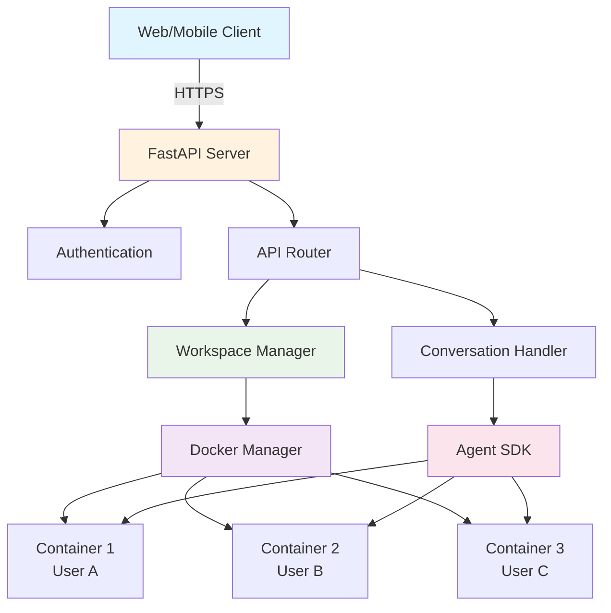

The Agent Server package (`openhands.agent_server`) provides an HTTP API server for remote agent execution. It enables building multi-user systems, SaaS products, and distributed agent platforms.

**Source**: [`openhands/agent_server/`](https://github.com/OpenHands/software-agent-sdk/tree/main/openhands/agent_server)

## Purpose

The Agent Server enables:
- **Remote execution**: Clients interact with agents via HTTP API
- **Multi-user isolation**: Each user gets isolated workspace
- **Container orchestration**: Manages Docker containers for workspaces
- **Centralized management**: Monitor and control all agents
- **Scalability**: Horizontal scaling with multiple servers

## Architecture Overview



### Key Components

**1. FastAPI Server**
- HTTP REST API endpoints
- Authentication and authorization
- Request validation
- WebSocket support for streaming

**2. Workspace Manager**
- Creates and manages Docker containers
- Isolates workspaces per user
- Handles container lifecycle
- Manages resource limits

**3. Conversation Handler**
- Routes requests to appropriate workspace
- Manages conversation state
- Handles concurrent requests
- Supports streaming responses

**4. Docker Manager**
- Interfaces with Docker daemon
- Builds and pulls images
- Creates and destroys containers
- Monitors container health

## Design Decisions

### Why HTTP API?

Alternative approaches considered:
- **gRPC**: More efficient but harder for web clients
- **WebSockets only**: Good for streaming but not RESTful
- **HTTP + WebSockets**: Best of both worlds

**Decision**: HTTP REST for operations, WebSockets for streaming
- ✅ Works from any client (web, mobile, CLI)
- ✅ Easy to debug (curl, Postman)
- ✅ Standard authentication (API keys, OAuth)
- ✅ Streaming where needed

### Why Container Per User?

Alternative approaches:
- **Shared container**: Multiple users in one container
- **Container per session**: New container each conversation
- **Container per user**: One container per user (chosen)

**Decision**: Container per user
- ✅ Strong isolation between users
- ✅ Persistent workspace across sessions
- ✅ Better resource management
- ⚠️ More containers, but worth it for isolation

### Why FastAPI?

Alternative frameworks:
- **Flask**: Simpler but less type-safe
- **Django**: Too heavyweight
- **FastAPI**: Modern, fast, type-safe (chosen)

**Decision**: FastAPI
- ✅ Automatic API documentation (OpenAPI)
- ✅ Type validation with Pydantic
- ✅ Async support for performance
- ✅ WebSocket support built-in

## API Design

### Key Endpoints

**Workspace Management**
```
POST   /workspaces              Create new workspace
GET    /workspaces/{id}         Get workspace info
DELETE /workspaces/{id}         Delete workspace
POST   /workspaces/{id}/execute Execute command
```

**Conversation Management**
```
POST   /conversations                Create conversation
GET    /conversations/{id}           Get conversation
POST   /conversations/{id}/messages  Send message
GET    /conversations/{id}/stream    Stream responses (WebSocket)
```

**Health & Monitoring**
```
GET    /health                   Server health check
GET    /metrics                  Prometheus metrics
```

### Authentication

**API Key Authentication**
```bash
curl -H "Authorization: Bearer YOUR_API_KEY" \
     https://agent-server.example.com/conversations
```

**Per-user workspace isolation**
- API key → user ID mapping
- Each user gets separate workspace
- Users can't access each other's workspaces

### Streaming Responses

**WebSocket for real-time updates**
```python
async with websocket_connect(url) as ws:
    # Send message
    await ws.send_json({"message": "Hello"})
    
    # Receive events
    async for event in ws:
        if event["type"] == "message":
            print(event["content"])
```

**Why streaming?**
- Real-time feedback to users
- Show agent thinking process
- Better UX for long-running tasks

## Deployment Models

### 1. Local Development

Run server locally for testing:
```bash
# Start server
openhands-agent-server --port 8000

# Or with Docker
docker run -p 8000:8000 \
  -v /var/run/docker.sock:/var/run/docker.sock \
  ghcr.io/all-hands-ai/agent-server:latest
```

**Use case**: Development and testing

### 2. Single-Server Deployment

Deploy on one server (VPS, EC2, etc.):
```bash
# Install
pip install openhands-agent-server

# Run with systemd/supervisor
openhands-agent-server \
  --host 0.0.0.0 \
  --port 8000 \
  --workers 4
```

**Use case**: Small deployments, prototypes, MVPs

### 3. Multi-Server Deployment

Scale horizontally with load balancer:
```
                 Load Balancer
                       |
        +-------------+-------------+
        |             |             |
   Server 1      Server 2      Server 3
   (Agents)      (Agents)      (Agents)
        |             |             |
        +-------------+-------------+
                       |
              Shared State Store
           (Database, Redis, etc.)
```

**Use case**: Production SaaS, high traffic, need redundancy

### 4. Kubernetes Deployment

Container orchestration with Kubernetes:
```yaml
apiVersion: apps/v1
kind: Deployment
metadata:
  name: agent-server
spec:
  replicas: 3
  template:
    spec:
      containers:
      - name: agent-server
        image: ghcr.io/all-hands-ai/agent-server:latest
        ports:
        - containerPort: 8000
```

**Use case**: Enterprise deployments, auto-scaling, high availability

## Resource Management

### Container Limits

Set per-workspace resource limits:
```python
# In server configuration
WORKSPACE_CONFIG = {
    "resource_limits": {
        "memory": "2g",      # 2GB RAM
        "cpus": "2",         # 2 CPU cores
        "disk": "10g"        # 10GB disk
    },
    "timeout": 300,          # 5 min timeout
}
```

**Why limit resources?**
- Prevent one user from consuming all resources
- Fair usage across users
- Protect server from runaway processes
- Cost control

### Cleanup & Garbage Collection

**Container lifecycle**:
- Containers created on first use
- Kept alive between requests (warm)
- Cleaned up after inactivity timeout
- Force cleanup on server shutdown

**Storage management**:
- Old workspaces deleted automatically
- Disk usage monitored
- Alerts when approaching limits

## Security Considerations

### Multi-Tenant Isolation

**Container isolation**:
- Each user gets separate container
- Containers can't communicate
- Network isolation (optional)
- File system isolation

**API isolation**:
- API keys mapped to users
- Users can only access their workspaces
- Server validates all permissions

### Input Validation

**Server validates**:
- API request schemas
- Command injection attempts
- Path traversal attempts
- File size limits

**Defense in depth**:
- API validation
- Container validation
- Docker security features
- OS-level security

### Network Security

**Best practices**:
- HTTPS only (TLS certificates)
- Firewall rules (only port 443/8000)
- Rate limiting
- DDoS protection

**Container networking**:
```python
# Disable network for workspace
WORKSPACE_CONFIG = {
    "network_mode": "none"  # No network access
}

# Or allow specific hosts
WORKSPACE_CONFIG = {
    "allowed_hosts": ["api.example.com"]
}
```

## Monitoring & Observability

### Health Checks

```bash
# Simple health check
curl https://agent-server.example.com/health

# Response
{
  "status": "healthy",
  "docker": "connected",
  "workspaces": 15,
  "uptime": 86400
}
```

### Metrics

**Prometheus metrics**:
- Request count and latency
- Active workspaces
- Container resource usage
- Error rates

**Logging**:
- Structured JSON logs
- Per-request tracing
- Workspace events
- Error tracking

### Alerting

**Alert on**:
- Server down
- High error rate
- Resource exhaustion
- Container failures

## Client SDK

Python SDK for interacting with Agent Server:

```python
from openhands.client import AgentServerClient

client = AgentServerClient(
    url="https://agent-server.example.com",
    api_key="your-api-key"
)

# Create conversation
conversation = client.create_conversation()

# Send message
response = client.send_message(
    conversation_id=conversation.id,
    message="Hello, agent!"
)

# Stream responses
for event in client.stream_conversation(conversation.id):
    if event.type == "message":
        print(event.content)
```

**Client handles**:
- Authentication
- Request/response serialization
- Error handling
- Streaming
- Retries

## Cost Considerations

### Server Costs

**Compute**: CPU and memory for containers
- Each active workspace = 1 container
- Typically 1-2 GB RAM per workspace
- 0.5-1 CPU core per workspace

**Storage**: Workspace files and conversation state
- ~1-10 GB per workspace (depends on usage)
- Conversation history in database

**Network**: API requests and responses
- Minimal (mostly text)
- Streaming adds bandwidth

### Cost Optimization

**1. Idle timeout**: Shutdown containers after inactivity
```python
WORKSPACE_CONFIG = {
    "idle_timeout": 3600  # 1 hour
}
```

**2. Resource limits**: Don't over-provision
```python
WORKSPACE_CONFIG = {
    "resource_limits": {
        "memory": "1g",    # Smaller limit
        "cpus": "0.5"      # Fractional CPU
    }
}
```

**3. Shared resources**: Use single server for multiple low-traffic apps

**4. Auto-scaling**: Scale servers based on demand

## When to Use Agent Server

### Use Agent Server When:

✅ **Multi-user system**: Web app with many users  
✅ **Remote clients**: Mobile app, web frontend  
✅ **Centralized management**: Need to monitor all agents  
✅ **Workspace isolation**: Users shouldn't interfere  
✅ **SaaS product**: Building agent-as-a-service  
✅ **Scaling**: Need to handle concurrent users

**Examples**:
- Chatbot platforms
- Code assistant web apps
- Agent marketplaces
- Enterprise agent deployments

### Use Standalone SDK When:

✅ **Single-user**: Personal tool or script  
✅ **Local execution**: Running on your machine  
✅ **Full control**: Need programmatic access  
✅ **Simpler deployment**: No server management  
✅ **Lower latency**: No network overhead

**Examples**:
- CLI tools
- Automation scripts
- Local development
- Desktop applications

### Hybrid Approach

Use SDK locally but RemoteAPIWorkspace for execution:
- Agent logic in your Python code
- Execution happens on remote server
- Best of both worlds

## Building Custom Agent Server

The server is extensible for custom needs:

**Custom authentication**:
```python
from openhands.agent_server import AgentServer

class CustomAgentServer(AgentServer):
    async def authenticate(self, request):
        # Custom auth logic
        return await oauth_verify(request)
```

**Custom workspace configuration**:
```python
server = AgentServer(
    workspace_factory=lambda user: DockerWorkspace(
        image=f"custom-image-{user.tier}",
        resource_limits=user.resource_limits
    )
)
```

**Custom middleware**:
```python
@server.middleware
async def logging_middleware(request, call_next):
    # Custom logging
    response = await call_next(request)
    return response
```

## Next Steps

### For Usage Examples

- [Local Agent Server](/sdk/guides/agent-server/local-server) - Run locally
- [Docker Sandboxed Server](/sdk/guides/agent-server/docker-sandbox) - Docker setup
- [API Sandboxed Server](/sdk/guides/agent-server/api-sandbox) - Remote API
- [Remote Agent Server Overview](/sdk/guides/agent-server/overview) - All options

### For Related Architecture

- [Workspace Architecture](/sdk/arch/workspace) - RemoteAPIWorkspace details
- [SDK Architecture](/sdk/arch/sdk) - Core framework
- [Architecture Overview](/sdk/arch/overview) - System design

### For Implementation Details

- [`openhands/agent_server/`](https://github.com/OpenHands/software-agent-sdk/tree/main/openhands/agent_server) - Server source
- [`examples/`](https://github.com/OpenHands/software-agent-sdk/tree/main/examples) - Working examples
