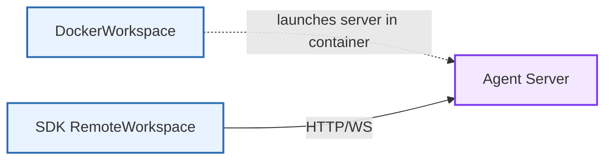

The Agent Server package (`openhands.agent_server`) exposes a FastAPI-based HTTP/WebSocket interface that runs OpenHands conversations remotely. It is stateless with respect to agent logic and does not orchestrate containers by itself. Containerization is handled by workspace implementations (e.g., DockerWorkspace) that launch this server inside a sandbox when needed.

Source: [`openhands-agent-server/`](https://github.com/OpenHands/software-agent-sdk/tree/main/openhands-agent-server)

## Core Responsibilities

The server provides:

1. **Conversation lifecycle API** - Create, run, pause, delete conversations ([conversation_router.py](https://github.com/OpenHands/software-agent-sdk/blob/HEAD/openhands-agent-server/openhands/agent_server/conversation_router.py))
2. **Event access** - Search, count, get, batch-get conversation events; WebSocket event streaming ([event_router.py](https://github.com/OpenHands/software-agent-sdk/blob/HEAD/openhands-agent-server/openhands/agent_server/event_router.py), [sockets.py](https://github.com/OpenHands/software-agent-sdk/blob/HEAD/openhands-agent-server/openhands/agent_server/sockets.py))
3. **Execution utilities** - Start and monitor bash commands; file upload/download; simple Git ops ([bash_router.py](https://github.com/OpenHands/software-agent-sdk/blob/HEAD/openhands-agent-server/openhands/agent_server/bash_router.py), [file_router.py](https://github.com/OpenHands/software-agent-sdk/blob/HEAD/openhands-agent-server/openhands/agent_server/file_router.py), [git_router.py](https://github.com/OpenHands/software-agent-sdk/blob/HEAD/openhands-agent-server/openhands/agent_server/git_router.py))
4. **Tool registry listing** - Introspect available tools on the server ([tool_router.py](https://github.com/OpenHands/software-agent-sdk/blob/HEAD/openhands-agent-server/openhands/agent_server/tool_router.py))
5. **Server details** - Health, alive, and server info endpoints ([server_details_router.py](https://github.com/OpenHands/software-agent-sdk/blob/HEAD/openhands-agent-server/openhands/agent_server/server_details_router.py))

## Architecture

```mermaid
%%{init: {"theme": "default", "flowchart": {"nodeSpacing": 28, "rankSpacing": 40}} }%%
flowchart TB
    Client[Client / SDK] -->|HTTP/WS| API[FastAPI App]

    subgraph Routers[Routers (/api/*)]
        Conv[conversations]
        Events[conversations/{id}/events]
        Bash[bash]
        File[file]
        Git[git]
        Tools[tools]
    end

    WS[/sockets/*\n(WebSocket)/]

    API --> Routers
    API --> WS

    subgraph Services[Services]
        ConvSvc[ConversationService]
        EventSvc[EventService]
    end

    Routers --> ConvSvc
    Routers --> EventSvc
    WS --> EventSvc

    classDef primary fill:#f3e8ff,stroke:#7c3aed,stroke-width:2px
    classDef secondary fill:#e8f3ff,stroke:#2b6cb0,stroke-width:2px
    classDef tertiary fill:#fff4df,stroke:#b7791f,stroke-width:2px

    class API primary
    class Routers,WS secondary
    class Services tertiary
```

- App construction and route wiring happen in [`api.py`](https://github.com/OpenHands/software-agent-sdk/blob/main/openhands-agent-server/openhands/agent_server/api.py): the app mounts a single `/api` router that includes conversation, event, tool, bash, git, file, vscode, and desktop routers.
- Event and VSCode/Desktop services are initialized in the lifespan context ([api.py](https://github.com/OpenHands/software-agent-sdk/blob/HEAD/openhands-agent-server/openhands/agent_server/api.py)).

## Authentication

- HTTP requests: header `X-Session-API-Key` if session keys are configured ([dependencies.py](https://github.com/OpenHands/software-agent-sdk/blob/HEAD/openhands-agent-server/openhands/agent_server/dependencies.py))
- WebSocket: query parameter `session_api_key` ([dependencies.py](https://github.com/OpenHands/software-agent-sdk/blob/HEAD/openhands-agent-server/openhands/agent_server/dependencies.py), [sockets.py](https://github.com/OpenHands/software-agent-sdk/blob/HEAD/openhands-agent-server/openhands/agent_server/sockets.py))
- Configuration source: environment-driven `Config` ([config.py](https://github.com/OpenHands/software-agent-sdk/blob/HEAD/openhands-agent-server/openhands/agent_server/config.py))

```mermaid
flowchart LR
    Client -->|X-Session-API-Key| HTTP[HTTP /api/*]
    Client -->|session_api_key| WS[/sockets/*]
```

## Endpoints (selected)

All REST endpoints are mounted under `/api` unless noted.

- Conversations ([conversation_router.py](https://github.com/OpenHands/software-agent-sdk/blob/HEAD/openhands-agent-server/openhands/agent_server/conversation_router.py))
  - `GET /api/conversations/search` – list
  - `GET /api/conversations/count` – count
  - `GET /api/conversations/{conversation_id}` – get
  - `GET /api/conversations?ids=...` – batch get
  - `POST /api/conversations` – start (accepts `StartConversationRequest` built with SDK `Agent` and `LocalWorkspace`)
  - `POST /api/conversations/{conversation_id}/run` – run loop
  - `POST /api/conversations/{conversation_id}/pause` – pause
  - `DELETE /api/conversations/{conversation_id}` – delete
  - `PATCH /api/conversations/{conversation_id}` – update metadata (title)
  - `POST /api/conversations/{id}/generate_title` – title via LLM
  - `POST /api/conversations/{id}/secrets` – update secrets
  - `POST /api/conversations/{id}/confirmation_policy` – set policy
  - `POST /api/conversations/{id}/security_analyzer` – set analyzer
  - `POST /api/conversations/{id}/ask_agent` – question-only (no state change)

- Events ([event_router.py](https://github.com/OpenHands/software-agent-sdk/blob/HEAD/openhands-agent-server/openhands/agent_server/event_router.py))
  - `GET /api/conversations/{conversation_id}/events/search`
  - `GET /api/conversations/{conversation_id}/events/count`
  - `GET /api/conversations/{conversation_id}/events/{event_id}`
  - `GET /api/conversations/{conversation_id}/events?event_ids=...`
  - `POST /api/conversations/{conversation_id}/events` – send `Message`

- Bash ([bash_router.py](https://github.com/OpenHands/software-agent-sdk/blob/HEAD/openhands-agent-server/openhands/agent_server/bash_router.py))
  - `POST /api/bash/start_bash_command`
  - `POST /api/bash/execute_bash_command`
  - `GET /api/bash/bash_events/search|{event_id}|` (list/get)
  - `DELETE /api/bash/bash_events` – clear

- Files ([file_router.py](https://github.com/OpenHands/software-agent-sdk/blob/HEAD/openhands-agent-server/openhands/agent_server/file_router.py))
  - `POST /api/file/upload/{path}` – upload to absolute path
  - `GET /api/file/download/{path}` – download absolute path
  - `GET /api/file/download-trajectory/{conversation_id}` – zip state

- Git ([git_router.py](https://github.com/OpenHands/software-agent-sdk/blob/HEAD/openhands-agent-server/openhands/agent_server/git_router.py))
  - `GET /api/git/changes/{path}`
  - `GET /api/git/diff/{path}`

- Tools ([tool_router.py](https://github.com/OpenHands/software-agent-sdk/blob/HEAD/openhands-agent-server/openhands/agent_server/tool_router.py))
  - `GET /api/tools/` – list registered tools

- Server details ([server_details_router.py](https://github.com/OpenHands/software-agent-sdk/blob/HEAD/openhands-agent-server/openhands/agent_server/server_details_router.py))
  - `GET /alive`, `GET /health`, `GET /server_info`

- WebSockets ([sockets.py](https://github.com/OpenHands/software-agent-sdk/blob/HEAD/openhands-agent-server/openhands/agent_server/sockets.py))
  - `WS /sockets/events/{conversation_id}?session_api_key=...&resend_all=bool`
  - `WS /sockets/bash-events?session_api_key=...&resend_all=bool`

## Design Notes

- The server itself does not manage Docker containers. Containerization and lifecycle are handled by workspace implementations such as `DockerWorkspace` in the `openhands-workspace` package, which run this server inside the container and connect via HTTP ([docker/workspace.py](https://github.com/OpenHands/software-agent-sdk/blob/HEAD/openhands-workspace/openhands/workspace/docker/workspace.py)).
- Request/response models are Pydantic classes in `models.py` ([models.py](https://github.com/OpenHands/software-agent-sdk/blob/HEAD/openhands-agent-server/openhands/agent_server/models.py)).
- Security: schema-level API key checks, path validation for file ops (absolute path enforcement), and typed payloads ([dependencies.py](https://github.com/OpenHands/software-agent-sdk/blob/HEAD/openhands-agent-server/openhands/agent_server/dependencies.py), [file_router.py](https://github.com/OpenHands/software-agent-sdk/blob/HEAD/openhands-agent-server/openhands/agent_server/file_router.py)).

## Component Relationships



- SDK’s `RemoteWorkspace` and higher-level `RemoteConversation` use these endpoints (source: openhands/sdk/workspace/remote/*, openhands/sdk/conversation/impl/remote_conversation.py).

## See Also

- [Workspace Architecture](/sdk/arch/workspace) – HTTP delegation model
- [SDK Architecture](/sdk/arch/overview) – Packages and modes

---

## Client SDK

Python examples for interacting with Agent Server:

```python
# Minimal REST client using httpx (no SDK wrapper required)
# Endpoints from conversation/event routers:
# - POST /api/conversations/{conversation_id}/events (send message)
# - GET  /api/conversations/{conversation_id}/events/search (read events)
# (source: event_router.py)
# https://github.com/OpenHands/software-agent-sdk/blob/HEAD/openhands-agent-server/openhands/agent_server/event_router.py

import httpx

BASE_URL = "https://agent-server.example.com"
API_KEY = "your-api-key"
CONVERSATION_ID = "your-conversation-uuid"

headers = {"X-Session-API-Key": API_KEY}

# Send a user message and start the agent loop
send = {
    "role": "user",
    "content": [{"type": "text", "text": "Hello, agent!"}],
    "run": True,
}
r = httpx.post(
    f"{BASE_URL}/api/conversations/{CONVERSATION_ID}/events",
    json=send,
    headers=headers,
)
r.raise_for_status()

# Poll recent events (use WebSockets for streaming if preferred)
resp = httpx.get(
    f"{BASE_URL}/api/conversations/{CONVERSATION_ID}/events/search",
    headers=headers,
    params={"limit": 50},
)
resp.raise_for_status()
for ev in resp.json().get("items", []):
    print(ev.get("kind"), ev.get("source"))
```

<Note>
To create a new conversation via REST, post a StartConversationRequest to `/api/conversations`.
See the JSON example in
[conversation_router.py](https://github.com/OpenHands/software-agent-sdk/blob/HEAD/openhands-agent-server/openhands/agent_server/conversation_router.py)
(START_CONVERSATION_EXAMPLES).
</Note>

### WebSocket streaming example (events)

```python
# Stream conversation events over WebSocket
# Endpoint: /sockets/events/{conversation_id}?session_api_key=...
# (source: sockets.py)
# https://github.com/OpenHands/software-agent-sdk/blob/HEAD/openhands-agent-server/openhands/agent_server/sockets.py

import asyncio
import json
import websockets

BASE_WS = "wss://agent-server.example.com"
API_KEY = "your-api-key"
CONVERSATION_ID = "your-conversation-uuid"

async def stream_events():
    ws_url = (
        f"{BASE_WS}/sockets/events/{CONVERSATION_ID}"
        f"?session_api_key={API_KEY}&resend_all=false"
    )
    async with websockets.connect(ws_url) as ws:
        while True:
            raw = await ws.recv()
            event = json.loads(raw)
            print(event.get("kind"), event.get("source"))

asyncio.run(stream_events())
```

<Note>
WebSockets require passing the session key as a query parameter
(`session_api_key`). See
[sockets.py](https://github.com/OpenHands/software-agent-sdk/blob/HEAD/openhands-agent-server/openhands/agent_server/sockets.py).
</Note>


### WebSocket streaming example (bash-events)

```python
# Stream bash events over WebSocket
# Endpoint: /sockets/bash-events?session_api_key=...
# (source: sockets.py)
# https://github.com/OpenHands/software-agent-sdk/blob/HEAD/openhands-agent-server/openhands/agent_server/sockets.py

import asyncio
import json
import websockets

BASE_WS = "wss://agent-server.example.com"
API_KEY = "your-api-key"

async def stream_bash_events():
    ws_url = f"{BASE_WS}/sockets/bash-events?session_api_key={API_KEY}&resend_all=false"
    async with websockets.connect(ws_url) as ws:
        while True:
            raw = await ws.recv()
            event = json.loads(raw)
            print(event.get("kind"), event.get("timestamp"))

asyncio.run(stream_bash_events())
```

<Note>
Bash WebSocket events include BashCommand and BashOutput items. For filtering or paging
via REST, see the bash event routes in
[bash_router.py](https://github.com/OpenHands/software-agent-sdk/blob/HEAD/openhands-agent-server/openhands/agent_server/bash_router.py).
</Note>

Source commit (software-agent-sdk): `93d405c9`
