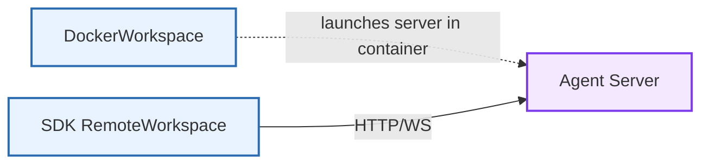

The Agent Server (`openhands.agent_server`) provides an HTTP/WebSocket interface for running OpenHands conversations remotely. It is stateless with respect to agent logic; containerization is handled by workspace implementations (e.g., DockerWorkspace) that launch this server inside a sandbox when needed.

Source: [`openhands-agent-server/`](https://github.com/OpenHands/software-agent-sdk/tree/main/openhands-agent-server)

## Core Responsibilities

The server provides:

1. **Conversation lifecycle API** – Start, run, pause, delete conversations ([conversation_router.py](https://github.com/OpenHands/software-agent-sdk/blob/HEAD/openhands-agent-server/openhands/agent_server/conversation_router.py))
2. **Event access** – Search/get conversation events; WebSocket streaming ([event_router.py](https://github.com/OpenHands/software-agent-sdk/blob/HEAD/openhands-agent-server/openhands/agent_server/event_router.py), [sockets.py](https://github.com/OpenHands/software-agent-sdk/blob/HEAD/openhands-agent-server/openhands/agent_server/sockets.py))
3. **Execution utilities** – Bash commands, file upload/download, simple Git ops ([bash_router.py](https://github.com/OpenHands/software-agent-sdk/blob/HEAD/openhands-agent-server/openhands/agent_server/bash_router.py), [file_router.py](https://github.com/OpenHands/software-agent-sdk/blob/HEAD/openhands-agent-server/openhands/agent_server/file_router.py), [git_router.py](https://github.com/OpenHands/software-agent-sdk/blob/HEAD/openhands-agent-server/openhands/agent_server/git_router.py))
4. **Tool registry** – List registered tools ([tool_router.py](https://github.com/OpenHands/software-agent-sdk/blob/HEAD/openhands-agent-server/openhands/agent_server/tool_router.py))
5. **Server details** – Health, uptime/idle info ([server_details_router.py](https://github.com/OpenHands/software-agent-sdk/blob/HEAD/openhands-agent-server/openhands/agent_server/server_details_router.py))

## Architecture

```mermaid
%%{init: {"theme": "default", "flowchart": {"nodeSpacing": 28, "rankSpacing": 40}} }%%
flowchart TB
    Client[Client / SDK] -->|HTTP/WS| API[FastAPI App]

    subgraph Routers["Routers (/api/*)"]
        Conv[conversations]
        Events[conversations/{id}/events]
        Bash[bash]
        File[file]
        Git[git]
        Tools[tools]
    end

    WS[/sockets/* (WebSocket)/]

    API --> Routers
    API --> WS

    subgraph Services[Services]
        ConvSvc[ConversationService]
        EventSvc[EventService]
    end

    Routers --> ConvSvc
    Routers --> EventSvc
    WS --> EventSvc

    classDef primary fill:#f3e8ff,stroke:#7c3aed,stroke-width:2px
    classDef secondary fill:#e8f3ff,stroke:#2b6cb0,stroke-width:2px
    classDef tertiary fill:#fff4df,stroke:#b7791f,stroke-width:2px

    class API primary
    class Routers,WS secondary
    class Services tertiary
```

- App construction and route wiring happen in [api.py](https://github.com/OpenHands/software-agent-sdk/blob/HEAD/openhands-agent-server/openhands/agent_server/api.py): a single `/api` router includes conversation, event, tool, bash, git, file, vscode, and desktop routers.
- Event and VSCode/Desktop services are initialized in the lifespan context ([api.py](https://github.com/OpenHands/software-agent-sdk/blob/HEAD/openhands-agent-server/openhands/agent_server/api.py)).

## Endpoints (selected)

Representative API surface under `/api`:

- Conversations ([conversation_router.py](https://github.com/OpenHands/software-agent-sdk/blob/HEAD/openhands-agent-server/openhands/agent_server/conversation_router.py))
  - `POST /api/conversations` – start conversation (StartConversationRequest)
  - `POST /api/conversations/{conversation_id}/run` – run agent loop
  - `POST /api/conversations/{conversation_id}/events` – send Message (optionally `run: true`)

- Events ([event_router.py](https://github.com/OpenHands/software-agent-sdk/blob/HEAD/openhands-agent-server/openhands/agent_server/event_router.py))
  - `GET /api/conversations/{conversation_id}/events/search` – list events
  - `GET /api/conversations/{conversation_id}/events/{event_id}` – get event

- Bash ([bash_router.py](https://github.com/OpenHands/software-agent-sdk/blob/HEAD/openhands-agent-server/openhands/agent_server/bash_router.py))
  - `POST /api/bash/start_bash_command` – start background command
  - `GET /api/bash/bash_events/search` – list bash events

- Files ([file_router.py](https://github.com/OpenHands/software-agent-sdk/blob/HEAD/openhands-agent-server/openhands/agent_server/file_router.py))
  - `POST /api/file/upload/{path}` – upload file (absolute path)
  - `GET /api/file/download/{path}` – download file (absolute path)

- Tools ([tool_router.py](https://github.com/OpenHands/software-agent-sdk/blob/HEAD/openhands-agent-server/openhands/agent_server/tool_router.py))
  - `GET /api/tools/` – list registered tools

- Server details ([server_details_router.py](https://github.com/OpenHands/software-agent-sdk/blob/HEAD/openhands-agent-server/openhands/agent_server/server_details_router.py))
  - `GET /server_info` – uptime and idle_time

## Authentication

```mermaid
flowchart LR
    Client -->|X-Session-API-Key| HTTP[HTTP /api/*]
    Client -->|session_api_key| WS[/sockets/*]
```

- HTTP requests: header `X-Session-API-Key` if configured ([dependencies.py](https://github.com/OpenHands/software-agent-sdk/blob/HEAD/openhands-agent-server/openhands/agent_server/dependencies.py))
- WebSocket: query parameter `session_api_key` ([dependencies.py](https://github.com/OpenHands/software-agent-sdk/blob/HEAD/openhands-agent-server/openhands/agent_server/dependencies.py), [sockets.py](https://github.com/OpenHands/software-agent-sdk/blob/HEAD/openhands-agent-server/openhands/agent_server/sockets.py))
- Configuration: environment-driven `Config` ([config.py](https://github.com/OpenHands/software-agent-sdk/blob/HEAD/openhands-agent-server/openhands/agent_server/config.py))

## Client SDK

Python examples for interacting with Agent Server:

```python
# Minimal REST client using httpx (no SDK wrapper required)
# Endpoints from conversation/event routers:
# - POST /api/conversations/{conversation_id}/events (send message)
# - GET  /api/conversations/{conversation_id}/events/search (read events)
# (source: event_router.py)
# https://github.com/OpenHands/software-agent-sdk/blob/HEAD/openhands-agent-server/openhands/agent_server/event_router.py

import httpx

BASE_URL = "https://agent-server.example.com"
API_KEY = "your-api-key"
CONVERSATION_ID = "your-conversation-uuid"

headers = {"X-Session-API-Key": API_KEY}

# Send a user message and start the agent loop
send = {
    "role": "user",
    "content": [{"type": "text", "text": "Hello, agent!"}],
    "run": True,
}
r = httpx.post(
    f"{BASE_URL}/api/conversations/{CONVERSATION_ID}/events",
    json=send,
    headers=headers,
)
r.raise_for_status()

# Poll recent events (use WebSockets for streaming if preferred)
resp = httpx.get(
    f"{BASE_URL}/api/conversations/{CONVERSATION_ID}/events/search",
    headers=headers,
    params={"limit": 50},
)
resp.raise_for_status()
for ev in resp.json().get("items", []):
    print(ev.get("kind"), ev.get("source"))
```

<Note>
To create a new conversation via REST, post a StartConversationRequest to `/api/conversations`.
See the JSON example in
[conversation_router.py](https://github.com/OpenHands/software-agent-sdk/blob/HEAD/openhands-agent-server/openhands/agent_server/conversation_router.py)
(START_CONVERSATION_EXAMPLES).
</Note>

### WebSocket streaming example (events)

```python
# Stream conversation events over WebSocket
# Endpoint: /sockets/events/{conversation_id}?session_api_key=...
# (source: sockets.py)
# https://github.com/OpenHands/software-agent-sdk/blob/HEAD/openhands-agent-server/openhands/agent_server/sockets.py

import asyncio
import json
import websockets

BASE_WS = "wss://agent-server.example.com"
API_KEY = "your-api-key"
CONVERSATION_ID = "your-conversation-uuid"

async def stream_events():
    ws_url = (
        f"{BASE_WS}/sockets/events/{CONVERSATION_ID}"
        f"?session_api_key={API_KEY}&resend_all=false"
    )
    async with websockets.connect(ws_url) as ws:
        while True:
            raw = await ws.recv()
            event = json.loads(raw)
            print(event.get("kind"), event.get("source"))

asyncio.run(stream_events())
```

<Note>
WebSockets require passing the session key as a query parameter
(`session_api_key`). See
[sockets.py](https://github.com/OpenHands/software-agent-sdk/blob/HEAD/openhands-agent-server/openhands/agent_server/sockets.py).
</Note>

### WebSocket streaming example (bash-events)

```python
# Stream bash events over WebSocket
# Endpoint: /sockets/bash-events?session_api_key=...
# (source: sockets.py)
# https://github.com/OpenHands/software-agent-sdk/blob/HEAD/openhands-agent-server/openhands/agent_server/sockets.py

import asyncio
import json
import websockets

BASE_WS = "wss://agent-server.example.com"
API_KEY = "your-api-key"

async def stream_bash_events():
    ws_url = f"{BASE_WS}/sockets/bash-events?session_api_key={API_KEY}&resend_all=false"
    async with websockets.connect(ws_url) as ws:
        while True:
            raw = await ws.recv()
            event = json.loads(raw)
            print(event.get("kind"), event.get("timestamp"))

asyncio.run(stream_bash_events())
```

<Note>
Bash WebSocket events include BashCommand and BashOutput items. For filtering or paging
via REST, see
[bash_router.py](https://github.com/OpenHands/software-agent-sdk/blob/HEAD/openhands-agent-server/openhands/agent_server/bash_router.py).
</Note>

## Design Notes

- The server itself does not manage Docker containers. Containerization and lifecycle are handled by workspace implementations such as `DockerWorkspace` in the `openhands-workspace` package, which run this server inside the container and connect via HTTP ([docker/workspace.py](https://github.com/OpenHands/software-agent-sdk/blob/HEAD/openhands-workspace/openhands/workspace/docker/workspace.py)).
- Request/response models are Pydantic classes in `models.py` ([models.py](https://github.com/OpenHands/software-agent-sdk/blob/HEAD/openhands-agent-server/openhands/agent_server/models.py)).
- Security: schema-level API key checks, path validation for file ops (absolute path enforcement), and typed payloads ([dependencies.py](https://github.com/OpenHands/software-agent-sdk/blob/HEAD/openhands-agent-server/openhands/agent_server/dependencies.py), [file_router.py](https://github.com/OpenHands/software-agent-sdk/blob/HEAD/openhands-agent-server/openhands/agent_server/file_router.py)).

## Component Relationships



---
Last updated: 2025-12-09 06:57 UTC  
Source commit (software-agent-sdk): `93d405c9`
