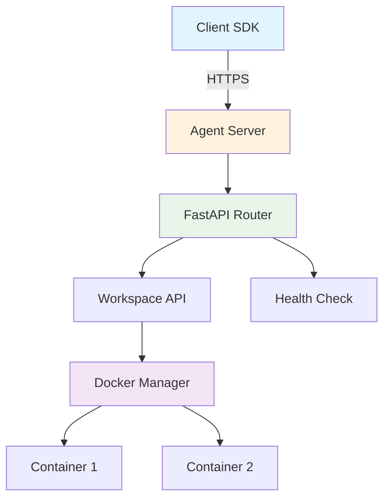

The Agent Server provides HTTP API endpoints for remote agent execution. It enables centralized agent management, multi-user support, and production deployments.

**Source**: [`openhands/agent_server/`](https://github.com/All-Hands-AI/agent-sdk/tree/main/openhands/agent_server)

## Purpose

The Agent Server enables:
- **Remote Execution**: Run agents on dedicated servers
- **Multi-User Support**: Isolate execution per user
- **Resource Management**: Centralized resource allocation
- **API Access**: HTTP API for agent operations
- **Production Deployment**: Scalable agent infrastructure

## Architecture



## Quick Start

### Using Pre-built Docker Image

```bash
# Pull latest image
docker pull ghcr.io/all-hands-ai/agent-server:latest

# Run server
docker run -d \
  -p 8000:8000 \
  -v /var/run/docker.sock:/var/run/docker.sock \
  ghcr.io/all-hands-ai/agent-server:latest
```

### Using Python

```bash
# Install agent-server package
pip install openhands-agent-server

# Start server
openhands-agent-server
```

## Building Docker Images

**Source**: [`openhands/agent_server/docker/`](https://github.com/All-Hands-AI/agent-sdk/tree/main/openhands/agent_server/docker)

### Build Script

```bash
# Build from source
python -m openhands.agent_server.docker.build \
  --base-image ubuntu:22.04 \
  --target runtime \
  --platform linux/amd64
```

### Build Options

| Option | Description | Default |
|--------|-------------|---------|
| `--base-image` | Base Docker image | `ubuntu:22.04` |
| `--target` | Build target (`runtime` or `dev`) | `runtime` |
| `--platform` | Target platform | Host platform |
| `--output-image` | Output image name | Auto-generated |

### Programmatic Build

```python
from openhands.agent_server.docker.build import (
    BuildOptions,
    build
)

# Build custom image
image_name = build(
    BuildOptions(
        base_image="python:3.12",
        target="runtime",
        platform="linux/amd64"
    )
)

print(f"Built image: {image_name}")
```

## Docker Images

### Official Images

```bash
# Latest release
ghcr.io/all-hands-ai/agent-server:latest

# Specific version
ghcr.io/all-hands-ai/agent-server:v1.0.0

# Development build
ghcr.io/all-hands-ai/agent-server:dev
```

### Image Variants

- **`runtime`**: Production-ready, minimal size
- **`dev`**: Development tools included

## API Endpoints

### Health Check

```bash
GET /api/health
```

Returns server health status.

### Execute Command

```bash
POST /api/workspace/command
Content-Type: application/json
Authorization: Bearer <api-key>

{
  "command": "python script.py",
  "working_dir": "/workspace",
  "timeout": 30.0
}
```

### File Upload

```bash
POST /api/workspace/upload
Authorization: Bearer <api-key>
Content-Type: multipart/form-data

# Form data with file
```

### File Download

```bash
GET /api/workspace/download?path=/workspace/output.txt
Authorization: Bearer <api-key>
```

## Configuration

### Environment Variables

```bash
# Server configuration
export HOST=0.0.0.0
export PORT=8000
export API_KEY=your-secret-key

# Docker configuration
export DOCKER_HOST=unix:///var/run/docker.sock

# Logging
export LOG_LEVEL=INFO
export DEBUG=false
```

### Server Settings

```python
# config.py
class Settings:
    host: str = "0.0.0.0"
    port: int = 8000
    api_key: str = "your-secret-key"
    workers: int = 4
    timeout: float = 300.0
```

## Deployment

### Docker Compose

```yaml
# docker-compose.yml
version: '3.8'

services:
  agent-server:
    image: ghcr.io/all-hands-ai/agent-server:latest
    ports:
      - "8000:8000"
    volumes:
      - /var/run/docker.sock:/var/run/docker.sock
    environment:
      - API_KEY=your-secret-key
      - LOG_LEVEL=INFO
    restart: unless-stopped
```

### Kubernetes

```yaml
# deployment.yaml
apiVersion: apps/v1
kind: Deployment
metadata:
  name: agent-server
spec:
  replicas: 3
  selector:
    matchLabels:
      app: agent-server
  template:
    metadata:
      labels:
        app: agent-server
    spec:
      containers:
      - name: agent-server
        image: ghcr.io/all-hands-ai/agent-server:latest
        ports:
        - containerPort: 8000
        env:
        - name: API_KEY
          valueFrom:
            secretKeyRef:
              name: agent-server-secrets
              key: api-key
```

### Systemd Service

```ini
# /etc/systemd/system/agent-server.service
[Unit]
Description=OpenHands Agent Server
After=docker.service
Requires=docker.service

[Service]
Type=simple
ExecStart=/usr/bin/docker run \
  --rm \
  -p 8000:8000 \
  -v /var/run/docker.sock:/var/run/docker.sock \
  ghcr.io/all-hands-ai/agent-server:latest

Restart=always
RestartSec=10

[Install]
WantedBy=multi-user.target
```

## Security

### Authentication

```python
# API key authentication
from fastapi import Header, HTTPException

async def verify_api_key(authorization: str = Header(None)):
    if not authorization or not authorization.startswith("Bearer "):
        raise HTTPException(status_code=401)
    
    api_key = authorization.split(" ")[1]
    if api_key != expected_api_key:
        raise HTTPException(status_code=403)
```

### Container Isolation

- Each request executes in separate Docker container
- Containers have resource limits
- Network isolation between containers
- Automatic cleanup after execution

### Rate Limiting

```python
# Implement rate limiting per API key
from slowapi import Limiter

limiter = Limiter(key_func=lambda: request.headers.get("Authorization"))

@app.post("/api/workspace/command")
@limiter.limit("100/minute")
async def execute_command(...):
    ...
```

## Monitoring

### Health Checks

```bash
# Check if server is running
curl http://localhost:8000/api/health

# Response:
# {"status": "healthy", "version": "1.0.0"}
```

### Logging

```python
# Structured logging
import logging

logger = logging.getLogger("agent_server")
logger.info("Request received", extra={
    "user_id": user_id,
    "command": command,
    "duration": duration
})
```

### Metrics

Track important metrics:
- Request rate and latency
- Container creation/cleanup time
- Resource usage per container
- Error rates and types

## Troubleshooting

### Server Won't Start

```bash
# Check port availability
netstat -tuln | grep 8000

# Check Docker socket
docker ps

# Check logs
docker logs agent-server
```

### Container Creation Fails

```bash
# Verify Docker permissions
docker run hello-world

# Check Docker socket mount
ls -la /var/run/docker.sock

# Check available resources
docker stats
```

### Performance Issues

```bash
# Check resource usage
docker stats

# Increase worker count
export WORKERS=8

# Optimize container startup
# Use pre-built images
# Reduce image size
```

## Best Practices

1. **Use Pre-built Images**: Faster startup, consistent environment
2. **Set Resource Limits**: Prevent resource exhaustion
3. **Enable Monitoring**: Track performance and errors
4. **Implement Rate Limiting**: Prevent abuse
5. **Secure API Keys**: Use strong, rotated keys
6. **Use HTTPS**: Encrypt data in transit
7. **Regular Updates**: Keep images updated
8. **Backup Configuration**: Version control configurations

## Development

### Running Locally

```bash
# Clone repository
git clone https://github.com/All-Hands-AI/agent-sdk.git
cd agent-sdk

# Install dependencies
pip install -e ".[server]"

# Run development server
uvicorn openhands.agent_server.main:app --reload
```

### Testing

```bash
# Run tests
pytest openhands/agent_server/tests/

# Test specific endpoint
curl -X POST http://localhost:8000/api/workspace/command \
  -H "Authorization: Bearer test-key" \
  -H "Content-Type: application/json" \
  -d '{"command": "echo test", "working_dir": "/workspace"}'
```

## See Also

- **[DockerWorkspace](/sdk/architecture/workspace/docker.mdx)** - Docker-based local execution
- **[RemoteAPIWorkspace](/sdk/architecture/workspace/remote_api.mdx)** - Client for agent server
- **[Examples](https://github.com/All-Hands-AI/agent-sdk/tree/main/examples/02_remote_agent_server)** - Server usage examples
- **[FastAPI Documentation](https://fastapi.tiangolo.com/)** - Web framework used
