The **Condenser** system manages the active conversation view used as LLM input. A condensation can remove events from that view and optionally insert a summary. The original events remain in the event log. For the default summarizing strategy, read the [context condensation blog](https://openhands.dev/blog/openhands-context-condensensation-for-more-efficient-ai-agents).

**Source:** [`openhands-sdk/openhands/sdk/context/condenser/`](https://github.com/OpenHands/software-agent-sdk/tree/main/openhands-sdk/openhands/sdk/context/condenser)

## Core Responsibilities

The Condenser system has four primary responsibilities:

1. **History Compression** - Reduce event lists to fit within context windows
2. **Threshold Detection** - Determine when condensation should trigger
3. **Optional Summary Generation** - Create a summary when required by the strategy
4. **View Management** - Transform event history into LLM-ready views

## Architecture

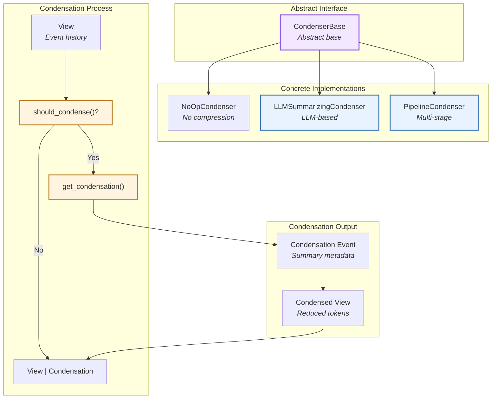

### Key Components

| Component | Purpose | Design |
|-----------|---------|--------|
| **[`CondenserBase`](https://github.com/OpenHands/software-agent-sdk/blob/main/openhands-sdk/openhands/sdk/context/condenser/base.py)** | Abstract interface | Defines `condense()` contract |
| **[`RollingCondenser`](https://github.com/OpenHands/software-agent-sdk/blob/main/openhands-sdk/openhands/sdk/context/condenser/base.py)** | Rolling window base | Implements threshold-based triggering |
| **[`LLMSummarizingCondenser`](https://github.com/OpenHands/software-agent-sdk/blob/main/openhands-sdk/openhands/sdk/context/condenser/llm_summarizing_condenser.py)** | LLM summarization | Uses LLM to generate summaries |
| **[`NoOpCondenser`](https://github.com/OpenHands/software-agent-sdk/blob/main/openhands-sdk/openhands/sdk/context/condenser/no_op_condenser.py)** | No-op implementation | Returns view unchanged |
| **[`PipelineCondenser`](https://github.com/OpenHands/software-agent-sdk/blob/main/openhands-sdk/openhands/sdk/context/condenser/pipeline_condenser.py)** | Multi-stage pipeline | Chains multiple condensers |
| **[`View`](https://github.com/OpenHands/software-agent-sdk/blob/main/openhands-sdk/openhands/sdk/context/view/view.py)** | Event view | Represents active-branch history for the LLM |
| **[`Condensation`](https://github.com/OpenHands/software-agent-sdk/blob/main/openhands-sdk/openhands/sdk/event/condenser.py)** | Condensation event | Metadata about compression |

## Condenser Types

### NoOpCondenser

Pass-through condenser that performs no compression:

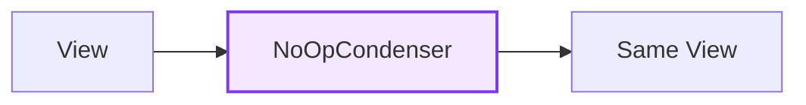

### LLMSummarizingCondenser

Uses an LLM to generate summaries of conversation history:

```mermaid
%%{init: {"theme": "default", "flowchart": {"nodeSpacing": 30, "rankSpacing": 40}} }%%
flowchart LR
    View["Long View"]
    Check["Threshold<br>exceeded?"]
    Summarize["LLM Summarization"]
    Summary["Summary Text"]
    Metadata["Condensation Event"]
    AddToHistory["Add to History"]
    NextStep["Next Step: View.from_events()"]
    NewView["Condensed View"]
    
    View --> Check
    Check -->|Yes| Summarize
    Summarize --> Summary
    Summary --> Metadata
    Metadata --> AddToHistory
    AddToHistory --> NextStep
    NextStep --> NewView
    
    style Check fill:#f3e8ff,stroke:#7c3aed,stroke-width:2px
    style Summarize fill:#e8f3ff,stroke:#2b6cb0,stroke-width:2px
    style NewView fill:#fff4df,stroke:#b7791f,stroke-width:2px
```

**Process:**
1. **Check Threshold:** Compare view size to configured limit (e.g., event count > `max_size`)
2. **Select Events:** Identify events to keep (first N + last M) and events to summarize (middle)
3. **LLM Call:** Generate summary of middle events using dedicated LLM
4. **Create Event:** Wrap summary in `Condensation` event with `forgotten_event_ids`
5. **Add to History:** Agent adds `Condensation` to event log and returns early
6. **Next Step:** `View.from_events()` filters forgotten events and inserts summary

**Configuration:**
- **`max_size`:** Event count threshold before condensation triggers (default: 240)
- **`keep_first`:** Number of initial events to preserve verbatim (default: 2)
- **`llm`:** LLM instance for summarization (often cheaper model than reasoning LLM)

### AgentResetCondenser (Development Branch)

<Note>
This optional strategy is documented against the
[`feat/issue-4916-agent-reset` development branch](https://github.com/cbinhan/software-agent-sdk/tree/feat/issue-4916-agent-reset).
See the [configuration and recovery guide](/sdk/guides/context-condenser#agent-requested-reset-development-branch)
for setup and release availability.
</Note>

`AgentResetCondenser` returns an unchanged view during ordinary steps. A successful
`new_context` tool call causes the harness to persist a `CondensationRequest` with
a `trigger_action_id` after the complete tool batch is committed. The condenser
then returns the existing `Condensation` event with `summary=None` and the real
triggering response ID. No extra model summary is generated for this path.

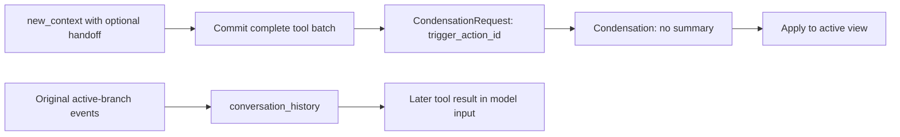

The successful `NewContextObservation` stores the input boundary captured by the
harness. The reset protects system events, user input after that boundary, and
the triggering response's complete tool batch. Missing boundaries preserve all
user input. `View.manipulation_indices` expands these protections to provider-safe
tool and thinking-loop blocks.

`View` derives the pending request and reminder state by replaying events. Applying
a condensation consumes the request; only a changed view re-enables a reminder.
The event log remains the source of truth across reopening and forking. History
retrieval reads the active branch, including events omitted from the view, rather
than searching every branch in the log.

The capacity fallback uses `LLMSummarizingCondenser.hard_context_reset()` on only
the removable blocks, preserves all system/user input, and remaps the summary
offset into the retained full view. Its bounded internal retries do not create an
unbounded agent retry loop: one generation attempt permits one outer rescue.
The guide describes failure conditions and explicit application condensation.

### PipelineCondenser

Chains multiple condensers in sequence:

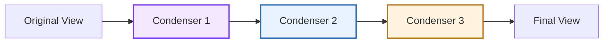

**Use Case:** Multi-stage compression (e.g., remove old events, then summarize, then truncate)

## Condensation Flow

### Trigger Mechanisms

Condensers can be triggered in two ways:

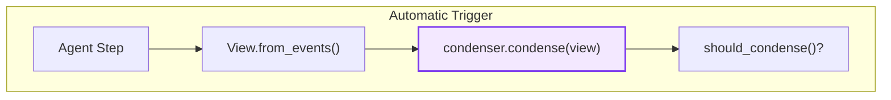

**Automatic Trigger:**
- **When:** Threshold exceeded (e.g., event count > `max_size`)
- **Who:** Agent calls `condenser.condense()` each step
- **Purpose:** Proactively keep context within limits

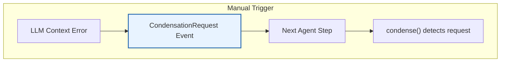
**Manual Trigger:**
- **When:** `CondensationRequest` event added to history (via `view.unhandled_condensation_request`)
- **Who:** Agent (on LLM context window error) or application code
- **Purpose:** Force compression when context limit exceeded

### Summarizing Condensation Workflow

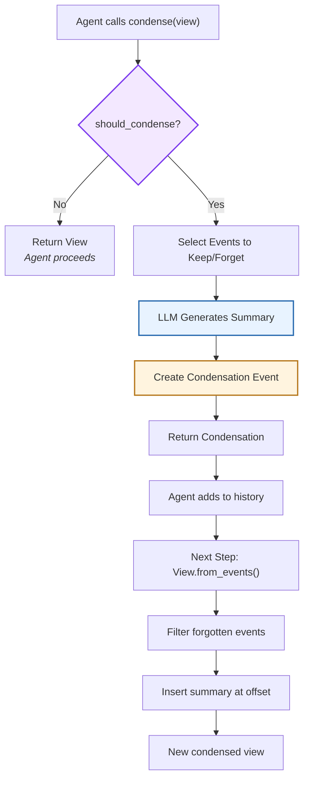

**Key Steps:**

1. **Threshold Check:** `should_condense()` determines if condensation needed
2. **Event Selection:** Identify events to keep (head + tail) vs forget (middle)
3. **Summary Generation:** LLM creates compressed representation of forgotten events
4. **Condensation Creation:** Create `Condensation` event with `forgotten_event_ids` and summary
5. **Return to Agent:** Condenser returns `Condensation` (not `View`)
6. **History Update:** Agent adds `Condensation` to event log and exits step
7. **Next Step:** `View.from_events()` ([source](https://github.com/OpenHands/software-agent-sdk/blob/main/openhands-sdk/openhands/sdk/context/view/view.py)) processes Condensation to filter events and insert summary

## View and Condensation

### View Structure

A `View` projects the selected active branch into the events used to build model
input. It is distinct from both the complete event log and the active branch:

```mermaid
%%{init: {"theme": "default", "flowchart": {"nodeSpacing": 30}} }%%
flowchart LR
    Events["Active Branch Events<br><i>+ Condensation events</i>"]
    FromEvents["View.from_events()"]
    Filter["Filter forgotten events"]
    Insert["Insert optional summary"]
    View["View<br><i>LLMConvertibleEvents</i>"]
    Convert["events_to_messages()"]
    LLM["LLM Input"]
    
    Events --> FromEvents
    FromEvents --> Filter
    Filter --> Insert
    Insert --> View
    View --> Convert
    Convert --> LLM
    
    style View fill:#f3e8ff,stroke:#7c3aed,stroke-width:2px
    style FromEvents fill:#e8f3ff,stroke:#2b6cb0,stroke-width:2px
```

**View Components:**
- **`events`:** List of `LLMConvertibleEvent` objects (filtered by Condensation)
- **`unhandled_condensation_request`:** Flag for pending manual condensation
- **Methods:** `from_events()` creates view from raw events, handling Condensation semantics

The development reset strategy also uses `pending_condensation_request` to retain
the request's action reference and `context_window_reminded` to avoid repeating
the same preparation reminder. Both are derived by replay, not a second history
store.

### Condensation Event

When condensation occurs, a `Condensation` event is created:

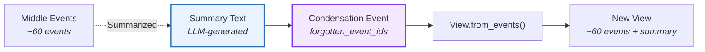

**Condensation Fields:**
- **`forgotten_event_ids`:** Set of event IDs to filter out of the view
- **`summary`:** Optional text representation of forgotten events
- **`summary_offset`:** Optional insertion index in the view after filtering
- **`llm_response_id`:** Real response ID that caused the condensation; for a normal agent reset, this is the response containing `new_context`
- Inherits from `Event`: `id`, `timestamp`, `source`

## Rolling Window Pattern

`RollingCondenser` implements a common pattern for threshold-based condensation:

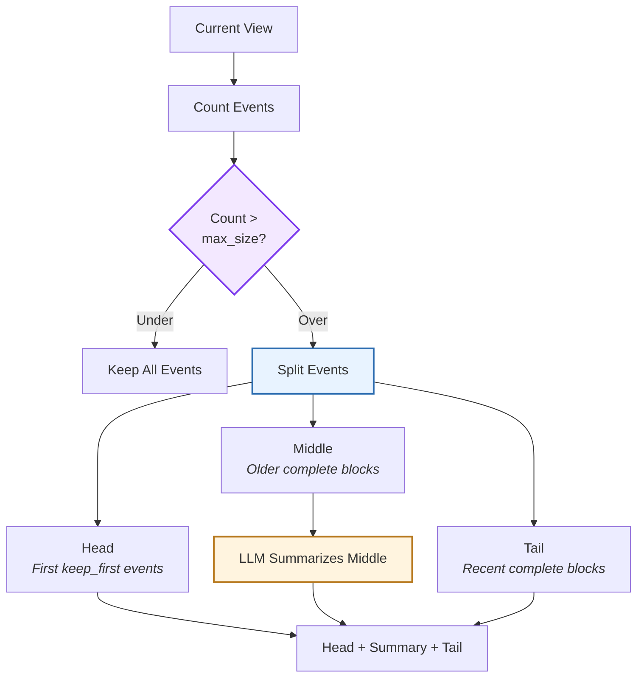

**Rolling Window Strategy:**
1. **Keep Head:** Preserve first `keep_first` events (default: 2) - usually system prompts
2. **Keep Tail:** Preserve last `target_size - keep_first - 1` events - recent context
3. **Summarize Middle:** Compress events between head and tail into summary
4. **Target Size:** Aim for `max_size // 2` events (default: 120), subject to safe manipulation boundaries

## Component Relationships

### How Condenser Integrates

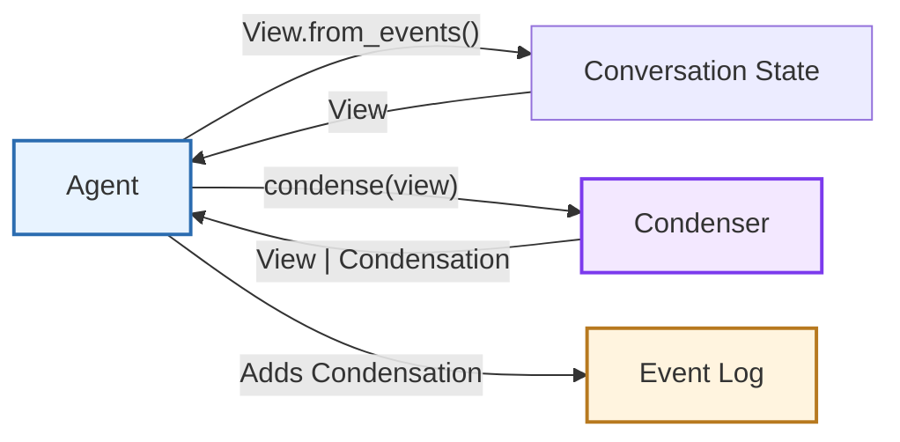

**Relationship Characteristics:**
- **Agent → State**: Calls `View.from_events()` to get current view
- **Agent → Condenser**: Calls `condense(view)` each step if condenser registered
- **Condenser → Agent**: Returns `View` (proceed) or `Condensation` (defer)
- **Agent → Events**: Adds `Condensation` event to log when returned

## See Also

- **[Agent Architecture](/sdk/arch/agent)** - How agents use condensers during reasoning
- **[Conversation Architecture](/sdk/arch/conversation)** - View generation and event management
- **[Events](/sdk/arch/events)** - Condensation event type and append-only log
- **[Context Condenser Guide](/sdk/guides/context-condenser)** - Configuring and using condensers
