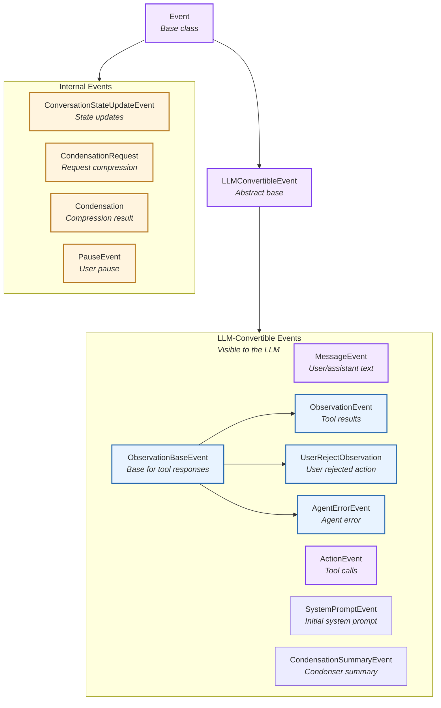
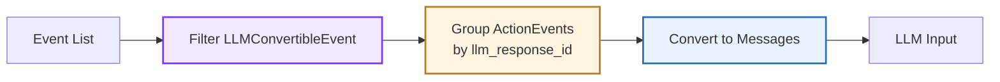
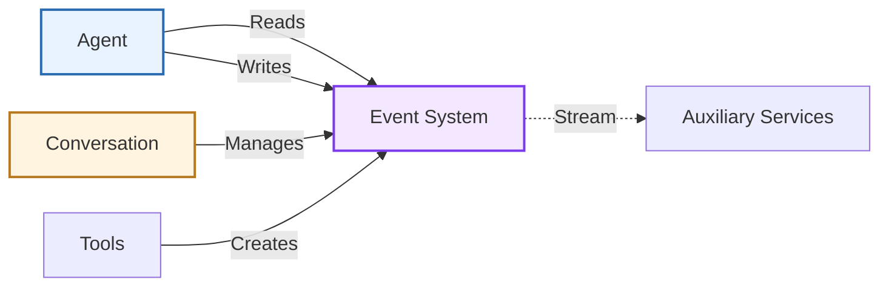
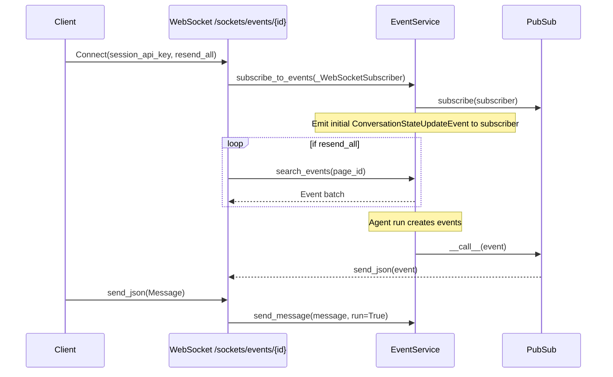

The **Event System** provides an immutable, type-safe event framework that drives agent execution and state management. Events form an append-only log that serves as both the agent's memory and the integration point for auxiliary services.

**Source:** [`openhands-sdk/openhands/sdk/event/`](https://github.com/OpenHands/software-agent-sdk/tree/main/openhands-sdk/openhands/sdk/event)

## Core Responsibilities

The Event System has four primary responsibilities:

1. **Type Safety** - Enforce event schemas through Pydantic models
2. **LLM Integration** - Convert events to/from LLM message formats
3. **Append-Only Log** - Maintain immutable event history
4. **Service Integration** - Enable observers to react to event streams

## Architecture



### Key Components

| Component | Purpose | Design |
|-----------|---------|--------|
| **[`Event`](https://github.com/OpenHands/software-agent-sdk/blob/main/openhands-sdk/openhands/sdk/event/base.py)** | Base event class | Immutable Pydantic model with ID, timestamp, source |
| **[`LLMConvertibleEvent`](https://github.com/OpenHands/software-agent-sdk/blob/main/openhands-sdk/openhands/sdk/event/base.py)** | LLM-compatible events | Abstract class with `to_llm_message()` method |
| **[`MessageEvent`](https://github.com/OpenHands/software-agent-sdk/blob/main/openhands-sdk/openhands/sdk/event/llm_convertible/message.py)** | Text messages | User or assistant conversational messages with skills |
| **[`ActionEvent`](https://github.com/OpenHands/software-agent-sdk/blob/main/openhands-sdk/openhands/sdk/event/llm_convertible/action.py)** | Tool calls | Agent tool invocations with thought, reasoning, security risk |
| **[`ObservationBaseEvent`](https://github.com/OpenHands/software-agent-sdk/blob/main/openhands-sdk/openhands/sdk/event/llm_convertible/observation.py)** | Tool response base | Base for all tool call responses |
| **[`ObservationEvent`](https://github.com/OpenHands/software-agent-sdk/blob/main/openhands-sdk/openhands/sdk/event/llm_convertible/observation.py)** | Tool results | Successful tool execution outcomes |
| **[`UserRejectObservation`](https://github.com/OpenHands/software-agent-sdk/blob/main/openhands-sdk/openhands/sdk/event/llm_convertible/observation.py)** | User rejection | User rejected action in confirmation mode |
| **[`AgentErrorEvent`](https://github.com/OpenHands/software-agent-sdk/blob/main/openhands-sdk/openhands/sdk/event/llm_convertible/observation.py)** | Agent errors | Errors from agent/scaffold (not model output) |
| **[`SystemPromptEvent`](https://github.com/OpenHands/software-agent-sdk/blob/main/openhands-sdk/openhands/sdk/event/llm_convertible/system.py)** | System context | System prompt with tool schemas |
| **[`CondensationSummaryEvent`](https://github.com/OpenHands/software-agent-sdk/blob/main/openhands-sdk/openhands/sdk/event/condenser.py)** | Condenser summary | LLM-convertible summary of forgotten events |
| **[`ConversationStateUpdateEvent`](https://github.com/OpenHands/software-agent-sdk/blob/main/openhands-sdk/openhands/sdk/event/conversation_state.py)** | State updates | Key-value conversation state changes |
| **[`Condensation`](https://github.com/OpenHands/software-agent-sdk/blob/main/openhands-sdk/openhands/sdk/event/condenser.py)** | Condensation result | Events being forgotten with optional summary |
| **[`CondensationRequest`](https://github.com/OpenHands/software-agent-sdk/blob/main/openhands-sdk/openhands/sdk/event/condenser.py)** | Request compression | Trigger for conversation history compression |
| **[`PauseEvent`](https://github.com/OpenHands/software-agent-sdk/blob/main/openhands-sdk/openhands/sdk/event/user_action.py)** | User pause | User requested pause of agent execution |

## Event Types

### LLM-Convertible Events

Events that participate in agent reasoning and can be converted to LLM messages:


| Event Type | Source | Content | LLM Role |
|------------|--------|---------|----------|
| **MessageEvent (user)** | user | Text, images | `user` |
| **MessageEvent (agent)** | agent | Text reasoning, skills | `assistant` |
| **ActionEvent** | agent | Tool call with thought, reasoning, security risk | `assistant` with `tool_calls` |
| **ObservationEvent** | environment | Tool execution result | `tool` |
| **UserRejectObservation** | environment | Rejection reason | `tool` |
| **AgentErrorEvent** | agent | Error details | `tool` |
| **SystemPromptEvent** | agent | System prompt with tool schemas | `system` |
| **CondensationSummaryEvent** | environment | Summary of forgotten events | `user` |

The event system bridges agent events to LLM messages:



**Special Handling - Parallel Function Calling:**

When multiple `ActionEvent`s share the same `llm_response_id` (parallel function calling):
1. Group all ActionEvents by `llm_response_id`
2. Combine into single Message with multiple `tool_calls`
3. Only first event's `thought`, `reasoning_content`, and `thinking_blocks` are included
4. All subsequent events in the batch have empty thought fields

**Example:**
```
ActionEvent(llm_response_id="abc123", thought="Let me check...", tool_call=tool1)
ActionEvent(llm_response_id="abc123", thought=[], tool_call=tool2)
→ Combined into single Message(role="assistant", content="Let me check...", tool_calls=[tool1, tool2])
```


### Internal Events

Events for metadata, control flow, and user actions (not sent to LLM):

| Event Type | Source | Purpose | Key Fields |
|------------|--------|---------|------------|
| **ConversationStateUpdateEvent** | environment | State synchronization | `key` (field name), `value` (serialized data) |
| **CondensationRequest** | environment | Trigger history compression | Signal to condenser when context window exceeded |
| **Condensation** | environment | Compression result | `forgotten_event_ids`, `summary`, `summary_offset` |
| **PauseEvent** | user | User pause action | Indicates agent execution was paused by user |

**Source Types:**
- **user**: Event originated from user input
- **agent**: Event generated by agent logic
- **environment**: Event from system/framework/tools

## Component Relationships

### How Events Integrate



**Relationship Characteristics:**
- **Agent → Events**: Reads history for context, writes actions/messages
- **Conversation → Events**: Owns and persists event log
- **Tools → Events**: Create ObservationEvents after execution
- **Services → Events**: Read-only observers for monitoring, visualization

## Error Events: Agent vs Conversation

Two distinct error events exist in the SDK, with different purpose and visibility:

- AgentErrorEvent
  - Type: ObservationBaseEvent (LLM-convertible)
  - Scope: Error for a specific tool call (has tool_name and tool_call_id)
  - Source: "agent"
  - LLM visibility: Sent as a tool message so the model can react/recover
  - Effect: Conversation continues; not a terminal state
  - Code: https://github.com/OpenHands/software-agent-sdk/blob/main/openhands-sdk/openhands/sdk/event/llm_convertible/observation.py

- ConversationErrorEvent
  - Type: Event (not LLM-convertible)
  - Scope: Conversation-level runtime failure (no tool_name/tool_call_id)
  - Source: typically "environment"
  - LLM visibility: Not sent to the model
  - Effect: Run loop transitions to ERROR and run() raises ConversationRunError; surface top-level error to client applications
  - Code: https://github.com/OpenHands/software-agent-sdk/blob/main/openhands-sdk/openhands/sdk/event/conversation_error.py

## Event Stream Subscription Mechanism

This section documents how clients subscribe to the event stream, how events are emitted, and a practical example of intercepting a headless run to inject instructions.

### Subscription Model
- The server maintains an in-process publish/subscribe registry per conversation. Subscribers implement an async callable interface and receive events pushed by the server (source: openhands-agent-server/openhands/agent_server/pub_sub.py — Subscriber.__call__, PubSub.subscribe, PubSub.__call__).
- When a new subscriber registers, the service emits an initial ConversationStateUpdateEvent snapshot so clients have current state immediately (source: openhands-agent-server/openhands/agent_server/event_service.py — subscribe_to_events()).
- Event emission is thread-safe: server code schedules emission on the main loop, acquiring the conversation lock to persist and publish (source: openhands-agent-server/openhands/agent_server/event_service.py — _emit_event_from_thread()).

### WebSocket Endpoint
- Path: /sockets/events/{conversation_id}
- Auth: session_api_key query parameter is checked against server config (source: openhands-agent-server/openhands/agent_server/sockets.py — events_socket()).
- Behavior:
  - On connect, subscribes the socket to the conversation’s PubSub
  - Optional resend_all=true replays historical events via paginated search (source: openhands-agent-server/openhands/agent_server/sockets.py — resend_all loop; event_service.search_events())
  - Incoming messages over the socket are validated as Message and routed to the conversation; if run=True, the run loop is triggered (source: openhands-agent-server/openhands/agent_server/sockets.py — Message.model_validate + event_service.send_message())



### HTTP Event APIs
- Search: GET /conversations/{conversation_id}/events/search with filters and pagination (source: openhands-agent-server/openhands/agent_server/event_router.py — search_conversation_events()).
- Count: GET /conversations/{conversation_id}/events/count (source: openhands-agent-server/openhands/agent_server/event_router.py — count_conversation_events()).
- Fetch one: GET /conversations/{conversation_id}/events/{event_id} (source: openhands-agent-server/openhands/agent_server/event_router.py — get_conversation_event()).
- Batch fetch: GET /conversations/{conversation_id}/events?event_ids=... (source: openhands-agent-server/openhands/agent_server/event_router.py — batch_get_conversation_events()).
- Inject message: POST /conversations/{conversation_id}/events with SendMessageRequest to add Message and optionally trigger a run (source: openhands-agent-server/openhands/agent_server/event_router.py — send_message()).

### Real-world example: Intercept and steer a headless run
- Subscribe to /sockets/events/{conversation_id} with resend_all=false to stream live events (source: openhands-agent-server/openhands/agent_server/sockets.py — events_socket()).
- Watch for ActionEvent and ObservationEvent to monitor progress; ConversationStateUpdateEvent provides status and stats (source: openhands-sdk/openhands/sdk/event/llm_convertible/observation.py; openhands-sdk/openhands/sdk/event/conversation_state.py).
- When a risky operation appears, send a Message via POST /conversations/{id}/events with instructions (e.g., “use a safer command”) and set run=true to resume (source: openhands-agent-server/openhands/agent_server/event_router.py — send_message()).

---
Last updated: 2025-12-09 UTC
Source commits: software-agent-sdk@93d405c, OpenHands@9b57a0b

## See Also

- **[Agent Architecture](/sdk/arch/agent)** - How agents read and write events
- **[Conversation Architecture](/sdk/arch/conversation)** - Event log management
- **[Tool System](/sdk/arch/tool-system)** - ActionEvent and ObservationEvent generation
- **[Condenser](/sdk/arch/condenser)** - Event history compression
