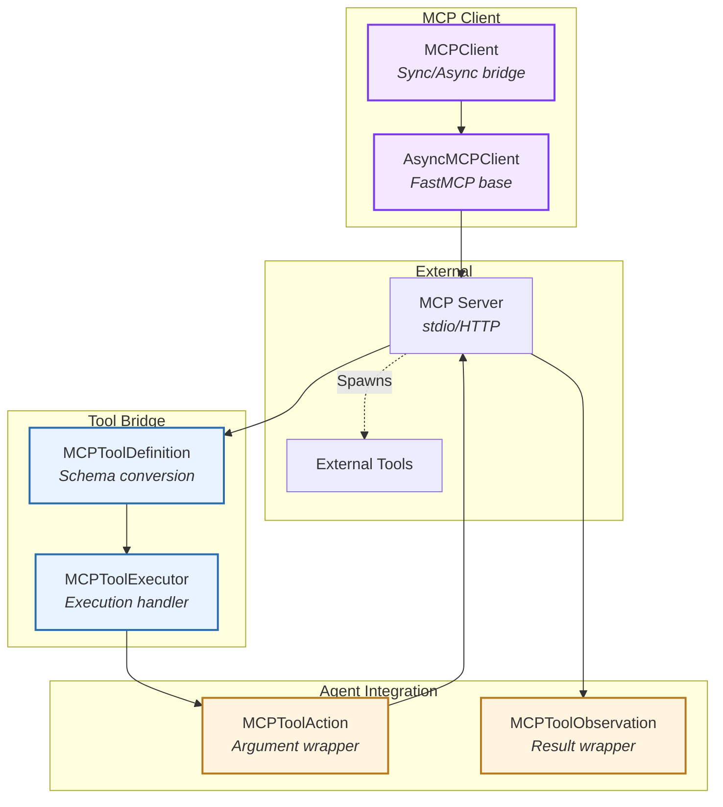
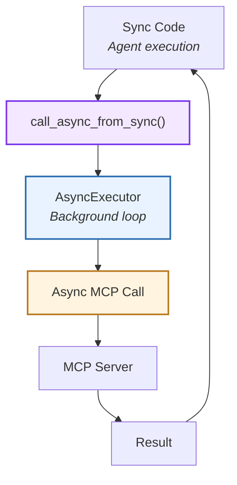
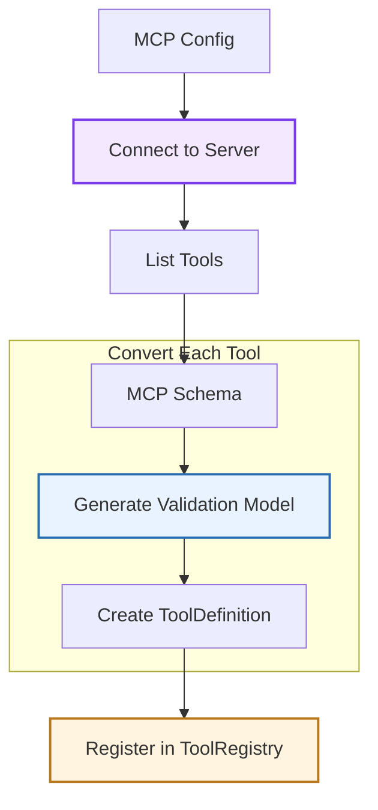
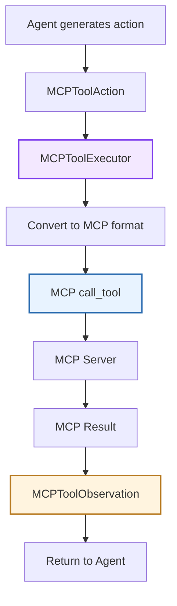
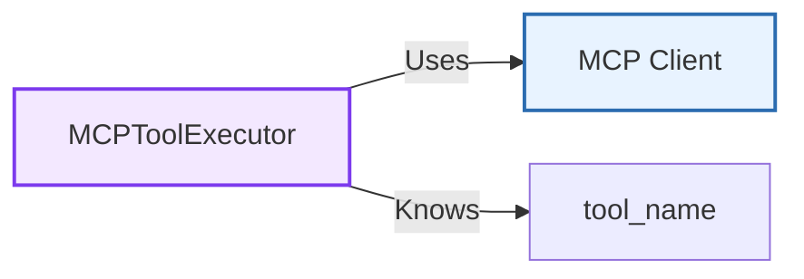
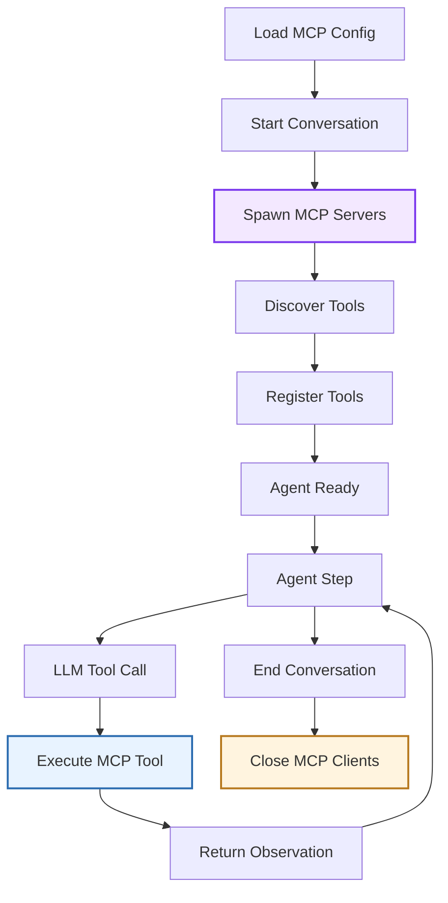
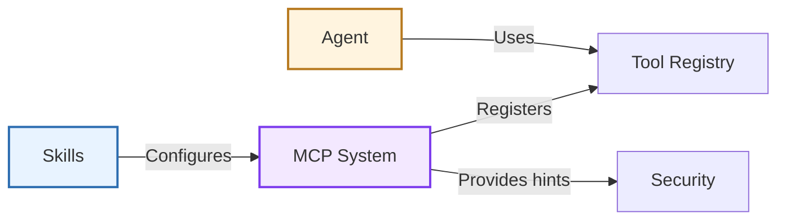

The **MCP Integration** system enables agents to use external tools via the Model Context Protocol (MCP). It provides a bridge between MCP servers and the Software Agent SDK's tool system, supporting both synchronous and asynchronous execution.

**Source:** [`openhands/sdk/mcp/`](https://github.com/OpenHands/software-agent-sdk/tree/main/openhands-sdk/openhands/sdk/mcp)

## Core Responsibilities

The MCP Integration system has four primary responsibilities:

1. **MCP Client Management** - Connect to and communicate with MCP servers
2. **Tool Discovery** - Enumerate available tools from MCP servers
3. **Schema Adaptation** - Convert MCP tool schemas to SDK tool definitions
4. **Execution Bridge** - Execute MCP tool calls from agent actions

## Architecture



### Key Components

| Component | Purpose | Design |
|-----------|---------|--------|
| **[`MCPClient`](https://github.com/OpenHands/software-agent-sdk/blob/main/openhands-sdk/openhands/sdk/mcp/client.py)** | Client wrapper | Extends FastMCP with sync/async bridge |
| **[`MCPToolDefinition`](https://github.com/OpenHands/software-agent-sdk/blob/main/openhands-sdk/openhands/sdk/mcp/tool.py)** | Tool metadata | Converts MCP schemas to SDK format |
| **[`MCPToolExecutor`](https://github.com/OpenHands/software-agent-sdk/blob/main/openhands-sdk/openhands/sdk/mcp/tool.py)** | Execution handler | Bridges agent actions to MCP calls |
| **[`MCPToolAction`](https://github.com/OpenHands/software-agent-sdk/blob/main/openhands-sdk/openhands/sdk/mcp/definition.py)** | Action wrapper | Stores validated arguments in `data` |
| **[`MCPToolObservation`](https://github.com/OpenHands/software-agent-sdk/blob/main/openhands-sdk/openhands/sdk/mcp/definition.py)** | Result wrapper | Wraps MCP tool results |

## MCP Client

### Sync/Async Bridge

The SDK's `MCPClient` extends FastMCP's async client with synchronous wrappers:



**Bridge Pattern:**
- **Problem:** MCP protocol is async, but agent tools run synchronously
- **Solution:** Background event loop that executes async code from sync contexts
- **Benefit:** Agents use MCP tools without async/await in tool definitions

**Client Features:**
- **Lifecycle Management:** `__enter__`/`__exit__` for context manager
- **Timeout Support:** Configurable timeouts for MCP operations
- **Error Handling:** Wraps MCP errors in observations
- **Connection Reuse:** Tools share their connected MCP client

### MCP Server Configuration

MCP servers are configured using the FastMCP format:

```python
mcp_config = {
    "mcpServers": {
        "fetch": {
            "command": "uvx",
            "args": ["mcp-server-fetch"]
        },
        "filesystem": {
            "command": "npx",
            "args": ["-y", "@modelcontextprotocol/server-filesystem", "/path"]
        }
    }
}
```

**Configuration Fields:**
- **command:** Executable to spawn (e.g., `uvx`, `npx`, `node`)
- **args:** Arguments to pass to command
- **env:** Environment variables (optional)

## Tool Discovery and Conversion

### Discovery Flow



**Discovery Steps:**

1. **Connect:** Launch a stdio server or connect to a configured HTTP server
2. **List Tools:** Call `tools/list` MCP endpoint
3. **Parse Schemas:** Extract tool names, descriptions, parameters
4. **Generate Models:** Create Pydantic models from input schemas for argument validation
5. **Create Definitions:** Wrap in `ToolDefinition` objects
6. **Register:** Add to agent's tool registry

### Schema Conversion

`MCPToolDefinition` keeps the original MCP tool metadata and input schema. The
LLM-facing schema is built from that input schema, preserving nested properties.
A separate Pydantic model derived from `Schema` validates the arguments.

`MCPToolAction` is a wrapper with a `data` dictionary. Its fields do not change for
each discovered tool. `action_from_arguments()` validates the arguments, removes
null values and internal fields, and stores the sanitized result in `data`.
The definition validates `action.data` again before execution.

For a discovered `fetch_url` tool whose input schema accepts a string `url` and a
numeric `timeout`, argument conversion looks like this:

```python
from openhands.sdk.mcp.tool import MCPToolDefinition


def prepare_fetch(tool_definition: MCPToolDefinition):
    action = tool_definition.action_from_arguments(
        {"url": "https://example.com", "timeout": 10}
    )
    # action.data holds the validated arguments.
    # The executor forwards these arguments to the MCP server.
    return action.to_mcp_arguments()
```

See [`MCPToolDefinition`](https://github.com/OpenHands/software-agent-sdk/blob/main/openhands-sdk/openhands/sdk/mcp/tool.py)
for schema generation and argument validation.

## Tool Execution

### Execution Flow



**Execution Steps:**

1. **Action Creation:** LLM generates tool call, parsed into `MCPToolAction`
2. **Executor Lookup:** Find `MCPToolExecutor` for tool name
3. **Format Conversion:** Read the argument dictionary using `action.to_mcp_arguments()`
4. **MCP Call:** Execute `call_tool` via MCP client
5. **Result Parsing:** Convert text and image blocks; log and skip unsupported blocks, including resources
6. **Observation Creation:** Wrap in `MCPToolObservation`
7. **Error Handling:** Catch exceptions, return error observations

### MCPToolExecutor

Executors bridge SDK actions to MCP calls:



**Executor Responsibilities:**
- **Client Management:** Hold reference to MCP client
- **Tool Identification:** Know which MCP tool to call
- **Argument Conversion:** Forward the action’s `data` dictionary as MCP arguments
- **Result Handling:** Parse MCP responses
- **Error Recovery:** Handle connection errors, timeouts, server failures

## MCP Tool Lifecycle

### From Configuration to Execution



**Lifecycle Phases:**

| Phase | Operations | Components |
|-------|-----------|------------|
| **Initialization** | Spawn servers, discover tools | MCPClient, ToolRegistry |
| **Registration** | Create definitions, executors | MCPToolDefinition, MCPToolExecutor |
| **Execution** | Handle tool calls | Agent, MCPToolAction |
| **Cleanup** | Close connections, shutdown servers | MCPClient.sync_close() |

## MCP Annotations

MCP tool annotations are copied into the SDK's `ToolAnnotations` model:

| Annotation | Meaning |
|------------|---------|
| **title** | Human-readable tool title |
| **readOnlyHint** | Tool reports that it does not modify its environment |
| **destructiveHint** | Tool may perform destructive updates |
| **idempotentHint** | Repeated calls with the same arguments have no additional effect |
| **openWorldHint** | Tool may interact with external entities |

When `readOnlyHint` is true, the MCP schema adapter omits the additional
`security_risk` prediction field from the LLM-facing schema. These annotations
are hints, not enforcement guarantees. `destructiveHint` does not by itself
require confirmation: confirmation depends on the configured security analyzer
and confirmation policy. See [Security](/sdk/arch/security).

The SDK's `ToolAnnotations` model does not define `progressEnabled`.

## Component Relationships

### How MCP Integrates



**Relationship Characteristics:**
- **Skills → MCP**: Repository skills can embed MCP configurations
- **MCP → Tools**: MCP tools registered alongside native tools
- **Agent → Tools**: Agents use MCP tools like any other tool
- **MCP → Security**: Read-only hints affect risk-prediction schema generation; the configured policy governs confirmation
- **Transparent Integration**: Agent doesn't distinguish MCP from native tools

## Design Rationale

**Async Bridge Pattern:** MCP protocol requires async, but synchronous tool execution simplifies agent implementation. Background event loop bridges the gap without exposing async complexity to tool users.

**Dynamic Model Generation:** Creating Pydantic models at runtime from MCP schemas enables type-safe tool calls without manual model definitions. This supports arbitrary MCP servers without SDK code changes.

**Unified Tool Interface:** Wrapping MCP tools in `ToolDefinition` makes them indistinguishable from native tools. Agents use the same interface regardless of tool source.

**FastMCP Foundation:** Building on FastMCP (MCP SDK for Python) provides battle-tested client implementation, protocol compliance, and ongoing updates as MCP evolves.

**Annotation Support:** MCP hints are preserved as tool metadata. Read-only hints affect risk-prediction schema generation, while confirmation is controlled by the configured policy.

**Lifecycle Management:** Automatic spawn/cleanup of MCP servers in conversation lifecycle ensures resources are properly managed without manual bookkeeping.

## See Also

- **[Tool System](/sdk/arch/tool-system)** - How MCP tools integrate with tool framework
- **[Skill Architecture](/sdk/arch/skill)** - Embedding MCP configs in repository skills
- **[Security](/sdk/arch/security)** - How MCP annotations inform risk assessment
- **[MCP Guide](/sdk/guides/mcp)** - Using MCP tools in applications
- **[FastMCP Documentation](https://gofastmcp.com/)** - Underlying MCP client library
