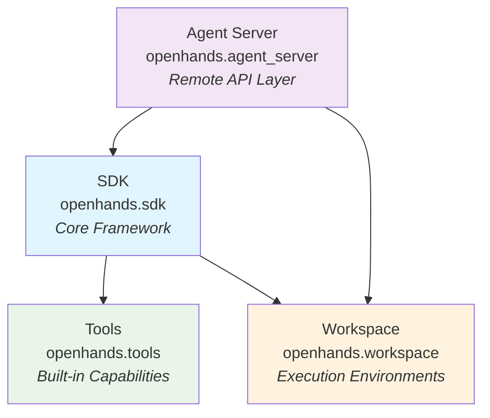

The **OpenHands Agent SDK** provides a unified, type-safe framework for building and deploying AI agents—from local experiments to full production systems, focused on **statelessness**, **composability**, and **clear boundaries** between research and deployment.

<Info>
**Context:** The **OpenHands Agent SDK** is part of the [OpenHands V1](https://openhands.dev/blog/the-path-to-openhands-v1) effort — a complete architectural rework based on lessons from **OpenHands V0**, one of the most widely adopted open-source coding agents.
[Over the last eighteen months](https://openhands.dev/blog/one-year-of-openhands-a-journey-of-open-source-ai-development), OpenHands V0 evolved from a scrappy prototype into a widely used open-source coding agent. The project grew to tens of thousands of GitHub stars, hundreds of contributors, and multiple production deployments. That growth exposed architectural tensions — tight coupling between research and production, mandatory sandboxing, mutable state, and configuration sprawl — which informed the design principles of agent-sdk in V1.
</Info>

## Design Principles

### Optional Isolation over Mandatory Sandboxing

<Info>
**V0 Challenge:**  
Every tool call in V0 executed in a sandboxed Docker container by default. While this guaranteed reproducibility and security, it also created friction — the agent and sandbox ran as separate processes, states diverged easily, and multi-tenant workloads could crash each other.  
Moreover, with the rise of the Model Context Protocol (MCP), which assumes local execution and direct access to user environments, V0’s rigid isolation model became incompatible.
</Info>

**V1 Principle:**  
**Sandboxing should be opt-in, not universal.**  
V1 unifies agent and tool execution within a single process by default, aligning with MCP’s local-execution model.  
When isolation is needed, the same stack can be transparently containerized, maintaining flexibility without complexity.

### Stateless by Default, One Source of Truth for State

<Info>
**V0 Challenge:**  
V0 relied on mutable Python objects and dynamic typing, which led to silent inconsistencies — failed session restores, version drift, and non-deterministic behavior. Each subsystem tracked its own transient state, making debugging and recovery painful.
</Info>

**V1 Principle:**  
**Keep everything stateless, with exactly one mutable state.**  
All components (agents, tools, LLMs, and configurations) are immutable Pydantic models validated at construction.  
The only mutable entity is the [conversation state](https://github.com/All-Hands-AI/agent-sdk/blob/main/openhands-sdk/openhands/sdk/event/conversation_state.py), a single source of truth that enables deterministic replay and robust persistence across sessions or distributed systems.

### Clear Boundaries between Agent and Applications

<Info>
**V0 Challenge:**  
The same codebase powered the CLI, web interface, and integrations (e.g., Github, Gitlab, etc). Over time, application-specific conditionals and prompts polluted the agent core, making it brittle.  
Heavy research dependencies and benchmark integrations further bloated production builds.
</Info>

**V1 Principle:**  
**Maintain strict separation of concerns.**  
V1 divides the system into stable, isolated layers: the [SDK (agent core)](/sdk/arch/overview#1-sdk-%E2%80%93-openhands-sdk), [tools (set of tools)](/sdk/arch/overview#2-tools-%E2%80%93-openhands-tools), [workspace (sandbox)](/sdk/arch/overview#3-workspace-%E2%80%93-openhands-workspace), and [agent server (server that runs inside sandbox)](/sdk/arch/overview#4-agent-server-%E2%80%93-openhands-agent-server).  
Applications communicate with the agent via APIs rather than embedding it directly, ensuring research and production can evolve independently.

### Composable Components for Extensibility

<Info>
**V0 Challenge:**  
Because agent logic was hard-coded into the core application, extending behavior (e.g., adding new tools or entry points) required branching logic for different entrypoints. This rigidity limited experimentation and discouraged contributions.
</Info>

**V1 Principle:**  
**Everything should be composable and safe to extend.**  
Agents are defined as graphs of interchangeable components—tools, prompts, LLMs, and contexts—each described declaratively with strong typing.  
Developers can reconfigure capabilities (e.g., swap toolsets, override prompts, add delegation logic) without modifying core code, preserving stability while fostering rapid innovation.

## Package Overview

### SDK – `openhands.sdk`
The core reasoning and execution framework.  
Includes conversation management, LLM integration, tool system, workspace abstraction, and event streaming.

**Use when:** Embedding agents directly in Python apps or building custom behaviors programmatically.

### Tools – `openhands.tools`
Production-ready, typed tools implementing the Action/Observation interface.

Examples:  
File editors, search utilities, task management, and web interaction tools.

**Use when:** You need common capabilities out-of-the-box or want to define new tools declaratively.

### Workspace – `openhands.workspace`
Defines where code executes:
- `LocalWorkspace` – No isolation  
- `DockerWorkspace` – Sandboxed execution  
- `RemoteAPIWorkspace` – Distributed via REST

**Use when:** You need isolation, resource control, or remote environments.

### Agent Server – `openhands.agent_server`
A REST+WebSocket server for remote agent execution and workspace orchestration.

**Use when:** Building multi-user, hosted, or SaaS-style agent platforms.

## Execution Models

### Local (Standalone)
The SDK runs entirely in your process—ideal for development or embedding in apps.

**Flow:**
1. User message → Conversation  
2. Agent → LLM → Tool → Workspace  
3. Observation → Response

### Remote (Agent Server)
Agents run inside isolated containers managed by the Agent Server.  
Clients interact via a `RemoteConversation` proxy using the same Python API.

**Why:** Enables scalable, multi-tenant deployments without changing client code.

---

## Choosing the Right Mode

| Use Case | Recommended Setup |
|-----------|------------------|
| Local dev, automation scripts | Standalone SDK |
| Web apps, hosted agents, SaaS | Agent Server |
| Hybrid (local control + remote exec) | SDK + `RemoteAPIWorkspace` |

---

## Next Steps
- [Getting Started](/sdk/getting-started) – Build your first agent  
- [Custom Tools](/sdk/guides/custom-tools) – Add new capabilities  
- [MCP Integration](/sdk/guides/mcp) – Connect external tool servers  
- [Remote Server](/sdk/guides/agent-server/overview) – Host agents remotely  

For in-depth details, explore:
- [`openhands/sdk/`](https://github.com/All-Hands-AI/agent-sdk/tree/main/openhands/sdk)  
- [`openhands/tools/`](https://github.com/All-Hands-AI/agent-sdk/tree/main/openhands/tools)  
- [`openhands/workspace/`](https://github.com/All-Hands-AI/agent-sdk/tree/main/openhands/workspace)  
- [`openhands/agent_server/`](https://github.com/All-Hands-AI/agent-sdk/tree/main/openhands/agent_server)  
