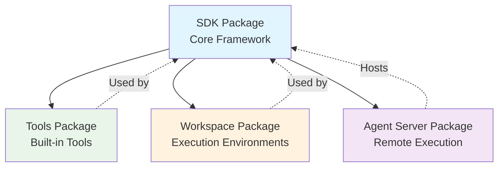
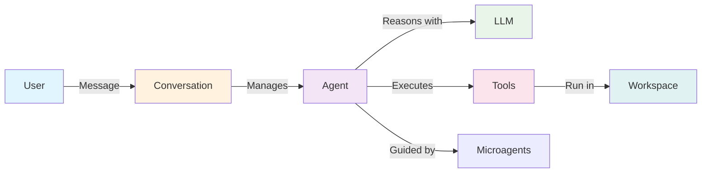

The OpenHands Agent SDK is organized into four packages, each serving a distinct purpose in the agent development lifecycle.

## Package Structure

## 1. SDK Package

Core framework for building agents locally.

**Key Components:**
- **[Tool System](/sdk/architecture/sdk/tool)** - Define custom capabilities
- **[Microagents](/sdk/architecture/sdk/microagents)** - Specialized behavior modules
- **[Condenser](/sdk/architecture/sdk/condenser)** - Memory management
- **[Agent](/sdk/architecture/sdk/agent)** - Base agent interface
- **[Workspace](/sdk/architecture/sdk/workspace)** - Execution abstraction
- **[Conversation](/sdk/architecture/sdk/conversation)** - Lifecycle management
- **[Event](/sdk/architecture/sdk/event)** - Event system
- **[LLM](/sdk/architecture/sdk/llm)** - Language model integration
- **[MCP](/sdk/architecture/sdk/mcp)** - Model Context Protocol
- **[Security](/sdk/architecture/sdk/security)** - Security framework

## 2. Tools Package

Production-ready tool implementations.

**Available Tools:**
- **[BashTool](/sdk/architecture/tools/bash)** - Command execution
- **[FileEditorTool](/sdk/architecture/tools/file_editor)** - File manipulation
- **[GlobTool](/sdk/architecture/tools/glob)** - File discovery
- **[GrepTool](/sdk/architecture/tools/grep)** - Content search
- **[TaskTrackerTool](/sdk/architecture/tools/task_tracker)** - Task management
- **[PlanningFileEditorTool](/sdk/architecture/tools/planning_file_editor)** - Multi-file workflows
- **[BrowserUseTool](/sdk/architecture/tools/browser_use)** - Web interaction

## 3. Workspace Package

Advanced execution environments for production.

**Workspace Types:**
- **[DockerWorkspace](/sdk/architecture/workspace/docker)** - Container-based isolation
- **[RemoteAPIWorkspace](/sdk/architecture/workspace/remote_api)** - Remote server execution

See [Workspace Overview](/sdk/architecture/workspace/overview) for comparison.

## 4. Agent Server Package

HTTP server for centralized agent execution.

**Capabilities:**
- Remote agent execution via API
- Multi-user isolation
- Container management
- Resource allocation

See [Agent Server Documentation](/sdk/architecture/agent_server/overview).

## Component Interaction

## Design Principles

### Immutability & Serialization
All core classes are:
- **Immutable**: State changes create new instances
- **Serializable**: Full conversation state can be saved/restored
- **Type-safe**: Pydantic models ensure data integrity

### Modularity
- **Composable**: Mix and match components as needed
- **Extensible**: Add custom tools, LLMs, or workspaces
- **Testable**: Each component can be tested in isolation

### Backward Compatibility
- **Semantic versioning** indicates compatibility levels
- **Migration guides** provided for major changes

## Getting Started

New to the SDK? Start with the guides:

- **[Getting Started](/sdk/guides/getting-started)** - Quick introduction
- **[Streaming Mode](/sdk/guides/streaming-mode)** - Execution patterns
- **[Tools & MCP](/sdk/guides/tools-and-mcp)** - Extending capabilities
- **[Workspaces](/sdk/guides/workspaces)** - Execution environments
- **[Sub-agents](/sdk/guides/subagents)** - Agent delegation

## Deep Dive

Explore individual components:

- **SDK Package** - [Tool](/sdk/architecture/sdk/tool) | [Agent](/sdk/architecture/sdk/agent) | [LLM](/sdk/architecture/sdk/llm) | [Conversation](/sdk/architecture/sdk/conversation)
- **Tools Package** - [BashTool](/sdk/architecture/tools/bash) | [FileEditorTool](/sdk/architecture/tools/file_editor)
- **Workspace Package** - [DockerWorkspace](/sdk/architecture/workspace/docker) | [RemoteAPIWorkspace](/sdk/architecture/workspace/remote_api)
- **Agent Server** - [Overview](/sdk/architecture/agent_server/overview)

## Examples

Browse the [`examples/`](https://github.com/All-Hands-AI/agent-sdk/tree/main/examples) directory for practical implementations:

- **Hello World** - Basic agent usage
- **Custom Tools** - Creating new capabilities
- **Docker Workspace** - Sandboxed execution
- **MCP Integration** - External tool servers
- **Planning Agent** - Multi-step workflows
