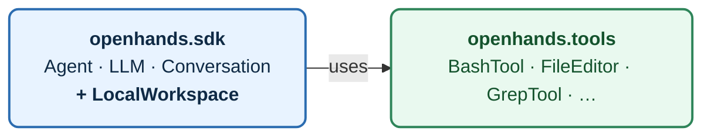
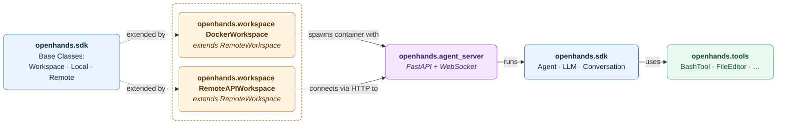
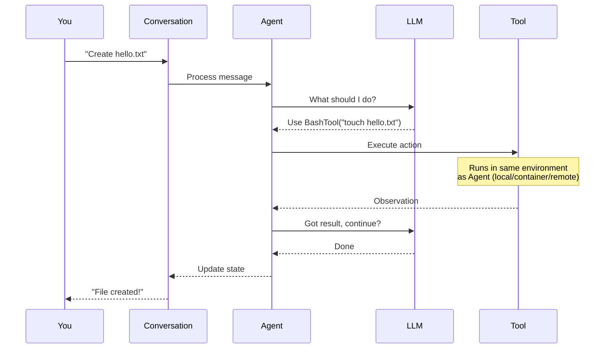
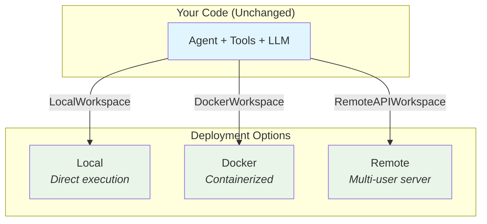

The **OpenHands Agent SDK** provides a unified, type-safe framework for building and deploying AI agents—from local experiments to full production systems, focused on **statelessness**, **composability**, and **clear boundaries** between research and deployment.

Check [this document](/sdk/arch/design) for the core design principles that guided its architecture.


## Four-Package Architecture

The agent-sdk is organized into four distinct Python packages:

| Package | What It Does | When You Need It |
|---------|-------------|------------------|
| **openhands.sdk** | Core agent framework + base workspace classes | Always (required) |
| **openhands.tools** | Pre-built tools (bash, file editing, etc.) | Optional - provides common tools |
| **openhands.workspace** | Extended workspace implementations (Docker, remote) | Optional - extends SDK's base classes |
| **openhands.agent_server** | Multi-user API server | Optional - used by workspace implementations |

### Two Deployment Modes

The SDK supports two deployment architectures depending on your needs:

#### Mode 1: Local Development

**Installation:** Just install `openhands-sdk` + `openhands-tools`

```bash
pip install openhands-sdk openhands-tools
```

**Architecture:**



- `LocalWorkspace` included in SDK (no extra install)
- Everything runs in one process
- Perfect for prototyping and simple use cases
- Quick setup, no Docker required

#### Mode 2: Production / Sandboxed

**Installation:** Install all 4 packages

```bash
pip install openhands-sdk openhands-tools openhands-workspace openhands-agent-server
```

**Architecture:**



- `RemoteWorkspace` auto-spawns agent-server in containers
- Sandboxed execution for security
- Multi-user deployments
- Distributed systems (e.g., Kubernetes) support

<Tip>
**Key Point:** Same agent code works in both modes—just swap the workspace type (`LocalWorkspace` → `DockerWorkspace` → `RemoteAPIWorkspace`).
</Tip>

### SDK Package (`openhands.sdk`)

**Purpose:** Core components and base classes for OpenHands agent.

**Key Components:**
- **Conversation:** Manages conversation state and lifecycle
- **Agent:** Implements the reasoning-action loop
- **LLM:** Provider-agnostic language model interface
- **Tool System:** Typed base class definitions for action, observation, tool, and executor
- **Skill:** Reusable user-defined prompts and capabilities
- **Condenser**: Conversation history compression
- **Events:** Typed event framework (e.g., action, observation, user messages, state update, etc.)
- **MCP:** Model Context Protocol integration
- **Workspace:** Base classes (`Workspace`, `LocalWorkspace`, `RemoteWorkspace`)

**Design:** Stateless, immutable components with type-safe Pydantic models.

**Self-Contained:** Build and run agents with just `openhands-sdk` using `LocalWorkspace`.

**Source:** [`openhands-sdk/`](https://github.com/All-Hands-AI/agent-sdk/tree/main/openhands-sdk)

### Tools Package (`openhands.tools`)

**Purpose:** Production-ready, pre-built tools following consistent patterns.

**Design:** All tools follow Action/Observation/Executor pattern with built-in validation, error handling, and security.

<Note>
**Tool Independence:** Tools run alongside the agent in whatever environment workspace configures (local/container/remote). They don't run "through" workspace APIs.
</Note>

**Source:** [`openhands-tools/`](https://github.com/All-Hands-AI/agent-sdk/tree/main/openhands-tools)

### Workspace Package (`openhands.workspace`)

**Purpose:** Production-ready workspace implementations extending SDK base classes.

**Implementations:**
- **`DockerWorkspace`** (extends `RemoteWorkspace`) - Auto-spawns agent-server in containers
- **`RemoteAPIWorkspace`** (extends `RemoteWorkspace`) - Spawn and Connects to existing agent-server via API

**Use Cases:** Sandboxed execution, multi-user deployments, production environments.

**Source:** [`openhands/workspace/`](https://github.com/All-Hands-AI/agent-sdk/tree/main/openhands/workspace)

### 4. Agent Server Package (`openhands.agent_server`)

**Purpose:** HTTP API server for remote agent execution.

**Features:**
- **REST API & WebSocket:** Create conversations, send messages, stream responses
- **Session Management:** Isolated per-user sessions
- **Authentication:** API key-based auth

**Deployment:** Runs inside containers (via `DockerWorkspace`) or as standalone process (connected via [`RemoteWorkspace`](https://github.com/All-Hands-AI/agent-sdk/tree/main/openhands-sdk/openhands/sdk/workspace/remote/base.py)).

**Use Cases:** Multi-user web apps, SaaS products, distributed systems.

**Source:** [`openhands-agent-server/`](https://github.com/All-Hands-AI/agent-sdk/tree/main/openhands-agent-server)

## How Components Work Together

### Basic Execution Flow (Local)

When you send a message to an agent, here's what happens:



**Key takeaway:** The agent orchestrates the reasoning-action loop—calling the LLM for decisions and executing tools to perform actions.

### Deployment Flexibility

The same agent code runs in different environments by swapping workspace configuration:



## Next Steps

### Get Started
- [Getting Started](/sdk/getting-started) – Build your first agent
- [Hello World](/sdk/guides/hello-world) – Minimal example

### Explore Components
- [Conversation](/sdk/arch/conversation) – State management and lifecycle
- [LLM System](/sdk/arch/llms/index) – Language model integration
- [Custom Tools](/sdk/guides/custom-tools) – Add new capabilities
- [MCP Integration](/sdk/guides/mcp) – Connect external tool servers

### Deploy
- [Remote Server](/sdk/guides/agent-server/overview) – Deploy remotely
- [Docker Sandboxed Server](/sdk/guides/agent-server/docker-sandboxed-server) – Container setup

### Source Code
- [`openhands/sdk/`](https://github.com/All-Hands-AI/agent-sdk/tree/main/openhands/sdk) – Core framework
- [`openhands/tools/`](https://github.com/All-Hands-AI/agent-sdk/tree/main/openhands/tools) – Pre-built tools
- [`openhands/workspace/`](https://github.com/All-Hands-AI/agent-sdk/tree/main/openhands/workspace) – Workspaces
- [`openhands/agent_server/`](https://github.com/All-Hands-AI/agent-sdk/tree/main/openhands/agent_server) – HTTP server
- [`examples/`](https://github.com/All-Hands-AI/agent-sdk/tree/main/examples) – Working examples
