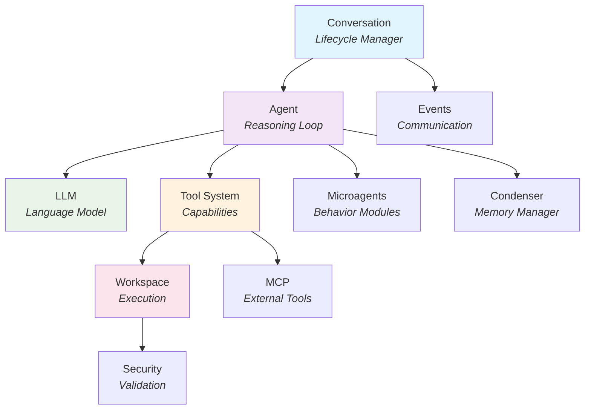

The SDK package (`openhands.sdk`) is the heart of the OpenHands Agent SDK. It provides the core framework for building agents locally or embedding them in applications.

**Source**: [`openhands/sdk/`](https://github.com/OpenHands/agent-sdk/tree/main/openhands/sdk)

## Purpose

The SDK package handles:
- **Agent reasoning loop**: How agents process messages and make decisions
- **State management**: Conversation lifecycle and persistence
- **LLM integration**: Provider-agnostic language model access
- **Tool system**: Typed actions and observations
- **Workspace abstraction**: Where code executes
- **Extensibility**: Microagents, condensers, MCP, security

## Core Components



### 1. Conversation - State & Lifecycle

**What it does**: Manages the entire conversation lifecycle and state.

**Key responsibilities**:
- Maintains conversation state (immutable)
- Handles message flow between user and agent
- Manages turn-taking and async execution
- Persists and restores conversation state
- Emits events for monitoring

**Design decisions**:
- **Immutable state**: Each operation returns a new Conversation instance
- **Serializable**: Can be saved to disk or database and restored
- **Async-first**: Built for streaming and concurrent execution

**When to use directly**: When you need fine-grained control over conversation state, want to implement custom persistence, or need to pause/resume conversations.

**Example use cases**:
- Saving conversation to database after each turn
- Implementing undo/redo functionality
- Building multi-session chatbots
- Time-travel debugging

**Learn more**:
- Guide: [Conversation Persistence](/sdk/guides/conversation/persistence)
- Guide: [Pause and Resume](/sdk/guides/conversation/pause-resume)
- Source: [`conversation.py`](https://github.com/OpenHands/agent-sdk/blob/main/openhands/sdk/conversation.py)

---

### 2. Agent - The Reasoning Loop

**What it does**: The core reasoning engine that processes messages and decides what to do.

**Key responsibilities**:
- Receives messages and current state
- Consults LLM to reason about next action
- Validates and executes tool calls
- Processes observations and loops until completion
- Integrates with microagents for specialized behavior

**Design decisions**:
- **Stateless**: Agent doesn't hold state, operates on Conversation
- **Extensible**: Behavior can be modified via microagents
- **Provider-agnostic**: Works with any LLM through unified interface

**The reasoning loop**:
1. Receive message from Conversation
2. Add message to context
3. Consult LLM with full conversation history
4. If LLM returns tool call → validate and execute tool
5. If tool returns observation → add to context, go to step 3
6. If LLM returns response → done, return to user

**When to customize**: When you need specialized reasoning strategies, want to implement custom agent behaviors, or need to control the execution flow.

**Example use cases**:
- Planning agents that break tasks into steps
- Code review agents with specific checks
- Agents with domain-specific reasoning patterns

**Learn more**:
- Guide: [Custom Agents](/sdk/guides/agent/custom)
- Guide: [Agent Stuck Detector](/sdk/guides/agent/stuck-detector)
- Source: [`agent.py`](https://github.com/OpenHands/agent-sdk/blob/main/openhands/sdk/agent.py)

---

### 3. LLM - Language Model Integration

**What it does**: Provides a provider-agnostic interface to language models.

**Key responsibilities**:
- Abstracts different LLM providers (OpenAI, Anthropic, etc.)
- Handles message formatting and conversion
- Manages streaming responses
- Supports tool calling and reasoning modes
- Handles retries and error recovery

**Design decisions**:
- **Provider-agnostic**: Same API works with any provider
- **Streaming-first**: Built for real-time responses
- **Type-safe**: Pydantic models for all messages
- **Extensible**: Easy to add new providers

**Why provider-agnostic?** You can switch between OpenAI, Anthropic, local models, etc. without changing your agent code. This is crucial for:
- Cost optimization (switch to cheaper models)
- Testing with different models
- Avoiding vendor lock-in
- Supporting customer choice

**When to customize**: When you need to add a new LLM provider, implement custom retries, or modify message formatting.

**Example use cases**:
- Routing requests to different models based on complexity
- Implementing custom caching strategies
- Adding observability hooks

**Learn more**:
- Guide: [LLM Registry](/sdk/guides/llm/registry)
- Guide: [LLM Routing](/sdk/guides/llm/routing)
- Guide: [Reasoning and Tool Use](/sdk/guides/llm/reasoning)
- Source: [`llm.py`](https://github.com/OpenHands/agent-sdk/blob/main/openhands/sdk/llm.py)

---

### 4. Tool System - Typed Capabilities

**What it does**: Defines what agents can do through a typed action/observation pattern.

**Key responsibilities**:
- Defines tool schemas (inputs and outputs)
- Validates actions before execution
- Executes tools and returns typed observations
- Generates JSON schemas for LLM tool calling
- Registers tools with the agent

**Design decisions**:
- **Action/Observation pattern**: Tools are defined as type-safe input/output pairs
- **Schema generation**: Pydantic models auto-generate JSON schemas
- **Executor pattern**: Separation of tool definition and execution
- **Composable**: Tools can call other tools

**The three components**:
1. **Action**: Input schema (what the tool accepts)
2. **Observation**: Output schema (what the tool returns)
3. **ToolExecutor**: Logic that transforms Action → Observation

**Why this pattern?** 
- Type safety catches errors early
- LLMs get accurate schemas for tool calling
- Tools are testable in isolation
- Easy to compose tools

**When to customize**: When you need domain-specific capabilities not covered by built-in tools.

**Example use cases**:
- Database query tools
- API integration tools
- Custom file format parsers
- Domain-specific calculators

**Learn more**:
- Guide: [Custom Tools](/sdk/guides/custom-tools)
- Source: [`tool/`](https://github.com/OpenHands/agent-sdk/tree/main/openhands/sdk/tool)

---

### 5. Workspace - Execution Abstraction

**What it does**: Abstracts *where* code executes (local, Docker, remote).

**Key responsibilities**:
- Provides unified interface for code execution
- Handles file operations across environments
- Manages working directories
- Supports different isolation levels

**Design decisions**:
- **Abstract interface**: LocalWorkspace in SDK, advanced types in workspace package
- **Environment-agnostic**: Code works the same locally or remotely
- **Lazy initialization**: Workspace setup happens on first use

**Why abstract?** You can develop locally with LocalWorkspace, then deploy with DockerWorkspace or RemoteAPIWorkspace without changing agent code.

**When to use directly**: Rarely - usually configured when creating an agent. Use advanced workspaces for production.

**Learn more**:
- Architecture: [Workspace Package](/sdk/arch/workspace-package)
- Guides: [Remote Agent Server](/sdk/guides/agent-server/overview)
- Source: [`workspace.py`](https://github.com/OpenHands/agent-sdk/blob/main/openhands/sdk/workspace.py)

---

### 6. Events - Component Communication

**What it does**: Enables observability and debugging through event emissions.

**Key responsibilities**:
- Defines event types (messages, actions, observations, errors)
- Emitted by Conversation, Agent, Tools
- Enables logging, debugging, and monitoring
- Supports custom event handlers

**Design decisions**:
- **Immutable**: Events are snapshots, not mutable objects
- **Serializable**: Can be logged, stored, replayed
- **Type-safe**: Pydantic models for all events

**Why events?** They provide a timeline of what happened during agent execution. Essential for:
- Debugging agent behavior
- Understanding decision-making
- Building observability dashboards
- Implementing custom logging

**When to use**: When building monitoring systems, debugging tools, or need to track agent behavior.

**Learn more**:
- Guide: [Metrics and Observability](/sdk/guides/core/metrics)
- Source: [`event.py`](https://github.com/OpenHands/agent-sdk/blob/main/openhands/sdk/event.py)

---

### 7. Condenser - Memory Management

**What it does**: Compresses conversation history when it gets too long.

**Key responsibilities**:
- Monitors conversation length
- Summarizes older messages
- Preserves important context
- Keeps conversation within token limits

**Design decisions**:
- **Pluggable**: Different condensing strategies
- **Automatic**: Triggered when context gets large
- **Preserves semantics**: Important information retained

**Why needed?** LLMs have token limits. Long conversations would eventually exceed context windows. Condensers keep conversations running indefinitely while staying within limits.

**When to customize**: When you need domain-specific summarization strategies or want to control what gets preserved.

**Example strategies**:
- Summarize old messages
- Keep only last N turns
- Preserve task-related messages

**Learn more**:
- Guide: [Context Condenser](/sdk/guides/core/context-condenser)
- Source: [`condenser/`](https://github.com/OpenHands/agent-sdk/tree/main/openhands/sdk/condenser)

---

### 8. MCP - Model Context Protocol

**What it does**: Integrates external tool servers via Model Context Protocol.

**Key responsibilities**:
- Connects to MCP-compatible tool servers
- Translates MCP tools to SDK tool format
- Manages server lifecycle
- Handles server communication

**Design decisions**:
- **Standard protocol**: Uses MCP specification
- **Transparent integration**: MCP tools look like regular tools to agents
- **Process management**: Handles server startup/shutdown

**Why MCP?** It lets you use external tools without writing custom SDK integrations. Many tools (databases, APIs, services) provide MCP servers.

**When to use**: When you need tools that:
- Already have MCP servers (fetch, filesystem, etc.)
- Are too complex to rewrite as SDK tools
- Need to run in separate processes
- Are provided by third parties

**Learn more**:
- Guide: [MCP Integration](/sdk/guides/mcp)
- Spec: [Model Context Protocol](https://modelcontextprotocol.io/)
- Source: [`mcp/`](https://github.com/OpenHands/agent-sdk/tree/main/openhands/sdk/mcp)

---

### 9. Microagents - Behavior Modules

**What it does**: Specialized modules that modify agent behavior for specific tasks.

**Key responsibilities**:
- Provide domain-specific instructions
- Modify system prompts
- Guide agent decision-making
- Compose to create specialized agents

**Design decisions**:
- **Composable**: Multiple microagents can work together
- **Declarative**: Defined as configuration, not code
- **Reusable**: Share microagents across agents

**Why microagents?** Instead of hard-coding behaviors, microagents let you compose agent personalities and capabilities. Like "plugins" for agent behavior.

**Example microagents**:
- GitHub operations (issue creation, PRs)
- Code review guidelines
- Documentation style enforcement
- Project-specific conventions

**When to use**: When you need agents with specialized knowledge or behavior patterns that apply to specific domains or tasks.

**Learn more**:
- Guide: [Microagents](/sdk/guides/core/microagents)
- Source: [`microagents/`](https://github.com/OpenHands/agent-sdk/tree/main/openhands/sdk/microagents)

---

### 10. Security - Validation & Sandboxing

**What it does**: Validates inputs and enforces security constraints.

**Key responsibilities**:
- Input validation
- Command sanitization
- Path traversal prevention
- Resource limits

**Design decisions**:
- **Defense in depth**: Multiple validation layers
- **Fail-safe**: Rejects suspicious inputs by default
- **Configurable**: Adjust security levels as needed

**Why needed?** Agents execute arbitrary code and file operations. Security prevents:
- Malicious prompts escaping sandboxes
- Path traversal attacks
- Resource exhaustion
- Unintended system access

**When to customize**: When you need domain-specific validation rules or want to adjust security policies.

**Learn more**:
- Guide: [Security and Secrets](/sdk/guides/core/security)
- Source: [`security/`](https://github.com/OpenHands/agent-sdk/tree/main/openhands/sdk/security)

---

## How Components Work Together

### Example: User asks agent to create a file

```
1. User → Conversation: "Create a file called hello.txt with 'Hello World'"

2. Conversation → Agent: New message event

3. Agent → LLM: Full conversation history + available tools

4. LLM → Agent: Tool call for FileEditorTool.create()

5. Agent → Tool System: Validate FileEditorAction

6. Tool System → Tool Executor: Execute action

7. Tool Executor → Workspace: Create file (local/docker/remote)

8. Workspace → Tool Executor: Success

9. Tool Executor → Tool System: FileEditorObservation (success=true)

10. Tool System → Agent: Observation

11. Agent → LLM: Updated history with observation

12. LLM → Agent: "File created successfully"

13. Agent → Conversation: Done, final response

14. Conversation → User: "File created successfully"
```

Throughout this flow:
- **Events** are emitted for observability
- **Condenser** may trigger if history gets long
- **Microagents** influence LLM's decision-making
- **Security** validates file paths and operations
- **MCP** could provide additional tools if configured

## Design Patterns

### Immutability

All core objects are immutable. Operations return new instances:

```python
conversation = Conversation(...)
new_conversation = conversation.add_message(message)
# conversation is unchanged, new_conversation has the message
```

**Why?** Makes debugging easier, enables time-travel, ensures serializability.

### Composition Over Inheritance

Agents are composed from:
- LLM provider
- Tool list
- Microagent list
- Condenser strategy
- Security policy

You don't subclass Agent - you configure it.

**Why?** More flexible, easier to test, enables runtime configuration.

### Type Safety

Everything uses Pydantic models:
- Messages, actions, observations are typed
- Validation happens automatically
- Schemas generate from types

**Why?** Catches errors early, provides IDE support, self-documenting.

## Next Steps

### For Usage Examples

- [Getting Started](/sdk/getting-started) - Build your first agent
- [Custom Tools](/sdk/guides/custom-tools) - Extend capabilities
- [LLM Configuration](/sdk/guides/llm/registry) - Configure providers
- [Conversation Management](/sdk/guides/conversation/persistence) - State handling

### For Related Architecture

- [Tools Package](/sdk/arch/tools-package) - Built-in tool implementations
- [Workspace Package](/sdk/arch/workspace-package) - Execution environments
- [Agent Server Package](/sdk/arch/agent-server-package) - Remote execution

### For Implementation Details

- [`openhands/sdk/`](https://github.com/OpenHands/agent-sdk/tree/main/openhands/sdk) - Full source code
- [`examples/`](https://github.com/OpenHands/agent-sdk/tree/main/examples) - Working examples
