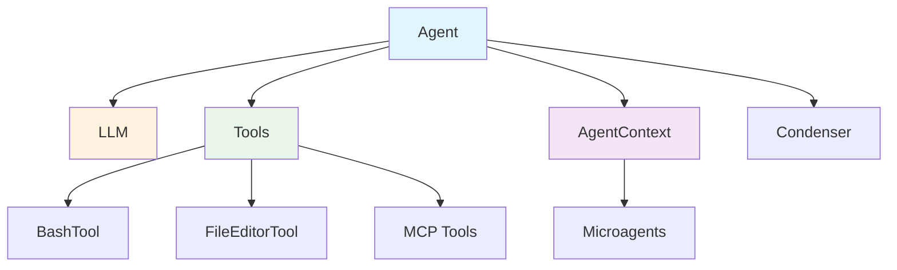
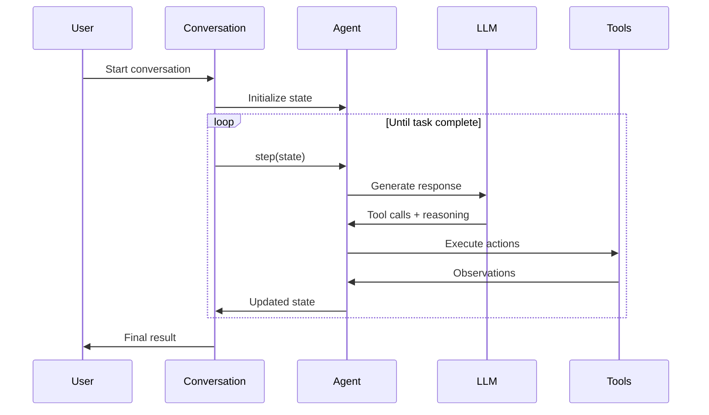

The Agent orchestrates LLM reasoning with tool execution to solve tasks. It manages the reasoning loop, system prompts, and state transitions while maintaining conversation context.

**Source**: [`openhands/sdk/agent/`](https://github.com/All-Hands-AI/agent-sdk/tree/main/openhands/sdk/agent)

## Core Concepts



An agent combines:
- **LLM**: Language model for reasoning and decision-making
- **Tools**: Capabilities to interact with the environment
- **Context**: Additional knowledge and specialized expertise
- **Condenser**: Memory management for long conversations

## Base Interface

**Source**: [`openhands/sdk/agent/base.py`](https://github.com/All-Hands-AI/agent-sdk/blob/main/openhands/sdk/agent/base.py)

### AgentBase

Abstract base class defining the agent interface:

```python
from openhands.sdk.agent import AgentBase
from openhands.sdk.conversation import ConversationState

class CustomAgent(AgentBase):
    def step(self, state: ConversationState) -> ConversationState:
        """Execute one reasoning step and return updated state."""
        # Your agent logic here
        return updated_state
```

**Key Properties**:
- **Immutable**: Agents are frozen Pydantic models
- **Serializable**: Full agent configuration can be saved/restored
- **Type-safe**: Strict type checking with Pydantic validation

## Agent Implementation

**Source**: [`openhands/sdk/agent/agent.py`](https://github.com/All-Hands-AI/agent-sdk/blob/main/openhands/sdk/agent/agent.py)

### Initialization Arguments

```python
from openhands.sdk import Agent, LLM
from openhands.tools import BashTool, FileEditorTool
from pydantic import SecretStr

agent = Agent(
    llm=LLM(
        model="anthropic/claude-sonnet-4-20250514",
        api_key=SecretStr("your-api-key")
    ),
    tools=[
        BashTool.create(),
        FileEditorTool.create()
    ],
    mcp_config={},  # Optional MCP configuration
    filter_tools_regex=None,  # Optional regex to filter tools
    agent_context=None,  # Optional context with microagents
    condenser=None,  # Optional context condenser
    security_analyzer=None,  # Optional security analyzer
    confirmation_policy=None,  # Optional confirmation policy
)
```

### Key Parameters

| Parameter | Type | Description |
|-----------|------|-------------|
| `llm` | `LLM` | Language model configuration (required) |
| `tools` | `list[Tool]` | Tools available to the agent |
| `mcp_config` | `dict` | MCP server configuration for external tools |
| `filter_tools_regex` | `str` | Regex to filter available tools |
| `agent_context` | `AgentContext` | Additional context and microagents |
| `condenser` | `CondenserBase` | Context condensation strategy |
| `security_analyzer` | `SecurityAnalyzer` | Security risk analysis |
| `confirmation_policy` | `ConfirmationPolicy` | Action confirmation strategy |

## Agent Lifecycle



### Execution Flow

1. **Initialization**: Create agent with LLM and tools
2. **State Setup**: Pass agent to conversation
3. **Reasoning Loop**: Conversation calls `agent.step(state)` repeatedly
4. **Tool Execution**: Agent executes tool calls from LLM
5. **State Updates**: Agent returns updated conversation state
6. **Termination**: Loop ends when agent calls `FinishTool`

## Usage Examples

### Basic Agent

See [`examples/01_standalone_sdk/01_hello_world.py`](https://github.com/All-Hands-AI/agent-sdk/blob/main/examples/01_standalone_sdk/01_hello_world.py):

```python
from openhands.sdk import Agent, LLM, Conversation
from openhands.tools import BashTool, FileEditorTool
from pydantic import SecretStr

# Create LLM
llm = LLM(
    model="anthropic/claude-sonnet-4-20250514",
    api_key=SecretStr("your-api-key")
)

# Create agent
agent = Agent(
    llm=llm,
    tools=[
        BashTool.create(),
        FileEditorTool.create()
    ]
)

# Use with conversation
conversation = Conversation(agent=agent)
await conversation.run(user_message="Your task here")
```

### Agent with Context

See [`examples/01_standalone_sdk/03_activate_microagent.py`](https://github.com/All-Hands-AI/agent-sdk/blob/main/examples/01_standalone_sdk/03_activate_microagent.py):

```python
from openhands.sdk import Agent, AgentContext

# Create context with microagents
context = AgentContext(
    microagents=["testing_expert", "code_reviewer"]
)

agent = Agent(
    llm=llm,
    tools=tools,
    agent_context=context
)
```

### Agent with Memory Management

See [`examples/01_standalone_sdk/14_context_condenser.py`](https://github.com/All-Hands-AI/agent-sdk/blob/main/examples/01_standalone_sdk/14_context_condenser.py):

```python
from openhands.sdk.context import LLMCondenser

condenser = LLMCondenser(
    max_tokens=8000,
    target_tokens=6000
)

agent = Agent(
    llm=llm,
    tools=tools,
    condenser=condenser
)
```

### Agent with MCP Tools

See [`examples/01_standalone_sdk/07_mcp_integration.py`](https://github.com/All-Hands-AI/agent-sdk/blob/main/examples/01_standalone_sdk/07_mcp_integration.py):

```python
mcp_config = {
    "mcpServers": {
        "fetch": {
            "command": "uvx",
            "args": ["mcp-server-fetch"]
        }
    }
}

agent = Agent(
    llm=llm,
    tools=tools,
    mcp_config=mcp_config
)
```

### Planning Agent Workflow

See [`examples/01_standalone_sdk/24_planning_agent_workflow.py`](https://github.com/All-Hands-AI/agent-sdk/blob/main/examples/01_standalone_sdk/24_planning_agent_workflow.py) for a complete example of multi-phase agent workflows.

## System Prompts

**Source**: [`openhands/sdk/agent/prompts/`](https://github.com/All-Hands-AI/agent-sdk/tree/main/openhands/sdk/agent/prompts)

Agents use Jinja2 templates for system prompts. Available templates:

| Template | Use Case | Source |
|----------|----------|--------|
| `system_prompt.j2` | Default reasoning and tool usage | [View](https://github.com/All-Hands-AI/agent-sdk/blob/main/openhands/sdk/agent/prompts/system_prompt.j2) |
| `system_prompt_interactive.j2` | Interactive conversations | [View](https://github.com/All-Hands-AI/agent-sdk/blob/main/openhands/sdk/agent/prompts/system_prompt_interactive.j2) |
| `system_prompt_long_horizon.j2` | Complex multi-step tasks | [View](https://github.com/All-Hands-AI/agent-sdk/blob/main/openhands/sdk/agent/prompts/system_prompt_long_horizon.j2) |
| `system_prompt_planning.j2` | Planning-focused workflows | [View](https://github.com/All-Hands-AI/agent-sdk/blob/main/openhands/sdk/agent/prompts/system_prompt_planning.j2) |

### Custom Prompts

Create custom agent classes with specialized prompts:

```python
class PlanningAgent(Agent):
    system_prompt_filename: str = "system_prompt_planning.j2"
```

## Custom Agent Development

### Extending AgentBase

```python
from openhands.sdk.agent import AgentBase
from openhands.sdk.conversation import ConversationState

class SpecializedAgent(AgentBase):
    # Custom configuration
    max_iterations: int = 10
    
    def step(self, state: ConversationState) -> ConversationState:
        # Custom reasoning logic
        # Tool selection and execution
        # State management
        return updated_state
```

### Multi-Agent Composition

```python
class WorkflowAgent(AgentBase):
    planning_agent: Agent
    execution_agent: Agent
    
    def step(self, state: ConversationState) -> ConversationState:
        # Phase 1: Planning
        plan = self.planning_agent.step(state)
        
        # Phase 2: Execution
        result = self.execution_agent.step(plan)
        
        return result
```

## Best Practices

1. **Tool Selection**: Provide only necessary tools to reduce complexity
2. **Clear Instructions**: Use detailed user messages for better task understanding
3. **Context Management**: Use condensers for long-running conversations
4. **Error Handling**: Implement proper error recovery strategies
5. **Security**: Use confirmation policies for sensitive operations
6. **Testing**: Test agents with various scenarios and edge cases

## See Also

- **[Tools](/sdk/architecture/sdk/tool.mdx)** - Defining and using tools
- **[Conversation](/sdk/architecture/sdk/conversation.mdx)** - Managing agent conversations
- **[LLM](/sdk/architecture/sdk/llm.mdx)** - Language model configuration
- **[MCP](/sdk/architecture/sdk/mcp.mdx)** - External tool integration
- **[Security](/sdk/architecture/sdk/security.mdx)** - Security and confirmation policies
