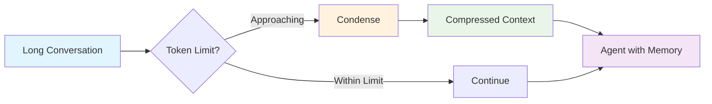
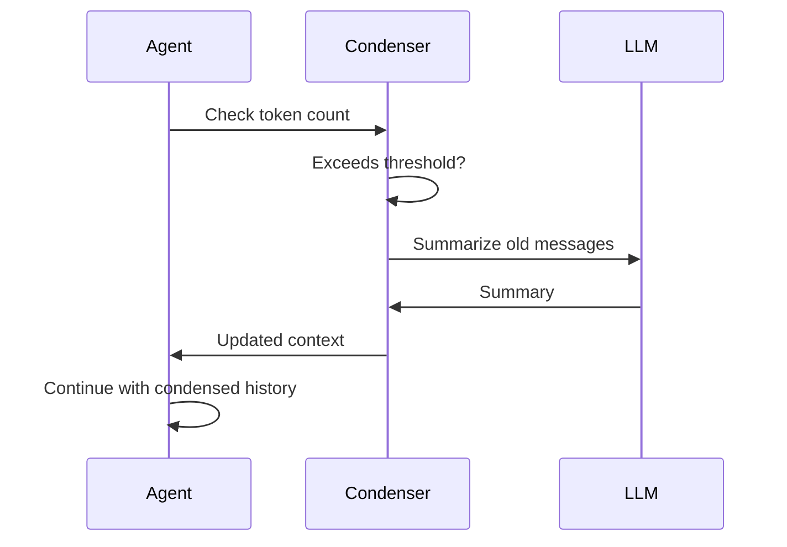

The context condenser manages agent memory by intelligently compressing conversation history when approaching token limits. This enables agents to maintain coherent context in long-running conversations without exceeding LLM context windows.

**Source**: [`openhands/sdk/context/condenser/`](https://github.com/All-Hands-AI/agent-sdk/tree/main/openhands/sdk/context/condenser)

## Why Context Condensation?



As conversations grow, they may exceed LLM context windows. Condensers solve this by:
- Summarizing older messages while preserving key information
- Maintaining recent context in full detail
- Reducing token count without losing conversation coherence

## LLM Condenser (Default)

**Source**: [`openhands/sdk/context/condenser/llm_condenser.py`](https://github.com/All-Hands-AI/agent-sdk/blob/main/openhands/sdk/context/condenser/llm_condenser.py)

The default condenser uses an LLM to intelligently summarize conversation history.

### How It Works

1. **Monitor Token Count**: Tracks conversation token usage
2. **Trigger Condensation**: Activates when approaching token threshold
3. **Summarize History**: Uses LLM to compress older messages
4. **Preserve Recent**: Keeps recent messages uncompressed
5. **Update Context**: Replaces verbose history with summary

### Configuration

```python
from openhands.sdk.context import LLMCondenser

condenser = LLMCondenser(
    max_tokens=8000,  # Trigger condensation at this limit
    target_tokens=6000,  # Reduce to this token count
    preserve_recent=10  # Keep last N messages uncompressed
)

agent = Agent(
    llm=llm,
    tools=tools,
    condenser=condenser
)
```

### Example Usage

See [`examples/01_standalone_sdk/14_context_condenser.py`](https://github.com/All-Hands-AI/agent-sdk/blob/main/examples/01_standalone_sdk/14_context_condenser.py):

```python
from openhands.sdk import Agent, LLM
from openhands.sdk.context import LLMCondenser
from pydantic import SecretStr

# Configure condenser
condenser = LLMCondenser(
    max_tokens=8000,
    target_tokens=6000
)

# Create agent with condenser
llm = LLM(
    model="anthropic/claude-sonnet-4-20250514",
    api_key=SecretStr("your-api-key")
)

agent = Agent(
    llm=llm,
    tools=tools,
    condenser=condenser
)
```

## Condensation Strategy

### Multi-Phase Approach



### What Gets Condensed

- **System messages**: Preserved as-is
- **Recent messages**: Kept in full (configurable count)
- **Older messages**: Summarized into compact form
- **Tool results**: Preserved for reference
- **User preferences**: Maintained across condensation

## Custom Condensers

Implement custom condensation strategies by extending the base class:

```python
from openhands.sdk.context import CondenserBase
from openhands.sdk.event import ConversationState

class CustomCondenser(CondenserBase):
    def condense(self, state: ConversationState) -> ConversationState:
        """Implement custom condensation logic."""
        # Your condensation algorithm
        return condensed_state
    
    def should_condense(self, state: ConversationState) -> bool:
        """Determine when to trigger condensation."""
        # Your trigger logic
        return token_count > threshold
```

## Best Practices

1. **Set Appropriate Thresholds**: Leave buffer room below actual limit
2. **Preserve Recent Context**: Keep enough messages for coherent flow
3. **Monitor Performance**: Track condensation frequency and effectiveness
4. **Test Condensation**: Verify important information isn't lost
5. **Adjust Per Use Case**: Different tasks need different settings

## Configuration Guidelines

| Use Case | max_tokens | target_tokens | preserve_recent |
|----------|-----------|---------------|-----------------|
| Short tasks | 4000 | 3000 | 5 |
| Medium conversations | 8000 | 6000 | 10 |
| Long-running agents | 16000 | 12000 | 20 |
| Code-heavy tasks | 12000 | 10000 | 15 |

## Performance Considerations

- **Condensation Cost**: Uses additional LLM calls
- **Latency**: Brief pause during condensation
- **Context Quality**: Trade-off between compression and information retention
- **Frequency**: Tune thresholds to minimize condensation events

## See Also

- **[Agent Configuration](/sdk/architecture/sdk/agent.mdx)** - Using condensers with agents
- **[Example Code](https://github.com/All-Hands-AI/agent-sdk/blob/main/examples/01_standalone_sdk/14_context_condenser.py)** - Working example
- **[Conversation State](/sdk/architecture/sdk/conversation.mdx)** - Managing conversation state
