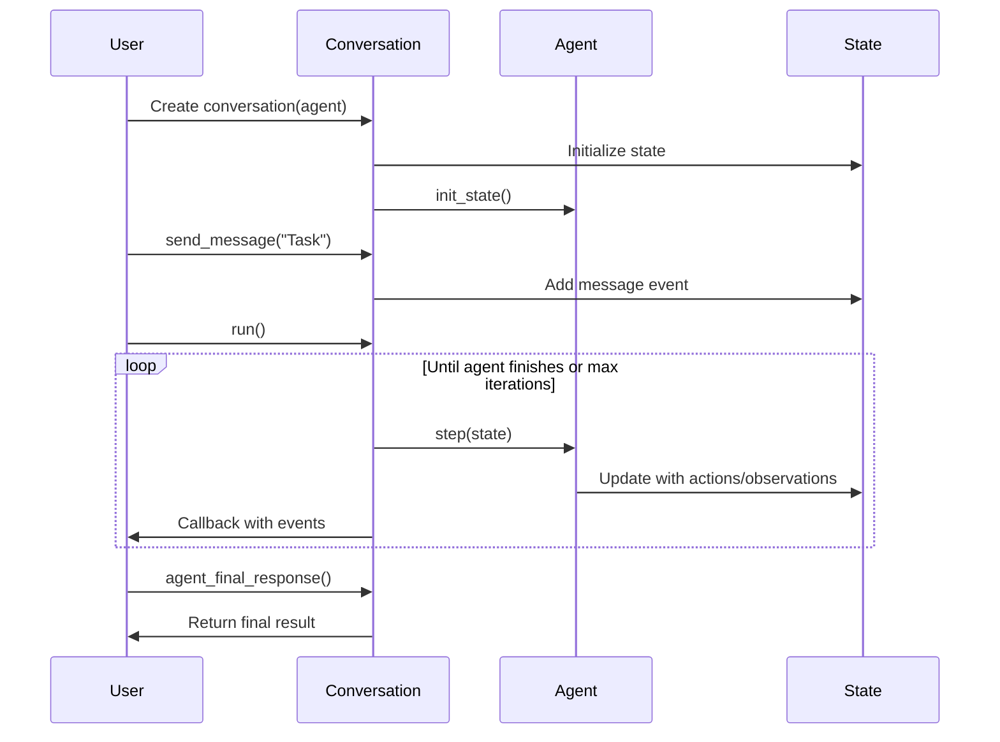

The Conversation class orchestrates agent execution through structured message flows. It manages the agent lifecycle, state persistence, and provides APIs for interaction and monitoring.

**Source**: [`openhands/sdk/conversation/`](https://github.com/All-Hands-AI/agent-sdk/tree/main/openhands/sdk/conversation)

## Core Concepts

```mermaid
graph LR
    User[User] --> Conversation[Conversation]
    Conversation --> Agent[Agent]
    Conversation --> State[ConversationState]
    Conversation --> Events[Event History]
    
    Agent --> Step[step()]
    State --> Persistence[Persistence]
    
    style Conversation fill:#e1f5fe
    style Agent fill:#f3e5f5
    style State fill:#fff3e0
    style Events fill:#e8f5e8
```

A conversation:
- **Manages Agent Lifecycle**: Initializes and runs agents until completion
- **Handles State**: Maintains conversation history and context
- **Enables Interaction**: Send messages and receive responses
- **Provides Persistence**: Save and restore conversation state
- **Monitors Progress**: Track execution stats and events

## Basic API

**Source**: [`openhands/sdk/conversation/conversation.py`](https://github.com/All-Hands-AI/agent-sdk/blob/main/openhands/sdk/conversation/conversation.py)

### Creating a Conversation

```python
from openhands.sdk import Conversation, Agent, LLM
from openhands.tools import BashTool, FileEditorTool
from pydantic import SecretStr

# Create agent
agent = Agent(
    llm=LLM(
        model="anthropic/claude-sonnet-4-20250514",
        api_key=SecretStr("your-api-key")
    ),
    tools=[BashTool.create(), FileEditorTool.create()]
)

# Create conversation
conversation = Conversation(
    agent=agent,
    workspace="workspace/project",  # Working directory
    persistence_dir="conversations",  # Save conversation state
    max_iteration_per_run=500,  # Max steps per run
    stuck_detection=True,  # Detect infinite loops
    visualize=True  # Generate execution visualizations
)
```

### Constructor Parameters

| Parameter | Type | Default | Description |
|-----------|------|---------|-------------|
| `agent` | `AgentBase` | *Required* | Agent to run in the conversation |
| `workspace` | `str \| LocalWorkspace \| RemoteWorkspace` | `"workspace/project"` | Execution environment |
| `persistence_dir` | `str \| None` | `None` | Directory for saving state |
| `conversation_id` | `ConversationID \| None` | `None` | Resume existing conversation |
| `callbacks` | `list[ConversationCallbackType] \| None` | `None` | Event callbacks |
| `max_iteration_per_run` | `int` | `500` | Maximum steps per `run()` call |
| `stuck_detection` | `bool` | `True` | Enable stuck detection |
| `visualize` | `bool` | `True` | Generate visualizations |
| `secrets` | `dict \| None` | `None` | Secret values for agent |

## Agent Lifecycle



### 1. Create Agent

Define agent with LLM and tools:

```python
agent = Agent(llm=llm, tools=tools)
```

### 2. Create Conversation

Pass agent to conversation:

```python
conversation = Conversation(agent=agent)
```

### 3. Send Messages

Add user messages to conversation:

```python
conversation.send_message("Build a web scraper for news articles")
```

### 4. Run Agent

Execute agent until task completion:

```python
conversation.run()
```

The conversation will call `agent.step(state)` repeatedly until:
- Agent calls `FinishTool`
- Maximum iterations reached
- Agent encounters an error
- User pauses execution

### 5. Get Results

Retrieve agent's final response:

```python
result = conversation.agent_final_response()
print(result)
```

## Core Methods

**Source**: [`openhands/sdk/conversation/base.py`](https://github.com/All-Hands-AI/agent-sdk/blob/main/openhands/sdk/conversation/base.py)

### send_message()

Add a message to the conversation:

```python
# String message
conversation.send_message("Write unit tests for the API")

# Message object with images
from openhands.sdk.llm import Message, ImageContent

message = Message(
    role="user",
    content=[
        "What's in this image?",
        ImageContent(source="path/to/image.png")
    ]
)
conversation.send_message(message)
```

See [`examples/01_standalone_sdk/17_image_input.py`](https://github.com/All-Hands-AI/agent-sdk/blob/main/examples/01_standalone_sdk/17_image_input.py).

### run()

Execute the agent until completion or max iterations:

```python
# Synchronous execution
conversation.run()

# Async execution
await conversation.run()
```

See [`examples/01_standalone_sdk/11_async.py`](https://github.com/All-Hands-AI/agent-sdk/blob/main/examples/01_standalone_sdk/11_async.py) for async usage.

### agent_final_response()

Get the agent's final response:

```python
final_response = conversation.agent_final_response()
```

### pause()

Pause agent execution:

```python
conversation.pause()
```

See [`examples/01_standalone_sdk/09_pause_example.py`](https://github.com/All-Hands-AI/agent-sdk/blob/main/examples/01_standalone_sdk/09_pause_example.py).

### close()

Clean up resources:

```python
conversation.close()
```

## Conversation State

**Source**: [`openhands/sdk/conversation/state.py`](https://github.com/All-Hands-AI/agent-sdk/blob/main/openhands/sdk/conversation/state.py)

### Accessing State

```python
state = conversation.state

# Conversation properties
print(state.id)  # Unique conversation ID
print(state.agent_status)  # Current execution status
print(state.events)  # Event history

# Agent and workspace
print(state.agent)  # The agent instance
print(state.workspace)  # The workspace
```

### Agent Execution Status

```python
from openhands.sdk.conversation.state import AgentExecutionStatus

status = state.agent_status

# Possible values:
# - AgentExecutionStatus.IDLE
# - AgentExecutionStatus.RUNNING
# - AgentExecutionStatus.FINISHED
# - AgentExecutionStatus.ERROR
# - AgentExecutionStatus.PAUSED
```

## Persistence

### Saving Conversations

Conversations are automatically persisted when `persistence_dir` is set:

```python
conversation = Conversation(
    agent=agent,
    persistence_dir="conversations"  # Saves to conversations/<id>/
)
```

See [`examples/01_standalone_sdk/10_persistence.py`](https://github.com/All-Hands-AI/agent-sdk/blob/main/examples/01_standalone_sdk/10_persistence.py).

### Resuming Conversations

Resume from a saved conversation ID:

```python
from openhands.sdk.conversation.types import ConversationID

# Get conversation ID
conv_id = conversation.id

# Later, resume with the same ID
resumed_conversation = Conversation(
    agent=agent,
    conversation_id=conv_id,
    persistence_dir="conversations"
)
```

## Monitoring and Stats

**Source**: [`openhands/sdk/conversation/conversation_stats.py`](https://github.com/All-Hands-AI/agent-sdk/blob/main/openhands/sdk/conversation/conversation_stats.py)

### Conversation Stats

```python
stats = conversation.conversation_stats

print(stats.total_messages)  # Total messages exchanged
print(stats.total_tokens)  # Total tokens used
print(stats.total_cost)  # Estimated cost
print(stats.duration)  # Execution time
```

See [`examples/01_standalone_sdk/13_get_llm_metrics.py`](https://github.com/All-Hands-AI/agent-sdk/blob/main/examples/01_standalone_sdk/13_get_llm_metrics.py).

## Event Callbacks

### Registering Callbacks

Monitor conversation events in real-time:

```python
from openhands.sdk.conversation import ConversationCallbackType
from openhands.sdk.event import Event

def on_event(event: Event):
    if isinstance(event, MessageEvent):
        print(f"Message: {event.content}")
    elif isinstance(event, ActionEvent):
        print(f"Action: {event.action.kind}")
    elif isinstance(event, ObservationEvent):
        print(f"Observation: {event.observation.kind}")

conversation = Conversation(
    agent=agent,
    callbacks=[on_event]
)
```

## Advanced Features

### Stuck Detection

**Source**: [`openhands/sdk/conversation/stuck_detector.py`](https://github.com/All-Hands-AI/agent-sdk/blob/main/openhands/sdk/conversation/stuck_detector.py)

Automatically detects when agents are stuck in loops:

```python
conversation = Conversation(
    agent=agent,
    stuck_detection=True  # Default: True
)
```

See [`examples/01_standalone_sdk/20_stuck_detector.py`](https://github.com/All-Hands-AI/agent-sdk/blob/main/examples/01_standalone_sdk/20_stuck_detector.py).

### Secrets Management

**Source**: [`openhands/sdk/conversation/secrets_manager.py`](https://github.com/All-Hands-AI/agent-sdk/blob/main/openhands/sdk/conversation/secrets_manager.py)

Provide secrets for agent operations:

```python
conversation = Conversation(
    agent=agent,
    secrets={
        "API_KEY": "secret-value",
        "DATABASE_URL": "postgres://..."
    }
)

# Update secrets during execution
conversation.update_secrets({
    "NEW_TOKEN": "new-value"
})
```

See [`examples/01_standalone_sdk/12_custom_secrets.py`](https://github.com/All-Hands-AI/agent-sdk/blob/main/examples/01_standalone_sdk/12_custom_secrets.py).

### Visualization

**Source**: [`openhands/sdk/conversation/visualizer.py`](https://github.com/All-Hands-AI/agent-sdk/blob/main/openhands/sdk/conversation/visualizer.py)

Generate execution visualizations:

```python
conversation = Conversation(
    agent=agent,
    visualize=True  # Default: True
)

# Visualizations saved to workspace/visualizations/
```

### Title Generation

Generate conversation titles:

```python
title = conversation.generate_title(max_length=50)
print(f"Conversation: {title}")
```

## Local vs Remote Conversations

### LocalConversation

**Source**: [`openhands/sdk/conversation/impl/local_conversation.py`](https://github.com/All-Hands-AI/agent-sdk/blob/main/openhands/sdk/conversation/impl/local_conversation.py)

Runs agent locally:

```python
from openhands.sdk.workspace import LocalWorkspace

conversation = Conversation(
    agent=agent,
    workspace=LocalWorkspace(working_dir="/project")
)
```

### RemoteConversation

**Source**: [`openhands/sdk/conversation/impl/remote_conversation.py`](https://github.com/All-Hands-AI/agent-sdk/blob/main/openhands/sdk/conversation/impl/remote_conversation.py)

Runs agent on remote server:

```python
from openhands.workspace import RemoteAPIWorkspace

conversation = Conversation(
    agent=agent,
    workspace=RemoteAPIWorkspace(
        working_dir="/workspace",
        api_url="https://agent-server.example.com"
    )
)
```

## Best Practices

1. **Set Appropriate Iteration Limits**: Prevent runaway executions
2. **Use Persistence**: Save important conversations for resume/replay
3. **Monitor Events**: Use callbacks for real-time monitoring
4. **Handle Errors**: Check agent status and handle failures gracefully
5. **Clean Up Resources**: Call `close()` when done
6. **Enable Stuck Detection**: Catch infinite loops early
7. **Track Stats**: Monitor token usage and costs

## Complete Example

```python
from openhands.sdk import Conversation, Agent, LLM
from openhands.tools import BashTool, FileEditorTool
from pydantic import SecretStr

# Create agent
agent = Agent(
    llm=LLM(
        model="anthropic/claude-sonnet-4-20250514",
        api_key=SecretStr("your-api-key")
    ),
    tools=[BashTool.create(), FileEditorTool.create()]
)

# Create conversation
conversation = Conversation(
    agent=agent,
    workspace="workspace/project",
    persistence_dir="conversations",
    max_iteration_per_run=100
)

try:
    # Send task
    conversation.send_message("Create a simple REST API")
    
    # Run agent
    conversation.run()
    
    # Get result
    result = conversation.agent_final_response()
    print(f"Result: {result}")
    
    # Check stats
    stats = conversation.conversation_stats
    print(f"Tokens used: {stats.total_tokens}")
    print(f"Cost: ${stats.total_cost}")
finally:
    # Clean up
    conversation.close()
```

## See Also

- **[Agent](/sdk/architecture/sdk/agent.mdx)** - Agent configuration and usage
- **[Events](/sdk/architecture/sdk/event.mdx)** - Event types and handling
- **[Workspace](/sdk/architecture/sdk/workspace.mdx)** - Workspace configuration
- **[Examples](https://github.com/All-Hands-AI/agent-sdk/tree/main/examples/01_standalone_sdk)** - Usage examples
