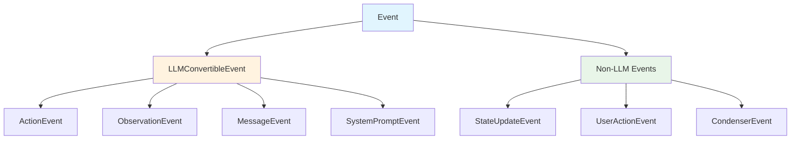
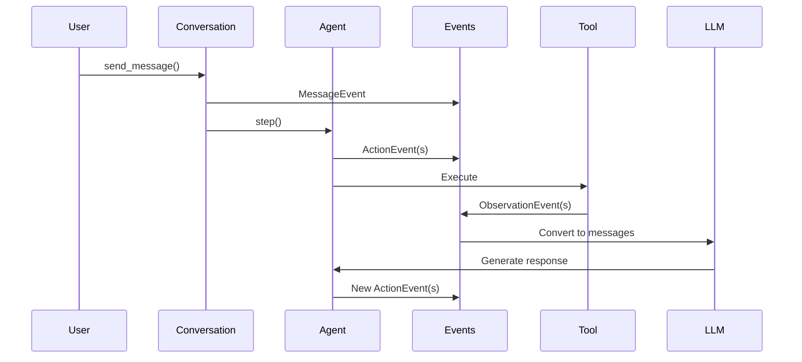

The event system provides structured representations of all interactions in agent conversations. Events enable state management, LLM communication, and real-time monitoring.

**Source**: [`openhands/sdk/event/`](https://github.com/All-Hands-AI/agent-sdk/tree/main/openhands/sdk/event)

## Core Concepts



Events fall into two categories:
- **LLMConvertibleEvent**: Events that become LLM messages
- **Non-LLM Events**: Internal state and control events

## Base Event Classes

**Source**: [`openhands/sdk/event/base.py`](https://github.com/All-Hands-AI/agent-sdk/blob/main/openhands/sdk/event/base.py)

### Event

Base class for all events:

```python
from openhands.sdk.event import Event

class Event:
    id: str  # Unique event identifier
    timestamp: str  # ISO format timestamp
    source: SourceType  # Event source (agent/user/system)
```

**Properties**:
- **Immutable**: Events are frozen Pydantic models
- **Serializable**: Full event data can be saved/restored
- **Visualizable**: Rich text representation for display

### LLMConvertibleEvent

Events that can be converted to LLM messages:

```python
from openhands.sdk.event import LLMConvertibleEvent
from openhands.sdk.llm import Message

class LLMConvertibleEvent(Event):
    def to_llm_message(self) -> Message:
        """Convert event to LLM message format."""
        ...
```

These events form the conversation history sent to the LLM.

## LLM-Convertible Events

### ActionEvent

**Source**: [`openhands/sdk/event/llm_convertible/action.py`](https://github.com/All-Hands-AI/agent-sdk/blob/main/openhands/sdk/event/llm_convertible/action.py)

Represents actions taken by the agent:

```python
from openhands.sdk.event import ActionEvent
from openhands.sdk.tool import Action

class ActionEvent(LLMConvertibleEvent):
    action: Action  # The action being executed
    thought: str  # Agent's reasoning (optional)
```

**Purpose**: Records what the agent decided to do.

**Example**:
```python
from openhands.tools import BashAction

action_event = ActionEvent(
    source="agent",
    action=BashAction(command="ls -la"),
    thought="List files to understand directory structure"
)
```

### ObservationEvent

**Source**: [`openhands/sdk/event/llm_convertible/observation.py`](https://github.com/All-Hands-AI/agent-sdk/blob/main/openhands/sdk/event/llm_convertible/observation.py)

Represents observations from tool execution:

```python
from openhands.sdk.event import ObservationEvent
from openhands.sdk.tool import Observation

class ObservationEvent(LLMConvertibleEvent):
    observation: Observation  # Tool execution result
```

**Purpose**: Records the outcome of agent actions.

**Example**:
```python
from openhands.tools import BashObservation

observation_event = ObservationEvent(
    source="tool",
    observation=BashObservation(
        output="file1.txt\nfile2.py\n",
        exit_code=0
    )
)
```

**Related Events**:
- **AgentErrorEvent**: Agent execution errors
- **UserRejectObservation**: User rejected an action

### MessageEvent

**Source**: [`openhands/sdk/event/llm_convertible/message.py`](https://github.com/All-Hands-AI/agent-sdk/blob/main/openhands/sdk/event/llm_convertible/message.py)

Represents messages in the conversation:

```python
from openhands.sdk.event import MessageEvent

class MessageEvent(LLMConvertibleEvent):
    content: str | list  # Message content (text or multimodal)
    role: str  # Role: "user", "assistant", "system"
    images_urls: list[str]  # Optional image URLs
```

**Purpose**: User messages, agent responses, and system messages.

**Example**:
```python
message_event = MessageEvent(
    source="user",
    content="Create a web scraper",
    role="user"
)
```

### SystemPromptEvent

**Source**: [`openhands/sdk/event/llm_convertible/system.py`](https://github.com/All-Hands-AI/agent-sdk/blob/main/openhands/sdk/event/llm_convertible/system.py)

Represents system prompts:

```python
from openhands.sdk.event import SystemPromptEvent

class SystemPromptEvent(LLMConvertibleEvent):
    content: str  # System prompt content
```

**Purpose**: Provides instructions and context to the agent.

## Non-LLM Events

### ConversationStateUpdateEvent

**Source**: [`openhands/sdk/event/conversation_state.py`](https://github.com/All-Hands-AI/agent-sdk/blob/main/openhands/sdk/event/conversation_state.py)

Tracks conversation state changes:

```python
from openhands.sdk.event import ConversationStateUpdateEvent

class ConversationStateUpdateEvent(Event):
    # Internal state update event
    # Not sent to LLM
```

**Purpose**: Internal tracking of conversation state transitions.

### PauseEvent

**Source**: [`openhands/sdk/event/user_action.py`](https://github.com/All-Hands-AI/agent-sdk/blob/main/openhands/sdk/event/user_action.py)

User paused the conversation:

```python
from openhands.sdk.event import PauseEvent

class PauseEvent(Event):
    pass
```

**Purpose**: Signal that user has paused agent execution.

### Condenser Events

**Source**: [`openhands/sdk/event/condenser.py`](https://github.com/All-Hands-AI/agent-sdk/blob/main/openhands/sdk/event/condenser.py)

Track context condensation:

#### Condensation

```python
class Condensation(Event):
    content: str  # Condensed summary
```

**Purpose**: Record the condensed conversation history.

#### CondensationRequest

```python
class CondensationRequest(Event):
    pass
```

**Purpose**: Request context condensation.

#### CondensationSummaryEvent

```python
class CondensationSummaryEvent(LLMConvertibleEvent):
    content: str  # Summary for LLM
```

**Purpose**: Provide condensed context to LLM.

## Event Source Types

**Source**: [`openhands/sdk/event/types.py`](https://github.com/All-Hands-AI/agent-sdk/blob/main/openhands/sdk/event/types.py)

```python
SourceType = Literal["agent", "user", "tool", "system"]
```

- **agent**: Events from the agent
- **user**: Events from the user
- **tool**: Events from tool execution
- **system**: System-generated events

## Event Streams

### Converting to LLM Messages

Events are converted to LLM messages for context:

```python
from openhands.sdk.event import LLMConvertibleEvent

events = [action_event, observation_event, message_event]
messages = LLMConvertibleEvent.events_to_messages(events)

# Send to LLM
response = llm.completion(messages=messages)
```

### Event Batching

Multiple actions in a single step are batched:

```python
# Multi-action events
action1 = ActionEvent(action=BashAction(...))
action2 = ActionEvent(action=FileEditAction(...))

# Converted to single LLM message with multiple tool calls
messages = LLMConvertibleEvent.events_to_messages([action1, action2])
```

## Event Visualization

Events support rich text visualization:

```python
from openhands.sdk.event import Event

event = MessageEvent(
    source="user",
    content="Hello",
    role="user"
)

# Rich text representation
print(event.visualize)

# Plain text
print(str(event))
# Output: MessageEvent (user)
#   user: Hello
```

## Event Callbacks

Monitor events in real-time:

```python
from openhands.sdk import Conversation
from openhands.sdk.event import (
    Event, 
    ActionEvent, 
    ObservationEvent, 
    MessageEvent
)

def on_event(event: Event):
    if isinstance(event, MessageEvent):
        print(f"💬 Message: {event.content}")
    elif isinstance(event, ActionEvent):
        print(f"🔧 Action: {event.action.kind}")
    elif isinstance(event, ObservationEvent):
        print(f"👁️ Observation: {event.observation.content}")

conversation = Conversation(
    agent=agent,
    callbacks=[on_event]
)
```

## Event History

Access conversation event history:

```python
conversation = Conversation(agent=agent)
conversation.send_message("Task")
conversation.run()

# Get all events
events = conversation.state.events

# Filter by type
actions = [e for e in events if isinstance(e, ActionEvent)]
observations = [e for e in events if isinstance(e, ObservationEvent)]
messages = [e for e in events if isinstance(e, MessageEvent)]
```

## Serialization

Events are fully serializable:

```python
# Serialize event
event_json = event.model_dump_json()

# Deserialize
from openhands.sdk.event import Event
restored_event = Event.model_validate_json(event_json)
```

## Best Practices

1. **Use Type Guards**: Check event types with `isinstance()`
2. **Handle All Types**: Cover all event types in callbacks
3. **Preserve Immutability**: Never mutate event objects
4. **Log Events**: Keep event history for debugging
5. **Filter Strategically**: Process only relevant events
6. **Visualize for Debugging**: Use `event.visualize` for rich output

## Event Lifecycle



## See Also

- **[Conversation](/sdk/architecture/sdk/conversation.mdx)** - Managing conversations and event streams
- **[Agent](/sdk/architecture/sdk/agent.mdx)** - Agent execution and event generation
- **[Tools](/sdk/architecture/sdk/tool.mdx)** - Tool actions and observations
- **[Condenser](/sdk/architecture/sdk/condenser.mdx)** - Context condensation events
