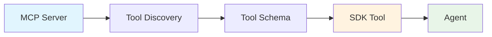

MCP (Model Context Protocol) integration enables agents to connect to external tools and services through a standardized protocol. The SDK seamlessly converts MCP tools into native agent tools.

**Source**: [`openhands/sdk/mcp/`](https://github.com/All-Hands-AI/agent-sdk/tree/main/openhands/sdk/mcp)

## What is MCP?

[Model Context Protocol](https://modelcontextprotocol.io/) is an open protocol that standardizes how AI applications connect to external data sources and tools. It enables:

- **Standardized Integration**: Connect to any MCP-compliant service
- **Dynamic Discovery**: Tools are discovered at runtime
- **Multiple Transports**: Support for stdio, HTTP, and SSE
- **OAuth Support**: Secure authentication for external services

## Basic Usage

### Creating MCP Tools

```python
from openhands.sdk import create_mcp_tools

mcp_config = {
    "mcpServers": {
        "fetch": {
            "command": "uvx",
            "args": ["mcp-server-fetch"]
        }
    }
}

# Create MCP tools
mcp_tools = create_mcp_tools(mcp_config, timeout=30)

# Use with agent
from openhands.sdk import Agent
from openhands.tools import BashTool

agent = Agent(
    llm=llm,
    tools=[
        BashTool.create(),
        *mcp_tools  # Add MCP tools
    ]
)
```

See [`examples/01_standalone_sdk/07_mcp_integration.py`](https://github.com/All-Hands-AI/agent-sdk/blob/main/examples/01_standalone_sdk/07_mcp_integration.py).

### Using MCP Config in Agent

```python
# Simpler: provide MCP config directly to agent
agent = Agent(
    llm=llm,
    tools=[BashTool.create()],
    mcp_config={
        "mcpServers": {
            "fetch": {
                "command": "uvx",
                "args": ["mcp-server-fetch"]
            }
        }
    }
)
```

## Configuration Formats

The SDK uses the [FastMCP configuration format](https://gofastmcp.com/clients/client#configuration-format).

### Stdio Servers

Run local MCP servers via stdio:

```python
mcp_config = {
    "mcpServers": {
        "filesystem": {
            "transport": "stdio",  # Optional, default
            "command": "python",
            "args": ["./mcp-server-filesystem.py"],
            "env": {"DEBUG": "true"},
            "cwd": "/path/to/server"
        }
    }
}
```

### HTTP/SSE Servers

Connect to remote MCP servers:

```python
mcp_config = {
    "mcpServers": {
        "remote_api": {
            "transport": "http",  # or "sse"
            "url": "https://api.example.com/mcp",
            "headers": {
                "Authorization": "Bearer token"
            }
        }
    }
}
```

### OAuth Authentication

Authenticate with OAuth-enabled services:

```python
mcp_config = {
    "mcpServers": {
        "google_drive": {
            "transport": "http",
            "url": "https://mcp.google.com/drive",
            "auth": "oauth",  # Enable OAuth flow
        }
    }
}
```

See [`examples/01_standalone_sdk/08_mcp_with_oauth.py`](https://github.com/All-Hands-AI/agent-sdk/blob/main/examples/01_standalone_sdk/08_mcp_with_oauth.py).

## Available MCP Servers

Popular MCP servers you can integrate:

### Official Servers

- **fetch**: HTTP requests ([mcp-server-fetch](https://github.com/modelcontextprotocol/servers/tree/main/src/fetch))
- **filesystem**: File operations ([mcp-server-filesystem](https://github.com/modelcontextprotocol/servers/tree/main/src/filesystem))
- **git**: Git operations ([mcp-server-git](https://github.com/modelcontextprotocol/servers/tree/main/src/git))
- **github**: GitHub API ([mcp-server-github](https://github.com/modelcontextprotocol/servers/tree/main/src/github))
- **postgres**: PostgreSQL queries ([mcp-server-postgres](https://github.com/modelcontextprotocol/servers/tree/main/src/postgres))

### Community Servers

See [MCP Servers Directory](https://github.com/modelcontextprotocol/servers) for more.

## MCP Tool Conversion

MCP tools are automatically converted to SDK tools:



1. **Discovery**: MCP server lists available tools
2. **Schema Extraction**: Tool schemas extracted from MCP
3. **Tool Creation**: SDK tools created with proper typing
4. **Agent Integration**: Tools available to agent

## Configuration Options

### Timeout

Set connection timeout for MCP servers:

```python
mcp_tools = create_mcp_tools(mcp_config, timeout=60)  # 60 seconds
```

### Multiple Servers

Configure multiple MCP servers:

```python
mcp_config = {
    "mcpServers": {
        "fetch": {
            "command": "uvx",
            "args": ["mcp-server-fetch"]
        },
        "filesystem": {
            "command": "uvx",
            "args": ["mcp-server-filesystem"]
        },
        "github": {
            "command": "uvx",
            "args": ["mcp-server-github"]
        }
    }
}
```

All tools from all servers are available to the agent.

## Error Handling

```python
try:
    mcp_tools = create_mcp_tools(mcp_config, timeout=30)
except TimeoutError:
    print("MCP server connection timed out")
except Exception as e:
    print(f"Failed to create MCP tools: {e}")
    mcp_tools = []  # Continue without MCP tools

agent = Agent(llm=llm, tools=[*base_tools, *mcp_tools])
```

## Tool Filtering

Filter MCP tools using regex:

```python
agent = Agent(
    llm=llm,
    tools=tools,
    mcp_config=mcp_config,
    filter_tools_regex="^fetch_.*"  # Only tools starting with "fetch_"
)
```

## Best Practices

1. **Set Appropriate Timeouts**: MCP servers may take time to initialize
2. **Handle Failures Gracefully**: Continue with reduced functionality if MCP fails
3. **Use Official Servers**: Start with well-tested MCP servers
4. **Secure Credentials**: Use environment variables for sensitive data
5. **Test Locally First**: Verify MCP servers work before deploying
6. **Monitor Performance**: MCP adds latency, monitor impact
7. **Version Pin**: Specify exact versions of MCP servers

## Environment Variables

Configure MCP servers via environment:

```bash
# GitHub MCP server
export GITHUB_PERSONAL_ACCESS_TOKEN="ghp_..."

# Google Drive OAuth
export GOOGLE_CLIENT_ID="..."
export GOOGLE_CLIENT_SECRET="..."

# Custom MCP endpoints
export MCP_FETCH_URL="https://custom-mcp.example.com"
```

## Advanced Usage

### Custom MCP Client

For advanced control, use the MCP client directly:

```python
from openhands.sdk.mcp.client import MCPClient

# Create custom MCP client
client = MCPClient(
    server_config={
        "command": "python",
        "args": ["./custom-server.py"]
    },
    timeout=60
)

# Get tools from client
tools = client.list_tools()

# Use tools with agent
agent = Agent(llm=llm, tools=tools)
```

## Debugging

### Enable Debug Logging

```python
import logging

logging.getLogger("openhands.sdk.mcp").setLevel(logging.DEBUG)
```

### Verify MCP Server

Test MCP server independently:

```bash
# Run MCP server directly
uvx mcp-server-fetch

# Check if server responds
curl http://localhost:3000/mcp/tools
```

## Common Issues

### Server Not Found

```python
# Ensure server is installed
# For uvx-based servers:
uvx --help  # Check if uvx is available
uvx mcp-server-fetch --help  # Check if server is available
```

### Connection Timeout

```python
# Increase timeout
mcp_tools = create_mcp_tools(mcp_config, timeout=120)
```

### OAuth Flow Issues

```python
# Ensure OAuth credentials are configured
# Check browser opens for OAuth consent
# Verify redirect URL matches configuration
```

## See Also

- **[Model Context Protocol](https://modelcontextprotocol.io/)** - Official MCP documentation
- **[MCP Servers](https://github.com/modelcontextprotocol/servers)** - Official server implementations
- **[FastMCP](https://gofastmcp.com/)** - Configuration format documentation
- **[Tools](/sdk/architecture/sdk/tool.mdx)** - SDK tool system
- **[Examples](https://github.com/All-Hands-AI/agent-sdk/blob/main/examples/01_standalone_sdk/07_mcp_integration.py)** - MCP integration examples
