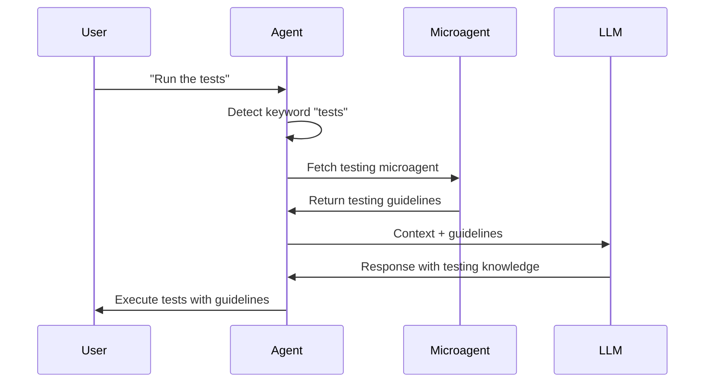

Microagents are specialized context providers that inject targeted knowledge into agent conversations when specific triggers are detected. They enable modular, reusable expertise without modifying the main agent.

## What are Microagents?

Microagents provide focused knowledge or instructions that are dynamically added to the agent's context when relevant keywords are detected in the conversation. This allows agents to access specialized expertise on-demand.

For a comprehensive guide on using microagents, see the [official microagents documentation](https://docs.all-hands.dev/usage/prompting/microagents-overview).

**Source**: [`openhands/sdk/context/microagents/`](https://github.com/All-Hands-AI/agent-sdk/tree/main/openhands/sdk/context/microagents)

## Microagent Types

**Source**: [`openhands/sdk/context/microagents/microagent.py`](https://github.com/All-Hands-AI/agent-sdk/blob/main/openhands/sdk/context/microagents/microagent.py)

The SDK provides three types of microagents, each serving a distinct purpose:

### 1. KnowledgeMicroagent

**Source**: [`openhands/sdk/context/microagents/microagent.py#L162`](https://github.com/All-Hands-AI/agent-sdk/blob/main/openhands/sdk/context/microagents/microagent.py#L162)

Provides specialized expertise triggered by keywords in conversations.

**Activation Logic:**
- Contains a list of trigger keywords
- Activated when any trigger appears in conversation
- Case-insensitive matching

**Use Cases:**
- Language best practices (Python, JavaScript, etc.)
- Framework guidelines (React, Django, etc.)
- Common patterns and anti-patterns
- Tool usage instructions

**Example:**
```python
from openhands.sdk.context.microagents import KnowledgeMicroagent

microagent = KnowledgeMicroagent(
    name="python_testing",
    content="Always use pytest for Python tests...",
    triggers=["pytest", "test", "unittest"]
)

# Triggered when message contains "pytest", "test", or "unittest"
```

### 2. RepoMicroagent

**Source**: [`openhands/sdk/context/microagents/microagent.py#L191`](https://github.com/All-Hands-AI/agent-sdk/blob/main/openhands/sdk/context/microagents/microagent.py#L191)

Repository-specific knowledge that's always active when working with a repository.

**Activation Logic:**
- No triggers required
- Always loaded and active for the repository
- Can define MCP tools configuration

**Use Cases:**
- Repository-specific guidelines
- Team practices and conventions
- Project-specific workflows
- Custom documentation references

**Special Files:**
- `.openhands_instructions` - Legacy repo instructions
- `.cursorrules` - Cursor IDE rules (auto-loaded)
- `agents.md` / `agent.md` - Agent instructions (auto-loaded)

**Example:**
```python
from openhands.sdk.context.microagents import RepoMicroagent

microagent = RepoMicroagent(
    name="project_guidelines",
    content="This project uses...",
    mcp_tools={"github": {"command": "npx", "args": ["-y", "@modelcontextprotocol/server-github"]}}
)
```

### 3. TaskMicroagent

**Source**: [`openhands/sdk/context/microagents/microagent.py#L236`](https://github.com/All-Hands-AI/agent-sdk/blob/main/openhands/sdk/context/microagents/microagent.py#L236)

Specialized KnowledgeMicroagent that requires user input before execution.

**Activation Logic:**
- Triggered by `/{agent_name}` format
- Prompts user for required inputs
- Processes inputs before injecting knowledge

**Use Cases:**
- Deployment procedures requiring credentials
- Multi-step workflows with parameters
- Interactive debugging sessions
- Customized task execution

**Example:**
```python
from openhands.sdk.context.microagents import TaskMicroagent, InputMetadata

microagent = TaskMicroagent(
    name="deploy",
    content="Deploy to {environment} with {version}...",
    triggers=["/deploy"],
    inputs=[
        InputMetadata(name="environment", type="string", required=True),
        InputMetadata(name="version", type="string", required=True)
    ]
)

# User types: "/deploy"
# Agent prompts: "Enter environment:" "Enter version:"
# Agent proceeds with filled template
```

## How Microagents Work



## Using Microagents

### Basic Usage

```python
from openhands.sdk import Agent, AgentContext

# Create context with microagents
context = AgentContext(
    microagents=["testing_expert", "code_reviewer"]
)

# Create agent with microagents
agent = Agent(
    llm=llm,
    tools=tools,
    agent_context=context
)
```

### Example Integration

See [`examples/01_standalone_sdk/03_activate_microagent.py`](https://github.com/All-Hands-AI/agent-sdk/blob/main/examples/01_standalone_sdk/03_activate_microagent.py) for a complete example.

## Microagent Structure

**Source**: [`openhands/sdk/context/microagents/microagent.py`](https://github.com/All-Hands-AI/agent-sdk/blob/main/openhands/sdk/context/microagents/microagent.py)

A microagent consists of:
- **Name**: Unique identifier
- **Triggers**: Keywords that activate the microagent
- **Content**: Knowledge or instructions to inject
- **Type**: One of "knowledge", "repo", or "task"

## Response Models

**Source**: [`openhands/sdk/context/microagents/types.py`](https://github.com/All-Hands-AI/agent-sdk/blob/main/openhands/sdk/context/microagents/types.py)

### MicroagentKnowledge

```python
class MicroagentKnowledge(BaseModel):
    name: str  # Microagent name
    trigger: str  # Keyword that triggered it
    content: str  # Injected content
```

### MicroagentResponse

```python
class MicroagentResponse(BaseModel):
    name: str  # Microagent name
    path: str  # Path or identifier
    created_at: datetime  # Creation timestamp
```

### MicroagentContentResponse

```python
class MicroagentContentResponse(BaseModel):
    content: str  # Full microagent content
    path: str  # Path or identifier
    triggers: list[str]  # Trigger keywords
    git_provider: str | None  # Git source if applicable
```

## Benefits

1. **Modularity**: Separate specialized knowledge from main agent logic
2. **Reusability**: Share microagents across multiple agents
3. **Maintainability**: Update expertise without modifying agent code
4. **Context-Aware**: Only inject relevant knowledge when needed
5. **Composability**: Combine multiple microagents for comprehensive coverage

## Best Practices

1. **Clear Triggers**: Use specific, unambiguous trigger keywords
2. **Focused Content**: Keep microagent content concise and targeted
3. **Avoid Overlap**: Minimize trigger conflicts between microagents
4. **Version Control**: Store microagents in version-controlled repositories
5. **Documentation**: Document trigger keywords and intended use cases

## See Also

- **[Official Microagents Guide](https://docs.all-hands.dev/usage/prompting/microagents-overview)** - Comprehensive documentation
- **[Agent Context](/sdk/architecture/sdk/agent.mdx)** - Using context with agents
- **[Example Code](https://github.com/All-Hands-AI/agent-sdk/blob/main/examples/01_standalone_sdk/03_activate_microagent.py)** - Working example
