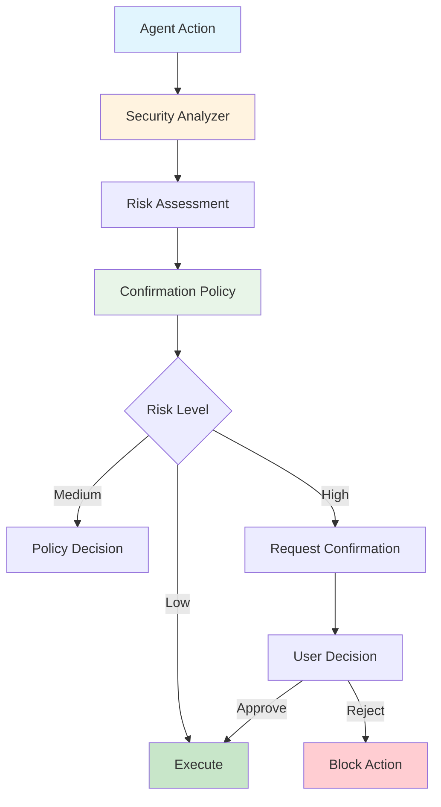
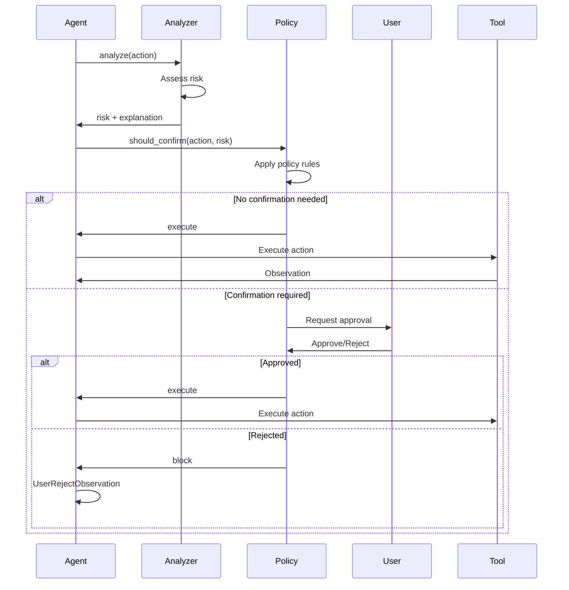

The security system enables control over agent actions through risk analysis and confirmation policies. It helps prevent dangerous operations while maintaining agent autonomy for safe actions.

**Source**: [`openhands/sdk/security/`](https://github.com/All-Hands-AI/agent-sdk/tree/main/openhands/sdk/security)

## Core Concepts



The security system consists of two components:
- **Security Analyzer**: Assesses risk level of actions
- **Confirmation Policy**: Decides when to require user confirmation

## Security Analyzer

### LLM Security Analyzer

**Source**: [`openhands/sdk/security/llm_analyzer.py`](https://github.com/All-Hands-AI/agent-sdk/blob/main/openhands/sdk/security/llm_analyzer.py)

Uses an LLM to analyze action safety:

```python
from openhands.sdk.security import LLMSecurityAnalyzer
from openhands.sdk import Agent, LLM
from pydantic import SecretStr

# Create security analyzer
security_analyzer = LLMSecurityAnalyzer(
    llm=LLM(
        model="anthropic/claude-sonnet-4-20250514",
        api_key=SecretStr("your-api-key")
    )
)

# Create agent with security analyzer
agent = Agent(
    llm=llm,
    tools=tools,
    security_analyzer=security_analyzer
)
```

### Risk Levels

**Source**: [`openhands/sdk/security/risk.py`](https://github.com/All-Hands-AI/agent-sdk/blob/main/openhands/sdk/security/risk.py)

```python
from openhands.sdk.security.risk import SecurityRisk

# Risk levels
SecurityRisk.LOW     # Safe operations (read files, list directories)
SecurityRisk.MEDIUM  # Potentially impactful (write files, API calls)
SecurityRisk.HIGH    # Dangerous operations (delete files, system changes)
```

### How LLM Analyzer Works

1. **Action Inspection**: Examines the action and its parameters
2. **Context Analysis**: Considers conversation history and workspace
3. **Risk Assessment**: LLM predicts risk level with reasoning
4. **Risk Return**: Returns risk level and explanation

```python
# Example internal flow
action = BashAction(command="rm -rf /")
risk = security_analyzer.analyze(action, context)
# Returns: SecurityRisk.HIGH, "Attempting to delete entire filesystem"
```

### Custom Security Analyzer

Implement custom risk analysis:

```python
from openhands.sdk.security.analyzer import SecurityAnalyzerBase
from openhands.sdk.security.risk import SecurityRisk
from openhands.sdk.tool import Action

class PatternBasedAnalyzer(SecurityAnalyzerBase):
    dangerous_patterns = ["rm -rf", "sudo", "DROP TABLE"]
    
    def analyze(
        self, 
        action: Action, 
        context: dict
    ) -> tuple[SecurityRisk, str]:
        command = getattr(action, "command", "")
        
        for pattern in self.dangerous_patterns:
            if pattern in command:
                return (
                    SecurityRisk.HIGH,
                    f"Dangerous pattern detected: {pattern}"
                )
        
        return SecurityRisk.LOW, "No dangerous patterns found"
```

## Confirmation Policies

**Source**: [`openhands/sdk/security/confirmation_policy.py`](https://github.com/All-Hands-AI/agent-sdk/blob/main/openhands/sdk/security/confirmation_policy.py)

### Built-in Policies

#### NeverConfirm

Never request confirmation (default):

```python
from openhands.sdk.security import NeverConfirm

agent = Agent(
    llm=llm,
    tools=tools,
    confirmation_policy=NeverConfirm()
)
```

#### AlwaysConfirm

Always request confirmation:

```python
from openhands.sdk.security import AlwaysConfirm

agent = Agent(
    llm=llm,
    tools=tools,
    security_analyzer=security_analyzer,
    confirmation_policy=AlwaysConfirm()
)
```

#### ConfirmOnHighRisk

Confirm only high-risk actions:

```python
from openhands.sdk.security import ConfirmOnHighRisk

agent = Agent(
    llm=llm,
    tools=tools,
    security_analyzer=security_analyzer,
    confirmation_policy=ConfirmOnHighRisk()
)
```

#### ConfirmOnMediumOrHighRisk

Confirm medium and high-risk actions:

```python
from openhands.sdk.security import ConfirmOnMediumOrHighRisk

agent = Agent(
    llm=llm,
    tools=tools,
    security_analyzer=security_analyzer,
    confirmation_policy=ConfirmOnMediumOrHighRisk()
)
```

### Custom Confirmation Policy

Implement custom confirmation logic:

```python
from openhands.sdk.security.confirmation_policy import ConfirmationPolicyBase
from openhands.sdk.security.risk import SecurityRisk
from openhands.sdk.tool import Action

class TimeBasedPolicy(ConfirmationPolicyBase):
    """Require confirmation during business hours."""
    
    def should_confirm(
        self, 
        action: Action, 
        risk: SecurityRisk, 
        context: dict
    ) -> bool:
        from datetime import datetime
        
        hour = datetime.now().hour
        
        # Business hours: always confirm high risk
        if 9 <= hour <= 17:
            return risk >= SecurityRisk.HIGH
        
        # Off hours: confirm medium and high risk
        return risk >= SecurityRisk.MEDIUM
```

## Using Security System

### Basic Setup

```python
from openhands.sdk import Agent, LLM, Conversation
from openhands.sdk.security import (
    LLMSecurityAnalyzer,
    ConfirmOnHighRisk
)
from pydantic import SecretStr

# Create analyzer
security_analyzer = LLMSecurityAnalyzer(
    llm=LLM(
        model="anthropic/claude-sonnet-4-20250514",
        api_key=SecretStr("your-api-key")
    )
)

# Create agent with security
agent = Agent(
    llm=llm,
    tools=tools,
    security_analyzer=security_analyzer,
    confirmation_policy=ConfirmOnHighRisk()
)

# Use in conversation
conversation = Conversation(agent=agent)
```

See [`examples/01_standalone_sdk/04_human_in_the_loop.py`](https://github.com/All-Hands-AI/agent-sdk/blob/main/examples/01_standalone_sdk/04_human_in_the_loop.py).

### Handling Confirmations

```python
from openhands.sdk import Conversation
from openhands.sdk.conversation.state import AgentExecutionStatus

conversation = Conversation(agent=agent)
conversation.send_message("Delete all temporary files")

# Run agent
conversation.run()

# Check if waiting for confirmation
if conversation.state.agent_status == AgentExecutionStatus.WAITING_FOR_CONFIRMATION:
    print("Action requires confirmation:")
    # Show pending action details
    
    # User approves
    conversation.confirm_pending_action()
    conversation.run()
    
    # Or user rejects
    # conversation.reject_pending_action(reason="Too risky")
```

### Dynamic Policy Changes

Change confirmation policy during execution:

```python
from openhands.sdk.security import AlwaysConfirm, NeverConfirm

conversation = Conversation(agent=agent)

# Start with strict policy
conversation.set_confirmation_policy(AlwaysConfirm())
conversation.send_message("Sensitive task")
conversation.run()

# Switch to permissive policy
conversation.set_confirmation_policy(NeverConfirm())
conversation.send_message("Safe task")
conversation.run()
```

## Security Workflow



## Best Practices

1. **Use LLM Analyzer**: Provides nuanced risk assessment
2. **Start Conservative**: Begin with strict policies, relax as needed
3. **Monitor Blocked Actions**: Review what's being blocked
4. **Provide Context**: Better context enables better risk assessment
5. **Test Security Setup**: Verify policies work as expected
6. **Document Policies**: Explain confirmation requirements to users
7. **Handle Rejections**: Implement proper error handling for rejected actions

## Performance Considerations

### LLM Analyzer Overhead

LLM security analysis adds latency:
- **Cost**: Additional LLM call per action
- **Latency**: ~1-2 seconds per analysis
- **Tokens**: ~500-1000 tokens per analysis

```python
# Only use with confirmation policy
agent = Agent(
    llm=llm,
    tools=tools,
    security_analyzer=security_analyzer,  # Costs tokens
    confirmation_policy=ConfirmOnHighRisk()  # Must be used together
)
```

### Optimization Tips

1. **Cache Similar Actions**: Reuse assessments for similar actions
2. **Use Faster Models**: Consider faster LLMs for security analysis
3. **Pattern-Based Pre-Filter**: Use pattern matching before LLM analysis
4. **Batch Analysis**: Analyze multiple actions together when possible

## Security Best Practices

### Principle of Least Privilege

```python
# Provide only necessary tools
agent = Agent(
    llm=llm,
    tools=[
        FileEditorTool.create(),  # Safe file operations
        # Don't include BashTool for untrusted tasks
    ]
)
```

### Sandbox Execution

```python
# Use DockerWorkspace for isolation
from openhands.workspace import DockerWorkspace

workspace = DockerWorkspace(
    working_dir="/workspace",
    image="ubuntu:22.04"
)

conversation = Conversation(agent=agent, workspace=workspace)
```

### Secrets Management

```python
# Provide secrets securely
conversation = Conversation(
    agent=agent,
    secrets={
        "API_KEY": "secret-value",
        "PASSWORD": "secure-password"
    }
)
```

See [`examples/01_standalone_sdk/12_custom_secrets.py`](https://github.com/All-Hands-AI/agent-sdk/blob/main/examples/01_standalone_sdk/12_custom_secrets.py).

## See Also

- **[Agent](/sdk/architecture/sdk/agent.mdx)** - Agent configuration with security
- **[Conversation](/sdk/architecture/sdk/conversation.mdx)** - Handling confirmations
- **[Tools](/sdk/architecture/sdk/tool.mdx)** - Tool security considerations
- **[Human-in-the-Loop Example](https://github.com/All-Hands-AI/agent-sdk/blob/main/examples/01_standalone_sdk/04_human_in_the_loop.py)** - Complete example
