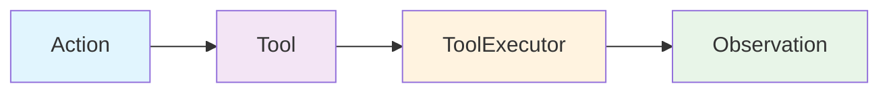

The tool system enables agents to interact with external systems and perform actions. Tools follow a typed action/observation pattern with comprehensive validation and schema generation.

## Core Concepts



A tool consists of three components:
- **Action**: Input schema defining tool parameters
- **ToolExecutor**: Logic that executes the tool
- **Observation**: Output schema with execution results

**Source**: [`openhands/sdk/tool/`](https://github.com/All-Hands-AI/agent-sdk/tree/main/openhands/sdk/tool)

## Defining Custom Tools

### 1. Define Action and Observation

**Source**: [`openhands/sdk/tool/schema.py`](https://github.com/All-Hands-AI/agent-sdk/blob/main/openhands/sdk/tool/schema.py)

```python
from openhands.sdk.tool import Action, Observation

class CalculateAction(Action):
    """Action to perform calculation."""
    expression: str
    precision: int = 2

class CalculateObservation(Observation):
    """Result of calculation."""
    result: float
    success: bool
```

### 2. Implement ToolExecutor

**Source**: [`openhands/sdk/tool/tool.py`](https://github.com/All-Hands-AI/agent-sdk/blob/main/openhands/sdk/tool/tool.py)

```python
from openhands.sdk.tool import ToolExecutor

class CalculateExecutor(ToolExecutor[CalculateAction, CalculateObservation]):
    def __call__(self, action: CalculateAction) -> CalculateObservation:
        try:
            result = eval(action.expression)
            return CalculateObservation(
                result=round(result, action.precision),
                success=True
            )
        except Exception as e:
            return CalculateObservation(
                result=0.0,
                success=False,
                error=str(e)
            )
```

### 3. Create Tool Class

```python
from openhands.sdk.tool import Tool

class CalculateTool(Tool[CalculateAction, CalculateObservation]):
    name: str = "calculate"
    description: str = "Evaluate mathematical expressions"
    action_type: type[Action] = CalculateAction
    observation_type: type[Observation] = CalculateObservation
    
    @classmethod
    def create(cls) -> list["CalculateTool"]:
        executor = CalculateExecutor()
        return [cls().set_executor(executor)]
```

### Complete Example

See [`examples/01_standalone_sdk/02_custom_tools.py`](https://github.com/All-Hands-AI/agent-sdk/blob/main/examples/01_standalone_sdk/02_custom_tools.py) for a working example.

## Built-in Tools

**Source**: [`openhands/sdk/tool/builtins/`](https://github.com/All-Hands-AI/agent-sdk/tree/main/openhands/sdk/tool/builtins)

### FinishTool

**Source**: [`openhands/sdk/tool/builtins/finish.py`](https://github.com/All-Hands-AI/agent-sdk/blob/main/openhands/sdk/tool/builtins/finish.py)

Signals task completion with optional output.

```python
from openhands.sdk.tool.builtins import FinishTool

# Automatically included with agents
finish_tool = FinishTool.create()
```

### ThinkTool

**Source**: [`openhands/sdk/tool/builtins/think.py`](https://github.com/All-Hands-AI/agent-sdk/blob/main/openhands/sdk/tool/builtins/think.py)

Enables internal reasoning without external actions.

```python
from openhands.sdk.tool.builtins import ThinkTool

# Automatically included with agents
think_tool = ThinkTool.create()
```

## Tool Annotations

**Source**: [`openhands/sdk/tool/tool.py`](https://github.com/All-Hands-AI/agent-sdk/blob/main/openhands/sdk/tool/tool.py)

Provide hints about tool behavior following [MCP spec](https://modelcontextprotocol.io/):

```python
from openhands.sdk.tool import ToolAnnotations

annotations = ToolAnnotations(
    title="Calculate",
    readOnlyHint=True,  # Tool doesn't modify environment
    destructiveHint=False,  # Tool doesn't perform destructive updates
    idempotentHint=True,  # Same input produces same output
    openWorldHint=False  # Tool doesn't interact with external entities
)

class CalculateTool(Tool[CalculateAction, CalculateObservation]):
    annotations: ToolAnnotations = annotations
    # ... rest of tool definition
```

## Tool Registry

**Source**: [`openhands/sdk/tool/registry.py`](https://github.com/All-Hands-AI/agent-sdk/blob/main/openhands/sdk/tool/registry.py)

Tools are automatically registered when defined. The registry manages tool discovery and schema generation for LLM function calling.

## Advanced Patterns

### Stateful Executors

Executors can maintain state across executions:

```python
class DatabaseExecutor(ToolExecutor[QueryAction, QueryObservation]):
    def __init__(self, connection_string: str):
        self.connection = connect(connection_string)
    
    def __call__(self, action: QueryAction) -> QueryObservation:
        result = self.connection.execute(action.query)
        return QueryObservation(rows=result.fetchall())
    
    def close(self) -> None:
        """Clean up resources."""
        self.connection.close()
```

### Dynamic Tool Creation

Create tools with runtime configuration:

```python
class ConfigurableTool(Tool[MyAction, MyObservation]):
    @classmethod
    def create(cls, api_key: str, endpoint: str) -> list["ConfigurableTool"]:
        executor = MyExecutor(api_key=api_key, endpoint=endpoint)
        return [cls().set_executor(executor)]

# Use with different configurations
tool1 = ConfigurableTool.create(api_key="key1", endpoint="https://api1.com")
tool2 = ConfigurableTool.create(api_key="key2", endpoint="https://api2.com")
```

## Best Practices

1. **Type Safety**: Use Pydantic models for actions and observations
2. **Error Handling**: Always handle exceptions in executors
3. **Resource Management**: Implement `close()` for cleanup
4. **Clear Descriptions**: Provide detailed docstrings for LLM understanding
5. **Validation**: Leverage Pydantic validators for input validation

## See Also

- **[Pre-defined Tools](/sdk/architecture/tools/)** - Ready-to-use tool implementations
- **[MCP Integration](/sdk/architecture/sdk/mcp.mdx)** - Connect to external MCP tools
- **[Agent Usage](/sdk/architecture/sdk/agent.mdx)** - Using tools with agents
