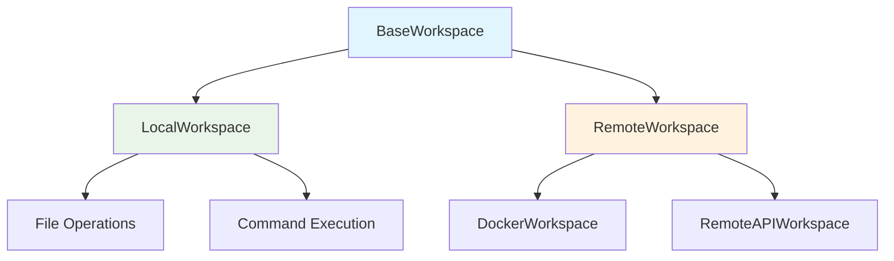

The workspace interface defines how agents interact with their execution environment. It provides a unified API for file operations and command execution, supporting both local and remote environments.

**Source**: [`openhands/sdk/workspace/`](https://github.com/All-Hands-AI/agent-sdk/tree/main/openhands/sdk/workspace)

## Core Concepts



A workspace provides:
- **File Operations**: Upload, download, read, write
- **Command Execution**: Run bash commands with timeout support
- **Resource Management**: Context manager protocol for cleanup
- **Flexibility**: Local development or remote sandboxed execution

## Base Interface

**Source**: [`openhands/sdk/workspace/base.py`](https://github.com/All-Hands-AI/agent-sdk/blob/main/openhands/sdk/workspace/base.py)

### BaseWorkspace

Abstract base class defining the workspace interface:

```python
from openhands.sdk.workspace import BaseWorkspace

class CustomWorkspace(BaseWorkspace):
    working_dir: str  # Required: working directory path
    
    def execute_command(
        self, 
        command: str, 
        cwd: str | None = None,
        timeout: float = 30.0
    ) -> CommandResult:
        """Execute bash command."""
        ...
    
    def file_upload(
        self,
        source_path: str,
        destination_path: str
    ) -> FileOperationResult:
        """Upload file to workspace."""
        ...
    
    def file_download(
        self,
        source_path: str,
        destination_path: str
    ) -> FileOperationResult:
        """Download file from workspace."""
        ...
```

### Context Manager Protocol

All workspaces support the context manager protocol for safe resource management:

```python
with workspace:
    result = workspace.execute_command("echo 'hello'")
    # Workspace automatically cleans up on exit
```

## LocalWorkspace

**Source**: [`openhands/sdk/workspace/local.py`](https://github.com/All-Hands-AI/agent-sdk/blob/main/openhands/sdk/workspace/local.py)

Executes operations directly on the local machine.

```python
from openhands.sdk.workspace import LocalWorkspace

workspace = LocalWorkspace(working_dir="/path/to/project")

# Execute command
result = workspace.execute_command("ls -la")
print(result.stdout)

# Upload file (copy)
workspace.file_upload("local_file.txt", "workspace_file.txt")

# Download file (copy)
workspace.file_download("workspace_file.txt", "local_copy.txt")
```

**Use Cases**:
- Local development and testing
- Direct file system access
- No sandboxing required
- Fast execution without network overhead

## RemoteWorkspace

**Source**: [`openhands/sdk/workspace/remote/`](https://github.com/All-Hands-AI/agent-sdk/tree/main/openhands/sdk/workspace/remote)

Abstract base for remote execution environments.

### RemoteWorkspace Mixin

**Source**: [`openhands/sdk/workspace/remote/base.py`](https://github.com/All-Hands-AI/agent-sdk/blob/main/openhands/sdk/workspace/remote/base.py)

Provides common functionality for remote workspaces:
- Network communication
- File transfer protocols
- Command execution over API
- Resource cleanup

### AsyncRemoteWorkspace

**Source**: [`openhands/sdk/workspace/remote/async_remote_workspace.py`](https://github.com/All-Hands-AI/agent-sdk/blob/main/openhands/sdk/workspace/remote/async_remote_workspace.py)

Async version for concurrent operations.

## Concrete Remote Implementations

Remote workspace implementations are provided in the `workspace` package:

### DockerWorkspace

**Source**: See [workspace/docker documentation](/sdk/architecture/workspace/docker.mdx)

Executes operations in an isolated Docker container.

```python
from openhands.workspace import DockerWorkspace

workspace = DockerWorkspace(
    working_dir="/workspace",
    image="ubuntu:22.04",
    container_name="agent-sandbox"
)

with workspace:
    result = workspace.execute_command("python script.py")
```

**Benefits**:
- Strong isolation and sandboxing
- Reproducible environments
- Resource limits and security
- Clean slate for each session

### RemoteAPIWorkspace

**Source**: See [workspace/remote_api documentation](/sdk/architecture/workspace/remote_api.mdx)

Connects to a remote agent server via API.

```python
from openhands.workspace import RemoteAPIWorkspace

workspace = RemoteAPIWorkspace(
    working_dir="/workspace",
    api_url="https://agent-server.example.com",
    api_key="your-api-key"
)

with workspace:
    result = workspace.execute_command("npm test")
```

**Benefits**:
- Centralized agent execution
- Shared resources and caching
- Scalable architecture
- Remote monitoring and logging

## Result Models

**Source**: [`openhands/sdk/workspace/models.py`](https://github.com/All-Hands-AI/agent-sdk/blob/main/openhands/sdk/workspace/models.py)

### CommandResult

```python
class CommandResult(BaseModel):
    stdout: str  # Standard output
    stderr: str  # Standard error
    exit_code: int  # Exit code (0 = success)
    duration: float  # Execution time in seconds
```

### FileOperationResult

```python
class FileOperationResult(BaseModel):
    success: bool  # Operation success status
    message: str  # Status message
    path: str  # File path
```

## Usage with Agents

Workspaces integrate with agents through tools:

```python
from openhands.sdk import Agent, LLM
from openhands.tools import BashTool, FileEditorTool
from openhands.sdk.workspace import LocalWorkspace

# Create workspace
workspace = LocalWorkspace(working_dir="/project")

# Create tools with workspace
tools = [
    BashTool.create(working_dir=workspace.working_dir),
    FileEditorTool.create()
]

# Create agent
agent = Agent(llm=llm, tools=tools)
```

## Local vs Remote Comparison

| Feature | LocalWorkspace | RemoteWorkspace |
|---------|---------------|-----------------|
| **Execution** | Local machine | Remote server/container |
| **Isolation** | None | Strong (Docker/API) |
| **Performance** | Fast | Network latency |
| **Security** | Host system | Sandboxed environment |
| **Setup** | Simple | Requires infrastructure |
| **Use Case** | Development | Production/Multi-user |

## Advanced Usage

### Custom Workspace Implementation

```python
from openhands.sdk.workspace import BaseWorkspace
from openhands.sdk.workspace.models import CommandResult, FileOperationResult

class CloudWorkspace(BaseWorkspace):
    working_dir: str
    cloud_instance_id: str
    
    def execute_command(
        self, 
        command: str, 
        cwd: str | None = None,
        timeout: float = 30.0
    ) -> CommandResult:
        # Execute on cloud instance
        response = self.cloud_api.run_command(
            instance_id=self.cloud_instance_id,
            command=command
        )
        return CommandResult(
            stdout=response.stdout,
            stderr=response.stderr,
            exit_code=response.exit_code,
            duration=response.duration
        )
    
    def file_upload(
        self,
        source_path: str,
        destination_path: str
    ) -> FileOperationResult:
        # Upload to cloud storage
        ...
    
    def file_download(
        self,
        source_path: str,
        destination_path: str
    ) -> FileOperationResult:
        # Download from cloud storage
        ...
```

### Error Handling

```python
from openhands.sdk.workspace import LocalWorkspace

workspace = LocalWorkspace(working_dir="/project")

try:
    result = workspace.execute_command("risky_command", timeout=60.0)
    if result.exit_code != 0:
        print(f"Command failed: {result.stderr}")
except TimeoutError:
    print("Command timed out")
except Exception as e:
    print(f"Execution error: {e}")
```

## Best Practices

1. **Use Context Managers**: Always use `with` statements for proper cleanup
2. **Set Appropriate Timeouts**: Prevent hanging on long-running commands
3. **Validate Working Directory**: Ensure paths exist before operations
4. **Handle Errors**: Check exit codes and handle exceptions
5. **Choose Right Workspace**: Local for development, remote for production
6. **Resource Limits**: Set appropriate resource limits for remote workspaces

## See Also

- **[DockerWorkspace](/sdk/architecture/workspace/docker.mdx)** - Docker-based sandboxing
- **[RemoteAPIWorkspace](/sdk/architecture/workspace/remote_api.mdx)** - API-based remote execution
- **[Agent Server](/sdk/architecture/agent_server/overview.mdx)** - Remote agent execution server
- **[Examples](https://github.com/All-Hands-AI/agent-sdk/tree/main/examples/02_remote_agent_server)** - Remote workspace usage examples
