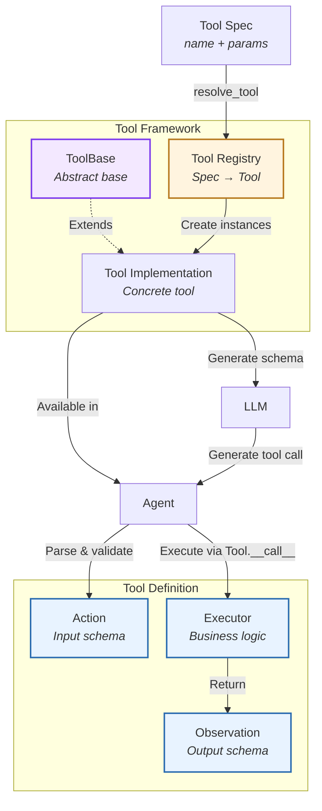
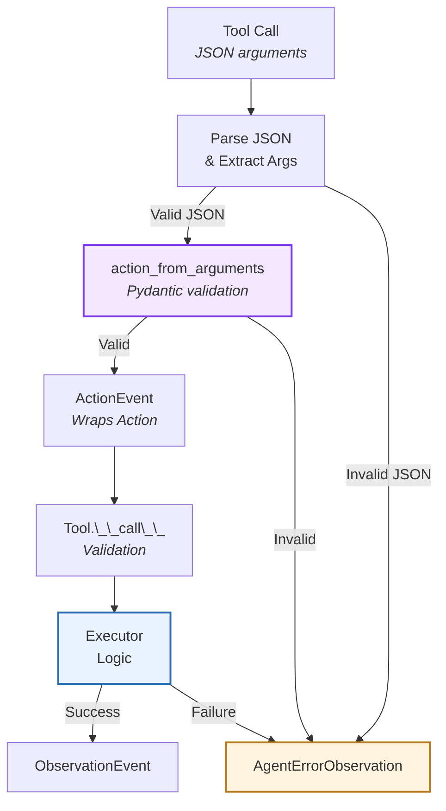
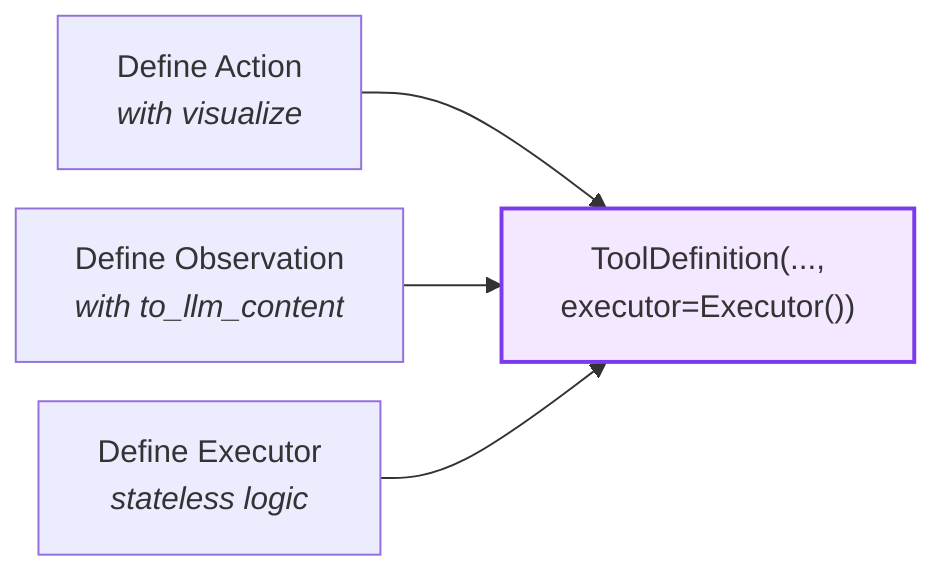
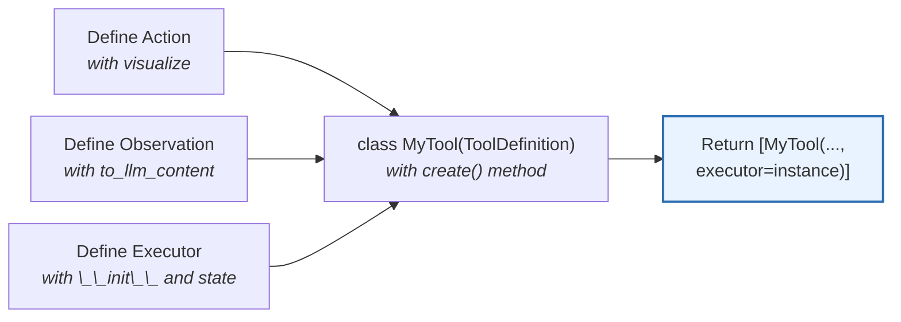
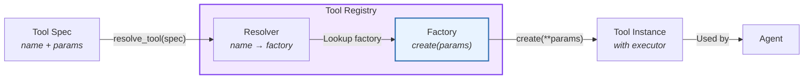
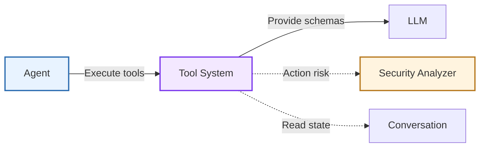

The **Tool System** provides a type-safe, extensible framework for defining agent capabilities. It standardizes how agents interact with external systems through a structured Action-Observation pattern with automatic validation and schema generation.

**Source:** [`openhands-sdk/openhands/sdk/tool/`](https://github.com/All-Hands-AI/agent-sdk/tree/main/openhands-sdk/openhands/sdk/tool)

## Core Responsibilities

The Tool System has four primary responsibilities:

1. **Type Safety** - Enforce action/observation schemas via Pydantic models
2. **Schema Generation** - Auto-generate LLM-compatible tool descriptions from Pydantic schemas
3. **Execution Lifecycle** - Validate inputs, execute logic, wrap outputs
4. **Tool Registry** - Discover and resolve tools by name or pattern

## Architecture



### Key Components

| Component | Purpose | Design |
|-----------|---------|--------|
| **[`ToolBase`](https://github.com/All-Hands-AI/agent-sdk/blob/main/openhands-sdk/openhands/sdk/tool/tool.py)** | Abstract base class | Generic over Action and Observation types, defines abstract `create()` |
| **[`ToolDefinition`](https://github.com/All-Hands-AI/agent-sdk/blob/main/openhands-sdk/openhands/sdk/tool/tool.py)** | Concrete tool class | Can be instantiated directly or subclassed for factory pattern |
| **[`Action`](https://github.com/All-Hands-AI/agent-sdk/blob/main/openhands-sdk/openhands/sdk/tool/schema.py)** | Input model | Pydantic model with `visualize` property |
| **[`Observation`](https://github.com/All-Hands-AI/agent-sdk/blob/main/openhands-sdk/openhands/sdk/tool/schema.py)** | Output model | Pydantic model with `to_llm_content` property |
| **[`ToolExecutor`](https://github.com/All-Hands-AI/agent-sdk/blob/main/openhands-sdk/openhands/sdk/tool/tool.py)** | Execution interface | ABC with `__call__()` method, optional `close()` |
| **[`ToolAnnotations`](https://github.com/All-Hands-AI/agent-sdk/blob/main/openhands-sdk/openhands/sdk/tool/tool.py)** | Behavioral hints | MCP-spec hints (readOnly, destructive, idempotent, openWorld) |
| **[`Tool` (spec)](https://github.com/All-Hands-AI/agent-sdk/blob/main/openhands-sdk/openhands/sdk/tool/spec.py)** | Tool specification | Configuration object with name and params |
| **[`ToolRegistry`](https://github.com/All-Hands-AI/agent-sdk/blob/main/openhands-sdk/openhands/sdk/tool/registry.py)** | Tool discovery | Resolves Tool specs to ToolDefinition instances |

## Action-Observation Pattern

All tools follow a **strict input-output contract** with event wrapping:



**Type Safety Guarantees:**

| Stage | Validation | Enforced By |
|-------|------------|-------------|
| **LLM → Tool Call** | Valid JSON structure | LLM Provider |
| **Tool Call → Action** | JSON matches action schema | Pydantic (`action_from_arguments`) |
| **Action → ActionEvent** | Action wrapped in event | Event system |
| **ActionEvent → Executor** | Type-correct parameters via `Tool.__call__` | Python type system |
| **Executor → ObservationEvent** | Type-correct results | Pydantic serialization in `Tool.__call__` |

## Tool Definition

Tools are defined using two patterns depending on complexity:

### Pattern 1: Direct Instantiation (Simple Tools)

For stateless tools that don't need runtime configuration (e.g., `finish`, `think`):



**Components:**
1. **Action** - Pydantic model with `visualize` property for display
2. **Observation** - Pydantic model with `to_llm_content` property for LLM
3. **ToolExecutor** - Stateless executor with `__call__(action) → observation`
4. **ToolDefinition** - Direct instantiation with executor instance

### Pattern 2: Subclass with Factory (Stateful Tools)

For tools requiring runtime configuration or persistent state (e.g., `execute_bash`, `file_editor`, `glob`):



**Components:**
1. **Action/Observation** - Same as Pattern 1
2. **ToolExecutor** - Stateful executor with `__init__()` for configuration and optional `close()` for cleanup
3. **MyTool(ToolDefinition)** - Subclass with `@classmethod create(conv_state, ...)` factory method
4. **Factory Method** - Returns sequence of configured tool instances

```mermaid
%%{init: {"theme": "default", "flowchart": {"nodeSpacing": 30}} }%%
flowchart TB
    subgraph Pattern1["Pattern 1: Direct Instantiation"]
        P1A["Define Action/Observation<br>with visualize/to_llm_content"]
        P1E["Define ToolExecutor<br>with __call__()"]
        P1T["ToolDefinition(...,<br>executor=Executor())"]
    end
    
    subgraph Pattern2["Pattern 2: Subclass with Factory"]
        P2A["Define Action/Observation<br>with visualize/to_llm_content"]
        P2E["Define Stateful ToolExecutor<br>with \_\_init\_\_() and __call__()"]
        P2C["class MyTool(ToolDefinition)<br>@classmethod create()"]
        P2I["Return [MyTool(...,<br>executor=instance)]"]
    end
    
    P1A --> P1E
    P1E --> P1T
    
    P2A --> P2E
    P2E --> P2C
    P2C --> P2I
    
    style P1T fill:#f3e8ff,stroke:#7c3aed,stroke-width:2px
    style P2I fill:#e8f3ff,stroke:#2b6cb0,stroke-width:2px
```



**Key Design Elements:**

| Component | Purpose | Requirements |
|-----------|---------|--------------|
| **Action** | Defines LLM-provided parameters | Extends `Action`, includes `visualize` property returning Rich Text |
| **Observation** | Defines structured output | Extends `Observation`, includes `to_llm_content` property returning content list |
| **ToolExecutor** | Implements business logic | Extends `ToolExecutor[ActionT, ObservationT]`, implements `__call__()` method |
| **ToolDefinition** | Ties everything together | Either instantiate directly (Pattern 1) or subclass with `create()` method (Pattern 2) |

**When to Use Each Pattern:**

| Pattern | Use Case | Examples |
|---------|----------|----------|
| **Direct Instantiation** | Stateless tools with no configuration needs | `finish`, `think`, simple utilities |
| **Subclass with Factory** | Tools requiring runtime state or configuration | `execute_bash`, `file_editor`, `glob`, `grep` |

### Tool Annotations

Tools include optional `ToolAnnotations` based on the [Model Context Protocol (MCP) spec](https://github.com/modelcontextprotocol/modelcontextprotocol) that provide behavioral hints to LLMs:

| Field | Meaning | Examples |
|-------|---------|----------|
| `readOnlyHint` | Tool doesn't modify state | `glob` (True), `execute_bash` (False) |
| `destructiveHint` | May delete/overwrite data | `file_editor` (True), `task_tracker` (False) |
| `idempotentHint` | Repeated calls are safe | `glob` (True), `execute_bash` (False) |
| `openWorldHint` | Interacts beyond closed domain | `execute_bash` (True), `task_tracker` (False) |

**Key Behaviors:**
- [LLM-based Security risk prediction](/llm/guides/security) automatically added for tools with `readOnlyHint=False`
- Annotations help LLMs reason about tool safety and side effects

## Tool Registry

The registry enables **dynamic tool discovery** and instantiation from tool specifications:



**Resolution Workflow:**

1. **[Tool (Spec)](https://github.com/All-Hands-AI/agent-sdk/blob/main/openhands-sdk/openhands/sdk/tool/spec.py)** - Configuration object with `name` (e.g., "BashTool") and `params` (e.g., `{"working_dir": "/workspace"}`)
2. **Resolver Lookup** - Registry finds the registered resolver for the tool name
3. **Factory Invocation** - Resolver calls the tool's `.create()` method with params and conversation state
4. **Instance Creation** - Tool instance(s) are created with configured executors
5. **Agent Usage** - Instances are added to the agent's tools_map for execution

**Registration Types:**

| Type | Registration | Resolver Behavior |
|------|-------------|-------------------|
| **Tool Instance** | `register_tool(name, instance)` | Returns the fixed instance (params not allowed) |
| **Tool Subclass** | `register_tool(name, ToolClass)` | Calls `ToolClass.create(**params, conv_state=state)` |
| **Factory Function** | `register_tool(name, factory)` | Calls `factory(**params, conv_state=state)` |

## Component Relationships

### How Tool System Interacts



**Relationship Characteristics:**
- **Tools → LLM**: Generate schemas describing capabilities
- **Agent → Tools**: Execute actions, receive observations
- **Tools → Conversation**: Read state for context-aware execution
- **Tools → Security**: Annotations inform risk assessment

## File Organization

Tools follow a consistent file structure for maintainability:

```
openhands-tools/openhands/tools/my_tool/
├── __init__.py           # Export MyTool
├── definition.py         # Action, Observation, MyTool(ToolDefinition)
├── impl.py              # MyExecutor(ToolExecutor)
└── [other modules]      # Tool-specific utilities
```

**File Responsibilities:**

| File | Contains | Purpose |
|------|----------|---------|
| `definition.py` | Action, Observation, ToolDefinition subclass | Public API, schema definitions, factory method |
| `impl.py` | ToolExecutor implementation | Business logic, state management, execution |
| `__init__.py` | Tool exports | Package interface |

**Benefits:**
- **Separation of Concerns** - Public API separate from implementation
- **Avoid Circular Imports** - Import `impl` only inside `create()` method
- **Consistency** - All tools follow same structure for discoverability

**Example Reference:** See [`execute_bash/`](https://github.com/All-Hands-AI/agent-sdk/tree/main/openhands-tools/openhands/tools/execute_bash) for complete implementation

## See Also

- **[Agent Architecture](/sdk/arch/agent)** - How agents select and execute tools
- **[Events](/sdk/arch/events)** - ActionEvent and ObservationEvent structures
- **[Security Analyzer](/sdk/arch/security)** - Action risk assessment
- **[MCP Integration](/sdk/arch/mcp)** - External tool protocol
- **[Custom Tools Guide](/sdk/guides/custom-tools)** - Building your own tools
