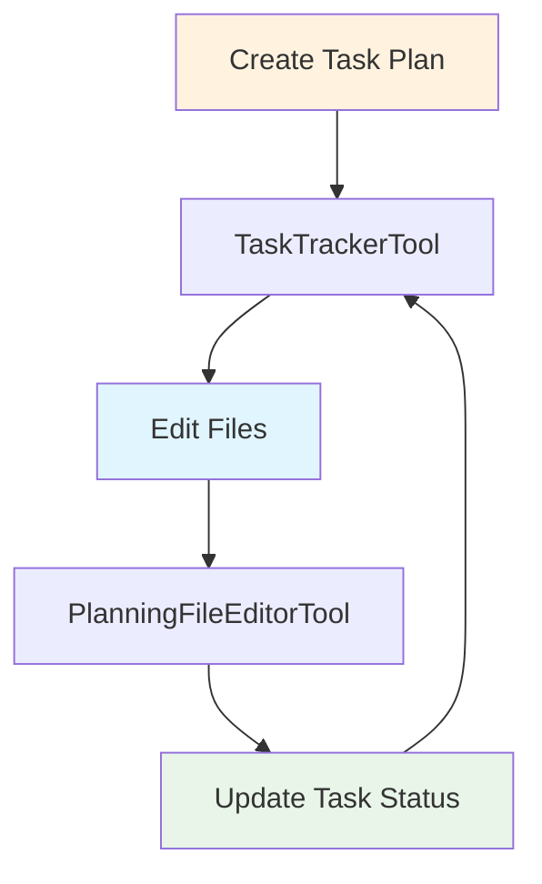

PlanningFileEditorTool extends FileEditorTool with multi-file editing capabilities optimized for planning agent workflows.

**Source**: [`openhands/tools/planning_file_editor/`](https://github.com/All-Hands-AI/agent-sdk/tree/main/openhands/tools/planning_file_editor)

## Overview

PlanningFileEditorTool provides:
- All FileEditorTool capabilities
- Optimized for planning workflows
- Batch file operations
- Coordination with TaskTrackerTool

## Usage

```python
from openhands.tools import PlanningFileEditorTool

agent = Agent(llm=llm, tools=[PlanningFileEditorTool.create()])
```

## Relation to FileEditorTool

PlanningFileEditorTool inherits all FileEditorTool commands:
- `view`: View file contents
- `create`: Create new files
- `str_replace`: Replace strings
- `insert`: Insert lines
- `undo_edit`: Undo changes

See [FileEditorTool](/sdk/architecture/tools/file_editor.mdx) for detailed command documentation.

## Planning Workflow Integration



## Usage in Planning Workflows

See [`examples/01_standalone_sdk/24_planning_agent_workflow.py`](https://github.com/All-Hands-AI/agent-sdk/blob/main/examples/01_standalone_sdk/24_planning_agent_workflow.py):

```python
from openhands.tools.preset import get_planning_tools

# Get planning toolset (includes PlanningFileEditorTool)
tools = get_planning_tools()

agent = Agent(llm=llm, tools=tools)
```

## Multi-File Workflow Example

```python
# 1. Plan tasks
TaskTrackerAction(
    command="plan",
    task_list=[
        Task(title="Create config file", status="todo"),
        Task(title="Create main script", status="todo"),
        Task(title="Create tests", status="todo")
    ]
)

# 2. Create files
PlanningFileEditAction(
    command="create",
    path="config.yaml",
    file_text="settings:\n  debug: true\n"
)

PlanningFileEditAction(
    command="create",
    path="main.py",
    file_text="import yaml\n\nif __name__ == '__main__':\n    pass\n"
)

# 3. Update task status
TaskTrackerAction(
    command="plan",
    task_list=[
        Task(title="Create config file", status="done"),
        Task(title="Create main script", status="done"),
        Task(title="Create tests", status="in_progress")
    ]
)
```

## Best Practices

1. **Use with TaskTrackerTool**: Coordinate file edits with task status
2. **Plan Before Editing**: Create task plan first
3. **Update Progress**: Mark tasks complete after edits
4. **Follow Workflow**: Plan → Edit → Update → Repeat
5. **Use Planning Preset**: Get all planning tools together

## When to Use

Use PlanningFileEditorTool when:
- Building complex multi-file projects
- Following structured planning workflows
- Coordinating with task tracking
- Need agent to manage implementation phases

Use regular FileEditorTool for:
- Simple file editing tasks
- Single-file modifications
- Ad-hoc editing without planning

## See Also

- **[FileEditorTool](/sdk/architecture/tools/file_editor.mdx)** - Base file editing capabilities
- **[TaskTrackerTool](/sdk/architecture/tools/task_tracker.mdx)** - Task management
- **[Planning Preset](https://github.com/All-Hands-AI/agent-sdk/blob/main/openhands/tools/preset/planning.py)** - Complete planning toolset
- **[Planning Example](https://github.com/All-Hands-AI/agent-sdk/blob/main/examples/01_standalone_sdk/24_planning_agent_workflow.py)** - Full workflow example
