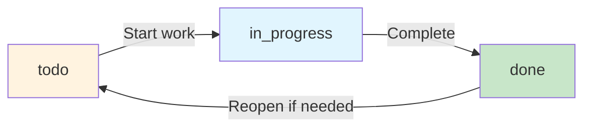

TaskTrackerTool enables agents to create, update, and manage task lists for complex multi-step workflows.

**Source**: [`openhands/tools/task_tracker/`](https://github.com/All-Hands-AI/agent-sdk/tree/main/openhands/tools/task_tracker)

## Usage

```python
from openhands.tools import TaskTrackerTool

agent = Agent(llm=llm, tools=[TaskTrackerTool.create()])
```

## Action Model

**Source**: [`openhands/tools/task_tracker/definition.py`](https://github.com/All-Hands-AI/agent-sdk/blob/main/openhands/tools/task_tracker/definition.py)

```python
class TaskTrackerAction(Action):
    command: Literal["view", "plan"]
    task_list: list[Task] | None = None  # For plan command
```

### Task Model

```python
class Task:
    title: str  # Task title
    status: Literal["todo", "in_progress", "done"]  # Task status
    notes: str | None = None  # Optional notes
```

## Observation Model

```python
class TaskTrackerObservation(Observation):
    task_list: list[Task]  # Current task list
    message: str  # Status message
```

## Commands

### view
View current task list.

```python
TaskTrackerAction(command="view")
```

### plan
Create or update task list.

```python
TaskTrackerAction(
    command="plan",
    task_list=[
        Task(title="Setup environment", status="done"),
        Task(title="Write code", status="in_progress"),
        Task(title="Run tests", status="todo")
    ]
)
```

## Usage Patterns

### Initialize Task List

```python
TaskTrackerAction(
    command="plan",
    task_list=[
        Task(title="Analyze requirements", status="todo"),
        Task(title="Design solution", status="todo"),
        Task(title="Implement features", status="todo"),
        Task(title="Write tests", status="todo"),
        Task(title="Deploy", status="todo")
    ]
)
```

### Update Progress

```python
TaskTrackerAction(
    command="plan",
    task_list=[
        Task(title="Analyze requirements", status="done"),
        Task(title="Design solution", status="in_progress"),
        Task(title="Implement features", status="todo"),
        Task(title="Write tests", status="todo"),
        Task(title="Deploy", status="todo")
    ]
)
```

### Check Current Status

```python
TaskTrackerAction(command="view")
# Returns current task list with status
```

## Best Practices

1. **Plan Early**: Create task list at workflow start
2. **Update Regularly**: Mark tasks as progress happens
3. **Use Notes**: Add details for complex tasks
4. **One Task Active**: Focus on one "in_progress" task
5. **Mark Complete**: Set "done" when finished

## Task Status Workflow



## Example: Planning Agent

See [`examples/01_standalone_sdk/24_planning_agent_workflow.py`](https://github.com/All-Hands-AI/agent-sdk/blob/main/examples/01_standalone_sdk/24_planning_agent_workflow.py):

```python
# Planning agent uses TaskTrackerTool for workflow management
from openhands.tools.preset import get_planning_tools

agent = Agent(
    llm=llm,
    tools=get_planning_tools()  # Includes TaskTrackerTool
)
```

## See Also

- **[PlanningFileEditorTool](/sdk/architecture/tools/planning_file_editor.mdx)** - Multi-file editing for planning
- **[Planning Preset](https://github.com/All-Hands-AI/agent-sdk/blob/main/openhands/tools/preset/planning.py)** - Planning toolset
- **[Planning Example](https://github.com/All-Hands-AI/agent-sdk/blob/main/examples/01_standalone_sdk/24_planning_agent_workflow.py)** - Complete workflow
