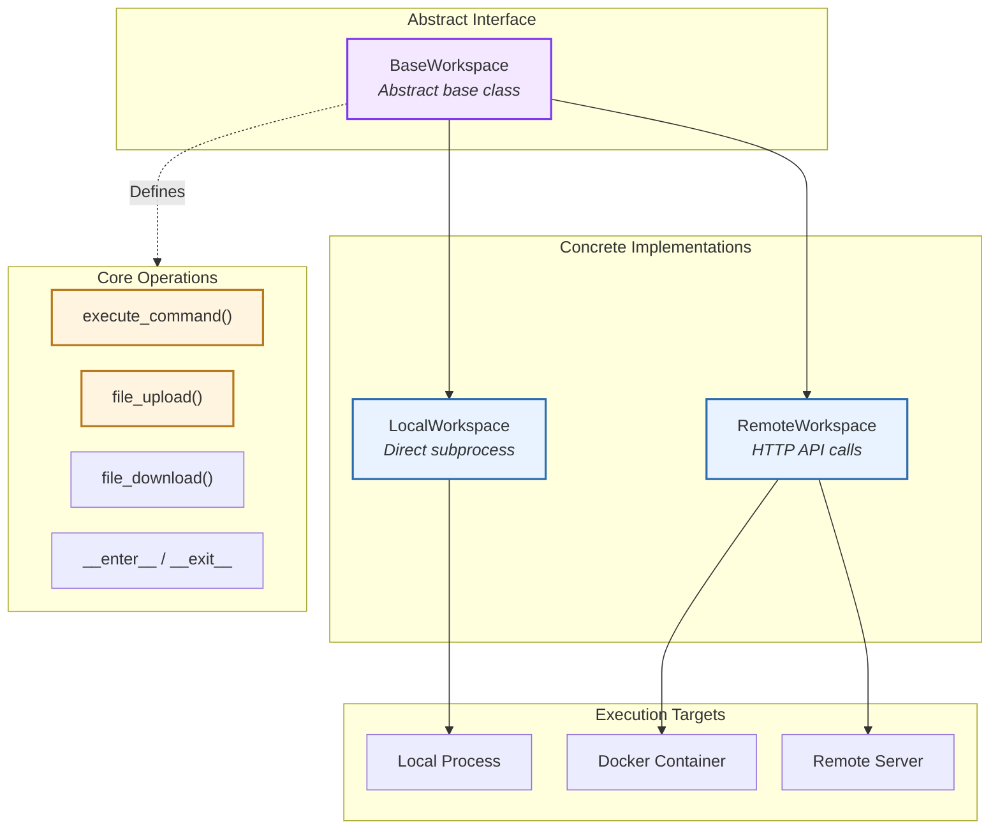
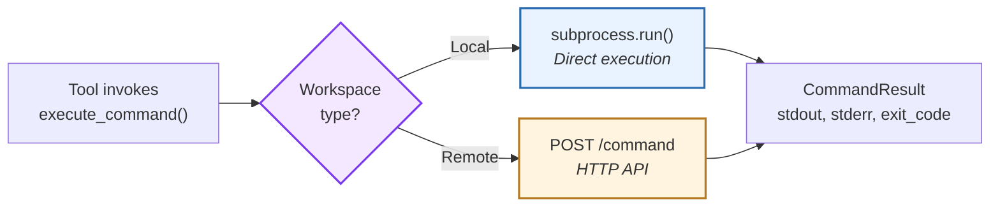
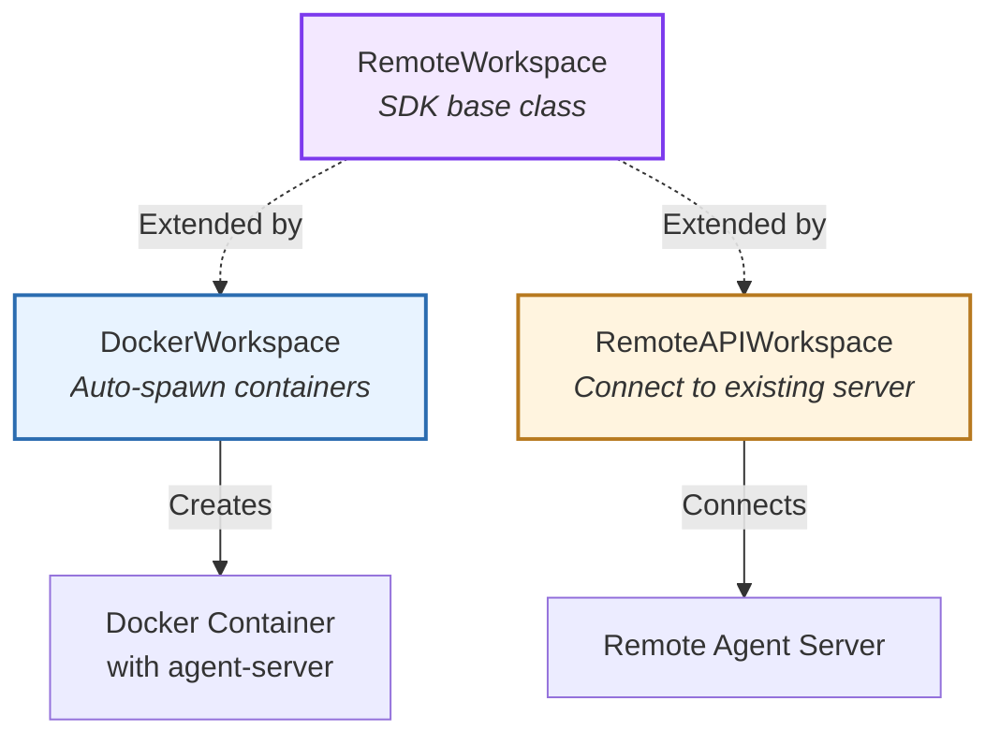
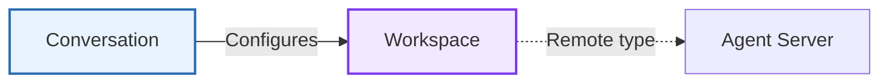

The **Workspace** component abstracts execution environments for agent operations. It provides a unified interface for command execution and file operations across local processes, containers, and remote servers.

**Source:** [`openhands/sdk/workspace/`](https://github.com/OpenHands/software-agent-sdk/tree/main/openhands-sdk/openhands/sdk/workspace)

## Core Responsibilities

The Workspace system has four primary responsibilities:

1. **Execution Abstraction** - Unified interface for command execution across environments
2. **File Operations** - Upload, download, and manipulate files in workspace
3. **Resource Management** - Context manager protocol for setup/teardown
4. **Environment Isolation** - Separate agent execution from host system

## Architecture

### Key Components

| Component | Purpose | Design |
|-----------|---------|--------|
| **[`BaseWorkspace`](https://github.com/OpenHands/software-agent-sdk/blob/main/openhands-sdk/openhands/sdk/workspace/base.py)** | Abstract interface | Defines execution and file operation contracts |
| **[`LocalWorkspace`](https://github.com/OpenHands/software-agent-sdk/blob/main/openhands-sdk/openhands/sdk/workspace/local.py)** | Local execution | Subprocess-based command execution |
| **[`RemoteWorkspace`](https://github.com/OpenHands/software-agent-sdk/blob/main/openhands-sdk/openhands/sdk/workspace/remote/base.py)** | Remote execution | HTTP API-based execution via agent-server |
| **[`CommandResult`](https://github.com/OpenHands/software-agent-sdk/blob/main/openhands-sdk/openhands/sdk/workspace/models.py)** | Execution output | Structured result with stdout, stderr, exit_code |
| **[`FileOperationResult`](https://github.com/OpenHands/software-agent-sdk/blob/main/openhands-sdk/openhands/sdk/workspace/models.py)** | File op outcome | Success status and metadata |

## Workspace Types

### Local vs Remote Execution

| Aspect | LocalWorkspace | RemoteWorkspace |
|--------|----------------|-----------------|
| **Execution** | Direct subprocess | HTTP → agent-server |
| **Isolation** | Process-level | Container/VM-level |
| **Performance** | Fast (no network) | Network overhead |
| **Security** | Host system access | Sandboxed |
| **Use Case** | Development, CLI | Production, web apps |

## Core Operations

### Command Execution

**Command Result Structure:**

| Field | Type | Description |
|-------|------|-------------|
| **stdout** | str | Standard output stream |
| **stderr** | str | Standard error stream |
| **exit_code** | int | Process exit code (0 = success) |
| **timeout** | bool | Whether command timed out |
| **duration** | float | Execution time in seconds |

## Invariants (Normative)

### Workspace Factory: Host Chooses Remote

The `Workspace(...)` constructor is a factory:

- If `host` is provided, it returns a `RemoteWorkspace`.
- Otherwise it returns a `LocalWorkspace`.

OCL-like (conceptual):

- `context Workspace::__new__ post RemoteIffHost: (host <> null) implies result.oclIsKindOf(RemoteWorkspace)`

### BaseWorkspace Contract

All workspace implementations must satisfy:

- `execute_command(command, cwd, timeout)` returns a `CommandResult` where `exit_code=-1` indicates timeout.
- `file_upload` / `file_download` return a `FileOperationResult` with `success=false` and a populated `error` field on failure.
- Git helpers (`git_changes`, `git_diff`) must raise if the path is not a git repository.

### working_dir Normalization

Natural language invariant:

- `working_dir` is normalized to a `str` even if passed as a `Path`.

### Pause/Resume Semantics (Optional Capability)

`pause()` / `resume()` are intentionally **optional capabilities**:

- `LocalWorkspace.pause()` / `.resume()` are no-ops.
- Remote/container workspaces may implement pause/resume to conserve resources.
- If a workspace type does not support pausing, it must raise `NotImplementedError`.

This is compatible with the “swap workspaces without rewriting code” principle because most client code should only rely on the *core* workspace and conversation operations. Optional capabilities should be feature-detected or used conditionally.

### File Operations

| Operation | Local Implementation | Remote Implementation |
|-----------|---------------------|----------------------|
| **Upload** | `shutil.copy()` | `POST /file/upload` with multipart |
| **Download** | `shutil.copy()` | `GET /file/download` stream |
| **Result** | `FileOperationResult` | `FileOperationResult` |

## Resource Management

Workspaces use **context manager** for safe resource handling:

**Lifecycle Hooks:**

| Phase | LocalWorkspace | RemoteWorkspace |
|-------|----------------|-----------------|
| **Enter** | Create working directory | Connect to agent-server, verify |
| **Use** | Execute commands | Proxy commands via HTTP |
| **Exit** | No cleanup (persistent) | Disconnect, optionally stop container |

## Remote Workspace Extensions

The SDK provides remote workspace implementations in `openhands-workspace` package:

**Implementation Comparison:**

| Type | Setup | Isolation | Use Case |
|------|-------|-----------|----------|
| **LocalWorkspace** | Immediate | Process | Development, trusted code |
| **DockerWorkspace** | Spawn container | Container | Multi-user, untrusted code |
| **RemoteAPIWorkspace** | Connect to URL | Remote server | Distributed systems, cloud |

**Source:** 
- **DockerWorkspace**: [`openhands-workspace/openhands/workspace/docker`](https://github.com/OpenHands/software-agent-sdk/tree/main/openhands-workspace/openhands/workspace/docker)
- **RemoteAPIWorkspace**: [`openhands-workspace/openhands/workspace/remote_api`](https://github.com/OpenHands/software-agent-sdk/tree/main/openhands-workspace/openhands/workspace/remote_api)

## Component Relationships

### How Workspace Integrates

**Relationship Characteristics:**
- **Conversation → Workspace**: Conversation factory uses workspace type to select LocalConversation or RemoteConversation
- **Workspace → Agent Server**: RemoteWorkspace delegates operations to agent-server API
- **Tools Independence**: Tools run in the same environment as workspace

## See Also

- **[Conversation Architecture](/sdk/arch/conversation)** - How workspace type determines conversation implementation
- **[Agent Server](/sdk/arch/agent-server)** - Remote execution API
- **[Tool System](/sdk/arch/tool-system)** - Tools that use workspace for execution
