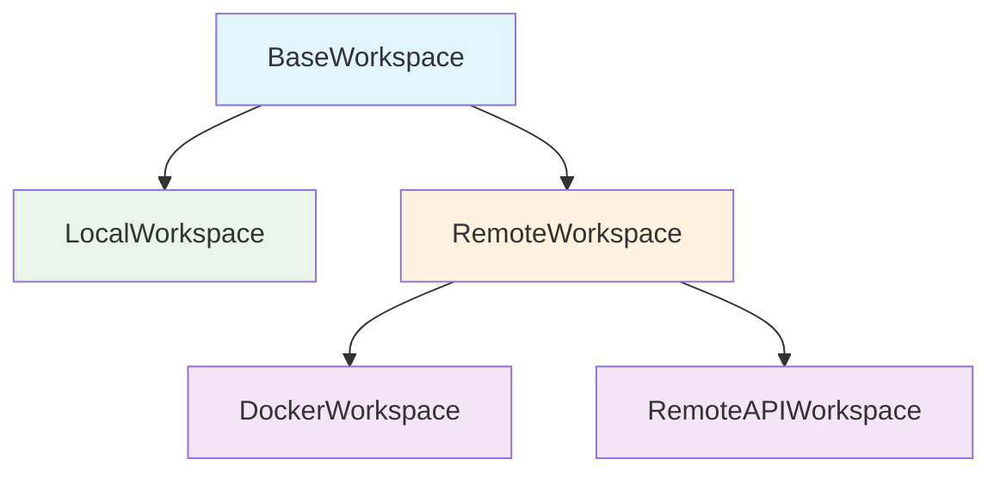

The `openhands.workspace` package provides advanced workspace implementations for production deployments, including Docker-based sandboxing and remote API execution.

**Source**: [`openhands/workspace/`](https://github.com/All-Hands-AI/agent-sdk/tree/main/openhands/workspace)

## Available Workspaces

- **[DockerWorkspace](/sdk/architecture/workspace/docker.mdx)** - Docker container isolation
- **[RemoteAPIWorkspace](/sdk/architecture/workspace/remote_api.mdx)** - Remote server execution

## Workspace Hierarchy



- **BaseWorkspace**: Core interface (in SDK)
- **LocalWorkspace**: Direct local execution (in SDK)
- **RemoteWorkspace**: Base for remote implementations
- **DockerWorkspace**: Docker container execution
- **RemoteAPIWorkspace**: API-based remote execution

## Comparison

| Feature | LocalWorkspace | DockerWorkspace | RemoteAPIWorkspace |
|---------|---------------|-----------------|-------------------|
| **Isolation** | None | Strong | Strong |
| **Performance** | Fast | Good | Network latency |
| **Setup** | None | Docker required | Server required |
| **Security** | Host system | Sandboxed | Sandboxed |
| **Use Case** | Development | Production/Testing | Distributed systems |

## Quick Start

### Docker Workspace

```python
from openhands.workspace import DockerWorkspace

workspace = DockerWorkspace(
    working_dir="/workspace",
    image="ubuntu:22.04"
)

with workspace:
    result = workspace.execute_command("echo 'Hello from Docker'")
    print(result.stdout)
```

### Remote API Workspace

```python
from openhands.workspace import RemoteAPIWorkspace

workspace = RemoteAPIWorkspace(
    working_dir="/workspace",
    api_url="https://agent-server.example.com",
    api_key="your-api-key"
)

with workspace:
    result = workspace.execute_command("python script.py")
    print(result.stdout)
```

## Use Cases

### Development
Use `LocalWorkspace` for local development and testing.

### Testing
Use `DockerWorkspace` for isolated test environments.

### Production
Use `DockerWorkspace` or `RemoteAPIWorkspace` for production deployments.

### Multi-User Systems
Use `RemoteAPIWorkspace` with centralized agent server.

## See Also

- **[SDK Workspace Interface](/sdk/architecture/sdk/workspace.mdx)** - Base workspace interface
- **[DockerWorkspace](/sdk/architecture/workspace/docker.mdx)** - Docker implementation
- **[RemoteAPIWorkspace](/sdk/architecture/workspace/remote_api.mdx)** - Remote API implementation
- **[Agent Server](/sdk/architecture/agent_server/overview.mdx)** - Server for remote workspaces
