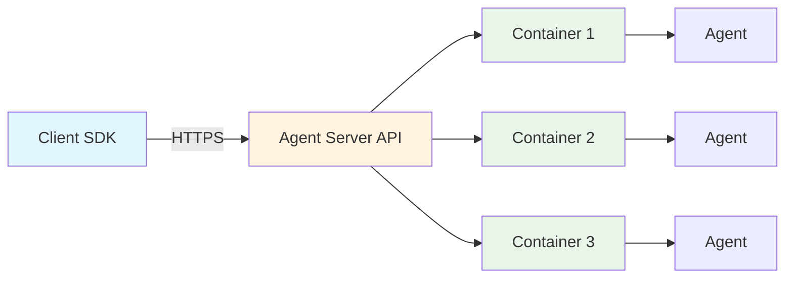

RemoteAPIWorkspace enables agent execution on remote servers through HTTP APIs. It's designed for production deployments requiring centralized agent management and multi-user support.

**Source**: [`openhands/workspace/remote_api/`](https://github.com/All-Hands-AI/agent-sdk/tree/main/openhands/workspace/remote_api)

## Overview

RemoteAPIWorkspace provides:
- HTTP API communication with agent server
- Authentication and authorization
- Centralized resource management
- Multi-user agent execution
- Monitoring and logging

## Usage

### Basic Usage

```python
from openhands.workspace import RemoteAPIWorkspace

workspace = RemoteAPIWorkspace(
    working_dir="/workspace",
    api_url="https://agent-server.example.com",
    api_key="your-api-key"
)

with workspace:
    result = workspace.execute_command("python script.py")
    print(result.stdout)
```

### With Agent

```python
from openhands.sdk import Agent, Conversation
from openhands.tools import BashTool, FileEditorTool

# Create workspace
workspace = RemoteAPIWorkspace(
    working_dir="/workspace",
    api_url="https://agent-server.example.com",
    api_key="your-api-key"
)

# Create agent
agent = Agent(
    llm=llm,
    tools=[BashTool.create(), FileEditorTool.create()]
)

# Use in conversation
conversation = Conversation(agent=agent, workspace=workspace)
conversation.send_message("Your task")
conversation.run()
```

## Configuration

**Source**: [`openhands/workspace/remote_api/workspace.py`](https://github.com/All-Hands-AI/agent-sdk/blob/main/openhands/workspace/remote_api/workspace.py)

### Parameters

| Parameter | Type | Required | Description |
|-----------|------|----------|-------------|
| `working_dir` | `str` | Yes | Working directory on server |
| `api_url` | `str` | Yes | Agent server API URL |
| `api_key` | `str` | Yes | Authentication API key |
| `timeout` | `float` | No | Request timeout (default: 30) |

### Example Configuration

```python
workspace = RemoteAPIWorkspace(
    working_dir="/workspace/user123",
    api_url="https://agents.company.com",
    api_key="sk-abc123...",
    timeout=60.0  # 60 second timeout
)
```

## API Communication

### HTTP Endpoints

RemoteAPIWorkspace communicates with agent server endpoints:

- `POST /api/workspace/command` - Execute commands
- `POST /api/workspace/upload` - Upload files
- `GET /api/workspace/download` - Download files
- `GET /api/health` - Health check

### Authentication

```python
# API key passed in Authorization header
headers = {
    "Authorization": f"Bearer {api_key}"
}
```

### Error Handling

```python
try:
    result = workspace.execute_command("command")
except ConnectionError:
    print("Failed to connect to agent server")
except TimeoutError:
    print("Request timed out")
except Exception as e:
    print(f"Execution error: {e}")
```

## File Operations

### Upload Files

```python
workspace.file_upload(
    source_path="local_data.csv",
    destination_path="/workspace/data.csv"
)
```

### Download Files

```python
workspace.file_download(
    source_path="/workspace/results.json",
    destination_path="local_results.json"
)
```

### Large File Transfer

```python
# Chunked upload for large files
workspace.file_upload(
    source_path="large_dataset.zip",
    destination_path="/workspace/dataset.zip"
)
```

## Architecture



## Use Cases

### Multi-User Platform

```python
# Each user gets isolated workspace
user_workspace = RemoteAPIWorkspace(
    working_dir=f"/workspace/{user_id}",
    api_url="https://agents.platform.com",
    api_key=user_api_key
)
```

### Scalable Agent Execution

```python
# Server manages resource allocation
# Multiple agents run concurrently
# Automatic load balancing
```

### Centralized Monitoring

```python
# Server tracks:
# - Resource usage per user
# - Agent execution logs
# - API usage metrics
# - Error rates and debugging info
```

## Security

### Authentication

- API key-based authentication
- Per-user access control
- Token expiration and rotation

### Isolation

- Separate workspaces per user
- Container-based sandboxing
- Network isolation

### Data Protection

- HTTPS communication
- Encrypted data transfer
- Secure file storage

## Performance Considerations

### Network Latency

```python
# Latency depends on:
# - Network connection
# - Geographic distance
# - Server load

# Optimization:
# - Use regional servers
# - Batch operations
# - Cache frequently accessed data
```

### Concurrent Execution

```python
# Server handles concurrent requests
# Multiple users can run agents simultaneously
# Automatic resource management
```

## Deployment

### Running Agent Server

See [Agent Server Documentation](/sdk/architecture/agent_server/overview.mdx) for server setup:

```bash
# Start agent server
docker run -d \
  -p 8000:8000 \
  -e API_KEY=your-secret-key \
  ghcr.io/all-hands-ai/agent-server:latest
```

### Using Deployed Server

```python
# Client connects to deployed server
workspace = RemoteAPIWorkspace(
    working_dir="/workspace",
    api_url="https://your-server.com",
    api_key="your-secret-key"
)
```

## Comparison with DockerWorkspace

| Feature | DockerWorkspace | RemoteAPIWorkspace |
|---------|-----------------|-------------------|
| **Setup** | Local Docker | Remote server |
| **Network** | Local | Internet required |
| **Scaling** | Single machine | Multiple users |
| **Management** | Client-side | Server-side |
| **Latency** | Low | Network dependent |
| **Use Case** | Local dev/test | Production |

## Best Practices

1. **Use HTTPS**: Always use secure connections
2. **Rotate API Keys**: Regularly update authentication
3. **Set Timeouts**: Configure appropriate timeouts
4. **Handle Network Errors**: Implement retry logic
5. **Monitor Usage**: Track API calls and resource usage
6. **Regional Deployment**: Use nearby servers for lower latency
7. **Batch Operations**: Combine multiple operations when possible

## Troubleshooting

### Connection Failures

```python
# Verify server is reachable
import requests
response = requests.get(f"{api_url}/api/health")
print(response.status_code)  # Should be 200
```

### Authentication Errors

```python
# Verify API key is correct
# Check key has not expired
# Ensure proper authorization headers
```

### Timeout Issues

```python
# Increase timeout for long operations
workspace = RemoteAPIWorkspace(
    api_url=api_url,
    api_key=api_key,
    timeout=120.0  # 2 minutes
)
```

## See Also

- **[DockerWorkspace](/sdk/architecture/workspace/docker.mdx)** - Local Docker execution
- **[Agent Server](/sdk/architecture/agent_server/overview.mdx)** - Server implementation
- **[SDK Workspace](/sdk/architecture/sdk/workspace.mdx)** - Base workspace interface
- **[Examples](https://github.com/All-Hands-AI/agent-sdk/tree/main/examples/02_remote_agent_server)** - Remote workspace examples
