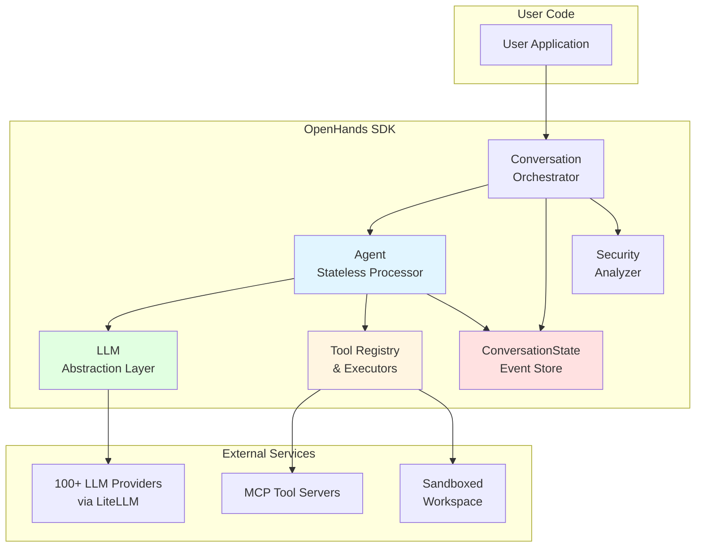
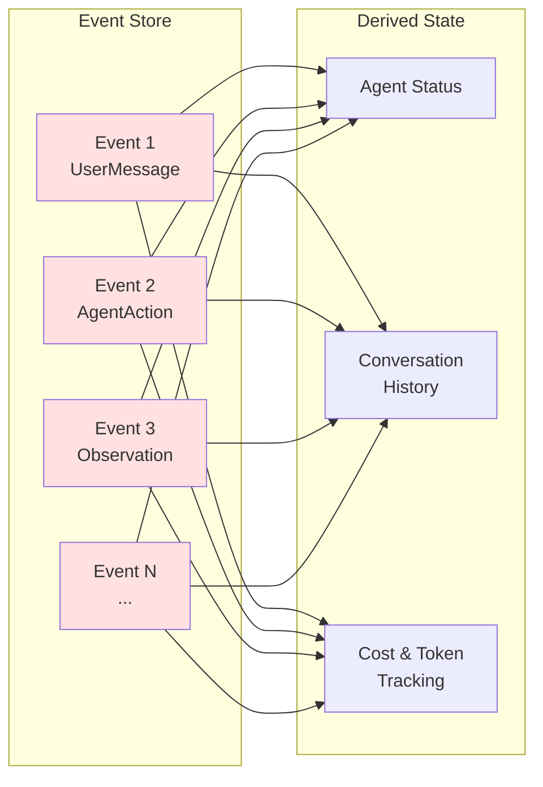
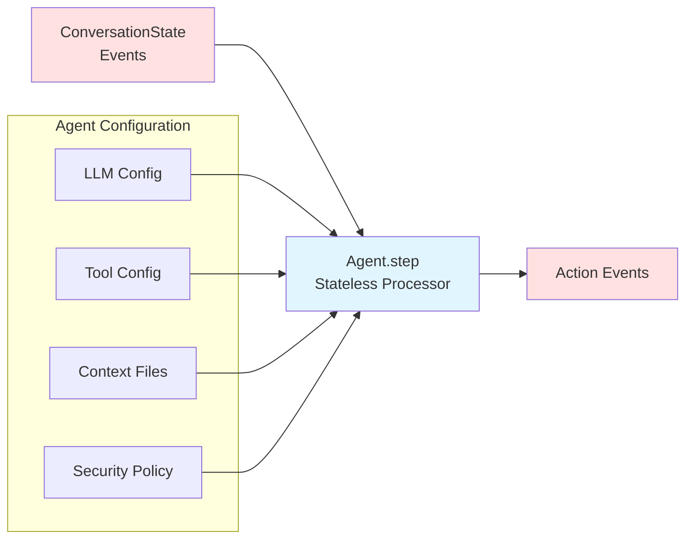
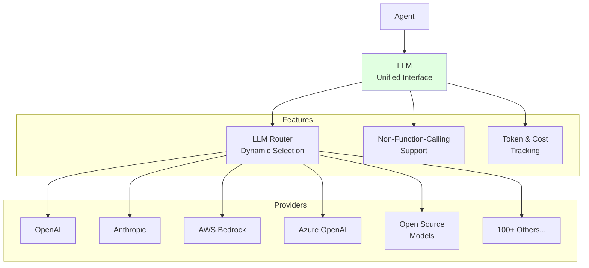
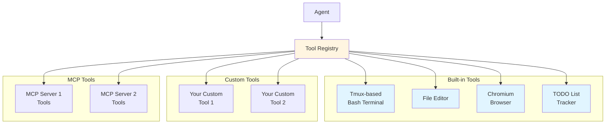
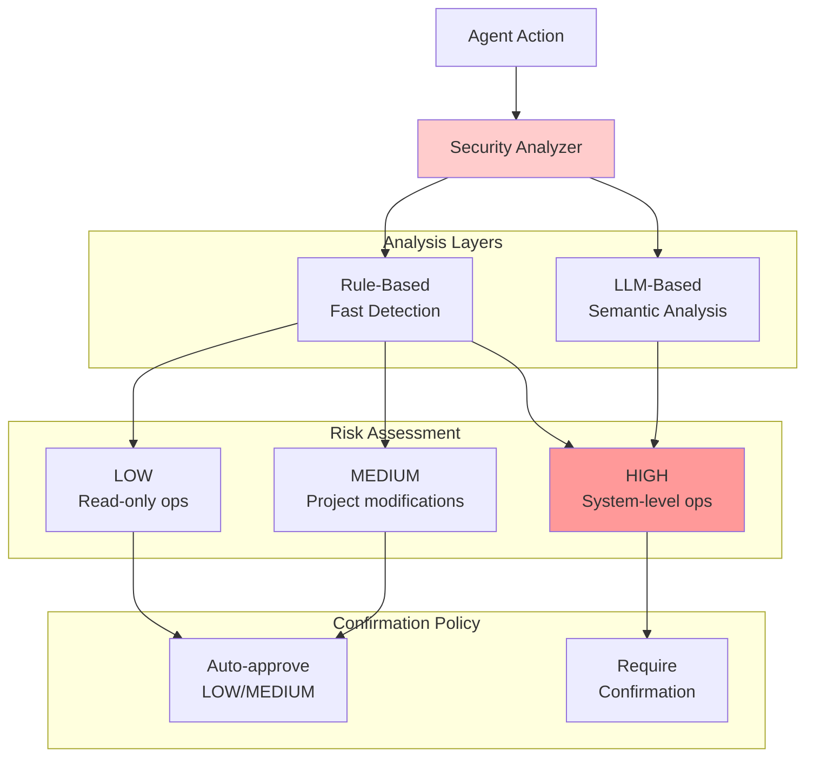
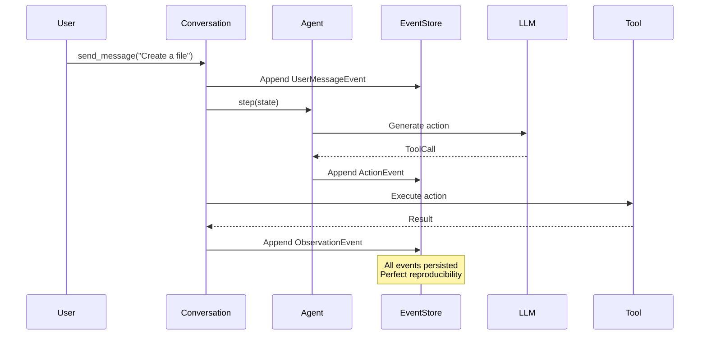
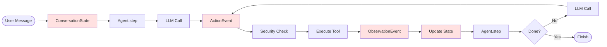

# Architecture Overview

The OpenHands Agent SDK is built on a modern, event-sourced architecture that prioritizes **correctness**, **reproducibility**, and **production-readiness**. This page provides a high-level overview of the system's components and design principles.

## High-Level Architecture

## Core Components

The SDK consists of five main components that work together:

### 1. **ConversationState** - Event-Sourced State Management

The single source of truth for all conversation state, derived from an immutable event log.

**Key Features:**
- **Immutable Event Log**: All state changes are recorded as events
- **Perfect Reproducibility**: Same events → same state, always
- **Time-Travel Debugging**: Replay any conversation from its event log
- **Automatic Persistence**: Events auto-save to disk when configured

### 2. **Agent** - Stateless Event Processor

Pure, stateless functions that consume events and produce new events.

**Key Features:**
- **Stateless Design**: All state lives in `ConversationState`
- **Immutable Configuration**: Agents are fully defined by their frozen config
- **Composable**: Support for sub-agents and delegation
- **Pause/Resume**: Natural support via event sourcing

### 3. **LLM** - Model-Agnostic Abstraction

Unified interface to 100+ language model providers.

**Key Features:**
- **100+ Providers**: Via LiteLLM integration
- **Auto-Detection**: Model capabilities detected automatically
- **Multi-LLM Routing**: Dynamic model selection based on task
- **Built-in Metrics**: Automatic cost and token tracking

### 4. **Tool System** - Extensible Execution

Type-safe, extensible tool system with MCP support.

**Key Features:**
- **Type-Safe**: Pydantic models for actions and observations
- **MCP Native**: First-class Model Context Protocol support
- **Built-in Tools**: Production-ready bash, file, browser tools
- **Easy Extension**: Simple interface for custom tools

### 5. **Security** - Defense in Depth

Multi-layered security framework for safe agent execution.

**Key Features:**
- **Two-Tier Analysis**: Rule-based + LLM semantic analysis
- **Risk Levels**: LOW, MEDIUM, HIGH, UNKNOWN
- **Confirmation Policies**: Customizable approval workflows
- **Secrets Management**: Auto-masking of sensitive data

## Design Principles

### Event Sourcing

All state changes are recorded as immutable events, enabling perfect reproducibility and time-travel debugging.

### Immutability

All core components (Agent, LLM, Tools) are immutable and type-safe, eliminating state corruption bugs.

### Stateless Agents

Agents are pure functions with no internal state, making them testable, composable, and naturally distributed.

### Configuration as Code

All configuration is defined in code using type-safe Pydantic models, eliminating config-code drift.

## Event Flow

The core execution loop follows a simple action-observation pattern:

## Key Benefits

### 🎯 Correctness & Reliability
- **Immutable events** eliminate state corruption bugs
- **Event sourcing** ensures perfect reproducibility
- **Type-safe APIs** catch errors at compile time

### 🛠️ Developer Experience
- **Stateless design** enables simple unit testing
- **Event replay** provides time-travel debugging
- **Clear interfaces** make extension straightforward

### 🚀 Production Ready
- **Built-in server** with REST/WebSocket APIs
- **Container sandboxing** for isolation
- **Authentication & secrets management** out of the box

### 🌐 Ecosystem Integration
- **Native MCP support** for thousands of tools
- **100+ LLM providers** via LiteLLM
- **Standards-aligned** for easy integration

### 🔬 Research Flexibility
- **Custom agents** for arbitrary reasoning strategies
- **LLM routers** for A/B testing
- **Event logs** for retrospective analysis

## Next Steps

- **[Core Components](/sdk/core/overview)** - Deep dive into SDK components
- **[Hello World Tutorial](/sdk/getting-started)** - Build your first agent
- **[Advanced Features](/sdk/advanced/overview)** - Context management, workflows
- **[Production Deployment](/sdk/production/overview)** - Deploy agents at scale
- **[API Reference](/sdk/api)** - Complete API documentation
