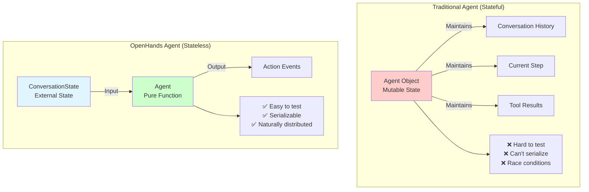
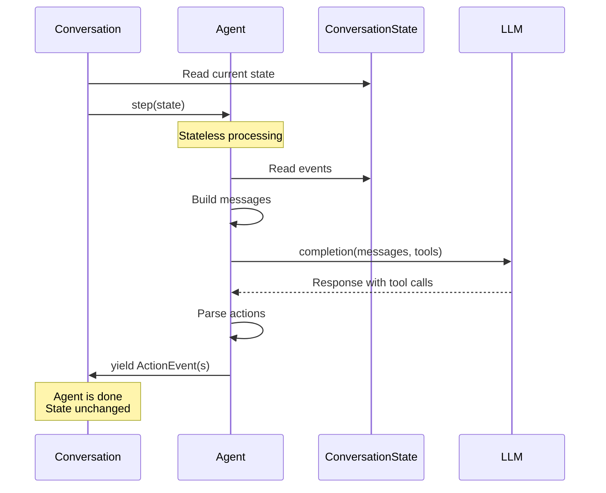
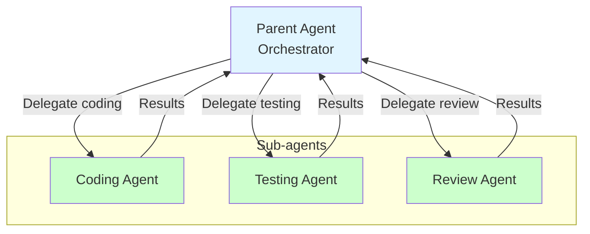
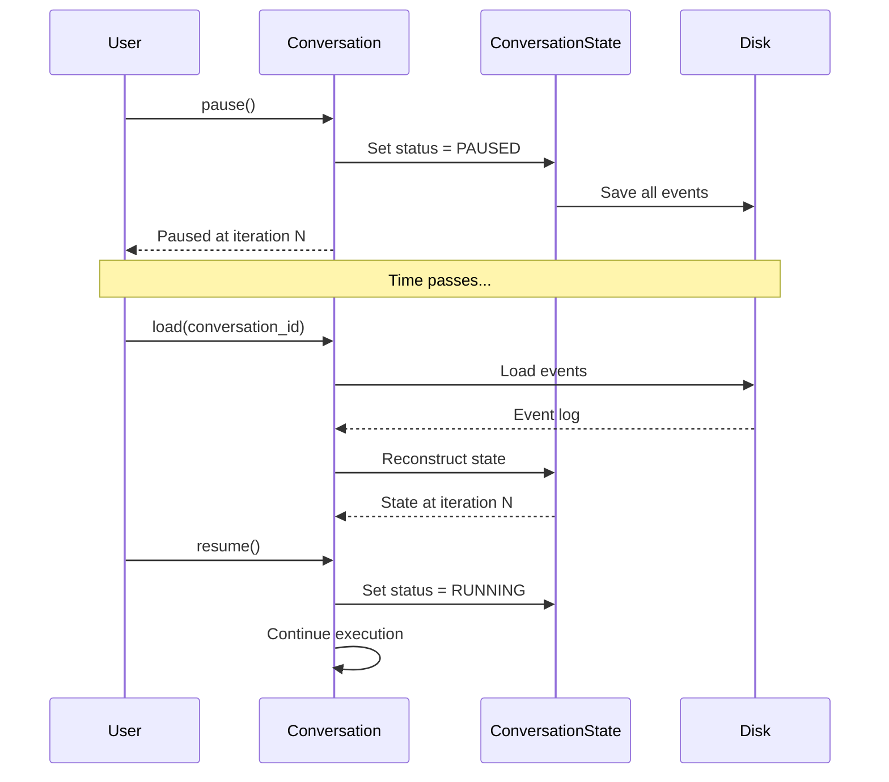
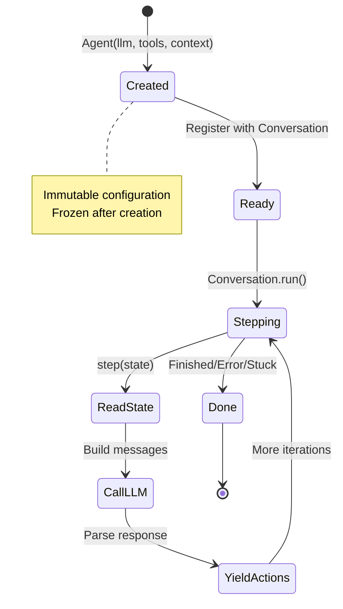

# Agent: Stateless Event Processor

The `Agent` is the core decision-making component in OpenHands SDK. Unlike traditional agents with internal state, OpenHands agents are **pure, stateless functions** that consume events and produce new events.

## Key Concept: Stateless Design



**Benefits:**
- **Testable**: No mocking needed - just pass in state
- **Serializable**: Can be sent across network boundaries
- **Distributed**: Can run anywhere without hidden state
- **Composable**: Sub-agents work naturally

## Core Execution Model

### The `step()` Method

Every agent implements a single core method:

```python
from openhands.sdk.agent import AgentBase
from openhands.sdk.conversation import ConversationState
from openhands.sdk.event import Event
from typing import Generator

class Agent(AgentBase):
    def step(
        self,
        state: ConversationState
    ) -> Generator[Event, None, None]:
        """
        Generate action events based on current state.
        
        Args:
            state: Current conversation state (read-only)
            
        Yields:
            ActionEvent: Actions to take
        """
        # 1. Read state (never modify it!)
        history = state.conversation_history
        
        # 2. Build LLM messages
        messages = [event.to_llm_message() for event in history]
        
        # 3. Call LLM with tools
        response = self.llm.completion(
            messages=messages,
            tools=self.get_tool_definitions(),
        )
        
        # 4. Yield action events
        for tool_call in response.tool_calls:
            yield ActionEvent(
                tool=tool_call.name,
                args=tool_call.arguments,
            )
```

### Execution Flow



## Agent Configuration

Agents are fully defined by immutable configuration:

```python
from openhands.sdk import Agent, LLM
from openhands.sdk.tool import BashTool, FileEditorTool
from openhands.sdk.context import AgentContext
from pydantic import SecretStr

agent = Agent(
    # LLM configuration (immutable)
    llm=LLM(
        model="anthropic/claude-sonnet-4",
        api_key=SecretStr("..."),
    ),
    
    # Tools (immutable list)
    tools=[
        BashTool(),
        FileEditorTool(),
    ],
    
    # Context (immutable)
    context=AgentContext(
        system_message="You are a helpful coding assistant.",
        user_message_suffix="Always explain your actions.",
    ),
    
    # Security (immutable)
    security_analyzer=SecurityAnalyzer(),
    confirmation_policy=ConfirmHighRiskPolicy(),
    
    # Frozen after creation
    model_config=ConfigDict(frozen=True),
)
```

## Default Agent

The SDK provides a production-ready default agent:

```python
from openhands.sdk.preset.default import get_default_agent

agent = get_default_agent(
    llm=llm,
    working_dir="/path/to/workspace",
    cli_mode=False,  # Enable browser tools
)

# Includes:
# - BashTool (tmux-based persistent shell)
# - FileEditorTool (structured file editing)
# - BrowserToolSet (web automation)
# - TaskTrackerTool (TODO list management)
# - Default context and security policies
```

## Custom Agents

Create custom agents for specialized reasoning:

```python
from openhands.sdk.agent import AgentBase

class PlanningAgent(AgentBase):
    """Agent that creates a plan before executing."""
    
    def step(self, state: ConversationState) -> Generator[Event, None, None]:
        # First iteration: Create plan
        if state.iteration == 0:
            messages = self._build_planning_prompt(state)
            plan = self.llm.completion(messages).content
            
            # Store plan in a metadata event
            yield PlanCreatedEvent(plan=plan)
            return
        
        # Subsequent iterations: Execute plan
        plan = self._get_plan_from_state(state)
        next_step = self._get_next_step(plan, state)
        
        messages = self._build_execution_prompt(state, next_step)
        response = self.llm.completion(messages, tools=self.get_tool_definitions())
        
        for tool_call in response.tool_calls:
            yield ActionEvent(tool=tool_call.name, args=tool_call.arguments)


class ChainOfThoughtAgent(AgentBase):
    """Agent that thinks step-by-step."""
    
    def step(self, state: ConversationState) -> Generator[Event, None, None]:
        # Add reasoning prompt
        messages = state.conversation_history + [
            {"role": "user", "content": "Think step-by-step before acting."}
        ]
        
        response = self.llm.completion(messages, tools=self.get_tool_definitions())
        
        # Yield thought process
        if response.content:
            yield AgentMessageEvent(content=response.content)
        
        # Yield actions
        for tool_call in response.tool_calls:
            yield ActionEvent(tool=tool_call.name, args=tool_call.arguments)
```

## Agent Delegation (Sub-agents)

Agents can delegate to specialized sub-agents:



### Example: Hierarchical Agents

```python
from openhands.sdk.agent import AgentBase

class OrchestratorAgent(AgentBase):
    """Parent agent that delegates to specialists."""
    
    def __init__(self, **kwargs):
        super().__init__(**kwargs)
        
        # Create sub-agents
        self.coding_agent = CodingAgent(llm=self.llm, tools=[BashTool()])
        self.testing_agent = TestingAgent(llm=self.llm, tools=[BashTool()])
    
    def step(self, state: ConversationState) -> Generator[Event, None, None]:
        # Analyze task
        task = state.conversation_history[-1].content
        
        if "write code" in task.lower():
            # Delegate to coding agent
            yield DelegateEvent(
                agent=self.coding_agent,
                task="Write the code for: " + task,
            )
            
        elif "test" in task.lower():
            # Delegate to testing agent
            yield DelegateEvent(
                agent=self.testing_agent,
                task="Test the code: " + task,
            )
```

## Pause and Resume

Agents naturally support pause/resume via event sourcing:

```python
# Start a long-running task
conversation = Conversation(
    agent=agent,
    persistence_dir="./conversations",
)

conversation.send_message("Refactor the entire codebase")
conversation.run(max_iterations=10)

# Pause execution
conversation.pause()
print(f"Paused at iteration {conversation.state.iteration}")

# Resume later (even in a different process!)
conversation = Conversation.load(
    persistence_dir="./conversations",
    conversation_id=conversation.id,
)

conversation.resume()  # Continue from exactly where we left off
```

### How Pause/Resume Works



## Observability via Callbacks

Monitor agent behavior in real-time:

```python
from openhands.sdk import Conversation

def on_event(event):
    """Called for every event."""
    print(f"[{event.timestamp}] {event.kind}: {event}")
    
    if isinstance(event, ActionEvent):
        print(f"  → Agent action: {event.tool}")
    elif isinstance(event, ObservationEvent):
        print(f"  ← Tool result: {event.content[:100]}...")

conversation = Conversation(
    agent=agent,
    on_event=on_event,  # Real-time event monitoring
)

conversation.send_message("Create a Python file")
conversation.run()

# Output:
# [2025-01-15 10:30:00] user_message: Create a Python file
# [2025-01-15 10:30:01] action: execute bash command
#   → Agent action: bash
# [2025-01-15 10:30:02] observation: File created
#   ← Tool result: File created successfully...
```

## Testing Agents

Stateless design makes testing trivial:

```python
from openhands.sdk.agent import Agent
from openhands.sdk.conversation import ConversationState
from openhands.sdk.event import UserMessageEvent

def test_agent():
    # Create agent
    agent = Agent(llm=mock_llm, tools=[MockTool()])
    
    # Create test state
    state = ConversationState()
    state.append_event(UserMessageEvent(content="Test task"))
    
    # Call step()
    events = list(agent.step(state))
    
    # Verify behavior
    assert len(events) == 1
    assert events[0].kind == "action"
    assert events[0].tool == "mock_tool"
    
    # No mocking of conversation, persistence, etc. needed!
```

## Agent Lifecycle



## Built-in Agent Types

### Default Agent

```python
from openhands.sdk.preset.default import get_default_agent

agent = get_default_agent(llm=llm, working_dir=".")
# Includes all standard tools and sensible defaults
```

### Microagent

```python
from openhands.sdk.agent.microagent import Microagent

agent = Microagent(
    llm=llm,
    name="Bug Fixer",
    instructions="""
    You are a bug fixing specialist.
    Always write tests before fixing bugs.
    Explain your changes clearly.
    """,
    tools=[BashTool(), FileEditorTool()],
)
# Lightweight agent for specific tasks
```

## Best Practices

### ✅ Do

- **Keep agents stateless** - all state in ConversationState
- **Use immutable configuration** - frozen after creation
- **Test with synthetic state** - no complex setup needed
- **Implement custom agents** for specialized reasoning
- **Use callbacks** for observability

### ❌ Don't

- **Store state in agent** - use ConversationState
- **Mutate configuration** - create new agent instead
- **Mix concerns** - agent should only decide actions
- **Skip type safety** - use Pydantic models

## API Reference

```python
class AgentBase(ABC, BaseModel):
    """Base class for all agents."""
    
    model_config = ConfigDict(frozen=True)
    
    llm: LLM
    tools: list[ToolExecutor]
    context: AgentContext
    security_analyzer: SecurityAnalyzerBase | None = None
    confirmation_policy: ConfirmationPolicyBase | None = None
    
    @abstractmethod
    def step(
        self,
        state: ConversationState
    ) -> Generator[Event, None, None]:
        """Generate action events based on state."""
        pass
    
    def get_tool_definitions(self) -> list[dict]:
        """Get tool schemas for LLM."""
        pass
    
    def build_llm_messages(
        self,
        state: ConversationState
    ) -> list[dict]:
        """Convert events to LLM messages."""
        pass
```

## Next Steps

- **[LLM](/sdk/core/llm)** - Learn about LLM abstraction
- **[Tools](/sdk/core/tools)** - Understand tool execution
- **[Custom Agents](/sdk/advanced/custom-agents)** - Build specialized agents
- **[Sub-agents](/sdk/advanced/sub-agents)** - Implement delegation patterns
