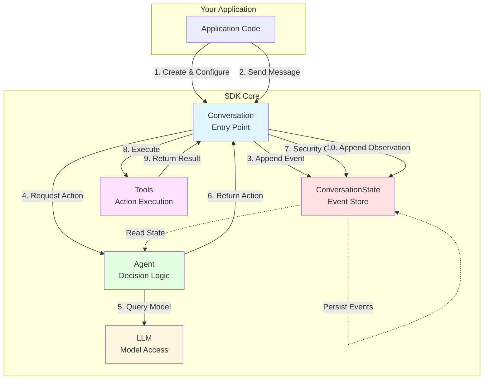
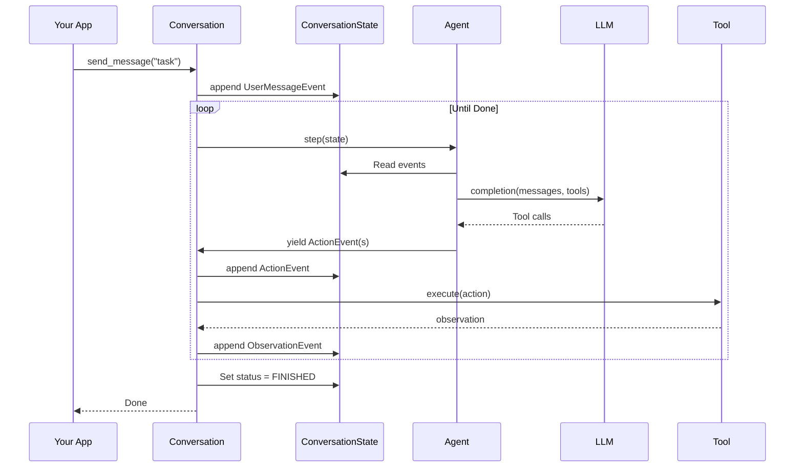
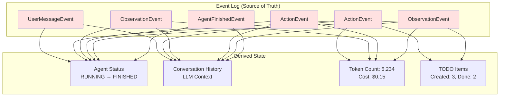

# Core Components

The OpenHands SDK consists of five core components that work together to provide a robust, production-ready agent framework. This section provides detailed documentation for each component.

## Component Interaction



## Components Overview

### 1. Conversation

**Purpose**: Orchestrates the agent execution loop and provides the main API.

```python
from openhands.sdk import Conversation

conversation = Conversation(
    agent=agent,
    persistence_dir="./conversations",  # Auto-save events
)

# Synchronous execution
conversation.send_message("Create a Python file")
conversation.run()

# Asynchronous execution
await conversation.arun()

# Pause and resume
conversation.pause()
conversation.resume()
```

**Key Responsibilities:**
- Message handling and event orchestration
- Agent execution loop management
- Security policy enforcement
- Event persistence and state management

[Learn more →](/sdk/core/conversation)

### 2. ConversationState

**Purpose**: Single source of truth derived from immutable event log.

```python
from openhands.sdk.conversation import ConversationState

# State is derived from events
state = ConversationState()
state.append_event(user_message_event)
state.append_event(action_event)
state.append_event(observation_event)

# Query computed state
status = state.agent_execution_status  # RUNNING, PAUSED, FINISHED, etc.
history = state.conversation_history   # All LLM-convertible events
metrics = state.metrics                # Token counts, costs
```

**Key Features:**
- Event-sourced state management
- Automatic persistence to disk
- Perfect reproducibility
- Time-travel debugging via replay

[Learn more →](/sdk/core/state)

### 3. Agent

**Purpose**: Stateless decision-making logic that converts events to actions.

```python
from openhands.sdk.agent import AgentBase

class CustomAgent(AgentBase):
    def step(self, state: ConversationState) -> Generator[Event, None, None]:
        """Generate action events based on current state."""
        # Convert events to LLM messages
        messages = self.build_llm_messages(state)
        
        # Call LLM with tools
        response = self.llm.completion(
            messages=messages,
            tools=self.get_tool_definitions()
        )
        
        # Yield action events
        for action in self.parse_actions(response):
            yield action
```

**Key Features:**
- Fully stateless and immutable
- Support for sub-agents and delegation
- Natural pause/resume support
- Observable via callbacks

[Learn more →](/sdk/core/agent)

### 4. LLM

**Purpose**: Unified interface to 100+ language model providers.

```python
from openhands.sdk import LLM
from pydantic import SecretStr

# Model-agnostic configuration
llm = LLM(
    model="anthropic/claude-sonnet-4",
    api_key=SecretStr("..."),
    temperature=0.7,
)

# Automatic capability detection
features = llm.get_features()
print(features.native_tool_calling)  # True for Claude
print(features.vision_support)       # True for Claude

# Multi-LLM routing
from openhands.sdk.llm.router import MultimodalRouter

router = MultimodalRouter(
    default_llm=text_only_llm,
    multimodal_llm=vision_llm,
)
llm = router.route(messages)  # Auto-selects based on content
```

**Key Features:**
- 100+ providers via LiteLLM
- Native support for non-function-calling models
- Built-in cost and token tracking
- Multi-LLM routing

[Learn more →](/sdk/core/llm)

### 5. Tools

**Purpose**: Type-safe, extensible action execution framework.

```python
from openhands.sdk.tool import ToolExecutor
from pydantic import BaseModel

class MyAction(BaseModel):
    query: str

class MyObservation(BaseModel):
    result: str

class MyTool(ToolExecutor[MyAction, MyObservation]):
    """Custom tool with type-safe actions and observations."""
    
    def __call__(self, action: MyAction) -> MyObservation:
        # Execute action
        result = self.process(action.query)
        return MyObservation(result=result)

# Register tool
from openhands.sdk.tool import register_tool
register_tool("my_tool", MyTool)
```

**Key Features:**
- Type-safe actions and observations
- Native MCP support
- Built-in production tools
- Simple extension interface

[Learn more →](/sdk/core/tools)

## Event Flow

The components interact through events in a simple action-observation loop:



## State Management

All state is derived from the event log, ensuring perfect reproducibility:



## Configuration Pattern

All components use immutable, type-safe configuration:

```python
from openhands.sdk import Agent, LLM, Conversation
from openhands.sdk.tool import BashTool, FileEditorTool

# Immutable configuration
llm = LLM(model="...", api_key=SecretStr("..."))  # Frozen after creation

agent = Agent(
    llm=llm,
    tools=[BashTool(), FileEditorTool()],
    context=AgentContext(...),
    security_analyzer=SecurityAnalyzer(...),
)  # Immutable configuration

# Configuration is part of the agent
conversation = Conversation(agent=agent)

# To change configuration, create new instances
new_llm = llm.model_copy(update={"temperature": 0.9})
new_agent = agent.model_copy(update={"llm": new_llm})
```

## Persistence and Replay

Events automatically persist and can be replayed for debugging:

```python
# Enable persistence
conversation = Conversation(
    agent=agent,
    persistence_dir="./conversations",
    conversation_id="my-task-123",
)

conversation.send_message("Create a file")
conversation.run()

# Later: Replay the exact conversation
from openhands.sdk.conversation import load_conversation

loaded = load_conversation(
    persistence_dir="./conversations",
    conversation_id="my-task-123",
)

# State is identical - perfect reproducibility
assert loaded.state.agent_execution_status == conversation.state.agent_execution_status
```

## Component Documentation

- **[Conversation](/sdk/core/conversation)** - Orchestration and API
- **[ConversationState](/sdk/core/state)** - Event-sourced state management
- **[Agent](/sdk/core/agent)** - Stateless decision logic
- **[LLM](/sdk/core/llm)** - Model abstraction and routing
- **[Tools](/sdk/core/tools)** - Action execution framework

## Next Steps

- **[Architecture Overview](/sdk/architecture)** - High-level system design
- **[Advanced Features](/sdk/advanced/overview)** - Context management, workflows
- **[Security](/sdk/security/overview)** - Defense in depth
- **[Production](/sdk/production/overview)** - Deploy at scale
