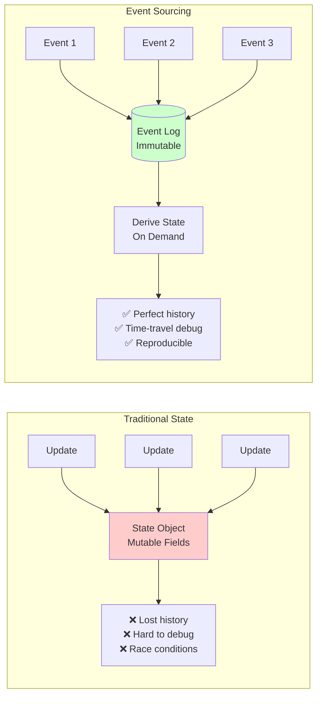
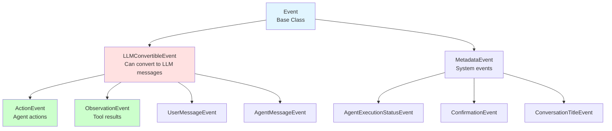
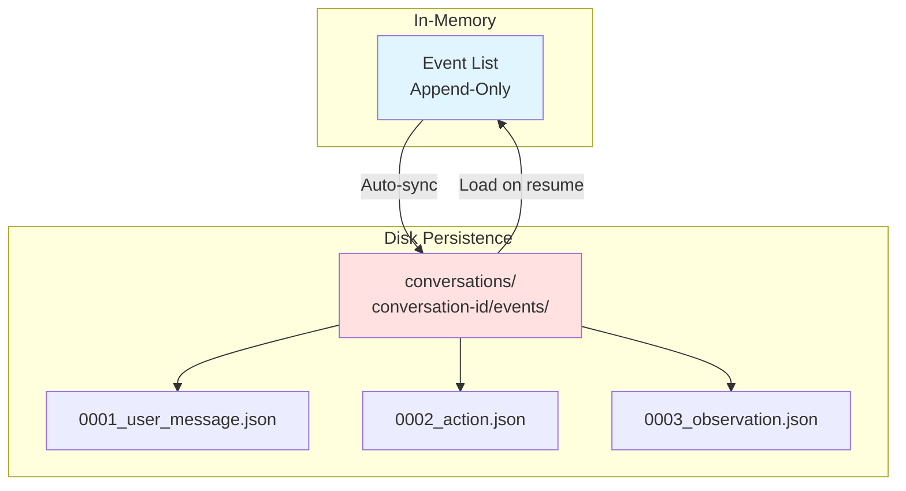
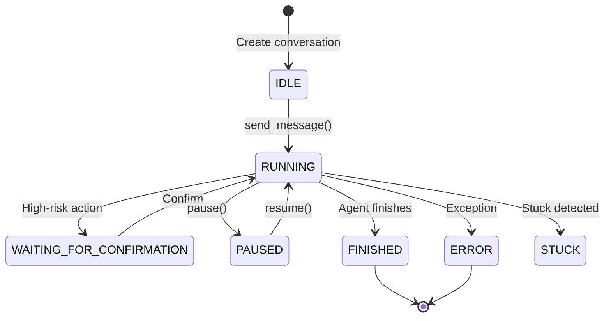
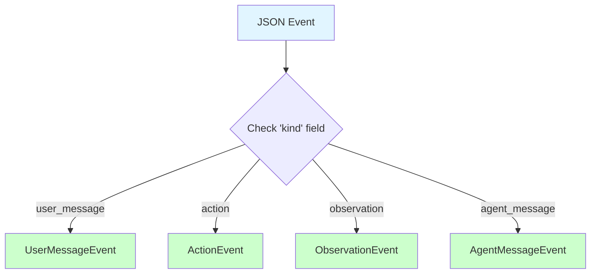

# ConversationState: Event-Sourced State Management

`ConversationState` is the single source of truth for all conversation data in the OpenHands SDK. Rather than storing mutable state directly, it derives all state on-demand from an immutable event log.

## Key Concept: Event Sourcing



**Benefits:**
- **Perfect Reproducibility**: Same events always produce same state
- **Time-Travel Debugging**: Replay any conversation exactly
- **Audit Trail**: Complete history of what happened and when
- **No Race Conditions**: Immutable events eliminate entire class of bugs

## Event Hierarchy

Events form a three-level hierarchy:



### Base Event

All events share common structure:

```python
from openhands.sdk.event import Event
from pydantic import Field

class Event(BaseModel):
    """Base event with common fields."""
    model_config = ConfigDict(frozen=True)  # Immutable!
    
    id: str = Field(default_factory=lambda: str(uuid.uuid4()))
    timestamp: datetime = Field(default_factory=datetime.now)
    source: str = "user"  # or "agent", "tool", etc.
    kind: str  # Discriminator for serialization
```

### LLMConvertibleEvent

Events that can be sent to the LLM:

```python
from openhands.sdk.event import LLMConvertibleEvent

class UserMessageEvent(LLMConvertibleEvent):
    """User message in the conversation."""
    kind: Literal["user_message"] = "user_message"
    content: str
    images: list[str] = []  # Optional image URLs
    
    def to_llm_message(self) -> dict:
        """Convert to LLM API format."""
        return {
            "role": "user",
            "content": self.content,
        }
```

## ConversationState API

### Creating and Managing State

```python
from openhands.sdk.conversation import ConversationState
from openhands.sdk.event import UserMessageEvent, ActionEvent

# Create new state
state = ConversationState()

# Append events
state.append_event(UserMessageEvent(content="Hello, agent!"))
state.append_event(ActionEvent(...))

# Query derived state
print(state.agent_execution_status)  # IDLE, RUNNING, FINISHED, etc.
print(state.iteration)                # Number of agent steps
print(state.conversation_history)     # All LLM-convertible events
```

### Persistence

Events automatically save to disk when configured:

```python
from openhands.sdk.conversation import ConversationState

state = ConversationState(
    persistence_dir="./conversations",
    conversation_id="my-task-123",
)

# Events auto-save to:
# ./conversations/my-task-123/events/0001_user_message.json
# ./conversations/my-task-123/events/0002_action.json
# ...

# Load existing conversation
loaded = ConversationState.load(
    persistence_dir="./conversations",
    conversation_id="my-task-123",
)
# State is perfectly reconstructed from events
```

### Event Store Implementation



## Derived State Properties

All state is computed from events, not stored directly:

### Agent Execution Status

```python
from openhands.sdk.conversation import AgentExecutionStatus

status = state.agent_execution_status
# Values: IDLE, RUNNING, PAUSED, WAITING_FOR_CONFIRMATION,
#         FINISHED, ERROR, STUCK
```

**Status Transitions:**



### Conversation History

```python
# Get all events convertible to LLM messages
history = state.conversation_history

# Includes: UserMessageEvent, AgentMessageEvent,
#          ActionEvent, ObservationEvent

for event in history:
    llm_message = event.to_llm_message()
    print(llm_message)
```

### Metrics

```python
# Token and cost tracking
metrics = state.metrics

print(f"Input tokens: {metrics.input_tokens}")
print(f"Output tokens: {metrics.output_tokens}")
print(f"Total cost: ${metrics.total_cost:.4f}")
print(f"LLM calls: {metrics.llm_call_count}")
```

### Task List

```python
# TODO items managed by TaskTrackerTool
tasks = state.task_list

for task in tasks:
    print(f"[{'✓' if task.done else ' '}] {task.description}")
```

## Event Replay

Replay conversations for debugging:

```python
from openhands.sdk.conversation import ConversationState

# Load conversation
state = ConversationState.load(
    persistence_dir="./conversations",
    conversation_id="problematic-run",
)

# Replay events
print(f"Total events: {len(state.events)}")

for i, event in enumerate(state.events):
    print(f"\n--- Event {i}: {event.kind} ---")
    print(event)
    
    # Reconstruct state at this point
    partial_state = ConversationState()
    for e in state.events[:i+1]:
        partial_state.append_event(e)
    
    print(f"Status after event: {partial_state.agent_execution_status}")
    print(f"Iteration: {partial_state.iteration}")
```

## Reproducibility Guarantee

The same event sequence **always** produces the same state:

```python
# Original conversation
state1 = ConversationState()
state1.append_event(event1)
state1.append_event(event2)
state1.append_event(event3)

# Replay
state2 = ConversationState()
state2.append_event(event1)
state2.append_event(event2)
state2.append_event(event3)

# Guaranteed to be identical
assert state1.agent_execution_status == state2.agent_execution_status
assert state1.iteration == state2.iteration
assert len(state1.conversation_history) == len(state2.conversation_history)
```

## Event Serialization

Events use discriminated union pattern for type-safe serialization:

```python
from openhands.sdk.event import Event

# Serialize
event = UserMessageEvent(content="Hello")
json_str = event.model_dump_json()

# Deserialize with type information
loaded = Event.model_validate_json(json_str)
assert isinstance(loaded, UserMessageEvent)
assert loaded.content == "Hello"
```

### Discriminated Union Pattern



## Advanced: Efficient Persistence

The SDK uses differential persistence to minimize I/O:

```python
# Only changed state is written
state.append_event(new_event)
# Writes only: ./events/0042_new_event.json
# Not: Entire conversation re-saved

# Efficient for long-running conversations
# with thousands of events
```

## Example: Pause and Resume

```python
# Day 1: Start long-running task
conversation = Conversation(
    agent=agent,
    persistence_dir="./conversations",
    conversation_id="large-refactor",
)

conversation.send_message("Refactor the entire codebase")
conversation.run(max_iterations=50)  # Run for a while
conversation.pause()  # Pause before completion

# Day 2: Resume where we left off
conversation = Conversation.load(
    persistence_dir="./conversations",
    conversation_id="large-refactor",
)

# State is perfectly preserved
print(f"Resuming at iteration {conversation.state.iteration}")
conversation.resume()  # Continue execution
```

## Best Practices

### ✅ Do

- **Enable persistence** for production workflows
- **Use unique conversation IDs** for different tasks
- **Replay conversations** when debugging issues
- **Monitor metrics** via `state.metrics`

### ❌ Don't

- **Mutate events** after creation (they're immutable)
- **Store state externally** - always derive from events
- **Manually manage event files** - let the SDK handle it

## API Reference

```python
class ConversationState:
    """Event-sourced conversation state."""
    
    # Properties (all derived from events)
    agent_execution_status: AgentExecutionStatus
    iteration: int
    conversation_history: list[LLMConvertibleEvent]
    metrics: Metrics
    task_list: list[Task]
    
    # Methods
    def append_event(self, event: Event) -> None:
        """Append event to log and update state."""
    
    @classmethod
    def load(
        cls,
        persistence_dir: Path,
        conversation_id: str,
    ) -> "ConversationState":
        """Load conversation from disk."""
    
    def save(self) -> None:
        """Save current state to disk."""
```

## Next Steps

- **[Agent](/sdk/core/agent)** - Learn about stateless agents
- **[Events](/sdk/core/events)** - Deep dive into event types
- **[Persistence](/sdk/advanced/persistence)** - Advanced persistence patterns
- **[Debugging](/sdk/advanced/debugging)** - Use replay for debugging
